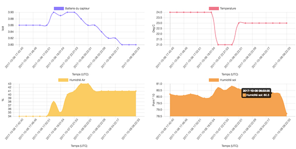

# Arrosage automatique d’un bonsaï 

*Publié le 27 septembre 2017*

Le but est de relever différentes mesures, toutes les heures, dont l’humidité de la terre, d’une plante. Si l’humidité de la terre est au-dessous de 30%, le petit puits va arroser le bonzaï pendant 5 secondes.

Ces mesures devront ensuite être envoyés sur un serveur distant, par radio communiquant selon la technologie [LoRaWAN](https://fr.wikipedia.org/wiki/LoRaWAN). Les mesures seront finalement exploitées, pour les afficher sur une page web sous forme de graphique.

## Matériel

### Micro-contrôlleur

* Dimension: 51mm x 23mm x 8mm
* Poids: 5.3 gramme
* Processeur: ATSAMD21G18 @ 48MHz with 3.3V logic/power
* Mémoire: 256KB odeFLASH + 32KB de RAM
* Tension d’entrée: 3.3V (500mA peak courrant de sortie)
* Port USB pour le debugage
* Hardware Serial, hardware I2C, hardware SPI support
* 8 x PWM pins
* 10 x analog inputs
* Indicateur de l’état de charge de la batterie
* Carte SD
* Batterie Lithium Ion 1200mA

### Ecran LCD

* Serial Enabled 16×2 LCD, 3,3V
* IIC I2C 0.91″128×32 White OLED LCD Display

### Radio LoRAWAN

* RFM95 @ 900 MHz
* Fréquence: 868Mhz
* Uses the license-free ISM bands
* +5 to +20 dBm up to 100 mW Power Output Capability
* ~300uA during full sleep, ~120mA peak during +20dBm transmit, ~40mA during active radio listening.
* Portée : 3 à 15km (un nouvel exercice sera mis en pratique pour tester ces données)
* Antenne: gain 2dB, Impédance de 50Ohm

### La pompe
[La pompe](https://www.seeedstudio.com/6V-Mini-Water-Pump-p-1945.html) est alimentée séparément car elle nécessite entre 5V et 12V. J’utilise donc un [MOSFET](https://www.seeedstudio.com/Grove-MOSFET.html) qui fera office de relai. Une batterie de 6V est connectée au Vin du MOSFET et la pompe est connectée au Vout du MOSFET. Une broche du micro-contrôlleur est connectée au SIG du micro-contrôlleur. Quant elle passe au niveau HIGH, le MOSFET se ferme et la pompe s’allume et pompe l’eau qui se trouve dans le récipient pendant 3 seconde, puis le micro-controlleur passe la broche au niveau BAS, le MOSFET s’ouvre et la pompe n’est plus alimentée.

* La pompe ([détail](https://www.seeedstudio.com/6V-Mini-Water-Pump-p-1945.html))
* Mosfet ([détail](https://www.seeedstudio.com/Grove-MOSFET-p-1594.html))

### Les sondes

* Capteur de la température ([détail](https://www.seeedstudio.com/Grove-Temp%26Humi%26Barometer-Sensor-%28BME280%29-p-2653.html))
* Capteur d’humidité du sol par détection capacitive ([détail](http://www.robotshop.com/ca/en/gravity-moisture-sensor-corrosion-resistant.html))
* Capteur de la luminosité ([détail](https://www.sparkfun.com/products/14350))

Les mesures de la batterie se fait via le micro-contrôlleur

## Les mesures

* l’état de la batterie du capteur
* l’humidité de la terre
* l’humidité de l’air
* la température
* la luminosité

 A noter que pour cet exercice, j’utilise un nouveau capteur qui mesure les niveaux d’humidité de la terre par détection capacitive, plutôt que par détection résistive comme les autres types de capteurs d’humidité.

Toutes les 15 secondes (intervalle peut être modifié), le micro-controlleur va relever les différentes mesures grâce aux capteurs. Il envoie ces valeurs sur un serveur distant via la passerelle LoRaWAN, afin de conserver les mesures

## Résultats

