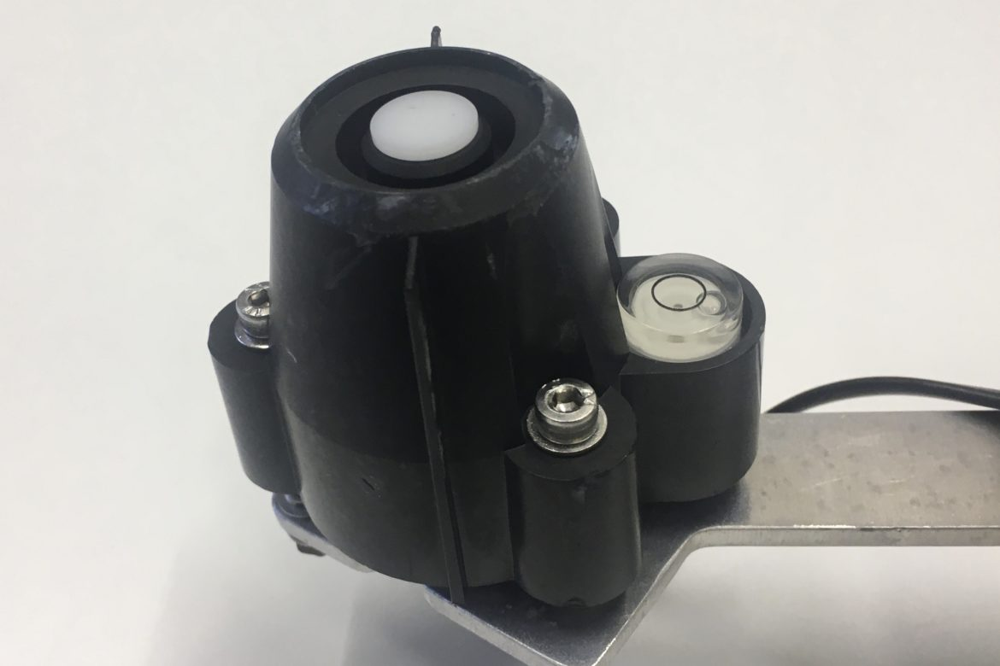

# Comment utiliser le Davis pyranomètre

Ce simple article est un aide-mémoire pour une uilisation basic.



## Caractéristiques

Général

 * Plages de température :
 	* En fonctionnement : -40°F à 150°F (-40°C à 65°C)
    * En stockage : -50°F à 158°F (-45°C à 70°C)
 * Transducteur : Photodiode de silicium
 * Réponse spectrale : 400 à 1 100 nanomètres
 * Réponse cosinétique :
 	* Pourcentage de lecture : ±3% (angle zénithal de 0° à ±70°), ±10% (angle d’incidence de ±70° à ±85°)
    * Pourcentage à pleine échelle : ±2% (0° à ±90°)
 * Longueur de câble fourni : 2 ‘ (0.6 m)
 * Type de câble : 4 conducteurs, 26 AWG
 * Connecteur : Connecteur modulaire (RJ-11)
 * Spécifications E/S :
 	* Fil vert : Sortie de 0 à 3V CC, 1.67 mV par W/m2
    * Fils rouge et noir : Masse
    * Fil jaune : 3 V CC ±10%, 1mA (typique)
 * Coefficient de température : 0.067% par °F (0.12% par °C)
 * Température de référence : 77°F (25°C)
 	* Correction au-dessus de température de référence : -0.067% de lecture par °F (-0.12% par °C)
    * Correction en-dessous de température de référence : 0.067% de lecture par °F (0.12% par °C)
 * Matériau protecteur : Plastique PVC résistant aux UV
 * Dimensions (longeur x largeur x hauteur) : 51 x 70 x 57 mm
 * Poids : 226 g

Sortie du capteur

* Résolution et Unités : 1 W/m2
* Plage de mesure : 0 à 1 800 W/m2
* Précision : ±5% à pleine échelle (Référence: Eppley PSP à 1000 W/m2) plus 45 W/m2 par câble additionnel de 100 ‘ (30 m)
* Dérive : jusqu’à ±2% par an
* Intervalle de mise à jour : 50 secondes à 1 minute

## Connections

Sensors | Arduino
--- | ---
Green | A2
Yellow | 3,3V
Balck | GND


## Exemple
(En cours de rédaction)

```
setup(){
  Serial.begin(9600);
  analogReadResolution(12);
  analogReference(AR_DEFAULT); // 3.3V
  const int pin_readSun = A2;
  pinMode(pin_readSun, INPUT_PULLUP);

  float f_sunValue = analogRead(pin_readSun);
  // next coming soon :(
}

```
