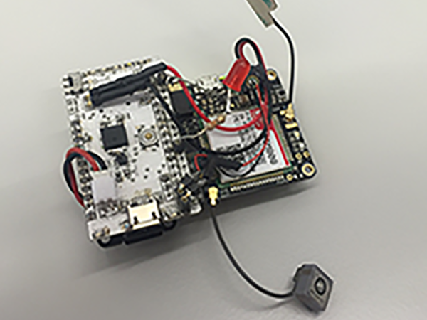

# Géolocalisation d’objets

*Publié le 20 octobre 2017*

**Réalisation d’un module pour géo-localiser les personnes à mobilité réduites**

J’ai réalisé un prototype dont son but principal est de prévenir les disparitions d’objets ou de personnes. Ce projet est actuellement en pause pour me consacrer pleinement à l’IoT.

Aussi tôt que l’objet sort d’un périmètre de sécurité défini, le module envoi une alerte (SMS) pour que le propriétaire puisse prendre les dispositions nécessaires rapidement. Les positions sont ensuite sauvées sur un serveur distant.

## Les objectifs

* Bouton SOS
* Interroger le module
* Ecouter les bruits autour de l’objet
* Définir un périmètre de sécurité
* Alarmer (SMS / e-mail) quand l’objet est déplacé
* Suivre l’objet (smartphone)
* Envoyer des positions des antennes GSM, si les satellites sont indisponibles
* Enregistrer les position sur une carte SD si le réseau GSM est indisponible

## Les cibles

* Personnes âgées ou handicapées
* Chiens de chasse ou en pension
* Véhicules, caravanes/Camping car, bateaux
* Motos, vélos
* Valises, etc…

## Caractéristiques

### GSM / GPRS

Frequency band
* Quad-band: 850/900/1800/1900

Data ransfer

* GPRS data downlink transfer: max. 85.6 kbps
* GPRS data uplink transfer: max. 42.8 kbps
* Coding scheme: CS-1, CS-2, CS-3 and CS-4
* Integrate the TCP/IP protocol
* FTP / HTTP

### GPS

* Receiver type : 33tracking/99 acquisition-channel GPS receiver
* Max. update rate : 10Hz
* Sensitivity : -167 dBm
* Time-To-First-Fix : 28s/26s/<1s/13s EPO Assist
* Accuracy : <2.5m CEP (Automatic Position3), 0.1m/s (Speed)

### Autres

* MicroSD card : FAT16 or FAT32
* Audio Speaker and micro
* Temperature: Normal operation :-30°C to 80°C
