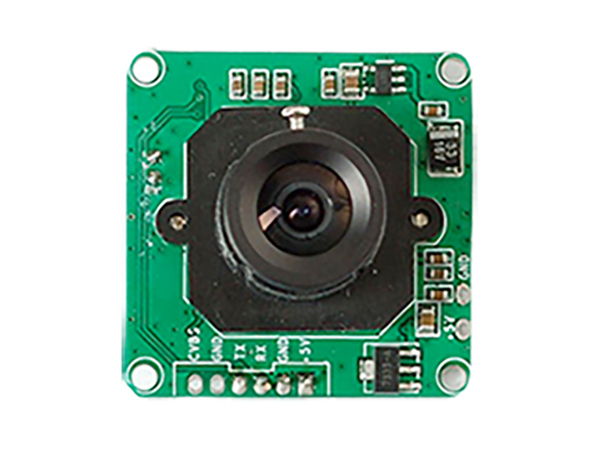

# Snap! Si tu bouges, je t’immortalise!

*Publié le 23 décembre 2017*

*Keywords: Camera TTL, VC0706, C++*



Dans ce petit exercice, je vais résumer comment connecter une camera pour que lorsque votre chat passe devant un détecteur de mouvement, la camera l’immortalisé.

Vous allez apprendre comment détecter un mouvement avec un capteur de mouvement [PIR](https://learn.adafruit.com/pir-passive-infrared-proximity-motion-sensor/how-pirs-work) et **sans** détecteur de mouvement!

Plus précisément, sans le capteur de mouvement PIR. vous allez configurer votre camera pour qu’elle compare les pixels de deux images. C’est cette différence qui va déclencher la capture de l’image.

Contrairement à cet article « [transformer votre raspberry en camera de surveillance](../..//Raspberry/Camera) » nous n’allons pas utiliser un Raspberry, mais un micro-controlleur [Adafruit Feather MO Adalogger](https://learn.adafruit.com/adafruit-feather-m0-adalogger/overview) avec un processeur ATSAMD21G18 ARM Cortex M0 (48 MHz) et 256KB de FLASH + 32KB de RAM. Ce micro-controlleur a une lecteur de carte SD intégré qui nous permettra d’enregistrer les images.

## Matériel
* [Adafruit Feather MO Adalogger](https://learn.adafruit.com/adafruit-feather-m0-adalogger/overview)
* Carte Micro SD
* [Camera TTL Serie 5V](https://learn.adafruit.com/ttl-serial-camera/circuitpython-usage?view=all)
* [Détecteur de mouvement (PIR)](https://www.seeedstudio.com/Grove-mini-PIR-motion-sensor-p-2930.html)
* Librairie [Adafruit_VC0706](https://github.com/adafruit/Adafruit-VC0706-Serial-Camera-Library)

## Lecture
* [How PIRs Work from Adafruit](https://learn.adafruit.com/pir-passive-infrared-proximity-motion-sensor/how-pirs-work)

## Assemblage

Camera | Board
--- | ---
Vcc | 5V
GND | GND
Rx | Tx
Tx | Rx

PIR  | Board
--- | ---
Vcc | 3.3
GDN | GND
SIF | 12

PIR est le capteur de mouvement

## Script

Tout d’abord, vous devez importer la librairie d’Adafruit [VC0706](https://github.com/adafruit/Adafruit-VC0706-Serial-Camera-Library) ainsi que les librairie SPI et SD (dans votre nouveau fichier.ino

```
#include <Adafruit_VC0706.h> // https://github.com/adafruit/Adafruit-VC0706-Serial-Camera-Library
#include <SPI.h>
#include <SD.h>
```

Vous devrez encore donner un nom à deux [constantes](https://www.arduino.cc/reference/en/language/structure/further-syntax/define/) ainsi que sa valeur, qui sera nécessaire au capteur de mouvement. J’attire votre attention que je crée aussi une constance CAMERA_MOTION qui nous permettra d’activer cette fonction ou de la désactiver en la commentant. C’est ceci qui nous permettra de détecter un mouvement sans le détecteur PIR. Vous devez faire de même pour la carte SD

```
/*
 * Motion
 */
#define PIR_PIN 12 // Pin definition for the signal
#define LED 13 // Pin definition for the LED
//#define CAMERA_MOTION // To activate or not the Camera detection

/*
 * SD
 */
#define chipSelect 4
```

Si vous utilisez un autre micro-controlleur et [un lecteur SD séparé](https://www.adafruit.com/product/254), vous devez connecter la broche (pin) CS du lecteur SD à la broche 4 de votre micro-controlleur. Vous pouvez très bien choisir une autre broche que celle que j’ai choisie. Étant donné que le lecteur SD du micro-controlleur que j'utilise, est intégré au micro-controlleur, la broche 4 est imposée par le constructeur.

Le mico-controlleur a deux port Hardware: Serial et Serial1. J’utilise le Serial pour afficher des messages dans le terminal

`Serial.print(F("Hello, voici la veleur de ")); Serial.println(ma_variable);`

et le Serial1 pour le Port Série (Rx/Tx). C’est ces deux broches (rx/Tx) que nous allons utilisé pour communiquer avec la camera.

### La fonction setup()

`setup()` initialise et fixe les valeurs de démarrage du programme. Il va définir l’état des broches, et initier certaines fonctionnalités.

> Tout ce qui suit, doit se trouver dans le fonction `setup(){.. ici ...}`

```
Serial.begin(115200);
Serial1.begin(115200);

//#define CAMERA_MOTION

pinMode(PIR_PIN,INPUT_PULLUP); // Define the pin as Input
digitalWrite(PIR_PIN,LOW); // Put to LOW pinMode(PIR_PIN,INPUT_PULLUP); // Define the pin as Input

pinMode(LED,OUTPUT); // Define as Input
digitalWrite(LED,LOW); // Put to low
```

Vous devez ensuite, initier votre lecteur de carte SD et la camera
```
if (!SD.begin(chipSelect)) // see if the card is present and can be initialized:
{ 
	Serial.println(F("Card failed, or not present"),0);
 	// don't do anything more:
 	while(1); // Do not continue
} 
 
if (cam.begin()){ // Try to locate the camera
	Serial.println(F("Camera Found:"),0);
} 
else
{
	Serial.println(F("No camera found?"),0); 
 	while(1); // No, Do not continue
}

/*
* Get the version of the Camera
*/
char *reply = cam.getVersion(); // Print out the camera version information
if (reply == 0)
{
	Serial.print(F("Failed to get version"),0);
}
else
{
	Serial.print(F("Cam version: "),0);
 	Serial.println(reply,0);
}
```

Vous pouvez encore définir la taille de vos photos. Plus elles seront lourdes, plus le programme mettra du temps pour les sauver (env. 4 à 24s. pour une taille moyenne)

```
// Set the picture size - you can choose one of 640x480, 320x240 or 160x120 
// Remember that bigger pictures take longer to transmit!
 
//cam.setImageSize(VC0706_640x480); // biggest
cam.setImageSize(VC0706_320x240); // medium
//cam.setImageSize(VC0706_160x120); // small

// You can read the size back from the camera (optional, but maybe useful?)
uint8_t imgsize = cam.getImageSize();
Serial.print(F("Image size: "));
if (imgsize == VC0706_640x480) Serial.println("640x480");
if (imgsize == VC0706_320x240) Serial.println("320x240");
if (imgsize == VC0706_160x120) Serial.println("160x120")
```

Finalement, nous allons ici spécifier si nous utilisons la détection avec le détecteur PIR ou si la camera va elle remplir cette fonction.

```
#ifdef CAMERA_MOTION  // If defined or commented
	// Motion detection system can alert you when the camera 'sees' motion!
 	cam.setMotionDetect(true); // turn it on
 #else
 	cam.setMotionDetect(false); // turn it off (default)
 #endif
 
 // You can also verify whether motion detection is active!
 Serial.print("Camera Motion detection is ");
 if (cam.getMotionDetect()) 
 {
 	Serial.println("ON");
 }
 else 
 {
 	Serial.println("OFF");
 	Serial.println("PIR sensor ON");
 	snap(); // Take a snap (Can be commented)
 }
```

### La fonction loop()

`loop()` (boucle en anglais) fait exactement ce que son nom suggère et s’exécute en boucle sans fin, permettant à votre programme de s’exécuter et de répondre.

Pour que la détection de mouvement se fasse grâce à la camera, soit sans le détecteur PIR, vous devez dé-commenter ceci `//#Define CAMERA_MOTION` qui se trouve avant le function `setup()`

Si en revanche, vous n’activer pas la détection par la camera, la fonction isPIRMotionDetected() sera appelée et le détecteur PIR indiquera au micro-controlleur si un mouvement est détecté ou pas.

```
void loop(){
	// Use the MOTION of the camera
	#ifdef CAMERA_MOTION // IF camera is set to act as MOTION (NO PIR detector)
 		if (cam.motionDetected()) // If the camera detect a motion
 		{
 			Serial.println("Motion!"); 
 			cam.setMotionDetect(false); // Turn off the functionnality
 			snap(); // Take a picture and save it
 			cam.resumeVideo();
 			cam.setMotionDetect(true); // Turn on the functionnality
 		}
 	// Use the PIR sensor
 	#else
 		if(isPIRMotionDetected()==true) // Call the function isPIRMotionDetected which will
 		{ 								// will return true if the PIR sensor detect a movement
 			Serial.println("PIR!"); 
 			snap(); // take a picture and save it
 		}
 	#endif
}
```

### Les autres fonctions

#### Pour le PIR 

Vous pouvez commencer par un peu de lecture (en anglais) sur [les détectuers de mouvements PIR](https://learn.adafruit.com/pir-passive-infrared-proximity-motion-sensor/how-pirs-work).

Le fil SIG est donc connecté à la broche 12 (pin 12) qui elle, attend (INPUT) un état haut ou bas. Quand un mouvement est détecté par le détecteur PIR, la broche 12 passe à l’état haut. isPIRMontionDetected() retourne TRUE et le fonction snap() va lancé le processus de la prise de vue et sauver la photo sur la carte SD.

`isPIRMontionDetected()`

```
boolean isPIRMotionDetected()
{
	int sensorValue = digitalRead(PIR_PIN); // Read if PIR_PIN is HIGH or LOW
	//Serial.print("SensorValue:"); Serial.println(sensorValue);
 
 	if(sensorValue == HIGH) // if the sensor value is HIGH?
 	{
 		Serial.println(F("\r\nMotition detected!!"),0);
 		digitalWrite(PIR_LED,HIGH);
 		delay(500);
 		digitalWrite(PIR_LED,LOW);
 		return true; // yes,return true
 	}
 	else
 	{
 		return false; // no,return false
 	}
}
```

#### Pour la camera

`snap()`

```
void snap()
{
	if (! cam.takePicture())
 	{
 		Serial.println(F("Failed to snap!"),0);
 	}
 	else 
 	{
 		Serial.println(F("Picture taken!"),0);

		// Create an image with the name IMAGExx.JPG
 		// Increment the file name if it exists
 		char filename[13];
 		strcpy(filename, "IMAGE00.JPG");
 		for (int i = 0; i < 100; i++) {
 		filename[5] = '0' + i/10;
 		filename[6] = '0' + i%10;
 		
 		// create if does not exist, do not open existing, write, sync after write
 		if (! SD.exists(filename))
 		{
 			break;
 		}
 	}
 
 	File imgFile = SD.open(filename, FILE_WRITE); 	// Open the created file for writing 
 	uint16_t jpglen = cam.frameLength(); 			// Get the size of the image (frame) taken 
	Serial.print(F("Storing "),0);
 	Serial.print(jpglen, DEC,0);
 	Serial.print(F(" byte image in "),0);
 	Serial.println(filename,0);
 
 	int32_t time = millis(); 						// Init the time for save the image
 
 	byte wCount = 0; 								// Read all the data up to # bytes!
 	while (jpglen > 0) 								// For counting # of writes
 	{ 
 		uint8_t *buffer;
 		uint8_t bytesToRead = min(64 , jpglen); 	// change 32 to 64 for a speedup but may not work
 													//	with all setups!
 		buffer = cam.readPicture(bytesToRead);
 		imgFile.write(buffer, bytesToRead);
 
 													// Every 2K, give a little feedback so it doesn't
 		if(++wCount >= 64) 							// appear locked up
 		{
 			Serial.print(F("."),0);
 			wCount = 0;
 		}
 
 		//Serial.print("Read "); Serial.print(bytesToRead, DEC); Serial.println(" bytes");
 		jpglen -= bytesToRead;
 	}
 	
 	imgFile.close(); // Close the file

	time = millis() - time; 						// Print the elasped time while saving the image
 	Serial.println(F("\r\ndone!"),0);
 	Serial.print(time); Si.sprintln(F(" ms elapsed"),0);
}
```

La photo est prise grâce à `cam.takePicture();`

En suite, la boucle for va parcourir votre carte SD et va contrôler les fichiers commençant par IMAGE00.JPG pour donner un nom à la nouvelle image qui finira par un numéro, pour autant que le nom n’existe pas encore. Si par exemple :

```
IMAGE00.JPG
IMAGE01.JPG
IMAGE03.JPG
```

La nouvelle image sera IMAGE02.JPG et la suivante IMAGE04.JPG (etc).

La fonction `SD.open(filename, FILE_WRITE)` va ouvrir le nouveau fichier en mode écriture.

La boucle `while (jpglen > 0){}` va « écrire » ou sauver la photo prise dans le fichier .

La fonction `imgFile.close();` va « fermer » le fichier.

## Bravo!
Vous avez mis en place un petit système espion pour capturer un intru. Vous pouvez aussi vous passer du capteur de mouvement afin de configurer votre caméra pour qu’elle détecte elle-même un mouvement.