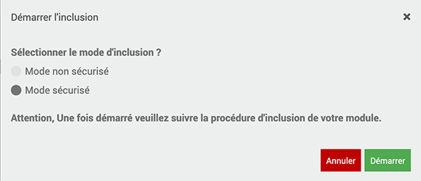

# Comment inclure un détecteur porte extérieur 

*Publié le 7 décembre 2019*

Dans cet article, je vais vous montrer comment préparer et inclure dans votre domotique, un détecteur "Sensative Strips Guard" de porte ultra fin.

## Prérequis
Vous devez avoir un contrôleur Jeedom fonctionnel. Cet article se base sur un contrôleur équipé d’un Raspberry Pi4 et d’une carte d’extension [RazBerry](https://z-wave.me/products/razberry/). Si vous en n'avez pas, vous pouvez suivre [cet article](../installation-jeedom) avant de continuer sur cet article où vous trouverez aussi les instructions pour configurer DNS Jeedom.

Nous partons dans le principe que ces étapes sont établies.

Vous devez avoir installé le plugin Z-wave.

## Matériel

* Capteur de porte [Sensative Strip Guard](https://sensative.com/sensors/strips-zwave/guard/) | [Documentation 1](Assets/pdf/Strips_Guard_French.pdf) | [Documentation 2](Assets/pdf/StripsGuard700manual-1.pdf)

## Précautions

Pour des raisons de sécurité, je vous conseille vivement de modifier la clé de sécurité Z-Wave avant l’inclusion. Pour réaliser cette opération, vous pouvez lire l’article [Installation de Jeedom sur un Raspberry Pi4](../installation-jeedom#modification-de-clé-de-sécurité), en bas de page. Cette étape est importante de le faire avant l’inclusion du premier capteur, faute de quoi, vous devrez les exclure et le ré-inclure, pour que tous les modules soient associés à cette nouvelle clé.

## Plugin Z-wave

Pour l’inclusion d’un module, vous devez toujours vous rendre dans le menu `Plugins->Protocole domotique -> Z-wave`

## Le capteur de porte ultra fin

Pour inclure le capteur dans votre réseau

* Mettez le capteur à proximité du contrôleur Z-wave
* Passer votre contrôleur en mode inclusion (pour sortir de ce mode, re-cliquez sur « Mode inclusion »)
* Sélectionnez le mode **non sécurisé (contrairement à ce qui est indiqué ci-dessous)**. En revanche, réserver le mode sécurisé pour les serrures connectées par exemple.

*Attention, contrairement à ce qui est montré sur l'image, choisissez le mode **non sécurisé***

* Retirez les deux aimants du Strips pour procéder à son insertion. 1 clignotement long confirme l’ajout

Attendez que le capteur soit inclus dans votre système jusqu’à ce que vous recevez une confirmation de votre contrôleur

> Ne perdez pas le l’aimant rond, il vous sera utile pour réveiller, inclure ou exclure le capteur

Dans le cas de l’insertion de mon deuxième capteur, il n’a pas été inclus du premier coup. J’ai remis le contrôleur en mode inclusion et avec l’aimant rond, je l’ai approché trois fois en moins de 10 seconde, près de la partie ronde du capteur, ce qui a réveillé le capteur et finalisé l’insertion. (voir [la doc]((Assets/pdf/Strips_Guard_French.pdf)))

