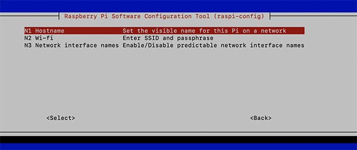

# Installation de Jeedom sur un Raspberry Pi4

*Publié le 1 décembre 2019*


Dans cet article, je vais vous montrer comment installer et configurer un contrôleur Z-wave avec Jeedom 4.03, sur mon Raspberry Pi 4, pour préparer votre domotique à la maison.

> Pour le bon fonctionnement de la carte d’extension de RazBerry, le Bluetooth (BT) de votre Raspberry Pi4 devra être désactivé et le BT ne sera plus disponible pour d’autres périphériques.

Dans cet article, vous allez voir comment

* installer et configurer un Raspberry Pi4
* installer la carte d’extension RaZberry
* installer et configurer Jeedom
* installer le plugin Z-Wave

## Matériel

* Apple Macbook Pro
* Un câble Ethernet
* Raspberry Pi 4, une carte CD, une alimentation (en option: un câble MicroHDMI->HDMI, un écran)
* [Carte d’extension RaZberry 2, Z-Wave+ pour Raspberry Pi](https://z-wave.me/products/razberry/)

## Preparation
### La carte RazBerry

Insérez [la carte d’extension RazBerry](https://z-wave.me/products/razberry/) comment montré sur la photo ci-dessus

### Installation du Rasbian Buster

> A l'heure où a été cet article (2109), seulement Raspbian Stretch and Buster sont supportés par Z-Wave pour l’extension RaZberry 2

Téléchargez la dernière version de Raspbian Litle . Vous pouvez aussi utiliser la version Desktop si vous n’êtes pas à l’aise avec les lignes de commande, même si je ne vous le recommande pas. La version Little est beaucoup plus légère et moins gourmande en mémoire. Étant donné que le Desktop (l’interface Rasbian) ne sera jamais utilisé, il n’y a donc pas de sens à l’avoir pour privilégier les performances du Raspberry.

Téléchargez et installez Etcher et créez l’image sur la carte SD.


Une fois fait, retirez et réinsérer la carte SD dans votre Mac, et créez un fichier ‘ssh’ dans le dossier boot, pour activer ssh lors du premier démarrage du Raspberry (L’exemple est donné depuis un Mac)

```
touch /Volumes/boot/ssh
```

Éjectez votre carte SD et insérez la dans le Raspberry.
Puis connectez votre Raspberry au routeur à l’aide du câble Ethernet.
Alimentez votre Raspberry

### Activation des services

Ouvrez votre terminal et connectez-vous à votre Raspberry

```
ssh pi@raspberrypi.local
```

Le mot de passe de `pi` par défaut est `raspberry`

Créez un nouvel utilisateur avec les privilèges sudo, puis quittez et authentifiez-vous avec le nouvel utilisateur

```
sudo adduser pierrot
sudo adduser pierrot sudo
exit 
ssh pierrot@raspberrypi.local
```

Supprimez l’utilisateur pi

```
sudo userdel -rf pi
```

Installer les mises à jour les packages utiles

```
sudo apt-get update
sudo apt-get upgrade
#La commande suivante est importante!
sudo apt update --allow-releaseinfo-change
sudo apt-get install ntpdate vim
```

#### VNC

Activez VNC, si vous n'installez pas Rasbian Litle. Si vous installez Rasbian Litle, passez à la localisation.

```
sudo raspi-config
```

et suivez les indications des images suivantes


*5 Interfacing Options>*


*P3 VNC*

Sélectionnez VNC et activez le. (si vous n’avez pas encore mis à jour votre Raspberry, des packages seront installés)

#### Localisation

Toujours dans raspi-config, modifier la localisation

```
sudo raspi-config
```


*4 Localisation Option*

Puis choisissez `I1 change local` en fonction de votre localisation


#### Time zone et WiFi

Puis choisissez `I2 Time zone` et corrigez en fonction de votre localisation.
Puis choisissez `I4 Change WiFi country` et sélectionnez votre pays.

#### Hostname

Modifier le nom de votre Raspberry. J’ai donné le nom `razwave1`


*2 Network Option*



*N1 hostname*

Dernière configuration, allez dans `3 Boot Options` puis `B2 Wait for Network at Boot` et sélectionner `No`


Quittez raspi-config et acceptez le redémarrage

Reconnectez-vous et lancez la commande

```
export LC_ALL=fr_CH.UTF-8
```

### Désactivation du Bluetooth

Pour terminer, la carte d’extension RaZberry nécessite la désactivation du bluetooth de votre Raspberry.

Vérifier le statut

```
systemctl status bluetooth
```

```
● bluetooth.service - Bluetooth service
Loaded: loaded (/lib/systemd/system/bluetooth.service; enabled; vendor preset: enabled)
Active: active (running) since Mon 2019-12-02 19:55:58 CET; 2min 44s ago
Docs: man:bluetoothd(8)
Main PID: 469 (bluetoothd)
Status: "Running"
Tasks: 1 (limit: 4915)
Memory: 2.7M
CGroup: /system.slice/bluetooth.service
└─469 /usr/lib/bluetooth/bluetoothd
```

Désactivation

```
echo "dtoverlay=pi3-disable-bt" | sudo tee -a /boot/config.txt
sudo systemctl disable hciuart
sudo reboot
```

et vérifiez le statut

```
systemctl status bluetooth
```

```
● bluetooth.service - Bluetooth service
Loaded: loaded (/lib/systemd/system/bluetooth.service; enabled; vendor preset: enabled)
Active: inactive (dead)
Docs: man:bluetoothd(8)
```

Vérifiez les mises à jour

```
sudo apt-get update
sudo apt-get upgrade
```

## Installation de Jeedom

### Packages

Installez les packages suivants

```
sudo apt install mariadb-client mariadb-common mariadb-server
sudo apt install apache2 apache2-utils libexpat1 ssl-cert php libapache2-mod-php php-json php-mysql
sudo apt-get update
sudo apt-get upgrade
```

### Installation de Jeedom

```
cd ~ 
mkdir jeedom
cd jeedom
wget https://raw.githubusercontent.com/jeedom/core/master/install/install.sh
sudo chmod +x install.sh
sudo ./install.sh
```

> ATTENTION: A la fin de l’installation, le mot de passe de la base de donnée s’affichera. N’oubliez pas de le mémoriser à quelque part.

### Installation de Z-Way pour l’extension RaZberry 2

[Installer l’extension](https://z-wave.me/z-way/download-z-way/) sur votre Raspberry en lançant la commande

```
wget -q -O - https://storage.z-wave.me/RaspbianInstall | sudo bash
```

Rebootez le raspberry `sudo reboot`

### Configuration de Jeedom

Ouvrez FireFox depuis votre laptop et saisissez l’adresse IP de votre Raspberry attribué par votre routeur. Dans mon cas les deux fonctionnent

```
http://192.168.1.105
http://razwave1.local
```

Commencez par changer le mot de passe par défaut de jeedom (admin/admin)

Il vous sera ensuite demandé de vous connecter ou de **créer un compte sur le Jeedom Market** et de relier votre box (contrôleur) à votre compte Jeedom Market.

Aussi, il vous sera demandé de créer votre premier objet qui est sensé représenter le début de l’arbre de vos objets (maison, étages, chambres, etc..)

Vérifiez les mises à jour de Jeedom


Dans Jeedom, allez dans la gestion des plugin et cliquez sur ‘Market’


et installez le plugin Z-wave


Il vous sera proposé d’aller sur la page de configuration de z-wave, acceptez-le. Activez l’état dans la section ‘État’.

Modifiez le Port clé z-wave comme ci-dessous et relancer les dépendances
Activer le demon et si le statut reste rouge, redémarrer le Raspberry

> J’ai eu du mal à avoir les statut du demon en vert. J’ai modifié la clé de sécurité (voir ci-dessous) et j’ai redémarré le Raspberry et tout à été OK, ensuite


**Port clé Z-wave** : Raspberry pi (/dev/ttyAMA0)
**Port server** : 8083

**Lors de ma deuxième installation, j’ai activé la Gestion Automatique, contrairement à ce qui est indiqué sur la photo, ci-dessus**

### Modification de clé de sécurité

Par défaut, la clé de sécurité est très simple, ce qui rend votre réseau vulnérable. Nous allons voir ici comment la modifier

Connectez-vous à vous Raspberry

```
ssh pierrot@razwave1.local
```

Vous pouvez remplacer razwave1.local par l’adresse IP attribué à votre Raspberry

Attention:

* Si vous avez déjà procédé à des inclusions sécurisées avec la clé par défaut, la modification de la clé rend impossible les communications avec les modules inclus en mode sécurisé. Il vous faudra les exclure et inclure à nouveau.
* Lorsque le plugin Z-Wave est mis à jour, votre clé privée personnelle sera remplacée par celle par défaut. L’ensemble des fichiers du plugin sont écrasés lors d’une mise à jour. Il faudra alors éditer à nouveau le fichier pour remettre votre clé privée personnelle.
* En complément au point précédent, il vous vaudra faire une copie de votre clé réseau privé sur un lieu sûr. Vous pouvez par exemple utiliser un keypass ou tout autre endroit sécurisé. Si vous perdez votre clé privée, vous ne serez plus en mesure de communiquer avec vos modules et il vous faudra refaire les inclusions avec une nouvelle clé.

Rendez-vous dans le dossier

```
cd /var/www/html/plugins/openzwave/resources/openzwaved/ozwave
```

et faîtes une copie du fichier

```
sudo cp manager_utils.py manager_utils.old
```

Générer une nouvelle clé

```
cat /dev/urandom | tr -dc '0-9A-F' | fold -w 32 | head -n 1 | sed -e 's/\(..\)/0x\1, /g' -e 's/, $//'
```

Sauvez bien la nouvelle clé comme dans KeePass (par exemple) et éditez le fichier suivant

```
sudo vi /var/www/html/plugins/openzwave/resources/openzwaved/ozwave/manager_utils.py
```

et remplacez la clé se trouvant à la ligne, avec la nouvelle.

```
globals.options.addOptionString("NetworkKey", "0x01, 0x02, 0x03, 0x04, 0x05, 0x06, 0x07, 0x08, 0x09, 0x0A, 0x0B, 0x0C, 0x0D, 0x0E, 0x0F, 0x10", True)
```

## Configurer votre WiFi

Editer le fichier suivant

```
sudo nano /etc/wpa_supplicant/wpa_supplicant.conf
```

et ajoutez les lignes suivantes (attention aux tablatures)

```
network={
	ssid="The_SSID_of_your_wifi"
	psk="Your_wifi_password"
}
```

## Bravo

Vous venez d’installer votre première boîte domotique, un contrôleur. Dans les articles suivants, je vais vous montrer comment inclure de appareils, comme un détecteur de porte.

