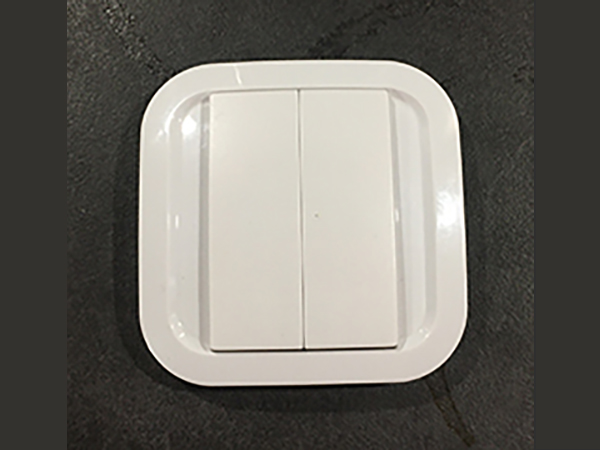
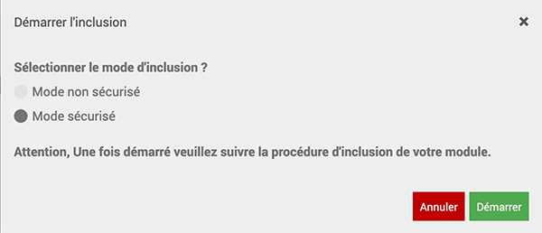
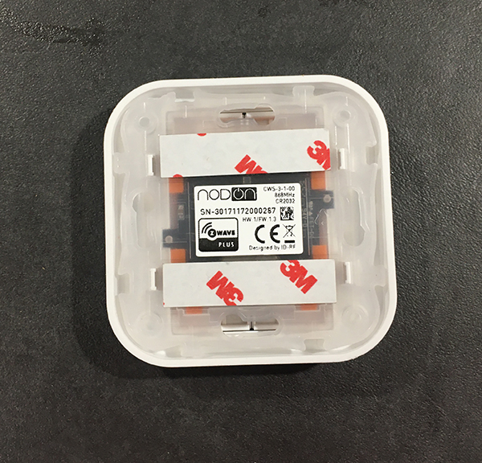
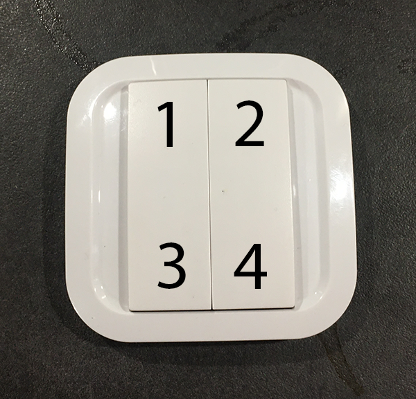
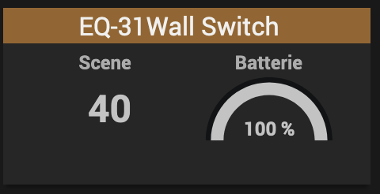
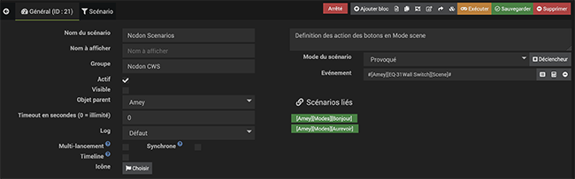
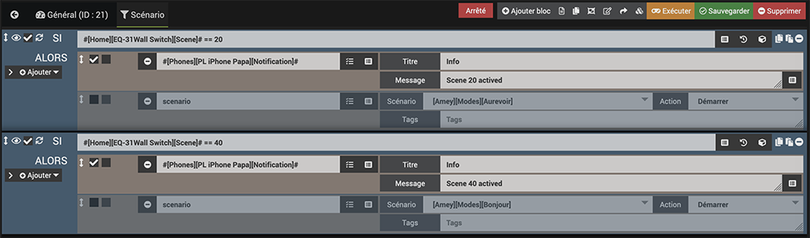

# Interrupteur mural Nodon cws-3-1-00 (Z-Wave)

*Publié le 8 janvier 2020*

Dans cet article, nous allons voir comment j’utilise un interrupteur mural Z-Wave avec Jeedom, pour contrôler une ampoule ou un scénario.

## Prérequis
Vous devez avoir un contrôleur Jeedom fonctionnel. Cet article se base sur un contrôleur équipé d’un Raspberry Pi4 et d’une carte d’extension [RazBerry](https://z-wave.me/products/razberry/). Si vous en n'avez pas, vous pouvez suivre [cet article](../installation-jeedom) avant de continuer sur cet article.

Vous devez avoir installé le plugin Z-wave.

## Matériel

* Interrupteur mural Nodon cws-3-1-00 (version Z-Wave) | [Notice d’utilisation](Assets/pdf/NodOn_WallSwitch_ZWave_UserGuide_FR.pdf)

## Précautions

Pour des raisons de sécurité, je vous conseille vivement de modifier la clé de sécurité Z-Wave avant l’inclusion. Pour réaliser cette opération, vous pouvez lire l’article [Installation de Jeedom sur un Raspberry Pi4](../installation-jeedom#modification-de-clé-de-sécurité), en bas de page. Cette étape est importante de le faire avant l’inclusion du premier capteur, faute de quoi, vous devrez les exclure et le ré-inclure, pour que tous les modules soient associés à cette nouvelle clé.

## Plugin Z-wave

Pour l’inclusion d’un module, vous devez toujours vous rendre dans le menu `Plugins->Protocole domotique -> Z-wave`

*Protocole domotique Z-wave*

## Interrupteur cws-3-1-00
### Inclusion

* Mettez le capteur à proximité du contrôleur Z-wave
* Passer votre contrôleur en mode inclusion (pour sortir de ce mode, re-cliquez sur « Mode inclusion »)
* Sélectionnez le mode **non sécurisé (contrairement à ce qui est indiqué ci-dessous)**. En revanche, réserver le mode sécurisé pour les serrures connectées par exemple.

*Attention, contrairement à ce qui est montré sur l'image, choisissez le mode **non sécurisé***

* Retourner votre interrupteur et placer-le de la sorte

*Interrupteur mural Nodon cws-3-1-00 – Positionnez la marque en haut*

Retourner-le de nouveau, de gauche à droite (ou de droite à gauche 🙂 ), de la sorte que la marque Nodon reste en haut, et voici les numéros des boutons

*Interrupteur mural Nodon cws-3-1-00 – position des boutons*

* Appuyez sur les boutons 1 et 2 pendant 1 seconde jusqu’à ce que la LED s’illumine en rose
* Appuyez 1 fois sur le bouton 1, dans les 10 secondes qui suivent
* Attendez-jusqu’à ce que la LED s’illumine en vert, ce qui confirmera l’inclusion. En cas d’échec, la LED l’illuminera en rouge

> Attention, ce module peut être capricieux à l’inclusion. Ne pas hésiter à le réveiller 1 ou 2 fois après l’inclusion. Et bien vérifier le groupe d’association.

Pour réveiller ce module il suffit d’appuyer sur un de ces boutons.

Pour vérifier l’état de la batterie, appuyez sur les boutons 1 et 2, brièvement
* Vert => Pleine
* rose/violet => moitié
* rouge=>vide

## Configuration

Passons d’abord en revue les différents paramètres.

Allez dans `Plugins->Protocole domotique->Z-Wave`. Sélectionnez l’interrupteur et cliquez sur `configuration` puis l’onglet `paramètres`

**Paramètre 1 :** Ce paramètre vous permettra de configurer le profile des boutons 1 et 3

* **Mode mono :** Le bouton agira indépendamment. C’est à dire que vous pourrez l’utiliser pour allumer et éteindre la même ampoule (variation sur un même bouton)
* **Mode duo :** Le bouton 1 pourra allumer l’ampoule et le bouton 3 l’éteindra (variation sur les deux boutons 1 et 3)
* **Mode scene :** L’action sur ce bouton vous permettra de lancer un scénario

Dans le cadre de cet exercice, sélectionnez Mode mono (en préparation)

**Paramètre 2 :** Ce paramètre vous permettra de configurer le profile des boutons 2 et 4, comme pour le paramètre 1
Dans le cadre de cet exercice, sélectionnez Mode scene

**Paramètre 3 :** Ce paramètre vous permettra de sélectionner le type de scène.
Pour Z-Wave vous devez absolument sélectionner Mode scene

**Paramètre 4 :** Configuration du comportement du bouton 1 lorsqu’il est en profil mono

**Paramètres 5 à 7:** Idem que pour le paramètre précédent, mais pour les boutons suivants

**Paramètre 8:** Configure le comportement de la LED

* Clignote sur appui du bouton
* Clignote dans les deux cas
* Clignote sur accusé réception de transmission
* Désactivé

> Lorsque vous modifiez un paramètre, la ligne devient jaune. Pour rendre la modification effective, vous devez appuyer sur les boutons 1 et 3 en même temps, comme pour connaître le niveau de la batterie.

## Utilisation avec un scénario

Nous allons d’abord observer le comportement des boutons 2 et 4

Allez dans `Accueil->Dashboard`. Vous devriez trouver la représentation de l’interrupteur avec au minimum « Scene » et avec le numéro 0.

*Appuyer sur le bouton 2 puis le bouton 4*

* Lorsque vous appuyez sur la touche 2, le chiffre 20 devrait s’afficher sous Scene
* Lorsque vous appuyez sur la touche 4, le chiffre 40 devrait s’afficher sous Scene

Il faut savoir, que vous pouvez encore générer d’autre numéros de scene

**Bouton 2** (Valeur ID 2)
* Appui => 20
* Appui prolongé long => 21
* Appui prolongé court => 22
* Double appui =>23

**Bouton 4** (Valeur ID 4)
* Appui => 40
* Appui prolongé long => 41
* Appui prolongé court => 42
* Double appui =>43

Si les boutons 1 et 3 étaient aussi configurés en Mode scene:

**Bouton 1** (Valeur ID 1)
* Appui => 10
* Appui prolongé long => 11
* Appui prolongé court => 12
* Double appui =>13

**Bouton 3** (Valeur ID 3)
* Appui => 30
* Appui prolongé long => 31
* Appui prolongé court => 32
* Double appui =>33

Rendez-vous maintenant sous `Outils->Scénario` et créez un nouveau scénario (mode provoqué) selon vos besoins

Il est important de sélectionner votre interrupteur comment indiqué sous le champs « Evénement ». Le déclenchement doit se faire sur un numéro de scene (20 ou 40 (41,42, 22, etc)) de l’interrupteur. (je détaillerai ceci dans la partie avancée, plus bas).

Puis allez dans l’onglet Scénario et créez un nouveau bloque de type if. Voici un très simple exemple pour qu’une action se lance quand on appuie sur l’un des bouton (appui, double appui, appui prolongé, etc). Je montrerai un exemple plus concret plus tard.

