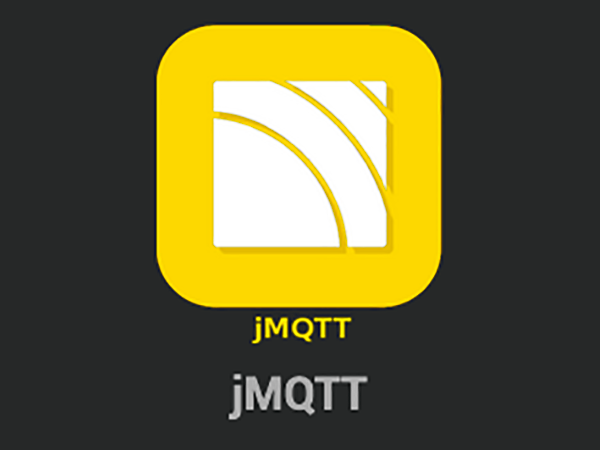
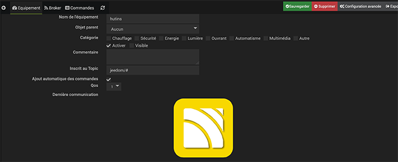
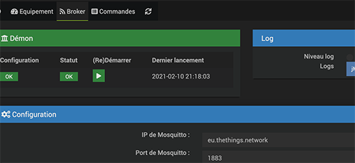

# Jeedom jMQTT et The Things Network TTN

*Publié le 13 février 2021*

*Keywords: MQTT, jMQTT, Raspberry, LoRaWAN, TTN*

> MQTT est un protocole de messagerie publish-subscribe opensource basé sur le protocole TCP/IP. Pour communiquer avec MQTT, les objets connectés utilisent un broker, c’est-à-dire un programme en charge de la réception des informations publiées afin de les transmettre aux clients abonnés. Le broker a un rôle de relais.

Dans cet article, je vais rapidement vous montrer comment installer jMQTT sur votre boîte Jeedom pour récupérer les données envoyées par l’une de vos station LoRaWAN.

## Prérequis

Pour suivre cet article, vous avez déjà des bonnes bases avec Jeedom et LoRaWAN.

Vous devez déjà avoir une infrastructure LoRaWAN qui fonctionne

* Au moin une station (node) LoRaWAN
* Gateway LoRaWAN
* Un compte chez TTN (The Things Network) avec l'enregistrement de ces périphériques (node, Gateway).

Quand la station tourne, vous devez voir arriver les messages/les données de votre station dans la console TTN.

J'ai écris [plusieurs articles](https://github.com/ecosensors/ecosensors/tree/main/Articles/LoRaWAN/Gateways) qui vous permettra peut-être de réaliser une passerelle LoRaWAN :).

Puis, vous devez avoir une boîte domotique Jeedom. Voici [un article](https://github.com/ecosensors/ecosensors/tree/main/Articles/Domotique/installation-jeedom) qui peut vous aider à préparer votre première boîte domotique, si cela n’est pas fait.

Vous savez aussi inclure un appareil Jeedom dans votre boîte.

## Installation et configuration de jMQTT

Sur boite Jeesom, installer le plugin `jMQTT`. Une fois fait, aller dans `Plugins -> Protocole domotique -> jMQTT`.

Vous allez devoir ajouter un broker.

Dans l’onglet **Equipement**

* Donner un nom
* Sélectionner un objet parent
* Activer le

Dans l’onglet **Broker**

* **ip mosquitto:** eu.thethings.network
* **port mosquitto:** 1883
* **identifiant connexion:** Ceci correspond à l’ Applicaion ID de l’application que vous avez préalablement créé dans votre console TTN
* **Compte de connexion:** Idem, indiquez l’Application ID
* **Mot de passe:** Vous trouvez ceci sous Acces key de votre application TTN

Sauvegarder vos données et si vous avez saisi correctement vos données, les status `Configuration`, `Status` et `(re)démarrer`, doivent être vert

Ensuite, vous devez ajouter un Equipement, toujours dans le menu `Plugins -> Protocole domotique -> jMQTT` et sélectionnez le broker que vous venez d’ajouter sous **broker associé**. Sous **catégorie du topic**, j’ai choisi température. Je ne sais pas si ce champs est obligatoire mais je vous recommande d’en sélectionner un.

## Pour terminer

Si vous avez bien préparer votre travail en amont, vous pouvez allumer votre station LoRaWAN. Des données vont être envoyées sur les serveurs TTN, et dans votre console, sous l’onglet Data, vous devriez voir arriver les messages envoyés par votre station LoRaWAN.

Retourner maintenant dans votre boîte Jeedom, sous `Plugins -> Protocole domotique -> jMQTT`, et cliquez sur votre nouveau Equipement que vous venez de créer.

Il est possible que message de votre boîte Jeedom s’affiche. Une message ressemblant à ceci

`La commande devices:st-13:up est ajoutée à l’équipement hutins`.

(`st-13` correspont au nom du **devise** que vous avez créé, dans votre console TTN)

Puis aller dans l’onglet **commande** de votre Broker, et vous devriez voir une nouvelle commande qui s’est ajoutée automatiquement.

Vous pouvez envore créer des scénarios pour envoyer un message Telegram si une station LoRaWAN envoie un mesure critique (Expl: température trop basse, ...)

Cet article va évoluer et j’apporterai de nouvelles informations notamment sur l’interaction d’un scénario avec jMQTT