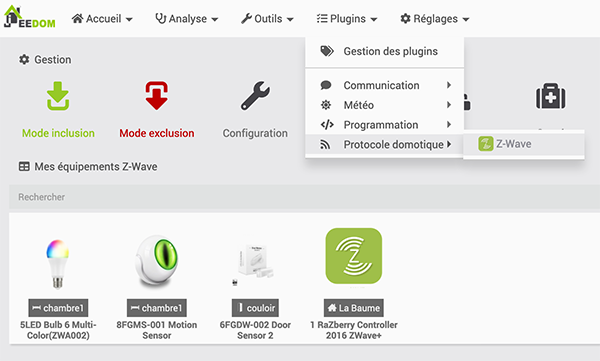
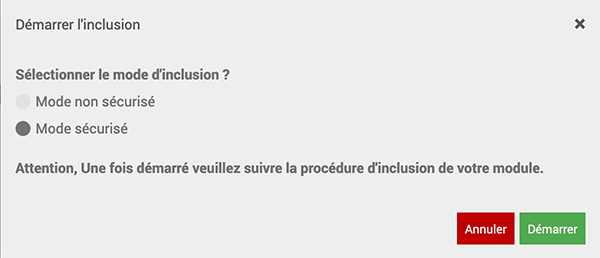
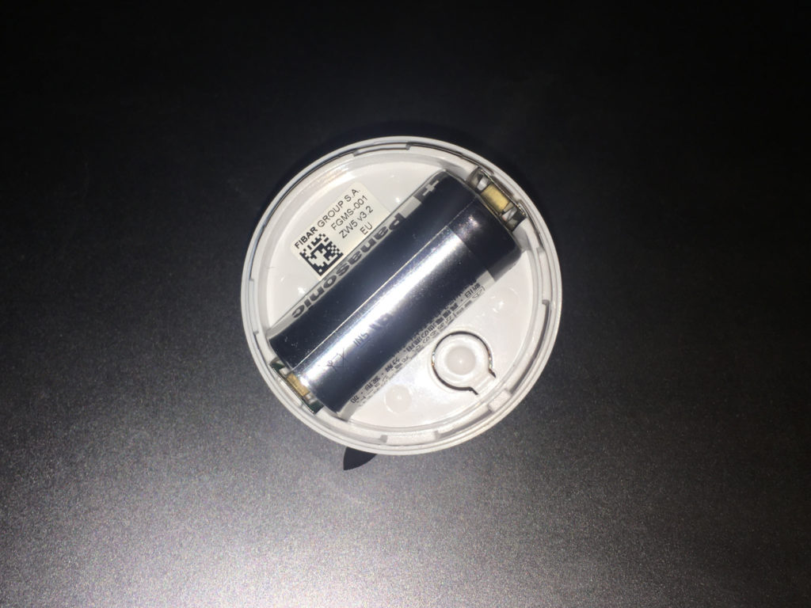
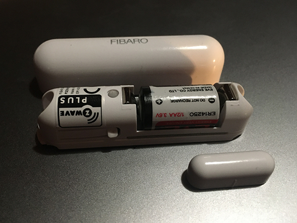

# Comment inclure un capteur dans Jeedom

*Publié le 4 décembre 2019*

*Keywords: "Detecteur de porte, détecteur de mouvement, Ampoule LED Bulb 6 Multi-Color*

Dans cet article, nous allons voir comment inclure un capteur dans votre domotique Jeedom, comme une ampoule, un détecteur de porte (ouverture/fermeture) et un détecteur de mouvements.

## Prérequis
Vous devez avoir un contrôleur Jeedom fonctionnel. Cet article se base sur un contrôleur équipé d’un Raspberry Pi4 et d’une carte d’extension RazBerry. L’installation et la configuration de ce contrôleur a été réalisée suivant cet article: [Installation de Jeedom sur un Raspberry Pi4](../installation-jeedom)

Vous devez avoir installé le plugin Z-wave.

## Matériel

* Un détecteur de mouvements [Fibaro Motion Sensor – FGMS-001](https://jeedom.github.io/documentation/zwave/fr_FR/fibaro.fgms001_-_Motion)
* Un détecteur [Door/Window Sensor 2](https://manuals.fibaro.com/fr/door-window-sensor-2/)
* Une ampoule Aeotec [LED Bulb 6 Multi-Color (ZWA002)](https://aeotec.com/z-wave-led-lightbulb/)

## Précautions

Pour des raisons de sécurité, je vous conseille vivement de modifier la clé de sécurité Z-Wave avant l’inclusion. Pour réaliser cette opération, vous pouvez lire l’article [Installation de Jeedom sur un Raspberry Pi4](../installation-jeedom#modification-de-clé-de-sécurité), en bas de page. Cette étape est importante de le faire avant l’inclusion du premier capteur, faute de quoi, vous devrez les exclure et le ré-inclure, pour que tous les modules soient associés à cette nouvelle clé.

## Inclusion
### Plugin Z-wave

Pour l’inclusion d’un module, vous devez toujours vous rendre dans le menu `Plugins->Protocole domotique -> Z-wave`



### Détecteur de mouvements Fibaro

* Ouvrez le couvercle en tournant dans le sens contraire des aiguilles d’une montre
* Mettez le capteur à proximité du contrôleur Z-wave
* Passer votre contrôleur en mode inclusion (pour sortir de ce mode, re-cliquez sur « Mode inclusion »)
* Sélectionnez le mode non sécurisé (contrairement à ce qui est indiqué ci-dessous). En revanche, réserver le mode sécurisé pour les serrures connectées par exemple.



> En mode sécurisé, toutes les trames sont cryptées, ce qui ralenti considérablement le réseau et ce inutilement

Cliquez rapidement 3 fois sur le bouton, à côté de la pile



*Détecteur de mouvements Fibaro*

* Attendez que le capteur soit inclus dans votre système jusqu’à ce que vous recevez une confirmation. Vous pourrez encore définir un objet et une catégorie.
* Réveillez le capteur en appuyant une fois sur le bouton
* Refermez le couvercle

Pour exclure ce capteur de votre système,

* Cliquez sur le « Mode d’exclusion »
* Approchez le capteur de votre contrôleur
* Appuyez trois fois rapide sur le bouton

### Détecteur de porte Fibaro

Ceci est un détecteur de porte intérieur. Ouvrez le couvercle et procédez exactement comme pour le détecteur de mouvements [Fibaro Motion Sensor – FGMS-001](https://jeedom.github.io/documentation/zwave/fr_FR/fibaro.fgms001_-_Motion)



Lors de l’installation du capteur, assurez-vous que la petite pièce se trouve proche du récepteur et non de la pile (contrairement à ce qui est représenté sur la photo).

### Ampoule Aeotec LED Bulb 6 Multi-Color

* Repérer la douille où vous souhaitez insérer l’ampoule
* Éteignez l’interrupteur d’éclairage
* Retirez l’ampoule existante
* Insérer l’ampoule LED Bulb 6
* Passer votre contrôleur en mode insertion, comme indiqué plus haut
* Allumer l’interrupteur mural. La LED Bulb 6 devient jaune pendant une courte période, puis clignote en blanc, puis vert pendant 3 secondes pour indiquer qu’elle a rejoint le réseau Z-wave. Si l’ampoule clignote en blanc, puis rouge, cela indique qu’elle n’a pas réussi à rejoindre le réseau.

Pour exclure l’ampoule de votre réseau Z-wave

* Éteignez l’interrupteur d’éclairage
* Allumez l’ampoule pendant 1 seconde
* Éteignez pendant 0.5 à 2 seconde et allumez-la rapidement avant de l’éteindre.
* Répétez trois fois cette opération

```
off->on
off->on
off->on
Attendre 0.5 à 2 secondes avant de la rallumer. Éteindre très rapidement
```

