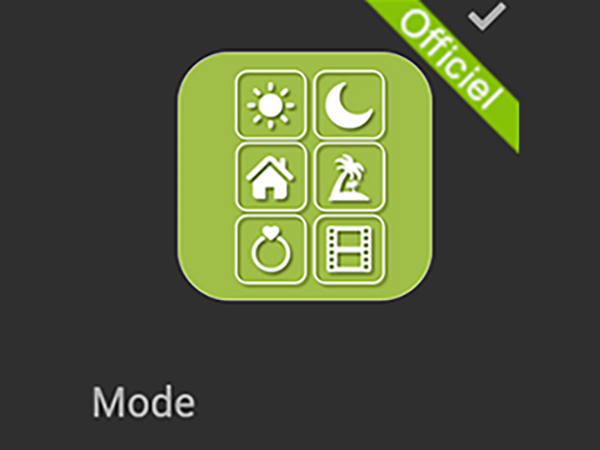
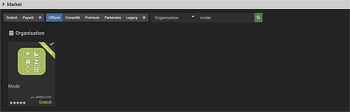
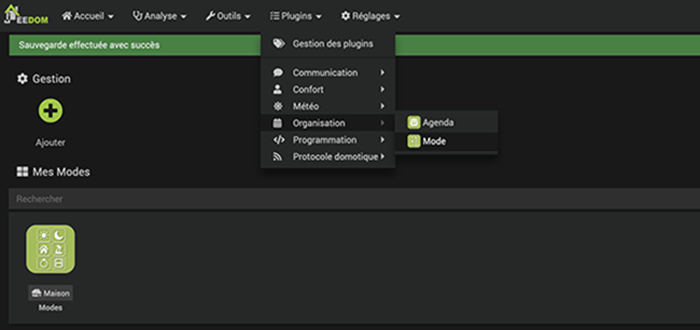
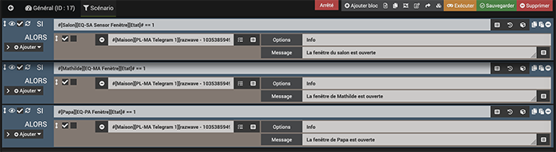
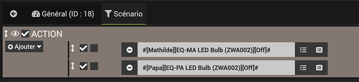

# Le plugin MODE dans Jeedom 

*Publié le 6 janvier 2020*

Dans cet article, je vais vous montrer comment on peut configurer des modes (Vacances, Aurevoir, etc) dans Jeedom avec le plugin MODE.

Ce plugin est très intéressant, car il va vous permettre de faire fonctionner votre contrôleur en fonction de certain mode, comme par exemple

* Aurevoir (quand vous quittez votre domicile)
* Bonjour (quand vous rentrez)
* Vacances (quand vous êtes absent pour une longue durée)

Vos appareils se comporteront alors en fonction du mode choisi:

* le mode « Vacances » pourrait simuler une présence.
* le mode « Aurevoir » pourrait éteindre toutes vos lumières, diminuer le chauffage, contrôler l’ouverture de vos fenêtres
* le mode « Bonjour » pourrais allumer une lumière en fonction de l’heure ou allumer votre chauffage en fonction de la température actuel
* et encore …

## Prérequis
Vous devez avoir un contrôleur Jeedom fonctionnel. Cet article se base sur un contrôleur équipé d’un Raspberry Pi4 et d’une carte d’extension [RazBerry](https://z-wave.me/products/razberry/). Si vous en n'avez pas, vous pouvez suivre [cet article](../installation-jeedom) avant de continuer sur cet article.

Vous devez avoir installé le plugin Z-wave.

## Matériel
Pour cet exercise, j’utilise

* une ampoule Aeotec LED Bulb 6 Multi-color (en bas de page)
* un capteur de porte Sensative Strips Guard

(J'ai écris des articles sur ces deux périphériques)

## Installation du plugin Mode

Rendez-vous dans `Plugins->Gestion des plugin`, cliquez sur `market` et rechercher `Mode`

*Jeedom plugin mode*

Installez ce plugin et aller sur la page de configuration de z-wave pour l’activer.

### Création d’un mode

> Nous partons dans le principe que vous savez et avez déjà créé des objets (Maisons, Chambre1, Chambre2, Salon, SDB, etc

Dirigez-vous dans `Plugins->Organisation->Mode` et ajouter (disons) un groupe de modes que j’ai appelé « Modes ». (J’ai volontairement mis un s, puisqu’il va regrouper les modes de ma maison/appartement)

* Donnez un nom d’équipement mode
* Définissez l’objet parent
* Et activez-le
* Vous pouvez encore définir des catégories

Puis cliquez sur le groupe qui vient de se créer ou rendez-vous sous l’onglet `Modes`, et définissez vos modes. Pour le moment, je vais que me consacrer sur le mode « Aurevoir »

*Définition du mode aurevoir*

* **Une action d’entrée** est l’action ou les actions qui vont être exécutée(s) quand on rentre dans ce mode
* **Une action de sortie** est l’action ou les actions qui vont être exécutée(s) quand on sort dans ce mode
* **Les deux coches** vous permettront d’activer ou pas votre mode (la première), et de permettre son exécution en parallèle à d’autres action (la deuxième)
* Le menu déroulant **Tous les modes**, vous permettra de lancer le mode à partir d’un autre ou de tous les modes. Si vous laissez “Tous les modes”, votre action d’entrée (ou de sortie) sera active quelque soit le mode de provenance.
* Pour les options suivantes, vous pouvez définir votre action ou l’exécution d’un scénario. Ce dernier est mon choix.

## Création des scénarios

Je vais donc créer deux scénarios qui seront exécutés lorsque le mode « Aurevoir » sera sélectionné.

Ces exemples sont très simples, mais je publierai un article avec des exemples plus concrêts, avec la gestion de radiateurs électriques.

### Contrôle des fenêtres

Ce scénario va contrôler si les fenêtres sont bien fermées quand je quitte mon domicile.

Rendez-vous dans `Outils->Scénarios`` et créez un scénario que j’ai appelé « Contrôle des fenêtres »

Dans l’onglet `Général` donnez/définissez au moins

*Définition du scénario Contrôle des fenêtres*

* un nom à votre scénario: Contrôle des fenêtres
* un groupe à votre scénario: Mode Aurevoir. Ceci va vous permettre de grouper vos scénarios en fonction de leur rôle. Prenez soin de bien les grouper. Cela vous sera utile plus tard, pour les retrouver et donner un sens à votre organisation
* un objet parent: Maison
* le mode du scénario doit être provoqué sans définir un déclencheur

Puis dirigez-vous dans l’onglet `Scénario`

Dans ce scénario, je souhaite recevoir un message Telegram si une fenêtre est restée ouverte. Pour l’utilisation de Telegram, je vous invite à aller [voir cet article](../telegram-dns/).

Comme vous le constatez, je crée trois conditions pour chaque fenêtre (une par pièce). Si l’état est à 1, j’envoie un message sur mon smartphone. L’image étant assez parlante, je ne vais pas détailler d’avantage ce passage. Je pars aussi dans le principe que vous savez sélectionner des appareils et leurs états.

### Contrôle des lumières

Ce scénario va éteindre les lumières. Pour simplifier cet article, je ne vais pas détailler cette partie car la pratique est la même que pour le scénario précédent, et finalement cela dépend aussi de votre organisation.

La différence étant que je n’utilise pas des conditions mais deux actions qui vont éteindre les deux ampoules [Aeotec LED Bulb 6 Multi-Color](https://aeotec.com/z-wave-led-lightbulb/), qui sont actuellement installées chez moi.

