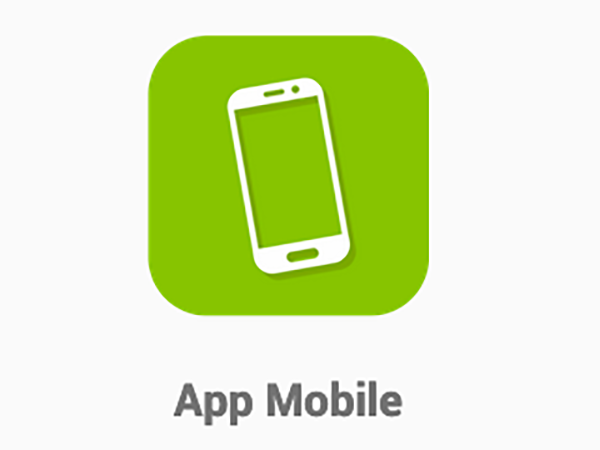
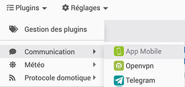
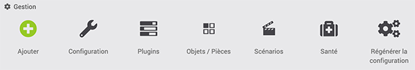
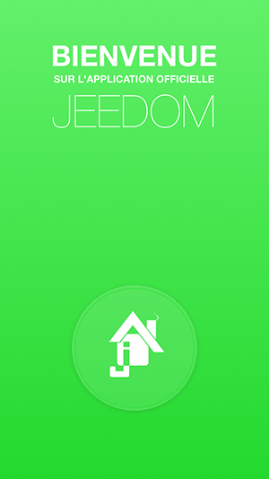
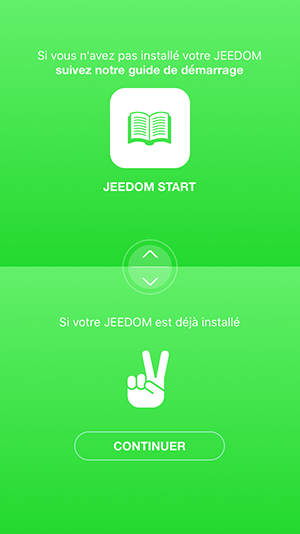
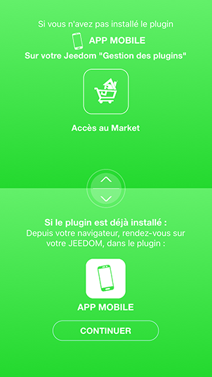
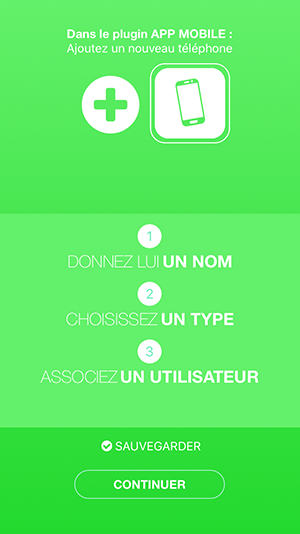

# Jeedom sur votre Smartphone

*Publié le 6 décembre 2019*

Dans cet article, je vais vous montrer comment installer et utiliser Jeedom sur votre SmartPhone pour visualiser vos appareils.

## Prérequis
Vous devez avoir un contrôleur Jeedom fonctionnel. Cet article se base sur un contrôleur équipé d’un Raspberry Pi4 et d’une carte d’extension [RazBerry](https://z-wave.me/products/razberry/). Si vous en n'avez pas, vous pouvez suivre [cet article](../installation-jeedom) avant de continuer sur cet article où vous trouverez aussi les instructions pour configurer DNS Jeedom.

Nous partons dans le principe que ces étapes sont établies.

Vous devez avoir installé le plugin Z-wave.

## Installation du plugin App Mobile

Rendez-vous dans `Plugins->Gestion des plugin`, cliquez sur « market » et rechercher `Mobile`

*Plugin App Mobile*

Installez ce plugin et aller sur la page de configuration de z-wave pour l’activer.

Dirigez-vous dans `Plugins->Communication->App Mobile`

et cliquez sur `Ajouter` pour ajouter un équipement et donner un nom à votre équipement.

Définissez

* l’objet parent, si vous avez créé des objets
* activez l’équipement
* le type de Mobile
* un utilisateur

et sauvegardez votre équipement.

Toujours dans `Plugins->Communication->App Mobile`

Sous `Plugins, Objets/Pièces`, `Scénarios`, vous pouvez encore autoriser ou pas des plugins, pièces ou scénarios sur votre Smart Phone

Pour plus d’informations détaillées, dirigez-vous vers la [documentation](https://jeedom.github.io/plugin-mobile/fr_FR/) de Jeedom.

## Installation de l’App Jeedom sur votre Smartphone

Prenez votre Smartphone et installer Jeedom. (Les exemples suivants sont montés depuis un iPhone). Acceptez les notifications lors de l’installation.

Une fois installé, suivez les instructions.

*Bienvenue*

*Votre plugin est déjà installé, cliquez sur Continuer*

*Continuer*

*Continuer*

Finalement, retourner dans votre contrôleur dans `Plugins->Communication->App Mobile` et scaner le QR Code.

