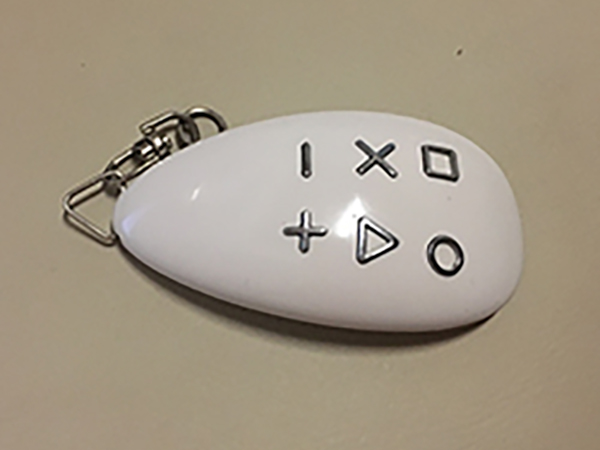
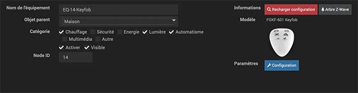
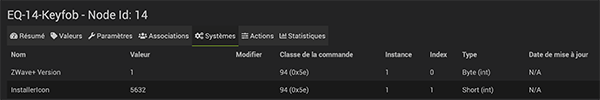
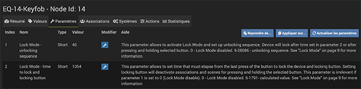

# La télécommande KeyFob de Fibaro

*Publié le 30 décembre 2019*

Dans cet article, je vais vous montrer comment inclure et configurer une petite télécommande dans votre domotique Jeedom. Elle va vous permettre de multiples tâches, comme éteindre ou allumer une ampoule, diminuer sa luminosité ou contrôler un radiateur.

## Prérequis
Vous devez avoir un contrôleur Jeedom fonctionnel. Cet article se base sur un contrôleur équipé d’un Raspberry Pi4 et d’une carte d’extension [RazBerry](https://z-wave.me/products/razberry/). Si vous en n'avez pas, vous pouvez suivre [cet article](../installation-jeedom) avant de continuer sur cet article.

Vous devez avoir installé le plugin Z-wave.

## Matériel

* [FGKF-601 Keyfob](https://www.fibaro.com/en/products/keyfob/) | swiss domotique | [Documentation](https://manuals.fibaro.com/keyfob/) | [pdf](Assets/pdf/FGKF-601-EN-T-v0.16_web_22.07.24.pdf)

## Précautions

Pour des raisons de sécurité, je vous conseille vivement de modifier la clé de sécurité Z-Wave avant l’inclusion. Pour réaliser cette opération, vous pouvez lire l’article [Installation de Jeedom sur un Raspberry Pi4](../installation-jeedom#modification-de-clé-de-sécurité), en bas de page. Cette étape est importante de le faire avant l’inclusion du premier capteur, faute de quoi, vous devrez les exclure et le ré-inclure, pour que tous les modules soient associés à cette nouvelle clé.

## Plugin Z-Wave

Pour l’inclusion d’un module, vous devez toujours vous rendre dans le menu `Plugins->Protocole domotique -> Z-wave`

Pour passer le contrôleur Z-wave en mode inclusion, cliquez sur « Mode inclusion » et sélectionner le mode non sécurisé

## La télécommande KeyFod de Fibaro
### L'inclusion

L’inclusion est relativement simple et identique aux autres produits Fibaro.

* Ouvrer le couvercle de la batterie
* Retirer la protection sur la batterie
* Refermer le couvercle
* Passer votre contrôleur Z-wave en mode inclusion
* Cliquez trois fois sur une des touche de la télécommande. Une LED va clignoter en blanc
* Attendez que votre contrôle confirme l’inclusion

### L’exclusion

Pour l’exclure du réseau, suivez les étapes suivantes

* Placez l’appareil dans la portée directe du contrôleur Z-Wave.
* Réglez le contrôleur en mode exclusion
* Appuyez simultanément sur le round et le tiret.
* Appuyez sur  le triangle ou la croix  jusqu’à ce que le voyant s’allume en vert.
* Appuyez sur le plus
* Attendez que le périphérique soit supprimé du contrôleur Z-wave.
* Le retrait sera confirmé par le contrôleur de réseau Z-Wave.

### Lock mode (vérouillage)

J’ai beaucoup galéré pour comprendre comment ce mode s’active. Mais voilà l’opération faite, je vous partage deux-trois explications.

Tour d’abord, il faut savoir que le verrouillage restera inactif si

* Le paramètre 1 est à 0, ou
* le paramètre 2 est à 0, ou
* la PROTECTION Command Class est définie comme Unprotected.

Tout d’abord, rendez-vous dans `Plugins->Protocole Domotique->Z-Wave` et cliquez sur votre télécommande que vous aviez inclus

Puis cliquez sur `Configuration` et sur l’onglet `Système` et chercher la ligne `protection`

*Configuration -> Système*

*Configuration -> Système -> Protection*

et modifiez ce paramètre sur `Protection by sequence`

### Les paramètres

Ensuite dirigez-vous sur l’onglet `Paramètre`

Les deux paramètres qui vont nous intéresser sont le 1 et le 2

> Si l’un des deux paramètres est à 0, le verrouillage restera inactif

Pour info
* le Carré à la valeur 1
* le Rond a la valeur 2
* la Croix a la valeur 3
* le Triangle a la valeur 4
* le Moins a la valeur 5
* et le Plus a la valeur 6

#### Pour calculer la valeur du paramètre:

**Valeur du paramètre** = Valeur du premier bouton + 8 * Valeur du deuxième bouton + 64 * Valeur du troisième bouton + 512 * Valeur du quatrième bouton + 4096 * Valeur du cinquième bouton

#### Paramètre 1: Lock – Unlocking sequence

Vous allez définir les deux touches de votre télécommande qui va la déverrouillée. Dans mon exercice, j’ai choisi l’appui simultané avec le Plus et le Moins (le Plus comme le premier bouton et le Moins comme le deuxième bouton)

Donc pour trouver la valeur du paramètre 1, vous devez faire ce calcul:

`valeur du paramètre 1 = 6 + 8 * 5 + 64 * 0 + 512 * 0 + 4096 * 0 = 46`

Modifiez le paramètre 1 avec la valeur 46 et la ligne deviendra jaune en attendant que ce paramètre soit pris en compte.

#### Paramètre 2: Time to lock and locking button

Vous allez maintenant définir

* la touche qui verrouillera votre télécommande
* et le temps qu’il faudra pour qu’elle s’auto-verrouillera après la dernière action

Pour ma part, j’ai choisi la touche Triangle et un auto-verrouillage après 30 seconde. Pour trouver la valeur de paramètre 2, vous devez faire ce calcul

**Valeur du paramètre** = Durée d’inactivité en secondes + 256 * Valeur du bouton de blocage

soit

`Valeur du paramètre = 30 + 256 * 4 = 1054`

Modifiez le paramètre 1 avec la valeur `1054` et la ligne deviendra jaune en attendant que ce paramètre soit pris en compte.

### Validation des modifications

Pour que ces modifications soient prises en compte, **vous devez réveiller votre télécommande**. Pour ce faire, aller dans le menu de la télécommande:

* Appuyer simultanément sur les touches Rond et Moins
* Observez la LED blanche
* et valider avec la touche Plus

Pour plus de détails: [doc](https://manuals.fibaro.com/fr/keyfob/)

A partir de là, vous observerez que les lignes des paramètres 1 et 2 redeviendront noires. Les modifications on été appliquées.

## Testons

* Quand vous appuyez sur une touche, la LED clignote vert.
* Quand la télécommande est verrouillée, la LED clignote rouge.
* Quand la télécommande se verrouille, la LED clignote du vert au rouge.
* Si vous appuyez sur n’importe quelle touche, la LED clignote rouge, se qui vous indiquera que la télécommande est verrouillée.
* Appuyez sur les touches Plus et Moins, la télécommande se déverrouillera.
* Attendez 30 seconde, et appuyez sur une touche. La LED devrait clignoter rouge.
* Re-déverrouillez la télécommande et maintenez enfoncé la touche Triangle , 1 seconde et la télécommande se verrouille. La LED passe du vert au rouge.