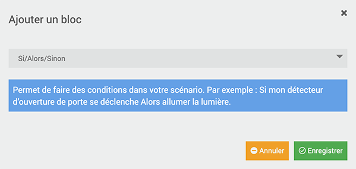

# Installation du plugin Telegram avec Jeedom DNS

*Publié le 4 décembre 2024*


Dans cet article je vais vous montrer comment installer le plugin Telegram dans Jeedom, pour être alerté lors d’un changement d’état, via cette messagerie. Vous allez aussi installer et utiliser DNS Jeedom.

## Nous allons voir comment

* souscrire au Service Pack Power
* configuration du DNS Jeedom
* créer un Bot Telegram
* installation et configurer du plugin Telegram
* création d’un scénario

Avant tout, Telegram nécessite un certificat, comme letsencrypt. Dans mon cas, je vais faire le travail avec le service DNS de jeedom. Il vous faudra alors souscrire au Service Pack Power pour €50.–.

## Pérequis

Vous devez avoir un contrôleur Jeedom fonctionnel. Cet exercice est réalisé avec un Raspberry Pi4 et une carte d’extension RaZberry. J'ai écris un article [ici](../installation-jeedom/)

Vous devez également avoir le Service Pack Power.

Idéalement, vous devez aussi avoir installé le plugin Openvpn. Si non, nous verrons plus bas, comment il s’installera lors de l’activation de DNS Jeedom dans la configuration du contrôleur.

## Service Pack Power

Rendez-vous sur [votre profil](https://www.jeedom.com/market/index.php?v=d&p=profils) et cliquez sur « Mes Services », puis cliquez sur Pack Power. Vous allez être redirigé sur paypal pour régler le coût du service.

## Service DNS Jeedom

*Documentation: [DNS Jeedom](https://jeedom.github.io/documentation/howto/fr_FR/mise_en_place_dns_jeedom)*

DNS Jeedom vous permettra d’avoir un accès à son contrôleur Jeedom depuis l’extérieur avec HTTPS. Il est indispensable pour le fonctionnement de Telegram.

Toujours sous l’onglet « Mes Services », vous allez pouvoir configurer votre DNS


*Jeedom accès à distance*


*Configuration de DSN Jeedom*

**Je vous recommande aussi de personnaliser un nom DNS** sous la colonne « Dns », avant de sauvegarder. Ceci vous permettra d’accéder à votre contrôleur avec un nom plus simple à retenir.

Puis ensuite, rendez-vous dans l’onglet « Mes Boxs » et synchroniser votre box (avant dernier icône, depuis la droite)


*Configuration de DNS Jeedom Box*

Ces modifications prendront env 24h pour qu’elles soient effectives

Une fois que l’état sera OK, vous pouvez continuer.

> Note: quand je suis allé vérifier le statut, soit environ 24h après, l’état était toujours « non synchronisé ». Je suis allé dans la configuration de mon contrôleur, sous l’onglet « mises à jour » et j’ai testé ma connexion au Market. Puis, je suis allé sous mon profil du Market, sous « Mes Boxs », et j’ai re-sauvé mon enregistrement. Je ne sais pas si c’était un hasard ou pas.

### Activation de DNS jeedom

Rendez-vous maintenant dans la configuration de votre contrôleur

")

*Utilisation de DNS jeedom (extérieur)*

puis cochez « Utiliser les DNS Jeedom » et ensuite sur « Démarrer« .

Si vous n’avez pas installer le plugin « Openvpn », il l’installera pour vous, mais vous aurez un message d’erreur indiquant que le plugin « Openvpn » n’est pas activé. Retourner dans vos plugins et vérifiez qu’il l’est, puis, re-cliquez sur « Démarrer ».

Votre boîte est maintenant accessible de l’extérieur.

## Telegram

Vous devez installer Telegram sur votre Smartphone, si ce n'est pas encore fait.

### Création d’un bot

**Cette opération est faite depuis un iPhone 6**

Allez sur « Settings » ou « Paramètres » et cliquez ensuite sur votre profil.
Créez un nom d’utilisateur.


*Création d’un nom utilisateur (username)*

Retournez sur le Chat et rechercher BotFather. Cliquez sur le premier


*Telegram – BotFather*

Cliquez sur « Start » ou « Démarrer » pour lancer une communication


Ensuite cliquez sur /newbot


Donnez un nom à votre bot ainsi qu’un nom d’utilisteur (username) qui doit se terminer par `_bot`


*Telegram – nom et nom d’utilisateur*

et finalement, vous allez recevoir votre token


**Mémorisez bien ce token, dans KeePass par exemple**

> Lors de la rédaction de cet article, mon contrôleur Z-wave, n’était pas encore visible de l’extérieur. J’ai préféré attendre que les DNS Jeedom soit synchronisé, pour qu’il soit visible, avant de continuer

## Installation du plugin Telegram

Rendez-vous maintenant dans votre contrôleur Jeedom (https://hostname.local ou avec l'IP fourni par votre routeur à votre Rapsberry/Contrôleur), puis dans la gestion des plugins.

Cliquez sur Market et rechercher le plugin Telegram


*Plugin Telegram*

Une fois installé, Jeedom vous proposera de vous rediriger vers la page de configuration du plugin. Acceptez et activez-le.


Vous devez maintenant créer un équipement. Allez dans le menu plugin->Communication->Telegram


*Ajout d’un équipement*

### Ajout d’un équipement

La création d’un équipement va vous permettre de recevoir un message quand un événement sera déclencher par l’ouverture d’une porte, par exemple.

Dans la suite de l’exercice, je souhaite en effet, recevoir un message lorsque la porte d’entrée de ma maison s’ouvre. Je vais donc créer un équipement en cliquant sur **Ajouter**

> Je pars dans le principe que vous avez/savez déjà créer des objets. Dans le cas contraire, vous pourrez les créer ultérieurement et mettre à jour cet équipement.


*Complétez et ajoutez le Bot token*

* Donnez un nom à votre équipement
* Définissez un objet parent
* Activez-le et rendez-le visible dans le Dashboard, si vous le souhaitez
* Renseignez le Bot Token que vous avez précédemment créer
* Vérifiez également que l’option « Créer automatiquement les nouveaux contacts » soit bien cochée. Il faudra désactiver cette coche plus tard, pour éviter des contacts inopportuns.
* Vous pouvez encore définir le format des messages


Je laisse pour le moment tout par défaut.

Reprenez ensuite votre smartphone et ouvrer votre App Telegram et rechercher votre bot dans le champs de recherche, depuis l’onglet « Chat ».


Puis cliquez sur démarrer (ou start)


Retournez maintenant dans votre contrôleur Jeedom, sous `Gestion des plugins->Communication->Telegram`, et cliquez sur l’onglet `commande`, et vous trouverez l’utilisateur à partir duquel vous venez d’envoyer un message à votre bot.


Si vous n’avez plus besoin d’ajouter de nouveaux contacts afin de piloter votre Jeedom avec Telegram et que vous avez suivi les étapes précédentes, je vous suggère **de désactiver la création de nouveaux contacts**. En effet, le bot étant public, vous pourriez recevoir des messages de tiers et ainsi avoir plusieurs utilisateurs non légitimes dans votre équipement.

## Scénario

L’objectif de ce scénario, est de recevoir un message Telegram et une notification sur votre App Jeedom sur mon Smart Phone, lorsque la porte du jardin s’ouvre.

### Inclusion d'un capteur de porte

Pour inclure le capteur Sensative Strip Guard, veuillez suivre [cet article](../sensative-strip-guard/)

### Objets
J’ai préalablement créé des objets

* Maison
	* Jardin
		* Porte Sud
	* Rez
		* Chambre 1
	* Couloir

### Scénario Jeedom

Rendez-vous maintenant dans le menu `Outils->Scénarios` et cliquez sur **Ajouter**


remplissez les champs


* Donnez un nom
* Définissez un groupe (option)
* Activez-le
* Définissez un objet parent. J’ai choisi ‘jardin’ vu que c’est une porte du jardin
* Vous pouvez définir une icône
* Donnez un description
* Mode du scénario => Provoqué
* Événement => cliquez la première icône « Choisir une commande » et sélectionnez
	* Objet => Jardin
	* Équipement => Sélectionnez le capteur Strip Guard (que vous avez placé sous un objet)
	* Commande => État

Sauvez et cliquez sur l’onglet Scénario


Vous allez créer 2 scénario. Pour cela, cliquez sur **Ajouter Bloc** et choisissez `Si/Alors/Sinon`



Cliquez sur l’icône **Choisir une commande**


et définissiez encore l’objet, l’équipement et l’état à surveiller et validez


*Surveillance de l’état …*

Dans la prochaine fenêtre, vous indiquez que vous souhaitez surveiller l’état ouvert


*… ouvert*

Sur la ligne SI, vous devriez trouver ceci. (Évidemment, les noms varions en fonction des noms que vous aurez donner à vos objets et équipements)

```
#[jardin][Module Strips Porte Sud][Etat]# == 1
```

Puis cliquez sur Ajouter et Action


Cliquez sur l’icône « Sélectionner une commande »


* Sélectionnez l’objet parent que vous avez défini lors que vous avez créé l’équipement Telegram 1
* Sélectionner l’équipement Telegram 1
* Sélectionnez la commande et Validez.

> Vous retrouverez ces informations sous le menu `Plugins->Communication->Telegram`. Le contact sous Commande a été créé quand vous avez envoyé votre premier message Telegram, avec votre Smart Phone. Je profite pour vous rappeler, qu’**il est important désactiver la création de nouveaux contacts**

Une fois fait, vous allez voir deux champs « Option » ou « titre » et « Message ».

Remplissez ces deux champs de la manière suivante


Sauvegarder votre scénario et cliquez sur « Exécuter »

Prenez votre capteur de porte et lorsque vous éloignez l’aimant, vous devriez recevoir un message sur Telegram de votre Smart Phone

