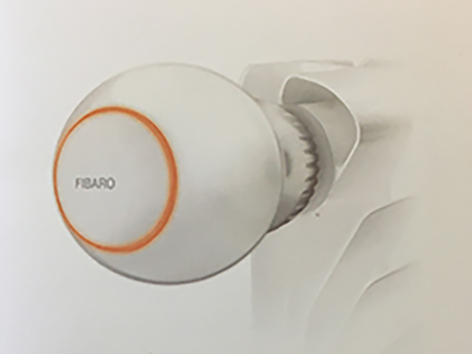
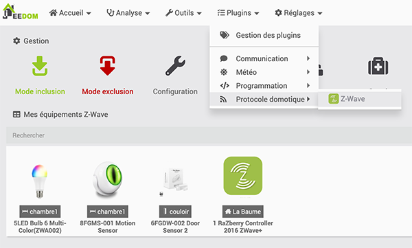

# Une tête thermostat Fibaro pour radiateur

*Publié le 5 décembre 2019*

Dans cet article, je vais vous montrer rapidement, comment inclure, dans votre domotique, un thermostatique Z-Wave pour contrôler la consommation de votre radiateur.

Le but de ce capteur est de pouvoir réguler la température de votre radiateur en fonction de la présence dans la pièce et d’un horaire de fonctionnement. Ceci, afin d’utiliser économiquement votre radiateur et de soulager votre porte-monnaie.

## Prérequis
Vous devez avoir un contrôleur Jeedom fonctionnel. Cet article se base sur un contrôleur équipé d’un Raspberry Pi4 et d’une carte d’extension [RazBerry](https://z-wave.me/products/razberry/). Si vous en n'avez pas, vous pouvez suivre [cet article](../installation-jeedom) avant de continuer sur cet article.

Vous devez avoir installé le plugin Z-wave.

## Matériel

* [Fibaro The Heat Controller FGT-001](https://manuals.fibaro.com/fr/heat-controller/) | [Documentation](Assets/pdf/FGT-001-EN-T-v1.3.pdf)
* Une petite pointe (une est livrée avec le thermostat

## Précautions

Pour des raisons de sécurité, je vous conseille vivement de modifier la clé de sécurité Z-Wave avant l’inclusion. Pour réaliser cette opération, vous pouvez lire l’article [Installation de Jeedom sur un Raspberry Pi4](../installation-jeedom#modification-de-clé-de-sécurité), en bas de page. Cette étape est importante de le faire avant l’inclusion du premier capteur, faute de quoi, vous devrez les exclure et le ré-inclure, pour que tous les modules soient associés à cette nouvelle clé.

Lisez bien [le manuel](https://manuals.fibaro.com/fr/heat-controller/) avant de faire montage, notamment sur le calibrage de l’appareil.

Je vous conseille aussi vivement de regarder [cette vidéo](https://www.youtube.com/watch?v=3-k3uGHAOqQ&t=2s) qui vous dira déjà beaucoup sur cet article.

## Plugin Z-wave

Pour l’inclusion d’un module, vous devez toujours vous rendre dans le menu `Plugins->Protocole domotique -> Z-wave`

*Protocole domotique Z-wave*

Pour passer le contrôleur Z.wave en mode inclusion, cliquez sur `Mode inclusion` et sélectionner le mode `sécurisé`

## Le Thermostat intelligent (résumé)

A l’aide de chargeur Micro-USB, connectez-le et rechargez votre tête thermostat jusqu’à ce qu’il clignote en vert.

* Démontez votre tête thermostat actuel
* Selon le type de votre valve, choisissiez un adaptateur fourni dans la boîte.
* Installez le thermostat intelligent Fibaro sur la vanne en tournant le couvercle dans le sens horaire.
* A l’aide de la pointe, enfoncé la dans le trou pendant 1 seconde, jusqu’à ce que l’appareil clignote bleu.
* Pour le calibrer, appuyez et maintenez la pointe dans le trou jusqu’à ce que l’appareil affiche la couleur blanche. Relâchez et appuyer une fois pour confirmer le mode calibration. Attendez que l’appareil clignote 3x blanc.

## Inclusion

* Passer votre contrôleur en Mode insertion et choisissez le mode **non sécurisé (contrairement à ce qui est indiqué ci-dessous)**. En revanche, réserver le mode sécurisé pour les serrures connectées par exemple.

*Attention, contrairement à ce qui est montré sur l'image, choisissez le mode **non sécurisé***

* Cliquez rapidement 3 fois rapide avec la pointe. La LED du thermostat commence à clignoter en blanc.
* Une association réussi, sera signalée par le contrôleur Z.wave
