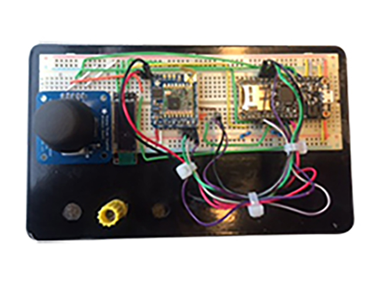
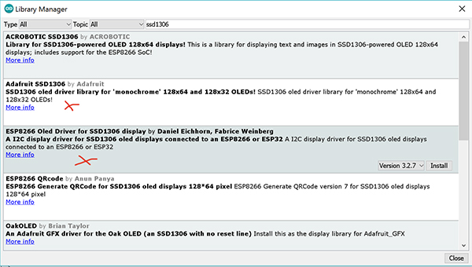
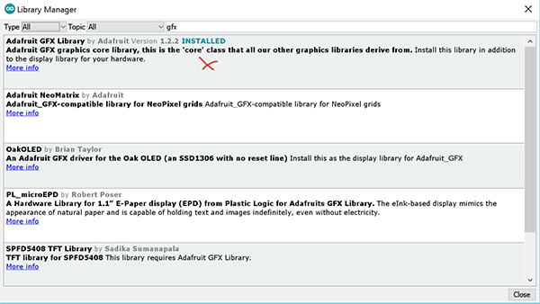

# Un Joystick pour orienter un petit robot avec LoRa

*Publié le 18 décembre 2017*



Dans cet article, je vais vous *résumer* comment préparer un Joystick et un mini display pour orienter un petit robot avec la technologie LoRa. Même, si je vous donnerai tout mon code, cet exercice n’a qu’un but expérimentale sur les modules et fonctionnalités proposé. L’acquis sera reporté sur un autre projet. Les suggestions d’experts sont les bienvenues pour améliorer le mode de fonctionnement.

Cet article part du principe que vous connaissez l’[IDE Arduino](https://www.arduino.cc/en/Main/Software) , C++ et comment installer des librairies


Le script complet sera présenté [ici](sender.ino)

Cet article ne vous permettra pas de mettre en place ce Joystick sans réflexion, sans chercher à comprendre et sans analyses. De tout évidence, il vous faudra analyser [le code en entier](sender.ino) ainsi que les diverses variables que je n’ai pas publié dans cet article.


## Matériel

* [Adafruit MO adalogger](https://www.adafruit.com/product/2796) (La carte SD n’est pas utilisée dans cet article)
* [Joystick](https://www.adafruit.com/product/512)
* [RFM95 Radio 868Mhz](https://www.adafruit.com/product/3072)
* Oled I2C 128×32 0.96 LCD Display


## Assemblage


## OLED LCD Display

*Référence : https://projetsdiy.fr/ssd1306-mini-ecran-oled-i2c-128×64-arduino/*

D’abord, il faut préparer votre IDE. Adafruit a développé une librairie très puissante qui va nous permettre de gérer l’affichage de notre mini écran mais aussi de tracer plein de chose très facilement grâce à la librairie dédiée, GFX Library

Ouvrer votre IDE puis le gestionnaire des librairies et installez les deux librairies `Adafruit SSD1306` et `ESP8266 Oled Drivers` comme indiqué sur l’image



*Adafruit SSD1306 & ESP8266 Oled Drivers*

Rechercher maintenant la libraire `Adafruit GFX` et installez-là encore.



*Adafruit GFX Library*

Fermez et ré-ouvrez votre IDE.

Dans votre nouveau fichier.ino, vous devrez inclure ces librairies:

```
#include <SPI.h> // I2C
#include <Wire.h> // I2C
#include <Adafruit_GFX.h>
#include <Adafruit_SSD1306.h>
Adafruit_SSD1306 display;
```

Puis dans fonction `setup()`, vous devez ajouter ceci pour afficher du texte:

```
/*
* Init the display
*/
display.begin(SSD1306_SWITCHCAPVCC, 0x3C); // initialize with the I2C addr 0x3C (for the 128x32)
// init done
display.display();
delay(2000);
display.clearDisplay(); // Clear the buffer.
display.setTextColor(WHITE); // Text color
display.setCursor(0,0); // Move the pointer/cursor to (x/y)
display.println("Welcome aboard SmartIdea!"); // un println comme pour écrire sur le port série
display.display(); // Print to LCD
display.clearDisplay(); // empyt the buffer but not the LCD print
```

## Le Joystick

*Référence: https://learn.adafruit.com/joy-controller-feather/software*

La pin Xout vous retournera une valeur  0 à 1023 (ADC). Idem pour l’axe Y, une valeur pourra entre 0 et 1023 pourra être mesurée à sortie Yout.

Cependant, pour le Joystick que j’utilise, les valeurs minimales et maximales mesurées sont de 13 et 1012 alors que le Joystick se trouvait en butée en haut, en bas, à gauche et à droite. Si vous utilisez un autre Joystick, il faudrait mesurer ces valeurs.

`Xout` affichera 12 quand le joystick poussé en butée vers l’avant. Il affichera 1012 quand il est poussé en butée vers le bas (vers vous).

`Yout` affichera 12 quand le joystick poussé en butée la gauche. Il affichera 1012 quand il est poussé en butée vers la droite.

`SIG` est LOW quand il est pressé, si non il est HIGH

Avant la fonction `setup()`, vous devez définir une variable de type struct qui contiendra les valeurs liées à l’état du Joystick

```
struct { // Joystick axis structure (2 axes per stick):
  int8_t pin; // Analog pin where stick axis is connected
  int lower; // Typical value in left/upper position
  int upper; // Typical value in right/lower positionax
  uint8_t key1; // Key code to send when left/up
  uint8_t key2; // Key code to send when down/right
  int value; // Last-read-and-mapped value (0-1023)
  int8_t state;
} axis[] = {
  {A0, MAX_PULSE, MIN_PULSE, KEY_UP_ARROW, KEY_DOWN_ARROW }, // Y axis // Need #include
  {A1, MIN_PULSE, MAX_PULSE, KEY_LEFT_ARROW , KEY_RIGHT_ARROW }, // X axis // Need #include
}; #define N_AXES (sizeof(axis) / sizeof(axis[0]))
```

Dans votre fonction setup(), vous pouvez définir la taille de la valeur retournée des pins analogiques, avec la fonction [analogReadResolution()](https://www.arduino.cc/en/Reference.AnalogReadResolution). J’ai aussi choisi d’avoir un niveau tension de référence de 3.3V, à la sortie des pins analogiques, en la connectant au 3.3V. Vous devez donc utiliser la fonction [analogReference(EXTERNAL)](https://www.arduino.cc/reference/en/language/functions/analog-io/analogreference/) . Etant donné que la carte Feather MO Adalogger a un processeur ATSAMD21G18 ARM Cortex M0 (48 MHz), je dois utiliser la même fonction avec le paramètre AR_EXTERNAL [analogReference(AV_EXTERNAL)](https://learn.adafruit.com/adafruit-feather-m0-adalogger/adapting-sketches-to-m0#analog-references). Le [INUT_PULLUP](https://learn.adafruit.com/adafruit-feather-m0-adalogger/adapting-sketches-to-m0#pin-outputs-and-pullups) est aussi une particularité de la carte. Avec la fonction pinMode, vous configurez la pin (broche) spécifiée, pour qu’elle se comporte soit en entrée, soit en sortie.

```
analogReadResolution(10);
Serial.println(F("analogReference()"));
analogReference(AR_EXTERNAL);
pinMode(JX, INPUT_PULLUP);
pinMode(JY, INPUT_PULLUP);
pinMode(JS, INPUT_PULLUP);
```

Toujours dans la fonction `setup()`, il vous faudra encore initier votre Joystick comme [ceci](sender.ino#L143)

Ensuite dans la boucle loop(),  vous devez ajouter [ce code](sender.ino#L263) qui va définit la position du Joystick et envoyer son état au module (Reciever) qui va recevoir le paquet LoRa, et orienter son objet en fonction de la position du Joystick.

## La radio LoRa

Pour cela, vous aurez besoin d’inclure a librairie [RadioHead](https://github.com/adafruit/RadioHead/archive/master.zip) et de déclarer les pin en fonction du schéma, ci-dessus

```
#include <RH_RF95.h> // LoRa Radio

// Define pin for feather m0
#define RFM95_CS 5
#define RFM95_RST 6
#define RFM95_INT 10
```

Vous devez encore créer un objet

```
RH_RF95 rf95(RFM95_CS, RFM95_INT)
```

Puis dans votre fonction `setup()`, vous initialisez le module Radio et vous affichez un message sur votre écran LCD.

```
/*
* Init LoRa / Radio
*/
pinMode(RFM95_RST, OUTPUT);
digitalWrite(RFM95_RST, HIGH);
while (!rf95.init()) {
 Serial.pprintln(F("LoRa radio init failed"),2);
 display.print("LoRa radio init failed");
 display.display();
 //display.clearDisplay();
while (1);
}

Serial.println(F("LoRa radio init OK!"),2);
//display.setCursor(0,0);
display.print("Radio ready"); // Prepare text to be pinted on LCD
// Defaults after init are 434.0MHz, modulation GFSK_Rb250Fd250, +13dbM
// We need 868.0Mhz for Europe
if (!rf95.setFrequency(RF95_FREQ))
{
  Serial.println(F("setFrequency failed"),2);
  while (1);
}

Serial.print(F("Freq at "),2); Serial.println(RF95_FREQ,2);
display.print(" "); // Prepare text to be pinted on LCD
display.print(RF95_FREQ); // Prepare text to be pinted on LCD
display.println("Mhz"); // Prepare text to be pinted on LCD
display.display(); // Dipslay on lCD
display.clearDisplay(); // Clear cache
delay(2000); // Wait 2sec
```

Vous enverrez vous données au module distant (reciever) grâce à ce code

```
memset(srfm,'\0',SRFMLEN); // Clean the buffer srfm
sprintf(srfm,"snap"); // Copy into srfm
r = send_rf95(srfm); // Send the vlaue of srfm

if(r == 1)
{
  display.println(SENT); // Prepare the text to be displayed
}
else if(r == 0)
{
  display.println(NOLISTNER);
}
else if(r == -1)
{
  display.println(FAILED);
}

display.display();
display.clearDisplay();
```


