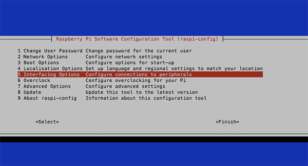

# Un raspberry Zero, un LCD et LoRa pour recevoir des données rfm95

*Publié le 25 décembre 2017*

*Keywords: rfm95, Raspberry Zero, Oled, RadioHead*


Dans cet article, vous allez apprendre à configurer un Raspberry Zero W avec un carte « chapeau » Radio RF95. Vous allez aussi le faire fonctionner en mode de réception pour qu’il reçoive les paquets envoyés par le Joystick (ou par un autre module LoRa). Vous allez encore configurer un écran écran Oled I2C 128×64 pour afficher les paquets reçus et des messages.

Nous partons dans le principe que vous sachez et avez installer l'OS de votre Raspberry. Si vous ne savez pas comment réinstaller un Raspberry, je décrit cette démarche dans plusieurs articles, dans le dossier `Raspberry`

## Matériel
* [Raspberry Zero W](https://www.raspberrypi.org/products/raspberry-pi-zero-w/)
* RFM 95 Lorawan/TTN hat ([Edit 09.2024] Malheureusement, ce module n'est plus disponible sur www.tindie.com)
* LCD 1,3 » Oled 128×64 

## LCD OLED 128×64 I2C
*Référence: https://hallard.me/adafruit-oled-display-driver-for-pi/*

Nous allons d’abord vérifier que I2C est activé sur votre Raspberry. Ouvrez votre terminal et tapez la commande suivante

```
sudo raspi-config
```

Sélectionner **5 Interfacing Option**



Puis **P5 I2C**


Puis, répondez YES pour l’activer. Puis cliquez sur `<Finish>`

## Câblage

*Référence: https://learn.adafruit.com/monochrome-oled-breakouts/wiring-1-dot-3-128×64#using-with-i2c*


## Installation des librairies (C) et de git

```
sudo apt-get install build-essential git-core libi2c-dev i2c-tools lm-sensors
```

## Installation d’ArduiPi_OLED

*Note: [ArduiPi_OLED](https://github.com/hallard/ArduiPi_OLED) remplace [ArduiPi_SSD1306](https://github.com/hallard/ArduiPi_SSD1306)*

```
mkdir ~/Soft
cd ~/Soft
git clone https://github.com/hallard/ArduiPi_OLED.git
cd ArduiPi_OLED/
sudo make
```

Le script compilera la librairie (ArduiPi_OLED) et l’installera pour vous (c’est pourquoi nous devons utiliser sudo) dans `/usr/local/lib/` et les en-têtes de bibliothèque dans `/usr/local/include/`

### Testons!

Allez dans `cd ~/Soft/ArduiPi_OLED/examples` et compilez

```
cd ~/Soft/ArduiPi_OLED/example
sudo make
```

puis lancez le fichier de démo pour un écran 128×64 fonctionnant sur I2C

```
sudo ./oled_demo --verbose --oled 3
```

De mon côté, ca marche très bien

## Radio RFM95

Installation des librairies C pour BCM 2835

```
mkdir ~/Soft
wget http://www.airspayce.com/mikem/bcm2835/bcm2835-1.52.tar.gz
tar zxvf bcm2835-1.52.tar.gz
cd bcm2835-1.52
sudo ./configure
sudo make
sudo make check
sudo make install
```

### RadioHead

*Référence : https://github.com/hallard/RadioHead*

```
cd ~/Soft/
git clone https://github.com/hallard/RadioHead.git
cd RadioHead/
cd ~/Soft/RadioHead/examples/raspi
sudo nano RasPiBoards.h
```

Il faut maintenant corriger la définition des pins pour qu’elle correspondent à mon PCB Radio RF95

Commentez et ajoutez ces lignes

```
// Module 1, 2 and 3 are example of module type soldered on the board
// change to fit your needs

// Module 1 on board RFM95 868 MHz (example)
//#define MOD1_LED_PIN RPI_V2_GPIO_P1_07 // Led on GPIO4 so P1 connector pin #7
//#define MOD1_CS_PIN RPI_V2_GPIO_P1_24 // Slave Select on CE0 so P1 connector pin #24
//#define MOD1_IRQ_PIN RPI_V2_GPIO_P1_22 // IRQ on GPIO25 so P1 connector pin #22
//#define MOD1_RST_PIN RPI_V2_GPIO_P1_29 // Reset on GPIO5 so P1 connector pin #29

#define MOD1_LED_PIN RPI_V2_GPIO_P1_18 
#define MOD1_CS_PIN RPI_V2_GPIO_P1_08 
#define MOD1_IRQ_PIN RPI_V2_GPIO_P1_25 
#define MOD1_RST_PIN RPI_V2_GPIO_P1_05
```

Pour quitter et sauver : `<ctrl+X>`, puis `<maj+Y>`, puis `<enter>`

Ensuite nous allons scanner votre carte

```
cd /Soft/RadioHead/examples/raspi/spi_scan
sudo make
sudo ./spi_scan
```

Si tout c’est bien passé, vous devriez voir ceci:

```
Checking register(0x42) with CS=GPIO06 => Nothing!
Checking register(0x10) with CS=GPIO06 => Nothing!
Checking register(0x42) with CS=GPIO07 => Nothing!
Checking register(0x10) with CS=GPIO07 => Nothing!
Checking register(0x42) with CS=GPIO08 => SX1276 RF95/96 (V=0x12)
Checking register(0x10) with CS=GPIO08 => Nothing!
Checking register(0x42) with CS=GPIO26 => Nothing!
Checking register(0x10) with CS=GPIO26 => Nothing!
```

Votre carte radio a bien été vue à la GPIO08

Maintenant, nous allons le faire fonctionner en mode récepteur. C’est à dire qu’il va attendre qu’un émetteur lui envoie des paquets

```
cd ~/Soft/RadioHead/RadioHead/examples/raspi/rf95
sudo make
sudo ./rf95_server
```

Je vais utiliser le Joystick que j’ai fait dans cet article : [un joystick pour orienter un petit robot avec lora](../rfm95-sender) (voir dans le dossier LoRa) pour que ce Joystick lui indique sa position (haut, bas, gauche, dtroite).


