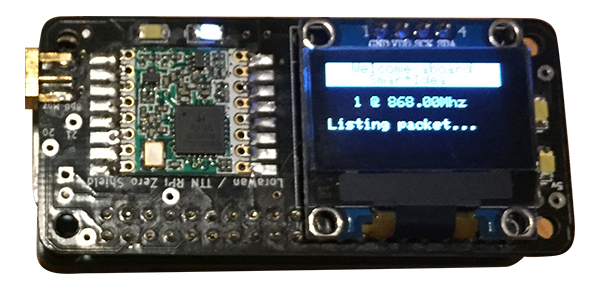

# Un raspberry Zero, un LCD et LoRa pour recevoir des données rfm95

*Publié le 25 décembre 2017*

*Keywords: rfm95, Raspberry Zero, Oled, RadioHead, systemd, systemctl*


Dans cet article, vous allez configurer votre Raspberry pour qu’il affiche du texte sur un écran 128x64 OLED. Mais vous allez surtout configurer votre Raspberry pour qu’il puisse recevoir des paquets Radio avec LoRa. Vous allez aussi modifier la librairie RadioHead pour que le contenu des paquets reçus s’affichent sur l’écran OLED. Vous aller aussi faire en sorte que votre module écoute les paquets radio envoyés dès son démarrage!

Nous partons dans le principe que vous sachez et vous avez installé l'OS de votre Raspberry. Si vous ne savez pas comment réinstaller un Raspberry, je décris cette démarche dans plusieurs articles, dans le dossier `Raspberry`

## Matériel
* [Raspberry Zero W](https://www.raspberrypi.org/products/raspberry-pi-zero-w/)
* RFM 95 Lorawan/TTN hat ([Edit 09.2024] Malheureusement, ce module n'est plus disponible sur www.tindie.com, mais vous devriez pouvoir refaire l'exercise avec des modules de subtitution)
* LCD 1,3 » Oled 128×64 

## LCD OLED 128×64 I2C
*Référence: https://hallard.me/adafruit-oled-display-driver-for-pi/*

Nous allons d’abord vérifier que I2C est activé sur votre Raspberry. Ouvrez votre terminal et tapez la commande suivante

```
sudo raspi-config
```

Sélectionner **5 Interfacing Option**


Puis **P5 I2C**


Puis, répondez YES pour l’activer. Puis cliquez sur `<Finish>`

## Câblage

*Référence: https://learn.adafruit.com/monochrome-oled-breakouts/wiring-1-dot-3-128×64#using-with-i2c*


## Installation des librairies (C) et de git

```
sudo apt-get install build-essential git-core libi2c-dev i2c-tools lm-sensors
```

## Installation d’ArduiPi_OLED

*Note: [ArduiPi_OLED](https://github.com/hallard/ArduiPi_OLED) remplace [ArduiPi_SSD1306](https://github.com/hallard/ArduiPi_SSD1306)*

```
mkdir ~/Soft
cd ~/Soft
git clone https://github.com/hallard/ArduiPi_OLED.git
cd ArduiPi_OLED/
sudo make
```

Le script compilera la librairie (ArduiPi_OLED) et l’installera pour vous (c’est pourquoi nous devons utiliser sudo) dans `/usr/local/lib/` et les en-têtes de bibliothèque dans `/usr/local/include/`

### Testons!

Allez dans `cd ~/Soft/ArduiPi_OLED/examples` et compilez

```
cd ~/Soft/ArduiPi_OLED/example
sudo make
```

puis lancez le fichier de démo pour un écran 128×64 fonctionnant sur I2C

```
sudo ./oled_demo --verbose --oled 3
```

De mon côté, ca marche très bien

## Radio RFM95

Installation des librairies C pour BCM 2835

```
mkdir ~/Soft
wget http://www.airspayce.com/mikem/bcm2835/bcm2835-1.52.tar.gz
tar zxvf bcm2835-1.52.tar.gz
cd bcm2835-1.52
sudo ./configure
sudo make
sudo make check
sudo make install
```

### RadioHead

*Référence : https://github.com/hallard/RadioHead*

```
cd ~/Soft/
git clone https://github.com/hallard/RadioHead.git
cd RadioHead/
cd ~/Soft/RadioHead/examples/raspi
sudo nano RasPiBoards.h
```

Il faut maintenant corriger la définition des pins pour qu’elle correspondent à mon PCB Radio RF95

Commentez et ajoutez ces lignes

```
// Module 1, 2 and 3 are example of module type soldered on the board
// change to fit your needs

// Module 1 on board RFM95 868 MHz (example)
//#define MOD1_LED_PIN RPI_V2_GPIO_P1_07 // Led on GPIO4 so P1 connector pin #7
//#define MOD1_CS_PIN RPI_V2_GPIO_P1_24 // Slave Select on CE0 so P1 connector pin #24
//#define MOD1_IRQ_PIN RPI_V2_GPIO_P1_22 // IRQ on GPIO25 so P1 connector pin #22
//#define MOD1_RST_PIN RPI_V2_GPIO_P1_29 // Reset on GPIO5 so P1 connector pin #29

#define MOD1_LED_PIN RPI_V2_GPIO_P1_18 
#define MOD1_CS_PIN RPI_V2_GPIO_P1_08 
#define MOD1_IRQ_PIN RPI_V2_GPIO_P1_25 
#define MOD1_RST_PIN RPI_V2_GPIO_P1_05
```

Pour quitter et sauver : `<ctrl+X>`, puis `<maj+Y>`, puis `<enter>`

Ensuite nous allons scanner votre carte

```
cd /Soft/RadioHead/examples/raspi/spi_scan
sudo make
sudo ./spi_scan
```

Si tout c’est bien passé, vous devriez voir ceci:

```
Checking register(0x42) with CS=GPIO06 => Nothing!
Checking register(0x10) with CS=GPIO06 => Nothing!
Checking register(0x42) with CS=GPIO07 => Nothing!
Checking register(0x10) with CS=GPIO07 => Nothing!
Checking register(0x42) with CS=GPIO08 => SX1276 RF95/96 (V=0x12)
Checking register(0x10) with CS=GPIO08 => Nothing!
Checking register(0x42) with CS=GPIO26 => Nothing!
Checking register(0x10) with CS=GPIO26 => Nothing!
```

Votre carte radio a bien été vue à la GPIO08

Maintenant, nous allons le faire fonctionner en mode récepteur. C’est à dire qu’il va attendre qu’un émetteur lui envoie des paquets

```
cd ~/Soft/RadioHead/RadioHead/examples/raspi/rf95
sudo make
sudo ./rf95_server
```

Je vais utiliser le Joystick que j’ai fait dans cet article : [un joystick pour orienter un petit robot avec lora](../rfm95-sender) (voir dans le dossier LoRa) pour que ce Joystick lui indique sa position (haut, bas, gauche, dtroite).

J’ai le grand bonheur de constater que lorsque le Jostick est bougé de haut en bas et de gauche à droite, mon petit Raspberry Zero W affiche ces informations

```
pierrot@smartidea2:~/Soft/RadioHead/RadioHead/examples/raspi/rf95 $ sudo ./rf95_server 
rf95_server
RF95 CS=GPIO8, IRQ=GPIO25, RST=GPIO22, LED=GPIO23 OK NodeID=1 @ 868.00MHz
Listening packet...
Packet[20] #255 => #255 -34dB: 75 70 00 00 00 00 00 00 00 00 00 00 00 00 00 00 00 00 00 00
Packet[20] #255 => #255 -34dB: 72 75 70 00 00 00 00 00 00 00 00 00 00 00 00 00 00 00 00 00
Packet[20] #255 => #255 -35dB: 64 6F 77 6E 00 00 00 00 00 00 00 00 00 00 00 00 00 00 00 00
Packet[20] #255 => #255 -35dB: 72 64 6F 77 6E 00 00 00 00 00 00 00 00 00 00 00 00 00 00 00
Packet[20] #255 => #255 -36dB: 75 70 00 00 00 00 00 00 00 00 00 00 00 00 00 00 00 00 00 00
Packet[20] #255 => #255 -35dB: 72 75 70 00 00 00 00 00 00 00 00 00 00 00 00 00 00 00 00 00
Packet[20] #255 => #255 -24dB: 75 70 00 00 00 00 00 00 00 00 00 00 00 00 00 00 00 00 00 00
Packet[20] #255 => #255 -24dB: 72 75 70 00 00 00 00 00 00 00 00 00 00 00 00 00 00 00 00 00
Packet[20] #255 => #255 -29dB: 72 69 67 68 74 00 00 00 00 00 00 00 00 00 00 00 00 00 00 00
Packet[20] #255 => #255 -28dB: 72 72 69 67 68 74 00 00 00 00 00 00 00 00 00 00 00 00 00 00
```

Ceci indique bien qu’il reçoit bien les paquets du Joystick via la technologie LoRa TF95 :o)

Nous allons voir plus bas, comment démarrer cette fonctionnalité automatiquement au démarrage du Raspberry, sans que vous aillez à tapez la commande `sudo ./rf95_server`


### Modification du Makefile RadioHead pour afficher des textes sur l’écran OLED

Nous allons modifier maintenant un fichier. Avant, nous allons faire une copie afin de garder l’original. Ouvrez votre terminal et taper la commande suivante

```
cd ~/Soft/RadioHead/Soft/RadioHead/examples/raspi/rf95
cp rf95_server.cpp rf95_server.ccpcopy
cd ~/Soft/RadioHead/Soft/RadioHead/examples/raspi/rf95
cp Makefile Makefilecopy
```

Nous allons ensuite éditer le ficher Makefile

```
cd ~/Soft/RadioHead/examples/raspi/rf95
sudo nano Makefile
```

et nous allons remplacer la ligne

```
LIBS = -lbcm2835
```

par

```
LIBS = -lbcm2835 -lArduiPi_OLED
```

Pour rappel, pour quitter et sauver le fichier après vos modifications, il faut appuyer sur les touches `<ctrl>+x` et ensuite `<ctrl>+O` ou `<ctrl>+Y`

Nous allons encore éditer le fichier rf95_server.cpp

```
cd ~/Soft/RadioHead/examples/raspi/rf95
sudo nano rf95_sever.ccp
```

et nous allons ajouter ces lignes juste dessous les autres lignes qui commencent par #include 

```
/***************
* For OLED LCD *
****************/
#include "ArduiPi_OLED_lib.h"
#include "Adafruit_GFX.h"
#include "ArduiPi_OLED.h"
#include <getopt.h>
// Instantiate the display
ArduiPi_OLED display;
// Config Option
struct s_opts
{
	int oled;
	int verbose;
} ;
int sleep_divisor = 1 ;
// default options values
s_opts opts = {
	OLED_ADAFRUIT_I2C_128x64, // Default oled (128x32 si vous utilisez un écran de cette taille
	false // Not verbose
};
```

C’est pas fini. Recherchez la fonction main() en faisant une recherche avec les touches `<ctrl>+W` (le critère de recherche est `main (` )

> Attention n’ajoutez que ce qu’il se trouve entre `/* FOR OLED */` et `/* END OLED */`

```
//Main Function
int main (int argc, const char* argv[] )
{

 /* FOR OLED */

 // I2C change parameters to fit to your LCD
 if ( !display.init(OLED_I2C_RESET,opts.oled) )
 {
 	exit(EXIT_FAILURE);
 };
 display.begin();
 
 display.clearDisplay(); // clears the screen buffer
 
 // text display tests
 display.setTextSize(1); // Taille du texte
 display.setTextColor(WHITE); // Couleur du texte
 // display.setTextColor(WHITE, BLACK); // Inverse texte/couleur
 display.setCursor(0,0); // Positionne le curseur (x,y)
 display.print("Welcome aboard\n"); // Message à afficher
 display.print("EcoSensors\n");
 display.print("\n");
 display.print("Starting\n");
 display.print("rf95_server\n"); 
 display.display(); // Affiche les print() précédents
 sleep(3);

/* END OLED */

unsigned long led_blink = 0;
```

compiler

```
cd ~/Soft/RadioHead/examples/raspi/rf95
sudo make
```

et exécuter rf95_server

```
sudo ./rf95_server
```

et vous devriez voir le message s’afficher

```
Welcome aboard
EcoSensors

Starting
rf95_server
```

De mon côté, ca marche!

Pour afficher les packets reçus, il vous faut aller ajouter ces fonctions sous cette condition `if (rf95.available()) {}`

et ajouter les lignes suivantes dans la condition `if (rf95.recv(buf, &len)){}`

```
if (rf95.recv(buf, &len)){
	printf("Packet[%02d] #%d => #%d %ddB: ", len, from, to, rssi);
	printbuffer(buf, len);

	/* OLED */
	display.clearDisplay();
	display.setTextColor(BLACK, WHITE); // 'inverted' text
	display.setCursor(0,0);
	display.print(" Listing ");
	display.setTextColor(WHITE, BLACK); // 'inverted' text
	display.print("Packet[");

	snprintf(buf_print,bufprintsize,"%d",len);
	display.print(buf_print);
	display.print("]\n");
	display.print("#");

	snprintf(buf_print,bufprintsize,"%d",from);
	display.print(buf_print);
	display.print(" => ");

	snprintf(buf_print,bufprintsize,"%d",to);
	display.print(buf_print);
	display.print("\n");
	display.print("rssi:");

	snprintf(buf_print,bufprintsize,"%d",rssi);
	display.print(buf_print);
	display.print("\n\n");

	snprintf(buf_print,bufprintsize,"%s",buf);
	display.print(buf_print);
	display.print("\n");
	display.display();


}else{
	Serial.print("receive failed");
}
```

Je vous laisse voir vous, comment faire mieux et où si vous jugez utilse d’afficher d’autres messages sur votre écran.

### rf95_server en tant que service

Pour que le Raspberry fonction automatiquement en mode de réception des paquets, dès qu’il a démarré, il faut créer un nouveau service.

Créer le fichier suivant

```
sudo nano /lib/systemd/system/rf95_server.service
```

Coller ce texte (modifier le paramètre `ExecStart`, si nécessaire)

```
[Unit]
Description=Launch welcome RF95 server to listen Radio packages
After=multi-user.target

[Service]
Type=idle
ExecStart=/home/pierrot/Soft/RadioHead/examples/raspi/rf95/rf95_server > /var/log/rf95-server.log 2>&1
[Install]
WantedBy=multi-user.target
```

Sauver le fichier avec les touches `<ctrl>+x` et ensuite `<ctrl>+O` ou `<ctrl>+Y`

Modifiez les droits, recharger le daemon, activez le nouveau service et redémarrez votre Raspberry

```
sudo chmod 644 /lib/systemd/system/rf95_server.service
sudo systemctl daemon-reload
sudo systemctl enable rf95_server.service
sudo reboot
```

Vous devriez voir ceci s’afficher


