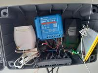

# Gateway LoRaWAN solaire

Une passerelle LoRaWAN collecte les données envoyées par les stations dans un périmètre de plusieurs kilomètres. C’est le seul élément du réseau qui a une carte GSM, pour retransmettre les données sur un serveur distant. Elle doit être alimentée par du courant du secteur. Mais on ne trouve pas des prises électriques dans la nature, c’est pourquoi, j’ai dû mettre en place une alimentation solaire.

*Gateway LoRaWAN autonome installée sur une remorque (Attention, sur cette photo, il y a encore la passerelle TTOG qui a été remplacée par la TTIG beaucouip moins gourmente en énergie. Il faudrait que je remplace cette photo prichainement :) )*

Comme support, j’utilise ma remorque, sur laquelle, j’ai installé l’installation solaire et la passerelle LoRaWAN.

## Matériel de la remorque

* 3 panneaux solaires de 60W (Récupérés de mon camping car)
* Un régulateur MPTT (Victron MPTT 75 | 15)
* Une batterie solaire au gel de 12V/110Ah (Victron)
* Un routeur 4G/WiFi (NetGear)
* Une passerelle LoRaWAN TTIG
* Antenne Sirio GP 868 C

## La passerelle LoRaWAN

Initialement, j’utilisais la passerelle [TTOG](https://www.thethingsnetwork.org/docs/gateways/thethingsoutdoor/) (The Things Outdoor Gateway) et une batterie au gel de 90Ah. J’ai eu beaucoup de peine à faire fonctionner la passerelle plus de 5 jours hivernal, par mauvais temps. Les panneaux solaires n’étaient pas assez puissants pour recharger ma batterie, ou mes appareils consommaient trop.

Après plusieurs semaines de testes, j’ai finalement décidé de remplacer la TTOG, qui consomme 7-8W, par la [TTIG](https://www.thethingsindustries.com/docs/gateways/models/thethingsindoorgateway/) (The Things Indoor Gateway), qui elle consomme 2-3W!

*Sur cette photo, on voit la passerelle TTIG, à gauche, le régulateur au centre et le routeur 4G à droite. La petite batterie au Li-ion n’est plus utilisée. Elle permettait d’alimenter le microcontrôleur, que l’on voit aussi sur la photo, qui surveille le niveau de tension de la batterie solaire.*

Mais le problème est que la TTIG n’est pas étanche, et surtout, elle n’a pas de connecteur SMA pour brancher l’antenne externe SIRO GP 868. Il m’a fallu donc adapter cette passerelle et la protéger dans un boîtier étanche, avec le régulateur et le routeur 4G. Le tout se trouve dans la remorque.

Comment adapter sa TTIG: [Low-cost outdoor solar powered LoRaWAN Gateway](https://www.disk91.com/2020/technology/lora/low-cost-outdoor-solar-powered-lorawan-gateway/)

Cette configuration a donné d’excellents résultats, puisque la passerelle TTIG a fonctionné toute la saison hivernale 2021-2022 et elle fonctionne encore aujourd’hui (avril 2022).