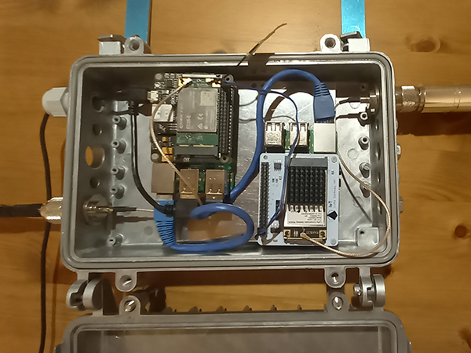
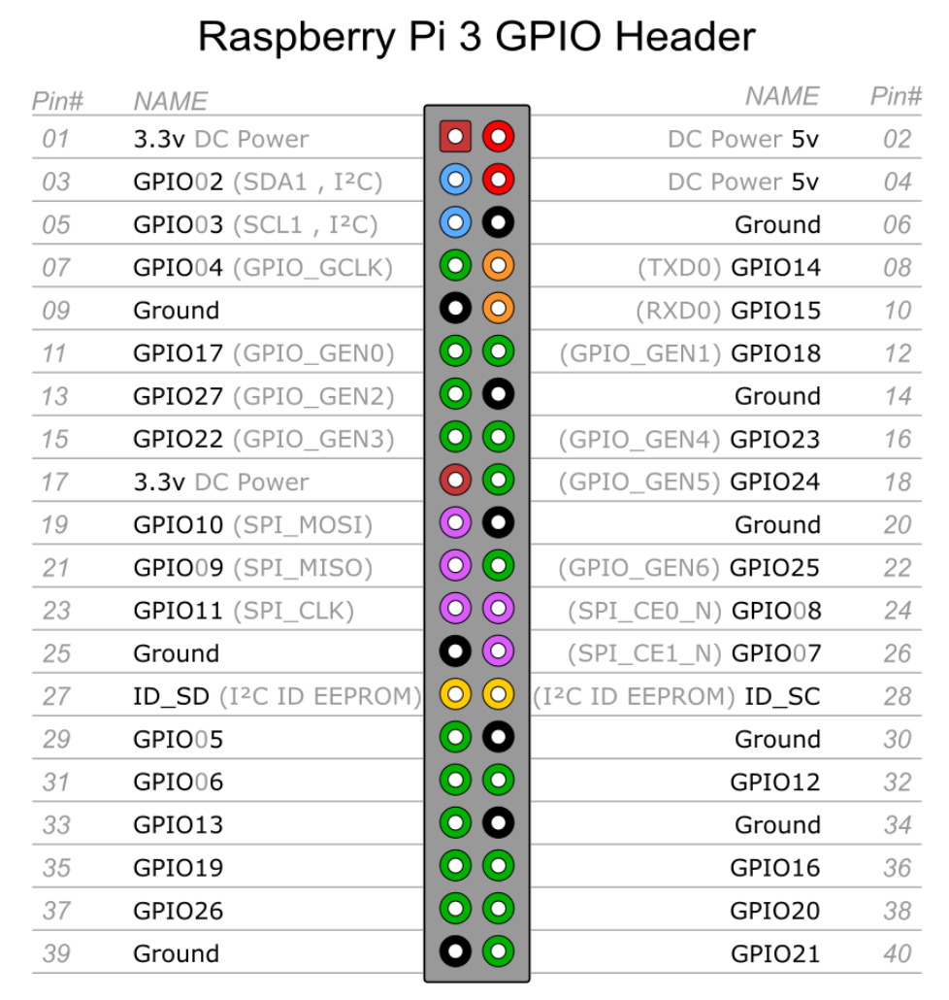

# Gateway LoRaWAN Waterproof avec deux Raspberry Pi3

*Publié le 24 octobre 2020*

*Keywords: Sixfab, IoT LoRa Hateway, Raspbbery, TTN, 3G/4G & LTE Base HAT, Quectel*



Dans cet article, je vais vous montrer comment réaliser une passerelle (Gateway) LoRaWAN avec deux Raspberry Pi3, un module WiFi/4G et un module LoRaWAN

* Sur le premier Raspberry, je vais installer un chapeau sixfab 4G https://sixfab.com/product/raspberry-pi-base-hat-3g-4g-lte-minipcie-cards/ avec son module quectel https://sixfab.com/product/quectel-ec25-mini-pcle-4glte-module/ qui permettra à ce premeir raspberry de se connecter à internet. En partageant le port eth0, le deuxième Raspbbery pourra aussi se connecter à un serveur distant via le premier.
* Sur le deuxième Raspbbery, je vais installer un chapeau (HAT) LoRaWAN de pi-supply https://uk.pi-supply.com/products/iot-lora-gateway-hat-for-raspberry-pi?lang=fr. En le connectant avec un câble Ethernet sur le premier (Routeur 4G), il va pouvoir traîter et envoyer les données reçus à TTN (The Things Network), pour ensuite les sauvegarder dans une base de donnée.


## Matériel

* Deux Raspberry Pi3
* [PiSupply IoT LoRa Gateway](https://uk.pi-supply.com/products/iot-lora-gateway-hat-for-raspberry-pi?lang=fr) (Il semble que ce module a été remplacé par le [RAK2247](https://uk.pi-supply.com/products/iot-lora-gateway-hat-for-raspberry-pi?lang=fr))
* [Nebra IP67 weatherproof](https://uk.pi-supply.com/products/die-cast-outdoor-weatherproof-enclosure)
* [Glass fiber LoRa antenna](https://uk.pi-supply.com/products/rakwireless-glass-fiber-lora-gateway-antenna?_pos=4&_sid=3bbc78311&_ss=r)
* [2x N-Type connector (UFL/IPEX)](https://uk.pi-supply.com/products/ufl-ipex-to-n-type-bulkhead?_pos=1&_sid=a5f981cd4&_ss=r)
* DELOCK N-Type SMA Adapter
* Une antenne GSM
* [Raspberry Pi 3G/4G & LTE Base HAT](https://sixfab.com/product/raspberry-pi-base-hat-3g-4g-lte-minipcie-cards/)
* [Quectel EC25 Mini PCle 4G/LTE Module](https://sixfab.com/product/quectel-ec25-mini-pcle-4glte-module/)
* Power supply 5V/2A (MicroUSB)
* [2 fils femelle-femelle](https://www.adafruit.com/product/1919)
* un câble ethernet

## Information importante

> [Edit 09.2024] Cette passerelle (gateway) a été réalisée avec un Raspberry Pi3 et la carte IoT LoRa HAT Gateway (RAK2247) sur un deuxième Raspberry Pi3. Elle a très bien fonctionnée sur le terrain de mars 2020 a décembre 2021. Elle a notammenet été utilisée dans le cadre du Workshop 3: [15 bougies à pellets pour lutter contre le gel de printemps](https://github.com/ecosensors/ecosensors/tree/main/Projets/Gel%20de%20printemps/La%20bougie%20%C3%A0%20pellets/Workshop%203%20-%20Version%202). Depuis que The Things Network (TTN) a migré sur la version The things Stack V3](https://www.thethingsindustries.com/docs/), la passerelle a cessé de traiter les données reçues quand je l'ai migrée sur Stack V3. Selon Pi Supply, l'OS du Raspberry (fourni par Pi Supply) avec le module IoT LoRa HAT, ne serait pas compatible avec Stack V3. Je n'ai pas investigué d'avantage car la passerelle TTOG me suffisait pour mes autres applications.
>
> Mi-septembre 2024, j'ai relu cet article et j'ai constaté que l'image fournie par Pi Supply, n'a pas été mise à jour depuis 2019. J'ai aussi lu une information que je n'avais pas vu (ou qui a été ajouté plus tard), indiquant que **le module "Pi Supply IoT LoRa Gateway" n'est pas compatible avec un Raspberry Pi4 8G**. 
>
> Pi Supply m'a aussi suggéré d'utiliser une autre image [rak_common_for_gateway](https://github.com/RAKWireless/rak_common_for_gateway?tab=readme-ov-file) qui est [compatible avec RAK2247](https://github.com/RAKWireless/rak_common_for_gateway?tab=readme-ov-file#supported-platforms).
>
> Je précise encore que cette passerelle, telle que je la présente dans cet article, a fonctionné sur le terrain pendant plusieurs mois.
>
> Il faudrait que je prenne un moment pour revoir ceci et mettre à jour cet article. Pour le moment, je laisse cet article comme je l'ai écris en 2020.

## Premier Raspberry / routeur 4G

### Installation du Router 4G

Vous allez devoir préparer le premier Raspberry qui fera office de router 4G et offrira une connexion internet au deuxième Raspberry, connecté à son port Ethernet (eth0). Pour cela suivez cet article "[Comment configurer un router WiFi/4G sois-même](https://github.com/ecosensors/ecosensors/tree/main/Articles/Raspberry/Routeur-4G)" et **arrêtez-vous avant le "chapitre Configurer votre Raspberry en un WiFi hotspot"** (J’expliquerai plus bas, pourquoi je n’utilise plus RaspAP). Revenez ensuite sur cet article.

Une fois fait, vous devez encore configurer le WiFi de votre domicile via le fichier `wpa_suppliant`

```
sudo nano /etc/wpa_suppliant/wpa_suppliant.con
```

avec le SSID et le PSK du routeur de votre domicile.

```
network={
	ssid="The_SSID_of_your_wifi"
	psk="Your_wifi_password"
}
```

Il vous permettra de vous connecter en ssh, plus tard.

### Partage du port eth0

Une fois fait, vous allez devoir faire encore ces étapes pour partager le port Ethernet (eth0) afin qu’il puisse attribuer une adresse IP au second Raspberry et pour que ce dernier puisse accéder à Internet via le premier. (Ceci rempléace RaspAP)

#### Installation de dnsmasq

```
sudo apt install dnsmasq
```

#### Activation de ip_forward

Editer le fichier

```
sudo nano /etc/sysctl.conf
```

et dé-commenter la ligne

`net.ipv4.ip_forward=1`

Pour contrôler si ip_forward est bien activé, cette commande doit retourner `1`

```
cat /proc/sys/net/ipv4/ip_forward
```

#### Activer le routing et IP masquerading

```
sudo DEBIAN_FRONTEND=noninteractive apt install -y netfilter-persistent iptables-persistent
sudo iptables -t nat -A POSTROUTING -j MASQUERADE
sudo cp /etc/iptables/rules.v4 /etc/iptables/rules.v4.orig
# Now save the current firewall rules for IPv4 (including the rule above) and IPv6 to be loaded at boot by 
# the netfilter-persistent service:
sudo iptables-save | sudo tee /etc/iptables/rules.v4
```

Editer le fichier

```
sudo nano /etc/dhcpcd.conf
```

et ajouter les lignes

```
# Cette ligne est très importante pour que l'adresse IP de wwan0 ne soit fournie
# que par votre fournisseur de votre carte SIM
denyinterfaces wwan0 

interface eth0
static ip_address=10.3.142.1/24
static routers=10.3.142.1
static domain_name_server=1.1.1.1 8.8.8.8
```

Pour terminer, éditer le fichier

```
sudo nano /etc/dnsmasq.conf
```

et ajouter ces lignes

```
interface=eth0
listen-address=10.3.142.1
# Bind to the interface to make sure we aren't sending things elsewhere 
#### bind-interfaces #### BUT don't enable this.
server=8.8.8.8 # Forward DNS requests to Google DNS
domain-needed # Don't forward short names
# Never forward addresses in the non-routed address spaces.
bogus-priv
# Assign IP addresses between 10.3.142.2 and 10.3.142.5 with a
# 12 hour lease time
dhcp-range=10.3.142.2,10.3.142.5,12h
```

Dès à présent, vous pouvez connecter un autre Raspberry au port Ethernet à votre installation. Une adresse IP entre 10.3.142.2 et 10.3.142.5 lui sera attribuée.

### Pourquoi je n’utilise plus RaspAP

RasAp est un utilitaire très bien. Il vous permettra de transformer votre Raspberry en un WiFi Hotspot, comme je l’indique dans cet article. Cependant, j’ai constaté que **le Hotpot n’était pas stable** ce qui rendait l’accès en ssh difficile. En plus de cela, si vous modifiez les paramètres de RaspAP via son interface, tel que le Hotspot, la configuration du fichier `/etc/ dhcpcd.conf` était écrasée, **ce qui supprimait aussi la ligne** `denyinterfaces wwan0` 

J’ai aussi constaté que de temps en temps, lors du boot du premier Pi, **aucune adresse IP n’était fournir à eth0**.

Il est fort probable que ce problème pouvait être résolu d’une manière ou d’une autre. Mais dans le cadre de cet article, soit de la réalisation d’une passerelle LoRaWAN avec deux Raspberry dans un boîtier Waterproof, il était absolument nécessaire d'avoir une solition stable sans que des paramètres définis dans un fichier, soit effacer quand une modification est faite via l'interface de RaspAp.

Finalement une version simplifiée, sans RaspAP, tel que je la présente, est largement suffisante pour cette passerelle LoRaWAN, et elle fonctionne à merveille.

## Deuxième Raspberry / LoRaWAN Gateway

> Merci de lire la section "Information importante", plus haut

Vous devez maintenant suivre cet article "[Pi Supply IoT LoRa Gateway pour Raspberry](https://github.com/ecosensors/ecosensors/tree/main/Articles/LoRaWAN/Gateways/PiSupply%20IoT%20Hat%20Gateway)" 

Comme pour le premier Raspberry, n’oubliez pas de bien configurer le fichier

```
sudo nano /etc/wpa_suppliant/wpa_suppliant.conf
```

avec le SSID et le PSK du routeur de votre domicile. Il vous permettra de vous connecter en ssh, plus tard

Une fois fait, connectez-vous en ssh sur le deuxième Raspberry et éditer le fichier

```
sudo nano /opt/iotloragateway/iot-lora-gateway-reset.sh

```

et commenter la ligne 4

```
#php -f /var/www/iotloragateway/html/updatePacketfwd.php
```

### Contrôle

Pour contrôler si votre passerelle arrive à se connecter au server TTN, lancer cette commande

```
sudo systemctl status iot-lora-gateway.service
```

vous devriez voir ceci

`INFO: [TTN] send status success for bridge.eu.thethings.network`

Si vous lisez ceci

`INFO: Enabling GPS mode for concentrator's counter`

c’est que le module est toujours en cours d’initialisation. Attendez et revérifier.

Vous pouvez encore redémarrer le service

```
sudo systemctl restart iot-lora-gateway.service
# ou
sudo systemctl stop iot-lora-gateway.service
sudo systemctl start iot-lora-gateway.service
```

Cette commande peut aussi s’avérer utile

```
journalctl -u iot-lora-gateway.service --no-pager -n 3000
```

## Alimentation des Raspberry

Préparer une alimentation de 5V/2A minimum et préparez-vous à alimenter le premeir Raspberry.

Pour alimenter le deuxième, vous allez le faire avec les deux fils femelle-femelle.



*Raspberry Pi3 Pinout*

Relier les broches 4 (5V) et les broches 6 (GND). Ce sont la 2ème et 3ème broches, en haut à gauche.

Une fois fait, alimenter le premier Raspberry avec l'alimentation 5V/2A

## Bravo!

Vous avez installé et configuré votre passerelle LoRaWAN. Il ne vous reste plus qu’à la mettre dans un boîtier étanche avec une belle antenne.


