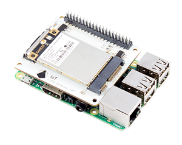
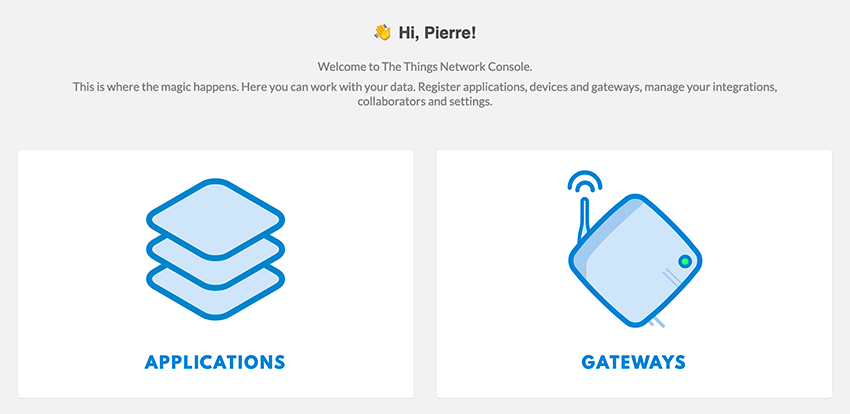
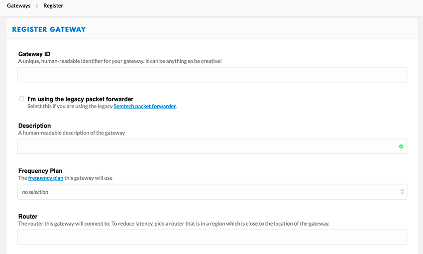
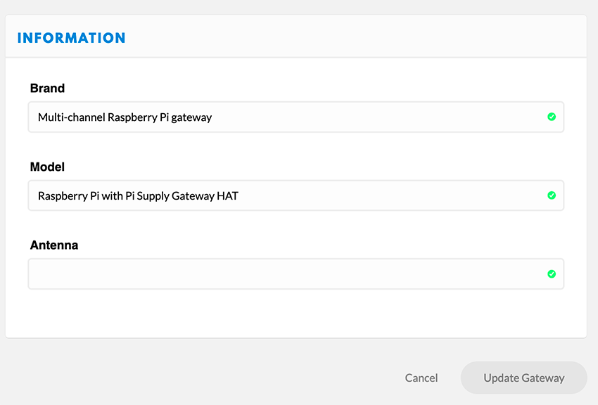

# Pi Supply IoT LoRa Gateway pour Raspberry

*Publié le 2 mars 2020*

*Keywords: Pi Supp, IoT LoRa Hateway, Raspbbery, TTN*

Dans cet article, je vais vous montrer comment réaliser une passerelle LoRaWAN avec un raspberry PI4, un chapeau IoT LoRaWAN. En supplément, je présente comment j’ai essayé d’utiliser un module 4G pour la transmission des données.

Dans cet article, nous allons voir

* comment ajouter une passerelle à votre console TTN (The Things Network)
* comment préparer votre Raspberry
* En supplément: comment la connecter à un autre Raspebrry avec un module 4G, via les ports ethernet (eth0)

## Matériel

* Raspberry Pi3 (Cet exercise a été réalisé avant le 1er décembre 2021 avec un Pi4)
* Pi Supply IoT LoRa Gateway HAT for Raspberry Pi avec [l’antenne](https://uk.pi-supply.com/products/ipex-ufl-coil-spring-antenna-for-rak833?_pos=6&_sid=408b3db83&_ss=r)
* 1x SD card (min 8G)
* 1x câble Ethernet
* un clavier et une souris ainsi qu’un écran

[Edit: 09.2024] Il semble que ce module n'existe plus et il a été remplacé par le [RAK2247](https://uk.pi-supply.com/products/iot-lora-gateway-hat-for-raspberry-pi?lang=fr)

## Information importante

> [Edit 09.2024] Cette passerelle (gateway) a été réalisée avec un Raspberry Pi4 et la carte IoT LoRa Gateway (RAK2247), et elle a très bien fonctionnée sur le terrain de mars 2020 a décembre 2021. Elle a notammenet été utilisée dans le cadre du Workshop 3: [15 bougies à pellets pour lutter contre le gel de printemps](https://github.com/ecosensors/ecosensors/tree/main/Projets/Gel%20de%20printemps/La%20bougie%20%C3%A0%20pellets/Workshop%203%20-%20Version%202). Depuis que The Things Network (TTN) a migré sur la version The things Stack V3](https://www.thethingsindustries.com/docs/), la passerelle a cessé de traiter les données reçues quand je l'ai migrée sur Stack V3. Selon Pi Supply, l'OS du Raspberry ne serait pas compatible avec Stack V3. Je n'ai pas investigué d'avantage car la passerelle TTOG me suffisait pour mes autres applications.
>
> Mi-septembre 2024, j'ai relu cet article et j'ai constaté que l'image fournie par Pi Supply, n'a pas été mise à jour depuis 2019. J'ai aussi lu une information que je n'avais pas vu (ou qui a été ajouté plus tard), indiquant que **le module "Pi Supply IoT LoRa Gateway" n'est pas compatible avec un Raspberry Pi4 8G**. (Pourtant ma passerelle a bien fonctionnée pour moi, avec un Raspberry Pi4)
>
> Pi Supply m'a aussi suggéré d'utiliser une autre image [rak_common_for_gateway](https://github.com/RAKWireless/rak_common_for_gateway?tab=readme-ov-file) qui est [compatible avec RAK2247](https://github.com/RAKWireless/rak_common_for_gateway?tab=readme-ov-file#supported-platforms).

### Solutions envisagées

Pour le moment, je laisserai cet article comme je l'ai écris en 2020. Il serait intéressant d'essayer

* Suivre cet article avec un Raspberry Pi3
* Suivre cet article avec un Raspberry Pi3, mais en installant l'OS de votre Raspbbery en suivant [cette procédure](https://github.com/RAKWireless/rak_common_for_gateway?tab=readme-ov-file#installation-procedure)

Quand j'aurai le temps, je ferai cette exercise.

## The Things Network

## Ajout d’une passerelle dans la console TTN (The Things Network)

> Cette partie a été faite en 2020, soit avant que la platforme TTN migre sur Stack V3

Connectez-vous à [votre console TTN](https://console.cloud.thethings.network/) et allez dans votre console et cliquez sur `Gateway` puis `register a gateway`

*The Things Network concole – Ajour d’une passerelle (Gateway)*

Suivez les indications ci-dessous

*Enregistrer une passerelle*

* **Gateway :** Saisissez un ID unique **Ne cochez pas `I’m using the legagcy packet forwarder`**
* **Description :** Saisissez une description concernant votre passerelle
* **Frequency Plan :** Vous devez sélectionner la fréquence pour votre région. Comme nous sommes en Europe, nous sélectionnons Europe 868Mhz.
* **Router :** Sélectionner le routeur le plus proche de votre région. Vous devriez sélectionner `ttn-router-eu` pour l’Europe.
* **Location / Antenna placement :** Indiquez les positions GPS de votre passerelle ainsi cliquez sur Outdoor s’il est placé à l’extérieur.

Enregistrer votre nouvelle passerelle puis cliquez sur `Settings`, puis sur `information`. Renseignez les champs comme indiquez dans l’image ci-dessous

* **Brand :** Multi-channel Raspberry Pi gateway
* **Model **:** Raspberry Pi with Pi Supply Gateway HAT

Et finalement, cliquez sur `Update Gateway`

## Assemblage

Installer l’IoT LoRa Gateway HAT sur votre Raspberry de la sorte, sans oublier l’antenne. Pour l’installation, j’ai utilisé cette antenne que vous recevez normalement avec la Gateway. Ensuite, placez le dissipateur de chaleur sur la partie argentée du RAK833. **N’alimentez pas encore votre Raspberry**.

[Assemblage](Assets/images/gatewayHat-assembled2-1.png "Assemblage")

*Assemblage de la passerelle IoT LoRa sur Raspberry pi (868MHz/915MHz)*

** N’allumer pas le Raspberry sans avoir connecter l’antenne**

## Préparation du Raspberry

