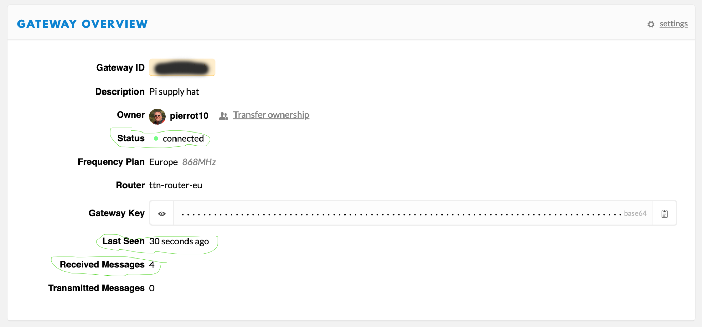

# Pi Supply IoT LoRa Gateway pour Raspberry

*Publié le 2 mars 2020*

*Keywords: Pi Supp, IoT LoRa Hateway, Raspbbery, TTN*


Dans cet article, je vais vous montrer comment réaliser une passerelle LoRaWAN avec un raspberry PI4, un chapeau IoT LoRaWAN. En supplément, je présente comment j’ai essayé d’utiliser un module 4G pour la transmission des données.

Dans cet article, nous allons voir

* comment ajouter une passerelle à votre console TTN (The Things Network)
* comment préparer votre Raspberry
* En supplément: comment la connecter à un autre Raspebrry avec un module 4G, via les ports ethernet (eth0)

## Matériel

* Raspberry Pi3 (Cet exercise a été réalisé avant le 1er décembre 2021 avec un Pi4 mais je ne vous recommande d'utiliser un Pi3)
* Pi Supply IoT LoRa Gateway HAT for Raspberry Pi avec [l’antenne](https://uk.pi-supply.com/products/ipex-ufl-coil-spring-antenna-for-rak833?_pos=6&_sid=408b3db83&_ss=r)
* 1x SD card (min 8G)
* 1x câble Ethernet
* un clavier et une souris ainsi qu’un écran

[Edit: 09.2024] Il semble que ce module n'existe plus et il a été remplacé par le [RAK2247](https://uk.pi-supply.com/products/iot-lora-gateway-hat-for-raspberry-pi?lang=fr)

## Information importante

> [Edit 09.2024] Cette passerelle (gateway) a été réalisée avec un Raspberry Pi4 et la carte IoT LoRa Gateway (RAK2247), et elle a très bien fonctionnée sur le terrain de mars 2020 a décembre 2021. Elle a notammenet été utilisée dans le cadre du Workshop 3: [15 bougies à pellets pour lutter contre le gel de printemps](https://github.com/ecosensors/ecosensors/tree/main/Projets/Gel%20de%20printemps/La%20bougie%20%C3%A0%20pellets/Workshop%203%20-%20Version%202). Depuis que The Things Network (TTN) a migré sur la version The things Stack V3](https://www.thethingsindustries.com/docs/), la passerelle a cessé de traiter les données reçues quand je l'ai migrée sur Stack V3. Selon Pi Supply, l'OS du Raspberry ne serait pas compatible avec Stack V3. Je n'ai pas investigué d'avantage car la passerelle TTOG me suffisait pour mes autres applications.
>
> Mi-septembre 2024, j'ai relu cet article et j'ai constaté que l'image fournie par Pi Supply, n'a pas été mise à jour depuis 2019. J'ai aussi lu une information que je n'avais pas vu (ou qui a été ajouté plus tard), indiquant que **le module "Pi Supply IoT LoRa Gateway" n'est pas compatible avec un Raspberry Pi4 8G**. (Pourtant ma passerelle a bien fonctionnée pour moi, avec un Raspberry Pi4)
>
> Pi Supply m'a aussi suggéré d'utiliser une autre image [rak_common_for_gateway](https://github.com/RAKWireless/rak_common_for_gateway?tab=readme-ov-file) qui est [compatible avec RAK2247](https://github.com/RAKWireless/rak_common_for_gateway?tab=readme-ov-file#supported-platforms).

### Solutions envisagées

Pour le moment, je laisserai cet article comme je l'ai écris en 2020. Il serait intéressant d'essayer

* Suivre cet article avec un Raspberry Pi3
* Suivre cet article avec un Raspberry Pi3, mais en installant l'OS de votre Raspbbery en suivant [cette procédure](https://github.com/RAKWireless/rak_common_for_gateway?tab=readme-ov-file#installation-procedure)

Quand j'aurai le temps, je ferai cette exercise.

## The Things Network

## Ajout d’une passerelle dans la console TTN (The Things Network)

> Cette partie a été faite en 2020, soit avant que la platforme TTN migre sur Stack V3

Connectez-vous à [votre console TTN](https://console.cloud.thethings.network/) et allez dans votre console et cliquez sur `Gateway` puis `register a gateway`


*The Things Network concole – Ajour d’une passerelle (Gateway)*

Suivez les indications ci-dessous


*Enregistrer une passerelle*

* **Gateway :** Saisissez un ID unique **Ne cochez pas `I’m using the legagcy packet forwarder`**
* **Description :** Saisissez une description concernant votre passerelle
* **Frequency Plan :** Vous devez sélectionner la fréquence pour votre région. Comme nous sommes en Europe, nous sélectionnons Europe 868Mhz.
* **Router :** Sélectionner le routeur le plus proche de votre région. Vous devriez sélectionner `ttn-router-eu` pour l’Europe.
* **Location / Antenna placement :** Indiquez les positions GPS de votre passerelle ainsi cliquez sur Outdoor s’il est placé à l’extérieur.

Enregistrer votre nouvelle passerelle puis cliquez sur `Settings`, puis sur `information`. Renseignez les champs comme indiquez dans l’image ci-dessous


* **Brand :** Multi-channel Raspberry Pi gateway
* **Model :** Raspberry Pi with Pi Supply Gateway HAT

Et finalement, cliquez sur `Update Gateway`


## Assemblage

Installer l’IoT LoRa Gateway HAT sur votre Raspberry de la sorte, sans oublier l’antenne. Pour l’installation, j’ai utilisé cette antenne que vous recevez normalement avec la Gateway. Ensuite, placez le dissipateur de chaleur sur la partie argentée du RAK833. **N’alimentez pas encore votre Raspberry**.


*Assemblage de la passerelle IoT LoRa sur Raspberry pi (868MHz/915MHz)*

**N’allumer pas le Raspberry sans avoir connecter l’antenne**

## Préparation du Raspberry

Nous allons directement utiliser un zip fourni par Pi Supply que vous pouvez télécharger [ici](https://github.com/PiSupply/iot-lora-image/releases) ou [cette version (2019-07-31)](https://eco-sensors.ch/iot-lora-gateway/2019-07-31-iot-lora-gateway-lite.zip).

Téléchargez et installez la dernière version d’[Etcher](https://www.balena.io/etcher/) et créez l’image sur la carte SD

Une fois fait, retirez et réinsérez la carte SD dans votre Mac, et créez un fichier ‘ssh’ dans le dossier boot, pour activer ssh lors du premier démarrage du Raspberry (L’exemple est donné depuis un Mac)

```
touch /Volumes/boot/ssh
```

Ceci vous permettra d’accéder à votre Raspberry en ligne de commande, avant d’avoir configurer votre Raspberry.

Ceci est particulièrement utile si vous êtes à l’aise avec les lignes de commande et si vous ne pouvez/voulez pas connecter un écran à votre Raspberry.

```
ssh pi@iotloragateway.local
#Le mot de passe de ‘pi’ par défaut est ‘raspberry’
```

Éjectez votre carte SD et insérez la dans le Raspberry.

Puis connectez votre Raspberry au routeur à l’aide du câble Ethernet. Connectez votre souris, clavier et écran à votre Raspberry.

Si vous avez créé le dossier `/Volumes/boot/ssh` vous pouvez vous passer de votre écran.

Connecter l'antenne et alimenter votre Raspberry

> N’allumer pas le Raspberry sans avoir connecter l’antenne avant

## Configuration du Raspberry

Vous avez donc connecté votre clavier, souris et vous avez connecté votre Raspberry au routeur WiFi avec le câble Ethernet. Il est indispensable qu’elle soit sur le même réseau que votre ordinateur (j’utilise un Mac pour cet exercice.

Ouvrez un terminal (sous Mac ou Linux)

Profitons pour mettre votre Raspberry à jour et installer vim

```
sudo apt-get update
sudo apt-get upgrade
sudo apt-get install vim
```

### Modification du mot de passe

Tapez la commande `sudo passwd pi` et saisissez et confirmer votre nouveau mot de passe

### Activation de SSH

Si vous n’avez pas créé le dossier /Volumes/boot/ssh, cette étape est indispensable. Saisissez la commande suivante

```
sudo raspi-config
```

(votre Raspberry devrait être en anglais, sur un clavier Suisse-fançais le – est le ‘)

Choisissez l’option `5 Interfacing Options`, puis `P2 SSH` puis `yes`

### Configuration du WiFi

Cette étape est utile si vous ne désirez plus utiliser la câble Ethernet et de connecter votre Raspberry sur le WiFi de votre lieu.

Saisissez la commande suivante

```
sudo nano /etc/wpa_supplicant/wpa_supplicant.conf
```

ajoutez les lignes suivantes (attention aux tablatures) et indiquez le SSID et le mot de passe de votre WiFi

```
network={
  ssid="The_SSID_of_your_wifi"
  psk="Your_wifi_password"
}
```

redémarrez votre Raspberry. Vous pouvez travailler sans votre câble Ethernet. Bien entendu, si cela ne fonctionne pas, il faudra le reconnecter et vérifier vos saisies. (je continue avec le câble Ethernet)

## Configuration de la passerelle (Gateway)

Depuis votre navigateur FireFox ou Chrome, saisissez (je travaille avec un Mac)

```
http://iotloragateway.local
```

> Sous Windows vous allez devoir trouver l’adresse IP de votre passerelle. Ceci peut-être facilement trouvé, depuis votre routeur (généralement accessible avec l’adresse IP 192.168.0.1), en cherchant iotloragateway, dans la liste des périphériques connectés à votre routeur.

Vous allez devoir saisir le login

* nom d’utilisateur (username): pi
* mot de passe (password): raspberry

**Note:** si vous avez changé votre mot de passe avec la command ‘sudo passwd pi’, vous devez saisir le nouveau mot de passe

A noter que la section `Internet Connectivity` **devra être verte avec le texte All Good**, contrairement à ce qui est indiqué sur l’image ci-dessous. Si ce n’est pas le cas, vérifier votre connexion à internet.


*IoT LoRa Gateway Status Page*

### Configuration

Dans cette étape, vous allez avoir besoin de votre **Gateway ID** et le **Gateway Key** depuis votre console TTN. Rendez-vous sur votre console et recherchez la Gateway que nous avons créé précédemment.


*TTN console gateway overview*

Cliquez sur le menu **Packet Fowarder Config** et recopiez la **Gateway ID** et la **Gateway Key**. Dans le premier champs Contact Email Address, indiquez votre adresse e-mail.


puis cliquez sur **Update Configuration**.

Une fois fait, cliquez sur le menu **Sytsem Controls** et redémarrez (Restart) votre passerelle


*IoT Lora Gateway System Controls Restart*

### Vérification

Depuis votre console TTN, vous devriez voir le statut avec un point vert « connected ». Last seen devrait avoir un temps récent (en seconde). Finalement, vous devriez voir des messages reçus « Received message »



*TTN Gateway status*

