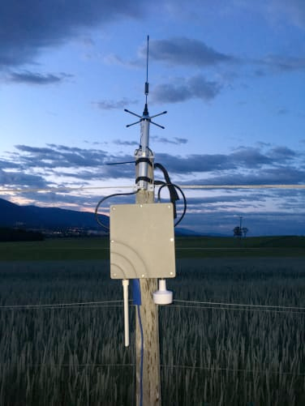
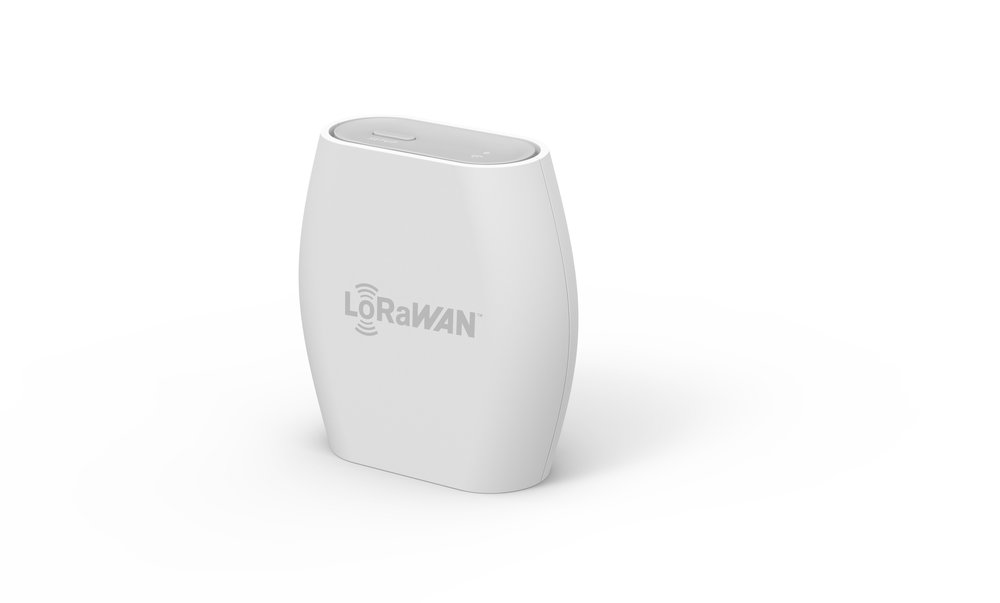
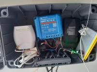
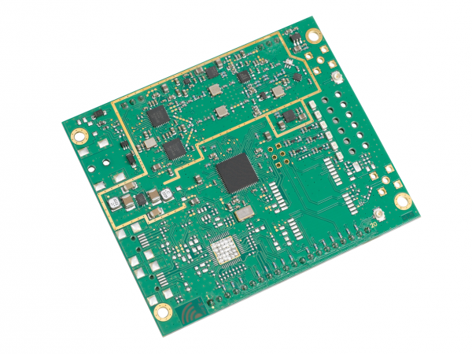
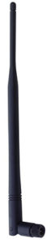
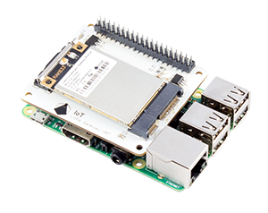

# Gateways LoRaWAN

La passerelle (Gateway) est un routeur équipé d’un concentrateur LoRa qui peut recevoir des packets (ou messages) LoRa. La passerelle est l’élément qui se trouvera sur le terrain et collectera les données de tous les stations  qui se trouvent dans le périmètre de couverture de la passerelle.

On appelle aussi nœuds (ou nodes en anglais) pour désigner une station. Une station est l’élément qui prendra les mesures avec les capteurs connectés à cette dernière.

J'ai 4 differentes passerelle:

* The Things Outdoor Gateway (TTOG)
* The Thing Indoor gateway (TTIG)
* Gateway IC800a
* Chapeau LoRaWANN pour Raspberry Pi

(les deux dernières ne sont plus utilisées)

## The Things Outdoor Gateway (TTOG)

C’est la passerelle que j’utilise principalement sur le terrain et j’en suis pleinement statisfait. 

### Key features:

* IP67 waterproof enclosure
* 3G/4G backhaul support
* EU868 frequency band
* Transmit power upto +27dBm
* Supports LBT (Listen Before Talk)
* 802.3at Power-over-Ethernet
* Certifications: FCC, CE, RCM (Australia), Telec (Japan), NCC (Taiwan), RCM (Australia), Malaysia
* Dimensions: 230 x 200 x 68mm
* Weight: 2.05kg

## The Things Indoor Gateway (TTIG)

### Features:

* An ultra low cost 8 channel LoRaWAN indoor gateway for less than $100.
* One of the first gateways to support the state-of-the-art BasicStation Protocol.
* Supports LBT.
* Simple setup steps taking less than 5 mins.
* Can connect to any network backend of choice.
* Setup and Connectivity over WiFi.
* Can be powered up via a USB-C cable or via an elegant connector to the power outlet.
* Built-in omnidirectional antenna for indoor use.
* EU868, US915, AS923 and CN470 versions available.
* Security via a range of modes.

Elle est actuellement fixée sur une remorque « fixe », parquée au milieu des vignes. Une batterie solaire au gel de 12V/110Ah ainsi que 3 panneaux solaire de 60W sont nécessaires pour faire fonctionner cette passerelle 24h/24h, 365j par année, été comme hiver

Pour qu'elle fonctionne, j'ai dû adapter la passerelle pourqu'on puisse connecter une antenne exertne, car cette option n'est pas prévue. encore ajouté quelque périphlrique

* Un régulateur MPTT (Victron MPTT 75 | 15)
* Un routeur 4G/WiFi (NetGear)
* Antenne Sirio GP 868 C

Pour plus d'information voir [l'aarticle "Gateway LoRaWAN solaire"](https://github.com/ecosensors/ecosensors/tree/main/Articles/LoRaWAN/Gateways/Gateway%20LoRaWAN%20solaire)

## Passerelle IC800a
C’est la première passerelle que j’ai utilisée pendant la première année. Je l’ai remplacée par le passerelle TTOG qui est plus performante, étanche et certifiée. Je l’utilise actuellement, à l’intérieur ou pour une courte couverture (100m, 200m).

En 2017, J'ai écris un article complet pour réaliser une telle passerelle (Voir sous "Articles")

Elle constituée de deux éléments principaux

### Raspberry Pi3

Un Raspberry Pi3 est une simple carte qui fonctionne comme un mini-ordinateur, avec une connection WiFi et Bluetooth. Il a un système d’exploitation (Rasbain Strech Lite) avec un processeur Quad-Core ARM Cortex A7 CPU et 1Go de RAM. C’est lui qui fait l’interface entre le concentrateur et votre réseau (ADSL). L’un de mes futur lab sera de lui connecté une module GSM pour qu’on ne soit plus dépendant d’un connection ADSL, comme à la maison. Ainsi on pourra laisser une passerelle dans une grange, une cabane…

### Concentrateur IC880a

L’[ic880A](http://shop.imst.de/wireless-modules/lora-products/8/ic880a-spi-lorawan-concentrator-868-mhz?number=404802) est capable de recevoir des paquets de différents périphériques terminaux envoie avec différents facteurs d’étalement sur jusqu’à 8 canaux en parallèle. Étant donné que la combinaison des facteurs d’étalement et des largeurs de bande de signal entraîne des débits de données différents, l’utilisation de « Dynamic Data-Rate Adaption » devient possible. Cela signifie que les nœuds LoRaR à grande distance du concentrateur doivent utiliser des facteurs d’étalement plus élevés et donc avoir un débit de données plus faible.

Pour connecter ces deux éléments, il faudra encore une [carte](https://www.tindie.com/products/gnz/imst-ic880a-lorawan-backplane-kit/) pour connecter le Raspberry et le concentrateur.

### Antenne

* Frequency range: 824-896 MHz,
* Impedance: 50 Ω,
* Gain: 2 dBi,
* Polarization: linear vertical
* RF power handling: 50 W

## IoT LoRa HAT pour Raspberry pi (868MHz/915MHz)

Cette solution est intéressante car il suffit de connecter cette passerelle sur un Raspberry Pi. 

J'ai écris deux intéressants articles pour la faire fonctionner (Voir sous Articles).

