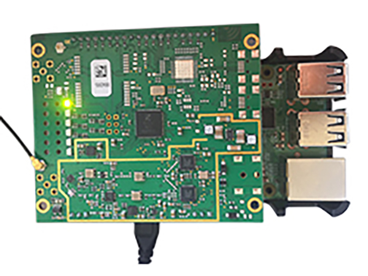
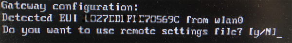
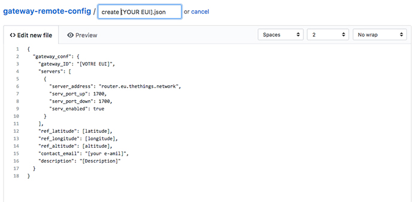

# Gateway LoRaWAN avec un concentrateur IC880a

*Publié le 20 octobre 2017* 



La passerelle est l’élément clé pour la transmission de vos mesures. Elle communique avec vos nœuds, traite les données collectées avant de les restituer à vos applications via le cloud

Dans cet article, vous allez apprendre à configurer une passerelle LoRaWAN avec un concentrateur IC880a

## Matériel

* Raspberry Pi3
* [Concentrateur ic880](http://shop.imst.de/wireless-modules/lora-products/8/ic880a-spi-lorawan-concentrator-868-mhz?number=404802)
* [Backplane kit](https://www.tindie.com/products/gnz/imst-ic880a-lorawan-backplane-kit/)

## Téléchargement de l’OS, Rasbien

* Télécharger [Rasbian Stretch Lite](https://www.raspberrypi.org/downloads/raspbian/) et enregistrer l’image sur votre carte SD avec [Etcher](https://etcher.io/) (Mac)
* Insérer la carte SD dans votre Raspberry
* Connecter votre Raspberry à un écran, une souris et un clavier


## Configuration

Alimenter votre raspberry, ce qui va l’allumer et saisissez votre nom d’utilisateur (pi) et le mot de passe (raspberry) par défaut. Taper les commandes suivante pour Activation de SPI , SSH et développer le filesystem

```
sudo raspi-config
```

puis aller dans:
* [5] Interfacing options -> P4 SPI
* [5] Interfacing options -> P2 SSH
* [7] Advanced options -> A1 Expand filesystem

Configuration des locales (Vous pouvez aussi le faire avec raspi-config)

```
sudo dpkg-reconfigure locales
sudo dpkg-reconfigure tzdata
```

Configuration du WiFi
```
sudo nano /etc/wpa_supplicant/wpa_supplicant.conf
```

Ajouter les lignes suivantes à la fin du fichier 
```
network={
  ssid="The_SSID_of_your_wifi"
  psk="Your_wifi_password"
}
```

Installation de git, vim, ntpdate
```
sudo apt-get update
sudo apt-get upgrade
sudo apt-get install vim ntpdate git
```

Création d’un nouvel utilisateur et ajout de le groupe sudo
```
sudo adduser ttn
sudo adduser ttn sudo
```

déconnectez-vous et connectez-vous avec le nouveau compte ssh `ttn@raspberrypi.local`
Suppression de l’utilisateur par défaut

```
sudo userdel -rf pi
```

## Installation de la Gateway
**Attention!** Avant de répondre ‘yes’, relever immédiatement votre EUI qui va s’afficher à l’écran. Vous en aurez besoin plus tard




```
git clone -b spi https://github.com/ttn-zh/ic880a-gateway.git ~/ic880a-gateway
cd ~/ic880a-gateway
sudo ./install.sh spi
```

Répondez à la question

*Do you want to use remote settings file* => yes

Le système redémarrera automatiquement à la fin de l’installation.
**Attention**, le hostname va changer durant l’installation, en ‘ttn-gateway’
A la fin de l’installation, relever votre Gateway EUI

## Remote settings

Si vous avez répondu ‘yes’ à la question « Do you want to use remote settings file’, ce que je recommande, suivez encore ces étapes:

* Rendez-vous sur https://github.com/ttn-zh/gateway-remote-config
* Créer un nouveau fichier (create new file) et remplisser le avec le contenu suivantAttention, l’image ci-dessous a une ereeur, vous devez nommer votre fichier ainsi: `gateway-remote-config/[YOUR EUI].json` (**sans** ‘create ‘ contrairement à ce qui est indiqué dans l’image)



*EUI (que vous avez relever lors de l’installation) doit être en majuscule (expl: AAA29BFFFEA1A57A.json) (https://github.com/ttn-zh/gateway-remote-config.)*


et **remplacer** la parties suivante
* [YOUR EUI] => par l’EUI que vous avez relevé. Attention,  en majuscules. Voir les exemples ici
* [latitude] , [longitude] et [altitude] => par celles correspondant à la position de votre gateway. L’altitude ne doit pas avoir d’unité (432 et non 432m)
* [your e-mail] => par votre e-mail (obligatoire)
* [description] => par une description de votre dispositif

Sous **Propose new file** indiqué dans le premier champs `create [YOUR EUI].json`

Envoyer et aller vous chercher une bière!


Ceci peut prendre 24 heures ou plus. Une fois que votre fichier sans erreurs sera accepté, il sera listé [ici](https://github.com/ttn-zh/gateway-remote-config)


Quand vous verrez votre fichier, **redémarrer** votre gateway et il sera téléchargé (ou mis à jour) dans votre gateway à l’endroit suivant:

> otp/ttn-gateway/gateway-remote-config/

Votre gateways est prête.

Il vous suffit encore d’aller sur http://www.thethingsnetwork.org et [enregistrer une gateway](https://www.thethingsnetwork.org/docs/gateways/registration.html) et créer votre application. Attention sélectonnez I’m using the legacy packet forwarder et donner le EUI de votre passerelle avec des espaces entre tous les deux caractères, et en majuscule.


## Liens utiles

* [Utilisation de cellules solaires pour alimenter un ordinateur monocarte Raspberry Pi 3](https://www.digikey.ch/fr/articles/techzone/2016/jul/how-to-use-solar-cells-to-power-a-raspberry-pi-3-single-board-computer)
* Enregistrement d’une gateway : https://www.thethingsnetwork.org/docs/gateways/registration.html
* Référence https://github.com/ttn-zh/ic880a-gateway/wiki#setting-up-the-software
* https://www.youtube.com/watch?v=ZFVA6cQyheY&t=36s
* https://www.thethingsnetwork.org/forum/t/ic880a-rpi3-model-b-gw-configuration/9529/17?u=pierrot
