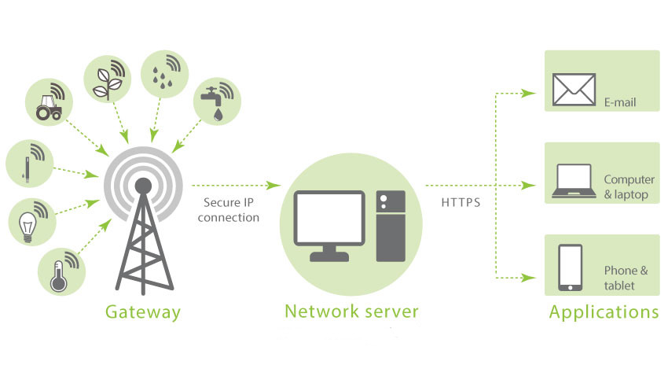
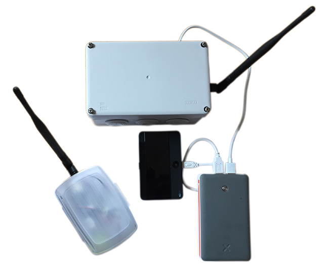
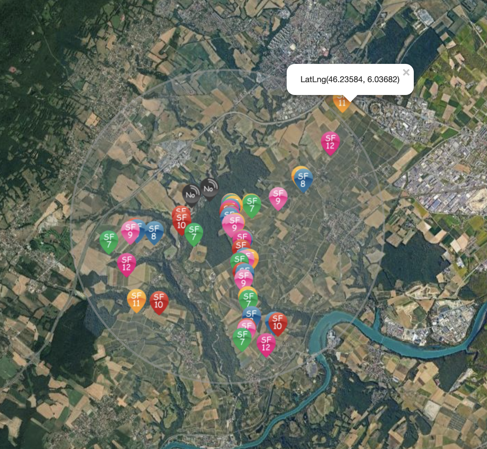
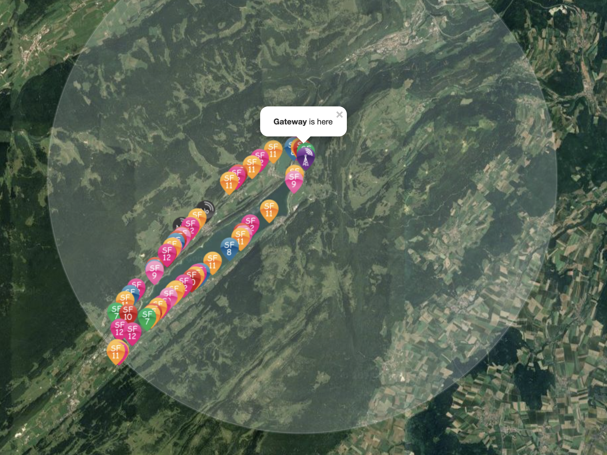

# Autres articles

**LoRaWAN** 

* [Arrosage automatique d'un bonsaï](https://github.com/ecosensors/ecosensors/tree/main/Articles/Arduino/Arrosage%20d'un%20bonsa%C3%AF)

# Qu'est ce que LoRaWAN

[LoRaWAN](https://fr.wikipedia.org/wiki/LoRaWAN) est un protocole de télécommunication permettant la communication à bas débit, par radio, d’objets à faible consommation électrique communiquant selon la technologie LoRa et connectés à l’Internet via des passerelles, participant ainsi à l’Internet des objets (IoT). Ce protocole est utilisé dans le cadre des villes intelligentes, le monitoring industriel ou encore l’agriculture. La technologie de modulation liée à LoRaWAN est LoRa, crée en 2009 par la startup grenobloise Cycléo et racheté par Semtech en 2012. [Semtech](https://www.semtech.com/lora) promeut sa plateforme LoRa grâce à la [LoRa Alliance](https://lora-alliance.org/), dont elle fait partie. Le protocole, LoRaWAN sur la couche physique LoRa, permet de connecter des capteurs ou des objets nécessitant une longue autonomie de batterie (comptée en années) et un coût réduit. LoRaWAN est l’acronyme de Long Range Wide-Area Network que l’on peut traduire par « réseau étendu à longue portée ».

# Quelle est la portée de LoRaWAN

Cette exercise a été réalisé le 11 et 26 novembre 2017

## Petits rappels

### LoRaWAN

Pour rappel, LoRaWAN (Long Range Radio Wide Area Network), est un protocole réseau bas débit et longue portée et très basse consommation, basé sur la technologie radio LoRa (pour Long Range, nom donné à la couche physique radio-fréquence)

Les objets (ou noeud) communiquant selon la technologie LoRa et, connectés à l’Internet via des passerelles, participant ainsi à l’Internet des objet.

Cette modulation est particulièrement performante pour les communications de longue portée et bas débit.

Les puces LoRa de Semtech fonctionnent sur des bandes fréquences 434 et 868MHz en Europe et 915MHz pour le reste du monde. La portée théorique en zone suburbaine est supérieure à 15km avec des débits compris entre 0,3 et 22kbps. La puissance d’émission est adaptative.

### Spreading Factor (SF)

La portée d’une communication LoRa est déterminée par sa bande passante, la puissance de sortie du signal ainsi que par le facteur d’étalement utilisé – Spreading Factor (SF). L’étalement du signal augmente sa portée, au détriment du débit car il est transmis sur une plus longue période

Dans cet exercice, j’ai utilisé la même puissance de sortie (14). Par contre j’ai varié le facteur d’étalement (SF).

## But de cet exercice

C’est ce que je vais tester: **la portée théorique!** Pour cela, je vais utiliser trois noeuds qui enverront les valeurs des capteurs avec des Spreading Factors (SF) différents. Ma passerelle sera autonome. J’utiliserai une batterie de poche de 15000mA pour alimenter la passerelle mais aussi un petit routeur sans fils qui assura la connexion au Cloud, grâce à sa carte SIM et le réseau GSM/GPRS.

*Une passerelle IC800a, un petite station, un routeur 4G et une batterie de 5000mA*

## Déroulement

Le déroulement sera simple. Je vais faire ces testes dans deux lieux différents avec une configuration différente du terrain.

La passerelle sera placée sur le toit de ma caravane tandis que les noeuds seront fixés sur le toit de ma voiture avec laquelle je roulerai dans un périmètre d’env 10km.

 fixés sur le toit de la voiture")

*Trois noeuds LoRaWAN (ou stations) fixés sur le toit de la voiture*

**Pour le premier lieu**, Je n’ai utilisé que deux nœuds. Les deux nœuds enverront les mesures (positions GPS et baromètre) toutes les deux minutes. D’abord, il enverra les mesures avec un SF7, puis un SF8 et un SF9, etc. Le deuxième nœud, enverra les mesures avec les SF10, SF11 et SF12.

**Pour le deuxième lieu**, j’ai utilisé 3 noeuds. Le premier noeud se chargera d’envoyer les mesures avec les SF7 et SF8. Le deuxième neoud utilisera les SF9 et SF10. Tandis que le dernier utilisera les SF11 et SF12.

> SF = Spreading Factor

## Résultats

### Lieu 1: Le Mandement (GE)

Le cercle transparent à un rayon de 3km depuis la passerelle

[Carte](https://www.eco-sensors.ch/measures/map_acccs.php)

### Lieu 2: La de joux

Le cercle transparent à un rayon de 10km depuis la passerelle

[Carte](https://www.eco-sensors.ch/measures/map_lacjoux.php)

Je suis satisfait de voir que ma passerelle fonctionne bien en mode autonome. C'est à dire, sans utiliser l'ADSL fixe et une prise électrique, pendant le temps de l’exercice. En effet, la batterie 15000mA a pu alimenter la passerelle. Quant au routeur, il a fonctionné sous sa propre autonomie avec sa batterie intégrée. La batterie portable de 15000mA n'a pas été nécessaire. Le routeur, qui a une carte GSM/GPRS, a pu transmettre les données traitées par la passerelle et les envoyer sur le Cloud.

### En campagne genevoise
En revanche, je m'attendais à ce que la portée soit plus importante. En effet, la position la plus éloignée, n'était que d'un peu plus de 3 kilomètre pour un SF11, en campagne genevoise.

J'ai été également surpris d'observer que s'il y avait peu d'obstacles (forêt, batîment), un SF7/9 pouvait transmettre jusqu'à un peu moins de 3 kilomètres. En revanche, même si le noeud se trouve à quelques centaines de mètres de la passerelle, une forêt était suffisant pour faire obstacle à la transmission (voir les points noires "no"). En soit, la configuration de la campagne viticole (vigne, petites collines) était suffisant pour limiter la portée des ondes radio.

Une forêt peut donc être aussi un obstacle suffisent pour une distance de moins d'un kilomètre.

### Au Lac de joux
En revanche, j'ai été agréablement surpris que s'il y a aucun obstacle, un SF7 **peut transmettre des mesures à la passerelle jusqu'à 10km!!** Une transmission avec un SF11 et 12 peut même aller au-delà des 10km alors que dans le versant plus montagneux (au niveau du village Le Lieu) ni un SF11 ou SF12 n'ont pu transmettre (points noirs "no"). J'aurais voulu aller encore plus loin mais la météo m'a pousser à revenir vers la passerelle.

## Conclusion

On peut donc clairement en conclure que les obstacles, tel qu'une forêt, une colline ou des bâtiments sont à considérer. On voit bien que SF7 peut aller jusqu'à 10km alors qu'en campagne il ne dépasse pas 3km. Il faudrait encore faire d'autres exercices en variant la puissance de sortie et le facteur d'étalement (SF), dans deux configurations différentes du terrain, comme ci-dessus.

## Matériel
Les noeuds
* Processeur: ATSAMD21G18 @ 48MHz with 3.3V logic/power
* Mémoire: 256KB odeFLASH + 32KB de RAM
* Radio RFM95
* Fréquence: 868Mhz
* Uses the license-free ISM bands
* +5 to +20 dBm up to 100 mW Power Output Capability
* ~300uA during full sleep, ~120mA peak during +20dBm transmit, ~40mA during active radio listening.
* Portée : 3 à 15km
* Antenne: gain 2dB, Impédance de 50Ohm

La Passerelle
* [Raspberry Pi 3 avec Concentrateur IC880a](https://github.com/ecosensors/ecosensors/tree/main/Articles/LoRaWAN/Gateways/ic880a)
