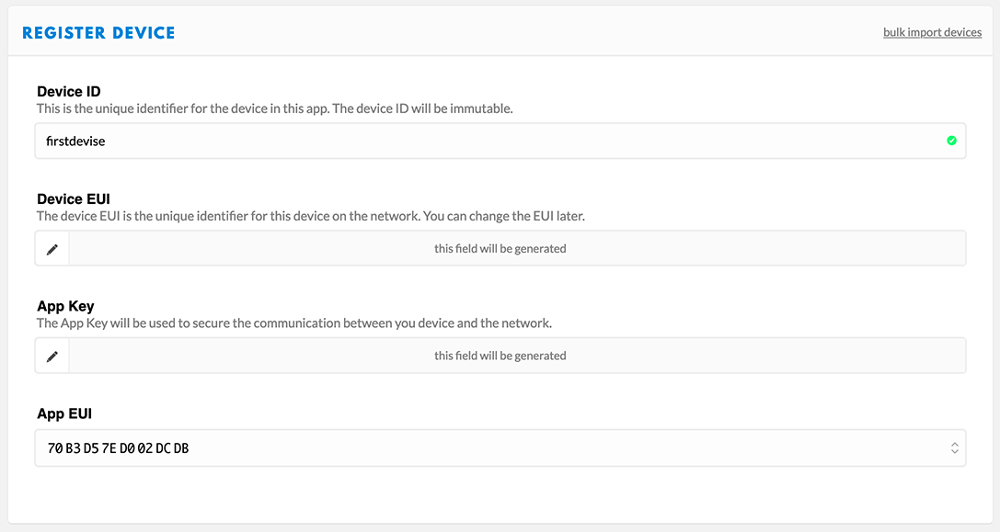

# Sonde pour mesurer de la qualité de l’air (PM2.5/PM10) avec Python3

*Publié le 11 juin 2020*

> [Commentaire ajouté le 6.9.2024] TinyLORA n'est plus compatible avec The Things Network Slack v3. Étant donné que TTN a entièrement migré vers la version 3, cette bibliothèque n'est plus en mesure de communiquer avec TTN.


Dans cet article, je vais vous montrer comment préparer un Raspberry et Python3 pour mesurer les poussières fines PM2.5 et PM10 et comment transmettre les mesures à un serveur distant grâce à LoRaWAN

J'attire votre attention que cet article n'est pas un tutoriel, mais mes notes. Il vous apportera les outils et des astuces pour le faire, mais il vous sera demandé un minimum de compétences. Cet article est donc mené à être modifier et améliorer.

**N'hésitez pas à me laisser vos commentaires pour améliorer cet article**

Dans cet article, nous verrons comment

* Installer et configurer votre Raspberry Zero
* préparer votre script python
* installer l'écran OLED LCD
* installer du capteur SDS011
* installation du capteur MH-Z19B
* installer un serveur lighttpd et tinylora
* préparer LoRaWAN et créer votre application TTN
* envoyez les données avec PycURL à la place de LoRaWAN
* sauvez les mesures dans un fichier JSON
* Installer et configurer un GPS (PG-735)
* Installer un carte pour gérer la charge de la batterie avec un panneau solaire
* Economiser la consomation du Raspberry en déactivant le bluetooth, le HDMI et les LEDs de la carte

## Matériels

* [Raspberry Zero W](https://www.raspberrypi.org/products/raspberry-pi-zero-w/) (CHF 24.--)
* [RFM 95 Lorawan/TTN hat with OLED LCD](https://www.tindie.com/products/electronictrik/lorawanttn-kit-for-the-raspberry-pi/) ($40.--)
* [Nova SDS011](https://www.conrad.ch/fr/p/module-capteur-joy-it-feunstaubsensor-uart-sen-sds011-1-pc-s-1884873.html?gclid=Cj0KCQjw4dr0BRCxARIsAKUNjWT3VCLIRbORVSSGzu8LDaWvpKLrUchu98nh14xlgFnS5BYh1SNIBccaAujLEALw_wcB&utm_source=google-shopping-fr&utm_medium=search&utm_campaign=shopping-online-fr&utm_content=shopping-ad_cpc&WT.srch=1&ef_id=Cj0KCQjw4dr0BRCxARIsAKUNjWT3VCLIRbORVSSGzu8LDaWvpKLrUchu98nh14xlgFnS5BYh1SNIBccaAujLEALw_wcB%3AG%3As) (CHF 38.--)
* [MH-Z19D](Assets/pdf//MH-Z19%20CO2%20Ver1.0.pdf)
* Un adaptateur USB -> MicroUSB
* [GPS GP-735](https://www.digikey.com/catalog/en/partgroup/gps-receiver-gp-735-56-channel/66012)
* [Solar Power management](https://www.waveshare.com/solar-power-manager.htm)
* [Panneau solaire 6V/5W](https://www.waveshare.com/solar-panel-6v-5w.htm)
* Batterie Li-ion 15'000mAh

## Installation
### Préparation du Raspberry
Commencer par télécharger la dernière version de Rasbian Buster Desktop que vous pouvez [télécharger ici](https://www.waveshare.com/solar-panel-6v-5w.htm)

Téléchargez et installez la dernière version d'[Etcher](https://www.balena.io/etcher/) et créez l’image sur la carte SD


*Etcher (2019-09-2...-lite.img est représentatif, vous devriez voir quelque chose comme 2020-02-1...lite.zip)*

Une fois fait, retirez et réinsérez la carte SD dans votre Mac, et créez un fichier ‘ssh’ dans le dossier boot, pour activer ssh lors du premier démarrage du Raspberry (L’exemple est donné depuis un Mac)

```
touch /Volumes/boot/ssh
```

Ceci vous permettra d'accéder à votre Raspberry en ligne de commande, avant d'avoir configurer votre Raspberry

```
ssh pi@raspberrypi.local 
#Le mot de passe de ‘pi’ par défaut est ‘raspberry’
```

Ceci est particulièrement utile si vous êtes à l'aise avec les lignes de commande et si vous ne pouvez/voulez pas connecter un écran à votre Raspberry.

Éjectez votre carte SD et insérez la dans le Raspberry.
Puis connectez votre Raspberry au routeur à l’aide du câble Ethernet. Connectez votre souris, clavier et écran à votre Raspberry.

Si vous avez créé le dossier `/Volumes/boot/ssh` vous pouvez vous passer de votre écran.

#### Mise à jour

Mettez à jour votre Raspberry et installez des packages utiles

```
sudo apt update && sudo apt upgrade
sudo apt install vim ntpdate git
```

#### Changer le mot de passe
```
sudo passwd pi
```

#### Créez un nouvel utilisateur avec les privilèges sudo.

Puis quittez et authentifiez-vous avec le nouvel utilisateur

```
sudo adduser pierrot 
sudo adduser pierrot sudo
exit 
ssh pierrot@sds011.local
```

#### Supprimez l’utilisateur pi (optionnel)
```
sudo userdel -rf pi
```

#### Changez les paramètres de votre Raspberry
```
sudo raspi-config
```

Choisissez **2 Network Option**, puis
* N1 Host name => Donnez/modifiez un nom à votre Raspberry (j'ai donné comme nom sds011)

Choisissez **4 Localisation Option**, puis
* I1 Change Local => adapter selon votre pays
* I2 Change Timezone => Idem
* I4 Change Wi-fi Country => Choisissez votre pays

Choisissez **5 Interfacing Options**, et activez
* P2 SSH
* P3 VNC
* P4 SPI
* P5 I2C

#### Configurez le WiFi de votre domicile
Même si je décris comment configurer votre WiFi ici, il est préférable de la faire à la fin et de continuer l’installation avec le câble Ethernet. A vous de voir.

```
sudo nano /etc/wpa_supplicant/wpa_supplicant.conf
```

et ajoutez les lignes suivantes (attention aux tablatures)

```
network={
    ssid="The_SSID_of_your_wifi"
	psk="Your_wifi_password"
}
```

### Python3
Installez ces packages

```
sudo apt install python3-smbus
sudo pip3 install psutil
```

Créez un fichier python que nous allons remplir au fur et à mesure. Le script complet ce trouve [ici](https://github.com/ecosensors/EcoAqi/blob/master/aqi-v1.py) .

```
sudo mkdir -p /opt/sds011/
sudo nano /opt/sds011/aqi-v1.py # Ne pas le nommer aqi.py
```

et ajoutez les ligne suivantes au début du fichier

```
#!/usr/bin/env python3
import time, json 
from datetime import datetime
import psutil
```

Sauver et quitter


### Display LCD
Sources:
* https://learn.adafruit.com/monochrome-oled-breakouts/python-setup
* https://github.com/adafruit/Adafruit_CircuitPython_SSD1306/blob/master/adafruit_ssd1306.py

#### Installation des librairies SSD1306 et Pillow
```
sudo apt install python3-pip
sudo pip3 install adafruit-circuitpython-ssd1306
sudo apt install python3-pil
```

Editez le fichier aqi.py
```
sudo nano /opt/sds011/aqi-v1.py
```

ajoutez les lignes suivantes
```
# Import library for SSD1306
import adafruit_ssd1306, board, busio
# Create the I2C interface.
i2c = busio.I2C(board.SCL, board.SDA)
# 128x64 OLED Display
display = adafruit_ssd1306.SSD1306_I2C(128, 64, i2c)
# Clear the display
display.fill(0)
display.show()
# Get the LCD size
width = display.width
height = display.height
```

Il vous faudra vous assurez d’avoir la font font5x8.bin au même niveau que votre fichier aqi.py, si non utilisez la commande wget pour le télécharger

```
cd /opt/sds011/
ls
# ou
sudo wget https://github.com/pierrot10/Raspi-sds011/blob/master/font5x8.bin
```

Commandes utiles
```
# Effacce l'écram
display.fill(0)
# Affiche
display.show()
# Met du texte dans le buffer éa position x=0 y=0
display.text('ECO-SENSORS.CH', 0, 0, 1)
# Met encore du texte dans le buffer à la position x=0, y=8
display.text('Smart Air Quality', 0, 8, 1)
# Affiche le texte contenu dans le buffer
display.show()
# On/Off l'écran
display.poweron()
display.poweroff()
```

### SDS011
Source : https://towardsdatascience.com/sensing-the-air-quality-5ed5320f7a56

Les mesures seront sauvegardées dans un fichier JSON. Nous allons aussi installé un petit serveur web, pour que vous puissiez lire les données depuis un navigateur

#### Installation de lighttpd
```
sudo apt install lighttpd python-enum
```

Nous allons changer le propriétaire du dossier web

```
sudo chown -R pierrot:pierrot /var/www/html/
# ou sudo chown -R pi:pi /var/www/html/
```

### Préparation du SDS011
Nous allons maintenant importer la classe qui vous permettra de faire tourner votre capteur SDS011 et mesurer les particules fines

```
cd /opt/sds011/
sudo wget https://github.com/pierrot10/Raspi-sds011/blob/master/sds011.py
```

Vous devrez encore installer cette librairie

```
sudo pip3 install python-aqi
```

**Connectez votre capteur SDS011 au port USB.**

Nous devons maintenant savoir à quel port USB, le capteur est connecter. Lancer la commande suivante

```
dmesg | grep USB
```

et vous devriez voir une ligne finissant par ttyUSB0, comme cela est mon cas

> ch341-uart converter now attached to ttyUSB0

Une fois fait, éditez votre fichier aqi-v1.py

```
sudo nano /opt/sds011/aqi-v1.py
```

et ajoutez les lignes suivantes

```
# SDS011
from sds011 import SDS011
import aqi
sensor = SDS011("/dev/ttyUSB0", use_query_mode=True)
# JSON
JSON_FILE = '/var/www/html/aqi.json'
```

Assurez-vous que ttyUSB0 correspond bien à ce que vous avez trouvé avec la commande ‘dmesg | grep USB’

**Créez encore un fichier json**, où seront sauvez plus tard, les mesures

echo [] > /var/www/html/aqi.json

#### Exemple
```
# Recevoir les mesures
pmt_2_5, pmt_10 = get_data()
# Affichage
print(time.strftime("%Y-%m-%d (%H:%M:%S)"), end='')
print(f"    PM2.5: {pmt_2_5} µg/m3    ", end='')
print(f"PM10: {pmt_10} µg/m3")
print(' ')
```

### JSON

Pour le sauvegarder dans votre fichier JSON vous pouvez le faire ainsi

```
import json # A ajouter en haut du fichier

# get date and time
tnow = datetime.now()
timestamp_now = datetime.timestamp(tnow)

# open stored data
try:
    with open(JSON_FILE) as json_data:
    data = json.load(json_data)
except IOError as e:
    data = []
    print('except')

# check if length is more than 100 and delete first element
if len(data) > 100:
    data.pop(0)

# append new values
jsonrow = {'pm25': pmt_2_5, 'pm10': pmt_10, 'time': timestamp_now}
data.append(jsonrow)

# save it
with open(JSON_FILE, 'w') as outfile:
    json.dump(data, outfile)
```

### MH-Z19B

* Datasheet: https://www.winsen-sensor.com/d/files/infrared-gas-sensor/mh-z19b-co2-ver1_0.pdf
* Librairie : https://pypi.org/project/mh-z19/
* Github (forked): https://github.com/ecosensors/mh-z19Port 
* Série (UART): https://www.framboise314.fr/utiliser-le-port-serie-du-raspberry-pi-3-et-du-pi-zero/

**Le capteur utilise les broche Tx et Rx (GPIO 14 et 15). Vous devez donc activer le port UART et déactiver la console.**


#### Activation du Port Serial (UART)
Pour cela, ouvrez votre terminal et allez dans raspi-config

```
sudo raspi-config
```

Choisissez **5 Interfacing Options**, et activez :
* P6 Serial

A la première question **Would you like a login shell to be accessible over Serial?**, répondez NO

A la deuxième question **Would you like the Serial port hardware to be enable?** répondez YES

#### Désactivation de la console

La console utilise le port Serial, vous devez donc la désactiver.

Editez le fichier suivant

```
sudo nano /boot/cmdline.txt
```

trouvez le texte suivant et supprimez-le

> console=serial0, 115200

puis, redémarrer votre Raspberry

### Assemblage

Connectez le capteur au raspberry comme ceci:

PI | MH-Z19B
--- | ---
5V | vin
GND | GND
Tx | Rx
Rx | Tx

### Installation de la librairie MH-Z10B

Lancez la commande
```
sudo pip3 install mh-z19
```

Vous pouvez déjà contrôler si va fonctionne

```
sudo python3 -m mh_z19
```

Ce qui m’affiche

> {"co2": 697}

Nous avons précédemment ajouté régulièrement des lignes dans le fichier aqi-v1.py. C’est ce que nous allons refaire maintenant

Editer le fichier `sudo nano /opt/sds011/aqi-v1.py`

et ajouter les lignes

```
import mh_z19 # Vous devez ajoutez ceci au debut du fichier

print('[INFO: Getting CO2]')
#print(mh_z19.read_all())
co_2 = mh_z19.read()
print("co2: " + str(co_2['co2']))
```

## LoRaWAN

Source : https://learn.adafruit.com/lora-and-lorawan-radio-for-raspberry-pi/sending-data-over-lorawan

### The Things Network

Rendez-vous dans votre [console](https://console.cloud.thethings.network/) et créez une application que je vais nommer aqi-sds011


Vous allez devoir maintenant créer un Devise. Retourner sur vos applications et cliquez sur l’application que vous venez de créer et cliquez sur l’onglet **Devices**



Sous le champs **Device EUI**, assurez-vous qu’il y a bien le texte this field will be generated, si non, donnez un identifiant unique, ou cliquez sur les deux flèches qui se croisent, à côté du champs. Cliquez sur **Register**.

Pour terminer, vous devez encore modifier les paramètres de ce Device. Vous verrez, en haut à droite l’onglet **Settings**.


Cliquez dessus, et modifiez les paramètres suivants


* **Activation Method** => ABP
* **Frame Counter Width** => 16 bit
* **Frame Counter Check** => Délectionnez-le

et cliquez sur **Save**

Le méthode OTAA est souvent recommandée et vous êtes libre de faire comme vous le souhaiter.

Ultérieurement vous allez avoir besoin des clés **App Session Key**, **Network Session Key** et **Devise address** que vous pourriez déjà relever.

## TinyLora

> [Commentaire ajouté le 6.9.2024] TinyLORA n'est pas compatible avec The Things Network Slack v3. Étant donné que TTN a entièrement migré vers la version 3, cette bibliothèque n'est plus en mesure de communiquer avec TTN.

Pour envoyer les données avec LoRaWAN aux serveur TTN (The Things Network), nous allons devoir installer une librairie d’Adafruit. Retourner sur votre Raspebrry

```
ssh pierrot@sds011.local # remplacer ssds011 par le hostname que vous avez choisi précédement
```

et installez la librairie tinylora

```
sudo pip3 install adafruit-circuitpython-tinylora
```

Editer le fichier `sudo nano /opt/sds011/aqi-v1.py`

et ajoutez les lignes suivantes en haut du fichier (je les ai mise en dessous de import busio

```
from digitalio import DigitalInOut, Direction, Pull
from adafruit_tinylora.adafruit_tinylora import TTN, TinyLoRa
# importer encore board, si vous n'utilisez pas l'écran OLED, car il a déjà été importer lors de l'installation de SSD1306
# import board

# TinyLoRa Configuration
## Attention, cette configuration dépendra du module radio que vous utiliser. Celle-ci fonctionne très
## bien pour le module d'adafruit RFM95W LoRa Radio
spi = busio.SPI(board.SCK, MOSI=board.MOSI, MISO=board.MISO)
cs = DigitalInOut(board.CE1)
irq = DigitalInOut(board.D5)
rst = DigitalInOut(board.D25)

# TTN Device Address, 4 Bytes, MSB
devaddr = bytearray([0x00, 0x00, 0x00, 0x00])
# TTN Network Key, 16 Bytes, MSB
nwkey = bytearray([0x00, 0x00, 0x00, 0x00, 0x00, 0x00, 0x00, 0x00, 0x00, 0x00, 0x00, 0x00, 0x00, 0x00, 0x00, 0x00])
# TTN Application Key, 16 Bytess, MSB
app = bytearray([0x00, 0x00, 0x00, 0x00, 0x00, 0x00, 0x00, 0x00, 0x00, 0x00, 0x00, 0x00, 0x00, 0x00, 0x00, 0x00])

# Initialize ThingsNetwork configuration
ttn_config = TTN(devaddr, nwkey, app, country='EU')
lora = TinyLoRa(spi, cs, irq, rst, ttn_config)
# 2b array to store sensor data
data_pkt = bytearray(2)
```

Vous allez devoir informer les clés (key) que vous trouverez dans votre [console TTN (allez dans Application)](https://console.thethingsnetwork.org/applications), et éditez l’application que vous avez créé plus tôt.

Puis cliquez sur le Device et puis sur le « device » que vous avez aussi déjà créé


et relever les clés **Device Address (devaddr)**, **Network Session Key (nwkey)** et **App Session Key (app)**


Note:

* Cliquez sur <> pour avoir le format {0x9c, 0x91…, 0xBC}
* Cliquez sur les deux flèches inversées pour avoir le format msb
* Cliquez sur l’icon de droite, pour copier la clé dans votre presse-papier

Vous allez maintenant remplacer vos clés ici

```
# TTN Device Address, 4 Bytes, MSB 
devaddr = bytearray([0x00, 0x00, 0x00, 0x00]) 
# TTN Network Key, 16 Bytes, MSB 
nwkey = bytearray([0x00, 0x00, 0x00, 0x00, 0x00, 0x00, 0x00, 0x00, 0x00, 0x00, 0x00, 0x00, 0x00, 0x00, 0x00, 0x00]) 
# TTN Application Key, 16 Bytess, MSB 
app = bytearray([0x00, 0x00, 0x00, 0x00, 0x00, 0x00, 0x00, 0x00, 0x00, 0x00, 0x00, 0x00, 0x00, 0x00, 0x00, 0x00])
```

**Attention de bien remplacer les {} par []**

## PycURL à la place de LoRaWAN

Dans certains cas il peut être nécessaire d’envoyer des données via un routeur WiFi à la place de passer par le protocole  et une passerelle LoRaWAN. Pour une station, cette situation s’est présentée car il n’y avait pas de passerelle LoRaWAN dans le périmètre et il me fallait prendre des mesures dans cette location. Il était aussi trop onéreux de mettre en place une passerelle, que je n’avais pas en stock d’ailleur. La solution PycURL s’est montré très utile puisqu’un routeur WiFi était à disposition.

Info : https://stackabuse.com/using-curl-in-python-with-pycurl/

Installation de la librairie

```
sudo pip3 install pycurl
```

## GPS

Source:

* https://ozzmaker.com/berrygps-setup-guide-raspberry-pi/
* https://ozzmaker.com/using-python-with-a-gps-receiver-on-a-raspberry-pi/
* https://fishandwhistle.net/post/2016/using-pyserial-pynmea2-and-raspberry-pi-to-log-nmea-output/

On va maintenant connecter le [GPS GP-735](https://www.digikey.com/catalog/en/partgroup/gps-receiver-gp-735-56-channel/66012).

Observez bien les broches du GPS dans la [datasheet](Assets/pdf/GP-735T-150203.pdf), page 8 et 9


Connexion:

GPS | Raspberry
--- | ---
Borche 1 | GND
Broche 2 | 5V
Broche 3 | (TXa) broche Rx
Broche 4 | (RXb) broche Tx
Broche 6 | Broche 18


Il va falloir encore modifier la configuration de votre Raspbbery `sudo raspi-config`

Sélectionnez *5 Interfacing Options*, puis P6 Serial, répondez *NON* à la prochaine question, puis *OUI* à la dernière question.

Vous allez devoir redémarrer votre Raspberry.

Vous pouvez déjà voir si ça fonctionne en lisant les données du GPS, de cette manière

```
sudo cat /dev/ttyS0 # Pour un Raspbbery 3
sudo cat /dev/ttyAMA0 # Pour les autres
```
### Parser les données de GPS

Installons maintenant la libraire pynma2

```
sudo pip3 install pynmea2
```

Ouvrez votre fichier `sudo nano /opt/sds011/aqi-v1.py`

et ajoutez en haut du fichier

```
import pynmea2, serial
```

Autres liens utiles

* https://www.sparkfun.com/tutorials/403
* https://github.com/Knio/pynmea2/blob/master/NMEA0183.pdf
* https://circuitpython.readthedocs.io/en/1.0.0/docs/esp8266/tutorial/pins.html


## Économiser la consommation sur la batterie

### Désactivation du bluetooth

Afficher le status `systemctl status bluetooth`

Désactivation

```
echo " " | sudo tee -a /boot/config.txt
echo "# Diable Bluetooth" | sudo tee -a /boot/config.txt
echo "dtoverlay=pi3-disable-bt" | sudo tee -a /boot/config.txt
sudo systemctl disable hciuart
sudo reboot
```

> Après avoir désactivé le Bluetooth, mon Raspberry n’était plus capable de lire sur le port ttyS0. Le GPS communiquait via le port ttyAMA0. J’ai du adapter mon code en conséquence

### Désactivation des LED

```
echo " " | sudo tee -a /boot/config.txt
echo "# Diable On-board LEDs" | sudo tee -a /boot/config.txt
echo "dtparam=act_led_trigger=none" | sudo tee -a /boot/config.txt
echo "dtparam=act_led_activelow=on" | sudo tee -a /boot/config.txt
sudo reboot
```

### Désactivation du port HDMI

Le port HDMI ne sera pas utiliser, donc pas d’écran connecté. Ce qui permettrait de sauver jusqu’à 30mA

```
sudo /opt/vc/bin/tvservice -o # Pour désactiver
sudo /opt/vc/bin/tvservice -p # Pour activer
```

## DYNU / ddclient

https://www.dynu.com/DynamicDNS/IPUpdateClient/DDClient

Vous devez d’abord créer un host chez dyndns.

Puis sur votre rapsberry, installer le client

```
sudo apt install ddclient
```

Vous allez devoir répondre à plusieurs questions

* **Fournisseur de service DNS dynamique:** autre
* **Serveur de DNS dynamique:** api.dynu.com
* **Protocole de mise à jour du DNS dynamique:** dyndns2
* **Identifiant pour les service… :** Votre identifiant
* **Mots de passe pour …:** Votre mots de passe
* **Interface utilisée par …? :** wwan0
* **Nom de domaine de DNS ..:** host.ddnsfree.com

```
sudo ddclient -daemon=0 -debug -verbose -noquiet

```

sudo nano /etc/ddclient.conf