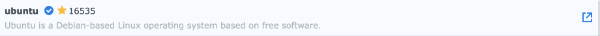
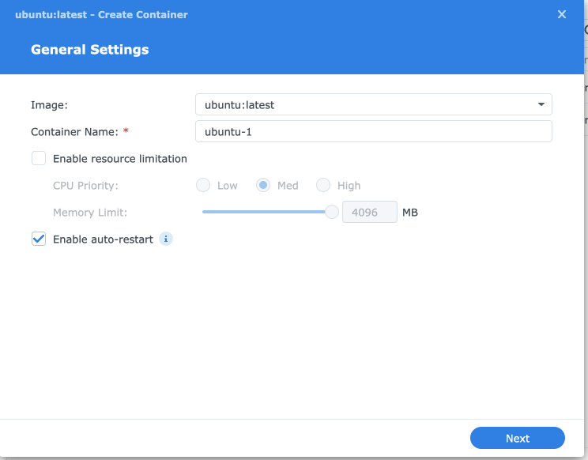
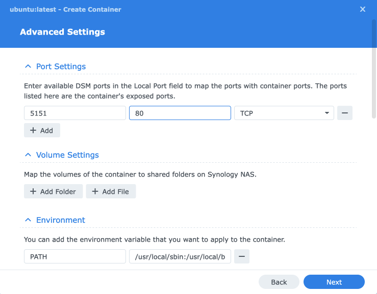
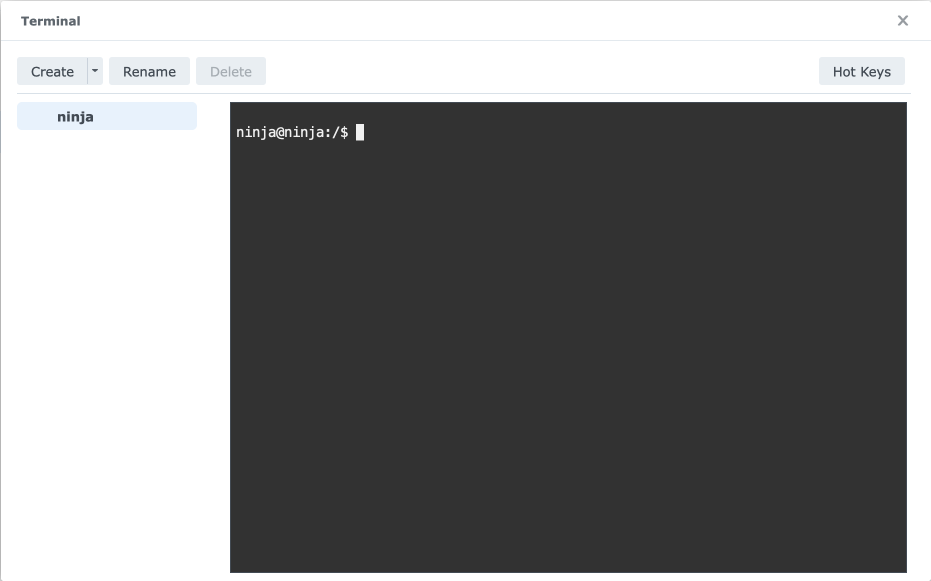
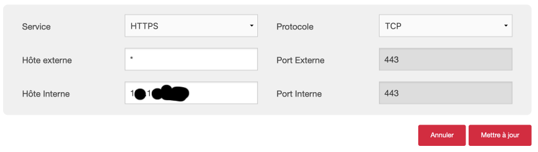
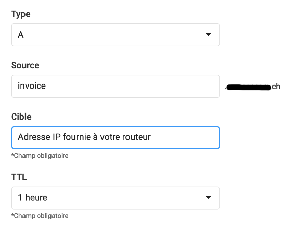
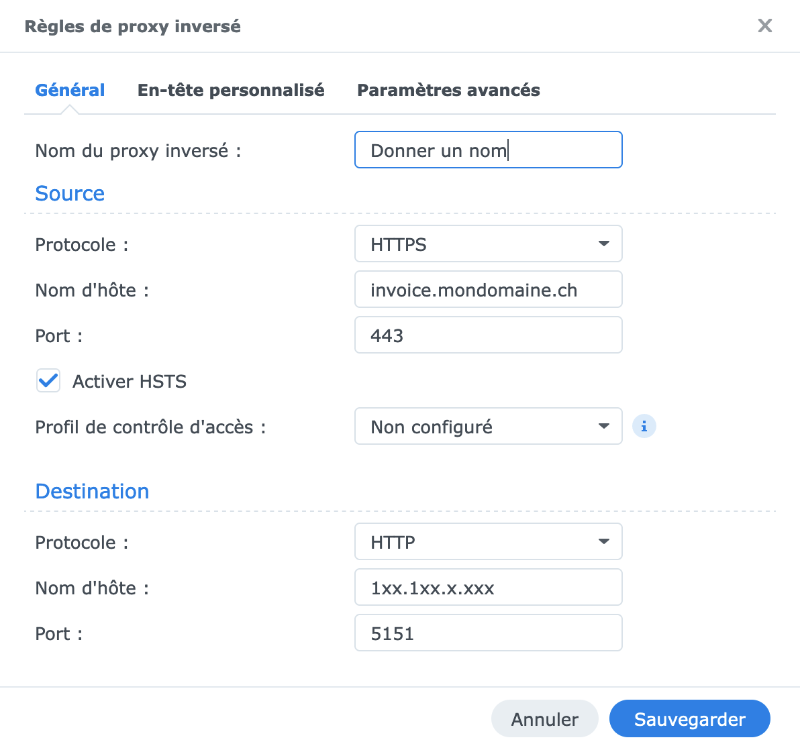
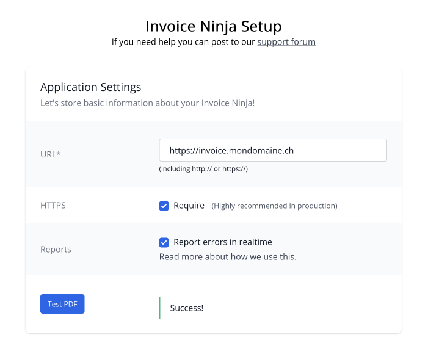

# Comment installer Ubuntu, Apache, MariaDB, SSL et InvoiceNinja sur un NAS Synonolgy

*Publié le 4 novembre 2023*


Dans cet article, je vais vous montrer comment installer Ubuntu, Apache, MariaDB, PHP dans un VM (Container Manager) d’un NAS Synology. Vous allez aussi installer un certificat Let’s Encrypt pour accéder à votre installation (Apache / InvoiceNinja) grâce au protocole  HTTPS. Finalement, vous allez installer [InvoiceNinja](https://invoiceninja.com/), qui est une application de facturation, de paiement et de gestion de workflow. [Suivre ce lien pour en savoir plus sur les fonctionnalités](https://invoiceninja.com/features/)

J’ai écris cet article au fur et à mesure de mes investigations pour arriver à mes fins, sans avoir une connaissance approfondie sur les VM (Container Manager / Docker) avec Synology. Si vous découvrez une erreur ou une amélioration, je serai ravi d’avoir votre partage. Cet article est encore en cours de rédaction

Cet exercie est réalisé avec un Macbook, un NAS synology DS220+ (DSM 7.2), dans un réseau local (Routeur WiFi de mon domicile).


## InvoiceNinja
[InvoiceNinja](https://invoiceninja.com/features/) est une application de facturation qui simplifie et facilite l’envoi de factures et la réception de paiements. [Elle a une version gratuite et une version payante](https://invoiceninja.com/pricing/).

## Prérequis
Vous devrez aussi avoir

* un nom de domaine avec la possibilité de créer un A Record dans votre zone DNS. Si vous n’avez pas de nom de domaine, dans votre console de votre NAS, vous pouvez créer un DDNS ce qui pourrait vous aider, mais je ne montrerai pas cette partie.
* un accès à votre Routeur WiFi pour activer et configurer le port forwarding 443.

Finalement, je vous invite a suivre [cette vidéo en anglais sur les containers](https://www.youtube.com/watch?v=aUFpdjfDI6c) (Docker)

## Création du container
(Est-ce que cette partie peut être améliorée?)

Depuis le Package Center de votre synology, installer [Conaitner Manager](https://www.synology.com/fr-fr/dsm/feature/container-manager).

Ouvrer Container Manager, et sous ‘Registry’, chercher Ubuntu et télécharger là




Vérifier bien qu’elle figure maintenant sous ‘Images’, puis aller sous ‘Container’ et créer maintenant un nouveau container avec l’image Ubuntu



*Sélectionner l’image, donner un nom à votre container et cocher ‘Enable Auto-restart’*




*électionner un port de votre Synology (5151) et le port de votre container (80). Vous pouvez choisir un port de votre Synology mais le port 80 de votre container est obligatoire*

Finalement, sélectionner votre nouveau container, cliquer droit de la souris et cliquer sur ‘Open Terminal’



*Le Terminal de votre container*

## Installation des packages

Ouvrez le terminal de votre container.

Le système a été minimisé en supprimant les packages et le contenu qui sont pas requis sur un système auquel les utilisateurs ne se connectent pas. Pour restaurer ce contenu, y compris les pages de manuel, vous pouvez exécuter la commande « unminimize » commande. Vous devrez toujours vous assurer que le package « man-db » est installé.

```
root@ninja:/# unminimize
```

Puis quand le processus est terminé, installer
```
apt install man-db sudo nano net-tools lsb-release wget unzip cron less
```

Créez un utilisateur et ajouter le dans le groupe sudo

```
useradd -m -s /bin/bash ninja
passwd ninja
usermod -aG sudo ninja
```

et utiliser cet utilisateur pour les prochaines étapes `su nija`

Mettez à jour l’OS
```
sudo apt update
sudo apt upgrade
sudo apt dist-upgrade
```

### Installation d’apache
```
sudo apt install apache2 apache2-utils
```

Vérifier que apache tourne
```
sudo service apache2 status
sudo service apache2 start # Démarrage de apache
sudo service apache2 status
```

Modifier les permissions sur le dossier

```
sudo chown www-data:www-data /var/www/html/ -R
```

### Installation de MariaDB
```
sudo apt install mariadb-server mariadb-client
sudo service mariadb status #Vérifiez le status
sudo service mariadb start #démarrer MariaDB si besoin
```

Saisisser la commande suivante et répondre aux questions

```
sudo mysql_secure_installation
```

* **Enter the current password for root:** Saisisser un mot de passe pour root et confirmer-le
* **Switch to unix_socket authentification [Y/n]?:** n
* **Change the root password [Y/n]?:** n
* **Remove user anonimous account [Y/n]?;** Y or press enter
* **Disable root login remotely [Y/n]?:** Y
* **Remove test database and access to it) [Y/n]:** Y
* **Reload privilege tables now [Y/n]:** Y

### Installation de  phpmyadmin

```
sudo apt install phpmyadmin
```

Répondez aux questions

* **Configure the database with dbconfig-common [yes/non]:** yes
* **Web server to reconfigure automatically:** 1


Redémarrer apapche 
```
sudo service apache2 restart
```

### Installation de PHP

```
sudo apt install php8.1 libapache2-mod-php8.1 php8.1-mysql php-common php8.1-cli php8.1-common php8.1-opcache php8.1-readline php8.1-mbstring php8.1-xml php8.1-gd php8.1-curl
```

Activer le module Apache php8.1 puis redémarrez le serveur Web Apache.

```
sudo a2enmod php8.1
sudo service apache2 restart
```

### Configuration de SSL (https)
Il faut maintenant que vous puissiez accéder à votre serveur apache (container) de manière sécurisée. En d’autres de mots, vous devez pouvoir afficher la page d’apache par défaut, qui se trouve dans votre container, depuis votre navigateur de manière sécurisée (https://invoice.mondomaine,ch) avec le protocole HTTPS

Pour ces étapes, je ne peux malheureusement pas votre montrer des images, car les interfaces des routeur WiFi varient en fonction des marques et modèles.

#### Redirection de ports

Généralement, les routeurs WiFi que vous avez à la maison, ont le port 443 fermé. Ce port est nécessaire pour le protocole HTTPS. Il faut donc ajouter une règle de redirection de port vers l’adresse IP de votre hôte interne, soit votre NAS Synology. Il faut donc accéder à votre routeur et rechercher l’onglet de redirection de ports (Port forwarding). Voci les paramètres que j’ai dû saisir



C’est aussi, depuis votre routeur que **vous pouvez connaitre l’adresse IP qui est fourni à votre NAS** par votre routeur.

Il est aussi fort recommandé **de réserver une adresse IP** de manière à ce que votre routeur fournisse toujours la même adresse IP à votre NAS Synology.

Vous allez aussi avoir besoin de chercher et **relever l’adresse IP fournie à votre Routeur** par votre fournisseur d’accès à internet (Orange, Sunrise, Salt, Swisscom, etc). Vous allez en avoir besoin plus loin.

#### Zone DNS / Sous domaine

Supposons que votre nom de domaine est www.mondomaine,ch et que vous souhaitez accéder à votre container avec un sous.domaine invoice.mondomaine,ch, vous allez devoir créer un A Record ‘invoice’ depuis votre zone DNS.



*Ajout d’un enregistrement DNS (A record)*

Dans la cible, saisissez l’adresse IP fournie à votre routeur par votre fournisseur, que vous avez relever plus haut.

#### Configuration de votre NAS

Vous devez maintenant indiquer à vous NAS **comment rediriger votre requête HTTPS sur votre container**, soit sur votre serveur Apache. Vous allez aussi créer un certificat SSL.


##### Certificat SSL
Rendez-vous sur votre panneau de configuration) , puis Securité et sur l’onglet Certificat. Ajouter un certifcat et suivez ces indications

* Dans la première fenètre « Veuillez choisir une action », cocher ajouter un nouveau certificat
* Dans la deuxième fenêtre « Veuillez choisir une action », donner une description et cocher Procurez-vous un certificat auprès de Let’s Encrypt
* Dans la fenêtre « Procurez-vous un certificat auprès de Let’s Encrypt », saisissez la zone DNS que vous avez créé plus haut (invoice.mondomaine.ch) et siasissez votre adresse e-mail. Laissez vide le dernier champ.
* Cliquez « effectué »

##### Proxy inversé (Reverse proxy)
Rendez-vous sur votre **panneau de configuration** , puis **Portail de connexion** et sur l’onglet **Avancé** et cliquer sur **proxy inversé**, puis cliqué sur **créer**

Saissisez les informations suivantes




* **Source – Nom d’hôte:** L’URL que cous avez créé plus haut (Zone DNS) pour accéder à votre NAS
* **Destination – Nom d’hôte:** L’adresse IP de votre NAS, fournie par votre routeur
* **Destination – Port:** Le port que vous avez indiqué sous le chapitre « Création du container »

##### Modification de votre certificat

Vous devez encore modifier votre certificat en fonction de ces dernières étapes.

Rendez-vous sur **votre panneau de configuration**, puis **Securité** et sur l’onglet **Certificat** et sélectionner le certificat que vous avez créé, puis cliquer sur **paramètres**.

Dans la liste de gauche, rechercher votre nom de domaine **invoice.mondomaine.ch** et dans la colonne de droite, corriger et sélectionner aussi **invoice.mondomaine.ch**

### Résultat

Vous pouvez tester maintenant. Si vous saisissez dans votre navigateur préféré https://invoice.mondomaine.ch, vous devriez voir la page apache de votre container! Bravo!!

## InvoiceNinja
### Installation de InvoiceNinja
```
cd
pwd #ninja@ninja:~$
mkdir Soft
cd Soft
wget https://github.com/invoiceninja/invoiceninja/releases/download/v5.7.48/invoiceninja.zip
sudo mkdir -p /var/www/invoiceninja/
sudo unzip invoiceninja.zip -d /var/www/invoiceninja/
sudo chown www-data:www-data /var/www/invoiceninja/ -R
```

Il faut maintenant créer une base de donnée

```
sudo mysql
MariaDB [(none)]> create database invoiceninja;
MariaDB [(none)]> create user ninja@localhost identified by 'ninja_password';
MariaDB [(none)]> grant all privileges on invoiceninja.* to ninja@localhost;
MariaDB [(none)]> flush privileges;
MariaDB [(none)]> exit;
```

Puis, il faut installer les modules PHP nécessaire à InvoiceNinja

```
sudo apt install php-imagick php8.1 php8.1-mysql php8.1-fpm php8.1-common php8.1-bcmath php8.1-gd php8.1-curl php8.1-zip php8.1-xml php8.1-mbstring php8.1-bz2 php8.1-intl php8.1-gmp
```

et redémarrer apache
```
sudo service apache2 restart
```

### Configuration de Ninja
Commencer par copier le fichier .env.example, que vous allez modifier ensuite

```
cd /var/www/invoiceninja/
sudo cp .env.example .env #Copier et renommer
sudo nano .env #Editer le fichier
```

Rechercher les lignes suivantes et modifier les comme indiqué ci-dessous. (APP_URL doit avoir le sous-domaine que nous avons créé plus haut (A Record))

```
# APP_URL=http://localhost
APP_URL=https://invoice.mondomaine.ch
TRUSTED_PROXIES=*
REQUIRE_HTTPS=true
```

Puis, toujours dans le même fichier, modifier les lignes suivantes

```
DB_HOST=localhost
DB_DATABASE=invoiceninja # Moficier ici le nom de la base de donnée que vous avez créé plus haut
DB_USERNAME=ninja # Modifier ici le nom d'utilisateur que vous avez créé plus haut
DB_PASSWORD=ninja_password # et ici le mot de passe que vous avez défini pour cet utilisateur
DB_PORT=3306
```

Corriger les propriétés du fichier .env

```
sudo chown www-data:www-data /var/www/invoiceninja/.env
```

Ensuite, exécutez la commande suivante pour générer une clé d’application unique pour votre installation InvoiceNinja.

```
sudo php8.1 /var/www/invoiceninja/artisan key:generate
```

et migrez la dans la base de donnée

```
sudo php8.1 /var/www/invoiceninja/artisan migrate:fresh --seed
```

Cette commande va créer les tables dans votre base de données. Cette opération est relativement longue.

### Correction de la configuration d’Apache
Maintenant, vous pouvez lancer le setup d’InvoiceNinja depuis l’URL https://invoice.mondomaine.ch/invoiceninja/ mais nous aimerions pour avoir accéder à l’application de facturation depuis l’URL https://invoice.mondomaine.ch

Pour cela, vous devez modifier la configuration d’appache. Etidez le fichier

```
sudo nano /etc/apache2/sites-available/invoice-ninja.conf
```

et coller ces lignes:

```
<VirtualHost *:80>
    ServerName invoice.mondomaine.ch 
    DocumentRoot /var/www/invoiceninja/public

    <Directory /var/www/invoiceninja/public>
       DirectoryIndex index.php
       Options +FollowSymLinks
       AllowOverride All
       Require all granted
    </Directory>

    ErrorLog ${APACHE_LOG_DIR}/invoice-ninja.error.log
    CustomLog ${APACHE_LOG_DIR}/invoice-ninja.access.log combined

</VirtualHost>
```

Vérifier bien que ServerName correspond bien à votre domaine, comme vu plus haut. Sauver et fermer ce fichier, et activer ce virtual host

```
sudo a2ensite invoice-ninja.conf
```

On a besoin d’activer le rewrite module et de redémarrer Apache

```
sudo a2enmod rewrite
sudo service apache2 restart
```

Vous pouvez maintenant accéder à la page de l’assistant de configuration d’Invoice Ninja (invoice.mondomaine.ch/setup). Si vous voyez la page Apache par défaut au lieu de l’assistant de configuration, vous devez désactiver l’hôte virtuel par défaut.

```
sudo a2dissite 000-default.conf
```

### Setup de InvoiceNinja

Vous pouvez maintenant lancer le setup de InvoiceNinja en suivant cette url https://invoice.mondomaine.ch. Cependant, j’ai rencontré une erreur **« Blocked loading mixed active content »**


>     Qu’est-ce que le contenu mixte ? Lorsqu’un utilisateur visite une page servie via HTTP, sa connexion est ouverte aux écoutes clandestines et aux attaques de l’homme du milieu (MITM). Lorsqu’un utilisateur visite une page servie via HTTPS, sa connexion avec le serveur Web est authentifiée et cryptée avec SSL et donc protégée contre les écoutes indiscrètes et les attaques MITM. Cependant, si une page HTTPS inclut du contenu HTTP, la partie HTTP peut être lue ou modifiée par des attaquants, même si la page principale est diffusée via HTTPS. Lorsqu’une page HTTPS a du contenu HTTP, nous appelons ce contenu « mixte ». La page Web que l’utilisateur visite n’est que partiellement cryptée, puisqu’une partie du contenu est récupérée en clair via HTTP. Le Mixed Content Blocker bloque certaines requêtes HTTP sur les pages HTTPS.

En d’autres mots, la page setup, fait appel à des fichiers CSS ou Javascipt avec le protocole HTTP alors que vous utiliser le protocole HTTPS.

J’ai résolu mon problème en modifiant cette ligne, dans le fichier .env (voir plus haut)

```
TRUSTED_PROXIES=*
```

Pour les dernières étapes, saisissez l’URL https://invoice.mondomaine,ch qui vous redirigera dans le setup. Il faudra donner les informations de votre base de données que nous avons défini plus haut. Il faudra aussiet **surtout n’oubliez pas de cocher la case « HTTPS require »**




## CRON
Vous devez encore configurer votre CRON pour vos rappels (etc) soient envoyés. Editez le fichier

```
sudo -u www-data crontab -e
# Ajouter la ligne suivante
* * * * * cd /var/www/invoiceninja && php artisan schedule:run >> /dev/null 2>&1
```

## Bug et amélioration

Je dois encore chercher comment créer un fichier docker-compose.yml correspondant à mon container, afin de pouvoir créer un projet avec ce fichier, dans Container Manager.

Il y a encore un bug que je vais régler plus tard. Quand on démarre le container, Apache et MariaDB ne démarre pas. Il faut les démarrer manuellement

```
sudo service apache2 start
sudo service mariadb start
#sudo systemctl enable apache2 ne fonctionne pas
```

Apparemment, cette erreur est dû au container. Dans Container Manager, il faudrait créer un projet avec un fichier `docker-compose.yml` qui démarre ces deux services. J’étudierai ceci plus tard.


## Références:

* https://www.linuxbabe.com/ubuntu/install-invoiceninja-ubuntu-22-04-apache-nginx
* https://www.linuxbabe.com/ubuntu/install-lamp-stack-ubuntu-22-04-server-desktop
* https://mariushosting.com/synology-https-ssl-to-your-docker-containers-without-port-at-the-end/
* https://www.wundertech.net/container-manager-on-a-synology-nas/
