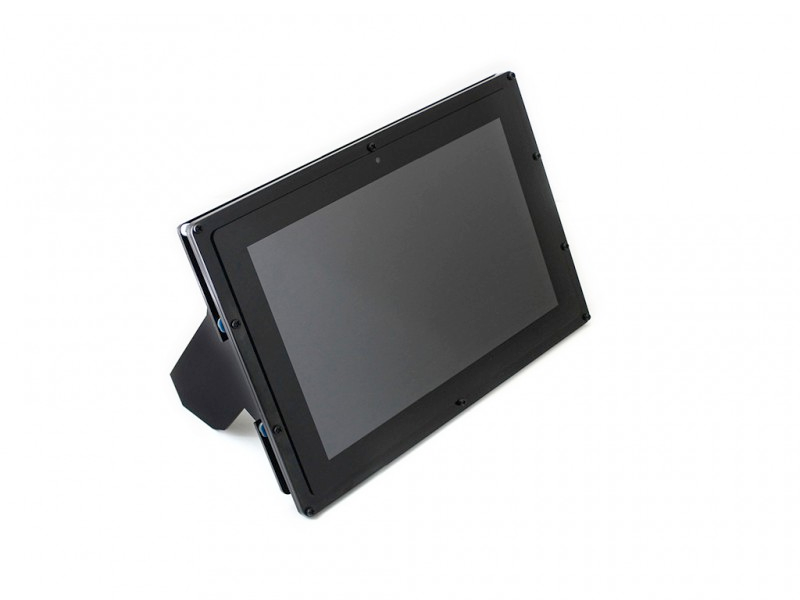

# Ecran 10.1 HDMI LCD sur un Raspberry



Dans cet article, je vais rapidement rédiger un aide mémoire pour utiliser un écran WAVESHARE 10.1 » HDMI à écran tactile (Capacitive Touch Screen LCD), sur un Raspberry

## Documentation

* [Installation](https://www.waveshare.com/img/devkit/LCD/10.1inch-HDMI-LCD-B-with-Holder/10.1inch-HDMI-LCD-B-with-Holder-assemble.jpg)
* [Wiki et informations supplémentaires](https://www.waveshare.com/wiki/10.1inch_HDMI_LCD_(B)_(with_case))

## Résumé

Une fois que vous avez cloné votre image Rasbian sur votre carte SD, réinsérez votre carte SD dans **votre ordinateur**, et ajoutez les lignes suivantes, à la fin du fichier `config.txt`

```
# WAVESHARE 10.1 HDMI LCD SCREEN
max_usb_current=1
hdmi_group=2
hdmi_mode=87
hdmi_cvt 1280 800 60 6 0 0 0
hdmi_drive=1
```

Sous Mac ou Linux, vous pouvez saisir les lignes de commande suivantes, pour ajouter ces lignes à la fin du fichier.

```
sh -c "echo '\n# WAVESHARE 10.1 HDMI LCD SCREEN' >> /Volumes/boot/config.txt"
sh -c "echo 'max_usb_current=1' >> /Volumes/boot/config.txt"
sh -c "echo 'hdmi_group=2' >> /Volumes/boot/config.txt"
sh -c "echo 'hdmi_mode=87' >> /Volumes/boot/config.txt"
sh -c "echo 'hdmi_cvt 1280 800 60 6 0 0 0' >> /Volumes/boot/config.txt"
sh -c "echo 'hdmi_drive=1' >> /Volumes/boot/config.txt"
```

Si vous utilisez un Raspberry Pi 4B, vous devez commenter la ligne suivante, de ce fichier, selon la doc, dans le fichier /Volumes/boot/config.txt

```
dtoverlay=vc4-fkms-V3D
```

En cas de problème, vous pouvez aussi essayer de modifier les lignes suivantes

```
max_usb_current=1
hdmi_group=2
hdmi_mode=27
```

Insérez votre carte SD dans votre Raspberry et alimentez-le ainsi que l’écran.
Vous devez encore connecter le câble MicroUSB du connecteur « TOUCH » à votre Raspbbery pour rentre votre écran tactile.

