# Faire ses sauvegardes sans connexion filaire

*Publié le 22 novembre 2017*

*Keywords: backup, Wireless, ssh, RealVnc, remote control, External disque, FireZilla*

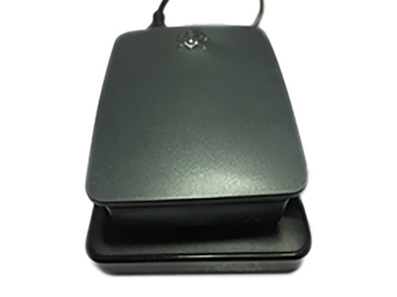

Dans cet article, vous allez apprendre à

* installer et configurer un micro-ordinateur Rasbery Pi  
* configurer un accès à distance (SSH et VNC)
* monter un disque dur externe en permanence
* configurer vos sauvegardes

Nous allons utiliser [FileZilla](https://filezilla-project.org/) qui est un excellent utilitaire FTP/SFTP pour faire et comparer ses sauvegardes sur un dossier distant, avec le protocole sécurisé SFTP. FileZilla est simple à utiliser et surtout compatible avec Windows et Mac.

Vous apprendrez aussi comment contrôler votre Raspberry depuis un autre ordinateur.

Si vous n’avez besoin que d’un excellent outil de synchronisation, je vous invite à suivre que la dernière partie de cet exercice, en bas de page : Configuration de l’application de sauvegarde (Il ne vous suffira que de modifier le champs host)

J’attire votre attention que certaines étapes demandent une connaissance informatique et risquent de faire peur aux novices. Cependant, si vous suivez bien les étapes par étapes, vous devriez pouvoir faire ces préparatifs.

## Le matériel

Pour continuer, vous aurez besoin

* d'un Raspberry Pi et une alimentation 5V
* d’un câble Micro USB, s’il n’est pas fourni avec le Raspberry.
* d’une carte micro-SD d’au moins 16G et son adaptateur. Néanmoins, je vous recommande de prendre une carte de plus grosse capacité 64G, 128G.
* d'un câble HDMI
* d'une souris et un clavier USB et un écran avec un port HDMI.
* d’un disque dur USB externe, comme une WD, que je recommande (exFAT ou FAT32)
* de l’utilitaire FileZilla, pour exécuter les sauvegardes (vous pouvez utiliser un autre outil)


## Préparation du Raspberry

Malheureusement pour le utilisateur Windows, il vous faudra faire preuve d’initiative, car mon tuto se fait avec un Mac, mais à deux doigts près, c’est la même chose.

### Installation d’Etcher

Etcher est une petite application qui vous permettra de créer une image sur une carte SD à partir d’un fichier .dmg ou .iso. Dans ce cas, nous allons installer l’OS Raspbian sur la carte SD à partir d’une image.

* Téléchargez [Etcher](https://etcher.io/). Il y a une version pour Windows. Installer donc ce petit programme. Pour les Mac, téléchargez Etcher dans votre dossier Téléchargement ou Desktop.
* Double cliquez sur Etcher.1.1.2.dmg
* Glissez Etcher dans votre dossier ‘Application’

C’est tout, vous venez d’installer une nouvelle application!

### Installation de votre Raspberry

* Rendez-vous sur la page de [téléchargement de Raspberry](https://www.raspberrypi.org/downloads/raspbian/) pour télécharger Raspbian, le système d'exploitation de votre Raspberry.
* Téléchargez **Raspbian Stretch with desktop** ([version zip](https://downloads.raspberrypi.org/raspbian_latest)) ou cliquez directement sur ce précédent lien. Si vous êtes à l’aise avec Linux, prenez la version **Raspbian Stretch Lite**, si non prenez la version Desktop qui présente l’avantage d’avoir une interface.
* Une fois téléchargé, dezipez le fichier pour avoir un fichier ‘xxxx-xx-xx-raspbian-stretch.img’ .
* Insérez votre carte micro-SD dans votre lecteur
* Ouvrez l’application Etcher
* A gauche, sélectionner l’image (xxxx-xx-xx-raspbian-strech.img)
* Au milieu, sélection votre carte SD
* A droite, cliquer sur ‘Flash’. Vous êtes en train d’installer l’OS de votre micro-ordinateur
* Une fois terminé, éjectez votre carte et retirez là de son support.

## Configuration de votre Raspberry

Préparez l’alimentation de votre Raspberry, l’écran, le clavier et la souris et la carte fraîchement installée. Puis connectez ces périphériques dans les bons ports et insérer la carte Micro-SD.

Après avoir connecté les périphériques, alimentez le Raspberry avec le câble Micro-USB. Il n’y a pas de bouton on/off, il s’allume et démarre tout seul comme un grand malgré sa taille.

Une fois allumé, vous devriez voir sur votre écran une belle route droite dans le désert

Vous suivez jusqu’à là? On continue, alors. Attention, il y a de fortes chances que votre OS soit en anglais. Il vous faudra alors sortir vos dicos. Ne perdez pas de temps à avoir une version française, c’est du temps perdu.

### Création d’un nouvel utilisateur (impératif)

Ouvrez un terminal et …

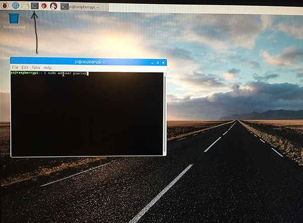

tapez la commande suivante. Remplacer ‘pierrot’ par un nom d’utilisateur de votre choix 
```
sudo adduser pierrot
```

> Attention, votre clavier est encore en anglais. Nous allons changé ceci plus tard. Si vous avez un clavier suisse-français et que votre mot de passe contient un z et vous taper la touche z, ca sera en réalité un y.

Ensuite tapez sur la touche ‘enter’ pour toutes les questions, sauf si vous voulez renseigner ces informations. Tapez Z  (=Y), puis confirmer que les saisies sont correct.

Comme indiqué plus haut, le clavier n’est pas encore modifié. Donc la touche Z est en fait, la touche Y…

**N’oubliez surtout pas cette commande**. Cette commande assigne l’utilisateur ‘pierrot’ dans le groupe sudo. Le groupe sudo est le groupe des supers administrateurs.

```
sudo adduser pierrot sudo
```

### Désactivation de l’auto login
Cliquez sur la framboise en haut à gauche, puis Preferences -> Raspberry Pi Configuration.

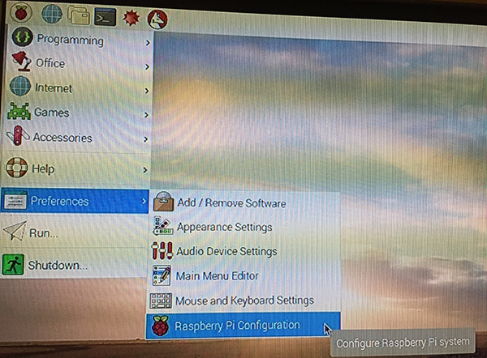

Puis dans l’onglet ‘System’, décochez **As current user**, et dans le champs **Hostname** donner un nouveau nom à votre micro-ordinateur, comme par exemple ‘home’ ou ‘home01’

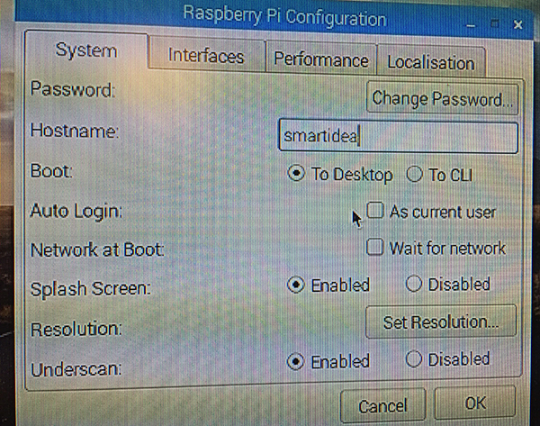

Puis, dans l’onglet ‘Interface’, activez (enabled) SSH et VNC. Ceci vous permettra d’accéder à votre Raspberry à distance. Nous verrons ceci plus tard.

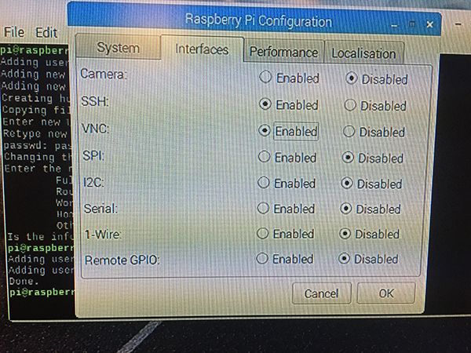

Cliquez sur ‘OK’ et répondez Yes pour redémarrer votre Raspberry.

Finalement, **authentifiez-vous avec votre nouveau compte**. Un message d’avertissement va s’afficher:

> SSH is enabled and the default password for the 'pi' user has not been changed. This is security risk - please login as the 'pi' user and run Raspberry Pi Configuration to set a new password

Ne prêtez pas attention à ce message, nous allons le régler immédiatement en supprimant ce compte.

### Suppression du premier compte (compte par défaut)

Vous avez ouvert une session avec votre nouveau compte, ouvrez un terminal et tapez la commande suivante qui supprimera le compte initial.

Attention, nous sommes toujours avec la configuration d’un clavier US. Tapez la touche du l’apostrophe (sur un clavier Suisse-français) pour avoir le –

```
sudo userdel -rf pi
```

Il vous sera demandé de saisir le mot de passe du nouveau compte.

### Préférence du clavier et du WiFi

Modifier maintenant la préférence de votre clavier. Nous ne l’avons pas fait avant car le fait de s’authentifier avec votre nouveau compte, vous auriez retrouvé une configuration par défaut, soit la configuration d’un clavier US.

Cliquez sur la **Framboise**, puis sur **Preference**, puis **Raspberry Pi Configuration** et allez dans l’onglet ‘Localisation’

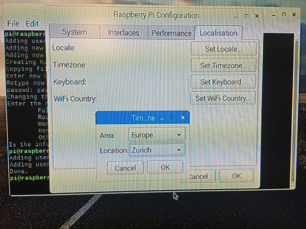

* Cliquez sur Set Time Zone et sélectionner votre zone
* Cliquez sur Set keyboard (on aurait pu le faire avant :o) et sélectionnez Switzerland et French (Switzerland)
* Cliquez sur Set WiFi Country et sélectionner CH Switzerland

### Extension du système de fichier

Cette opération est la plus compliquée pour un novice. Ouvrez un terminal et tapez la commande suivante

```
sudo raspi-config
```

* Descendez avec les flèches de votre clavier sur 7 ‘Advanced Options’, tapez la touche  ‘enter’
* Sélectionner A1 ‘Expand filesystem’, tapez la touhe ‘enter’, confirmez

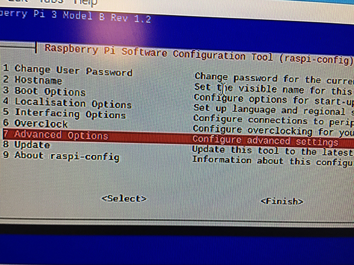

C’est fini, tapez la touche TAB de votre clavier, sélectionnez `Finish` et confirmez pour le reboot.

### Configuration du SSID (WiFi)

On continue et attention ça se complique! Ouvrez un terminal et tapez la commande suivante pour éditer et modifier le fichier de configuration de votre réseau

```
sudo nano /etc/wpa_supplicant/wpa_supplicant.conf
```

Avec les touches de votre clavier, descendez le curseur, au-dessous de la ligne ‘update_config=1’ et entrez les lignes suivantes


```
network={
  ssid="The_SSID_of_your_wifi"
  psk="Your_wifi_password"
}
```

Tapez exactement ces lignes **avec une tabulation avant ssid et psk**, et bien entendu remplacer The_SSID_of_your_wifi et Your_wifi_password que vous avez choisi lors de la configuration de votre routeur sans fil 4G portable. **Attention, ne supprimer/effacer pas les guillemets**.

Pour quitter cette fenêtre, taper en même temps `<ctrl>+o`, puis `<enter>`, puis `<ctrl>+x` pour sauver et fermer votre modification.

Bravo!

Dans votre terminal, tapez la commande `sudo reboot` pour redémarrer votre Raspberry (encore)

## Mise à jour de votre Raspberry

Maintenant que vous avez accès à internet, je vous recommande vivement de mettre à jour votre nouveau petit ordinateur.

Pour cela, ouvrez un terminal et taper ces commandes, l’une après l’autre. Cette opération va prendre un peu de temps pour se faire.

```
sudo apt-get update
sudo apt-get upgrade
```

et installez un petit utilitaire utile

```
sudo apt-get install vim
```

## Prise en main à distance

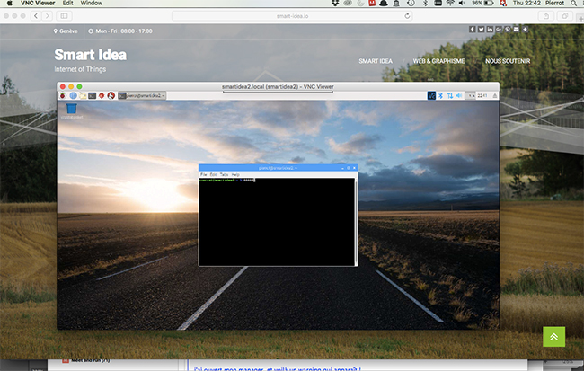

Notez que cette étape ne se fait plus sur votre Raspberry, mais sur votre ordinateur.

### Avec SSH
Si vous êtes familiarisés avec les lignes de commande, vous pouvez utiliser SSH.

Si vous avez Windows, installer Putty. Une fois installé, ouvrez-le et indiquez le nom de votre Raspberry dans le champs Host Name, comme ci-dessous:

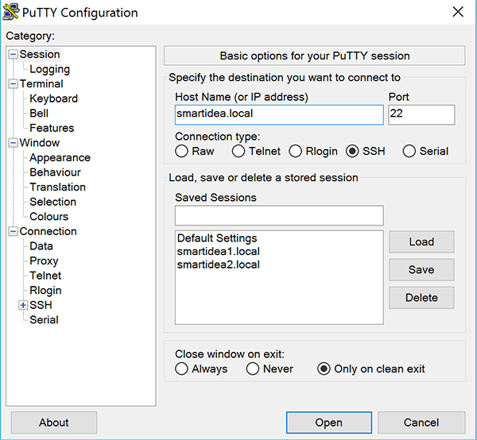

*Indiquez le nom de votre Raspberry dans le champs Host Name*

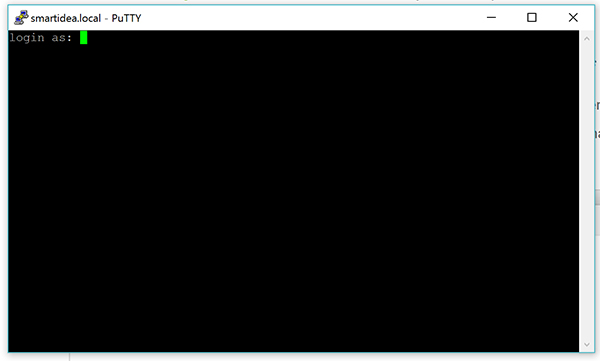

*Authentification*

Depuis un Mac ou Ubuntu, ouvrez un terminal et saisissez la commande

```
ssh <username>@<hostname>
```

Ce qui donne, pour moi: `ssh pierrot@smartidea.local`

### Avec RealVnc

[RealVnc](https://www.realvnc.com/fr/) est un outil qui vous permet de prendre en main votre Raspberry, comme si vous y étiez connecté avec votre écran (voir la photo, un peu plus haut).

Pour cela, [télécharger RealVnc ici](https://www.realvnc.com/fr/connect/download/vnc/)  en fonction de votre système d’exploitation, sur votre ordinateur portable ou fixe. Installez-le et une fois fait, ouvrez RealVnc.

Je vous fais la démo depuis un Mac, mais je pense que depuis un PC ça ne doit pas être très différent…

Dans barre d’adresse, entrez le nom de votre Raspberry que vous avez précédemment choisi, suivi de .local. Pour ma part, je me connecte sur **smartidea.local**. Vous constatez que j’ai des petites images dessous. Vous l’aurez aussi après votre première connexion ;o).

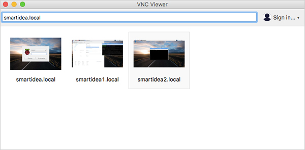

Lors de votre première connexion, vous aurez à répondre à cette question

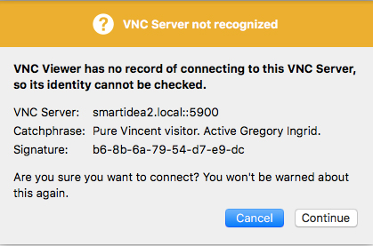

Répondez Continue et authentifiez-vous avec le nouveau compte que vous avez créé. Dès à présent, vous travaillez sur un autre ordinateur que celui où vous êtes assis derrière.

Ceci étant fait, je vous propose de revenir sur le clavier et l’écran de votre Raspberry, pour continuer.

## Configuration de vos sauvegardes

Votre clavier, écran et souris sont toujours connectés au Raspberry. Ne connecter pas encore votre disque dur externe (ou votre clé USB)

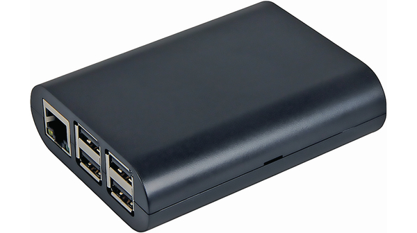

*Raspberry dans son boîtier*

## Installation des utilitaires

Nous allons commencé par installer des packages. Ouvrez un terminal et taper la commande suivante pour installer les packages nécessaire. Par précaution, installer aussi les utilitaires pour hfs+, ça ne mange pas de pain.

```
sudo apt-get install exfat-fuse
sudo apt-get install -y hfsutils hfsplus hfsprogs
```

Vous pouvez maintenant connecter votre disque dur externe dans un port USB du Raspberry

## Monter le disque de manière permanente

Nous allons d’abord vérifier le système de fichier de votre disque dur externe. Ouvrez un terminal et tapez la commande suivante

```
sudo lsblk -o UUID,NAME,FSTYPE,SIZE,MOUNTPOINT,LABEL
```

qui devrait vous afficher ceci

```
pierrot@smartidea:~ $ sudo lsblk -o UUID,NAME,FSTYPE,SIZE,MOUNTPOINT,LABEL
UUID NAME FSTYPE SIZE MOUNTPOINT LABEL
 sda 931.5G 
67E3-17ED ├─sda1 vfat 200M EFI
3ea226a6-af57-3f02-a413-5d9a7c38b723 ├─sda2 hfsplus 465.6G PierrotWD
5A1D-9AAE └─sda3 exfat 465.5G Rasp1_HD
 mmcblk0 14.9G 
E5B7-FEA1 ├─mmcblk0p1 vfat 41.8M /boot boot
b4ea8e46-fe87-4ddd-9e94-506c37005ac5 └─mmcblk0p2 ext4 14.8G / 
pierrot@smartidea:~ $
```

On voit que j’ai un disque dur avec deux partitions.

La première partition a le label PierrotWD avec un numéro unique 3ea226a6-af57-3f02-a413-5d9a7c38b723 de 465G et que le système de fichier est hfsplus (Apple)

La deuxième partition a le label Rasp1_HD avec un numéro unique 5A1D-9AAE de 465G et le système de fichier est exfat. C’est cette partition que je vais utiliser dans la suite de mon tuto.

> Par defaut, raspberry monte automatiquement des fichiers système tel FAT, NTFS et HFS+ sur `/media/<nom d’utilisateur>/<label du disque>`

Comme il est indiqué dans l’encadré, il est fort probable que vous voyez une ligne ressemblant à ceci:

```
pierrot@smartidea:~ $ lsblk -o UUID,NAME,FSTYPE,SIZE,MOUNTPOINT,LABEL
UUID NAME FSTYPE SIZE MOUNTPOINT LABEL
 sda 931.5G 
67E3-17ED ├─sda1 vfat 200M EFI
<ID unique> └─sda2 <système de fichier> 931.2G /media/<votre nom d'utilisateur>/<Le label (nom) de votre dique>
 mmcblk0 14.9G 
E5B7-FEA1 ├─mmcblk0p1 vfat 41.8M /boot boot
b4ea8e46-fe87-4ddd-9e94-506c37005ac5 └─mmcblk0p2 ext4 14.8G /
```

Ce qui est normal. Nous allons modifier ceci plus tard.

Le système de fichier [hfsplus](https://fr.wikipedia.org/wiki/HFS%2B) est système propriétaire d’Apple et j’ai personnellement eu des problèmes lorsque j’ai voulu synchroniser des fichiers depuis un PC. J’ai donc préalablement créé la deuxième partition Rasp1_HD pour avoir un système de fichier [exFAT](https://fr.wikipedia.org/wiki/ExFAT) , qui pourra être aussi bien utilisé par Mac ou Windows

De votre côté, si vous avez aussi ce système de fichier, il vous faudra soit créer une partition exFAT ou reformater votre disque ( je détaillerai cette procédure plus tard).

### Accès au disque dur (montage)

Si je décide de connecter un autre disque dur, ou une clé USB, le disque dur pourrait devenir sda2 (ou sda3) et je ne saurai plus comment y accéder. Il faut donc lui donner une « adresse » permanente grâce au numéro unique.

Il faudra d’abord, créer un nouveau dossier de montage. C’est ce dossier qui « accueillera » le contenu du dossier cible, soit celui de votre disque dur externe.

Ouvrez votre terminal et tapez les commandes suivante pour créer un nouveau **dossier de montage**

```
sudo mkdir /mnt/wd
```

(si un mot de passe vous est demandé, donner le mot de passe de l’utilisateur que vous avez créé précédemment)

Évidemment on peut appeler le répertoire comme on veut. Pour ma part j’ai préféré l’appeler ‘wd’. Vous pouvez très bien l’appeler /mnt/backup. La seule contrainte est que ce soit un sous-répertoire de /mnt.

**Attention, ne donnez pas de nom avec des accents**

On voit que lorsque vous avez taper cette commande

```
sudo lsblk -o UUID,NAME,FSTYPE,SIZE,MOUNTPOINT,LABEL
```
Votre disque du externe est monté par défaut sur `/media/<nom d'utilisateur>/<nom du disque/partition>`

Ce qui peut aussi le cas, si vous connecter une simple clé USB.
Pour remédier à ceci, nous allons ajouter une inscription dans un fichier qui est nommé ‘fstab’. Grâce a ceci, votre disque dur sera toujours monté sur un dossier unique, ou disons un dossier consacré que pour lui.

Relevez l’UUID qui est l’id de votre disque. Dans mon cas, elle ressemble à ceci `5A1D-9AAE`

car je veux utiliser la partition dont sont système de fichier est **exfat**.

Éditez ensuite le fichier fstab en tapant la commande suivante:

```
sudo nano /etc/fstab
```

Descendez tout en bas du fichier et écrivez cette ligne (il y a un espace entre chaque bloque de texte).

```
UUID=5A1D-9AAE /mnt/wd exfat defaults,auto,umask=000,users,rw 0 0
```

Contrôlez bien votre saisie!

Pour quitter en sauvant, taper les touches de votre clavier `ctrl+x`, puis `maj+o` (ou `maj+y`) et taper `enter`

**Ne redémarrez pas votre Raspberry maintenant!**

If faut encore démonté votre disque qui a été monté automatiquement sur /media/pierrot/PierrotWD en tappant cette commande

```
sudo umount /media/pierrot/PierrotWD
```

Évidement, remplacer pierrot par votre nom d’utilisateur et remplacer PierrotWD par le nom de votre disque, comme vous avez pu le voir plus haut.

Pour terminer, vous allez monter manuellement votre disque dur externe. Ceci nous permettra de vérifier votre saisie dans le fichier fstab. Tapez la commande suivante, dans votre terminal.

```
sudo mount -a
```

Vous devriez voir ceci s’afficher.

```
@:~ $ sudo mount -a
FUSE exfat 1.2.5
@:~ $
```

Pour vous assurer que tout c’est bien passé, tapez la commande suivante.

Remplacer Rasp1_HD par le nom de votre disque ou partition que vous avez pu voir plus haut.

```
sudo mount -l |grep Rasp1_HD
```

Vous devriez voir une ligne similaire à celle-ci, normalement tout en bas

```
/dev/sda3 on /mnt/wd type fuseblk (rw,nosuid,nodev,noexec,relatime,user_id=0,group_id=0,default_permissions,allow_other,blksize=4096) [Rasp1_HD
```

Vous pouvez encore tapez cette commande `ls /mnt/wd`

ce qui va afficher le contenu de votre disque. Bien entendu, si votre disque est neuf, donc vide, vous devriez rien voir.

Maintenant, à chaque fois que vous redémarrez votre Raspberry, votre disque dur externe sera automatiquement monté et accessible pour les sauvegardes

Vous pouvez éteindre l’écran et retirer les périphériques du Raspberry, sauf le disque dur USB externe, bien entendu.

## Configuration de l’application de sauvegarde

Bravo, vous allez maintenant préparer votre ordinateur pour faire les sauvegardes.

Pour cela, nous allons utiliser [FileZilla](https://filezilla-project.org/) qui est un excellent utilitaire qui vous pemettra de

* Synchroniser vos dossiers sur un emplacement distant, de manière sécurisée (SFTP/SSH)
* Comparer le contenu du dossier local avec le dossier cible.

Pour commencer, installer [FileZilla](https://filezilla-project.org/download.php?type=client) en fonction de votre OS puis ouvrez FileZilla

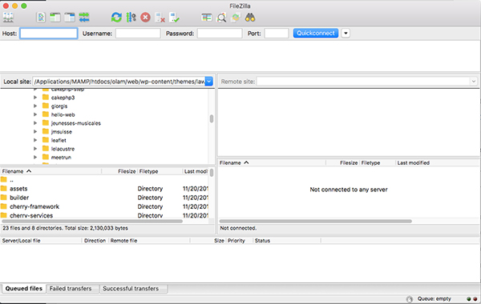

Cliquez, en haut à gauche sur les petits serveurs

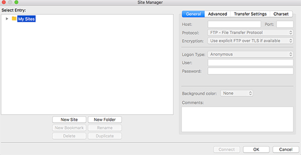

Dans la nouvelle fenêtre, cliquez sur « New site » et donner un nom à votre configuration. Je l’ai appelé Rasp, mais vous pouvez trouver un nom plus sympa.

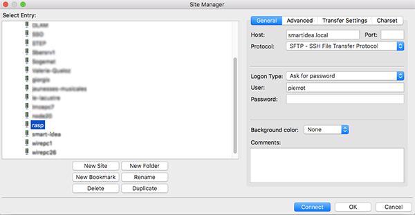

**Dans l’onglet ‘General’**

Host : indiquez le nom de votre Raspberry que vous avez choisi plus haut, dans la rubrique Désactivation de l’auto login dans le champs ‘hostname’. Il doit être suivi par .local 

Exemple: `smartidea.local`

Protocol: Sélectionnez SFTP
Login: Le nom d’utilisateur que vous avez créé lors de la configuration du Raspberry
Password : Le mot de passe

**Dans l’onglet ‘Advanced’**

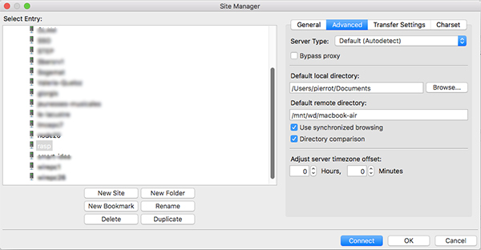

**Indiquez le dossier local** (Default local directory) à sauvegarder sur le dossier distant.
`/home/pierrot/Document`

Finalement, indiquez le **dossier distant** (Default remote directory).
`/mnt/wd/macbook-air`


Cochez les deux options

* Use synchronized browsing
* Directory comparaison

Puis cliquez sur OK

Pour qu’il ne vous demande pas votre mot de passe à chaque fois, vous pouvez encore aller dans le menu

**FileZille -> Settings ->Interface (sous Windows : Edit->Settings)**

et sélectionnez **Save password**. Revenez dans l’onglet général et Sélectionnez le menu déroulant ‘Normal’, indiquez votre nom d’utilisateur et mot de passe et cliquez OK

Cliquez à nouveau, « les petits serveurs », en haut à gauche, sélectionnez votre nouveau Site et cliquez sur **Connect**

Il se peut que cette fenêtre apparaisse

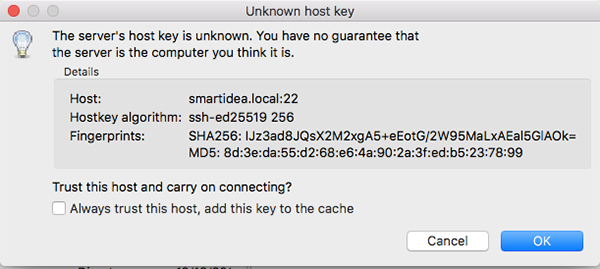

Cliquez OK

## Comment utiliser FileZilla

Une fois connecté (cliquez sur les petits serveurs, en haut à gauche), vous allez voir le contenu de votre dossier source et le contenu de votre dossier cible, qui devrait être vide.

Le contenu de gauche devrait être jaune. Je vais transférer, pour commencer le dossier ‘Arduino’ qui se trouve dans Mes Documents.

* Je sélectionne le dossier en question
* Je clique droit sur ce dossier et je clique sur « envoyer »

Au-dessus de ces deux fenêtres, vous allez voir l’activité du transfère.

NB: Je suis passé sur mon PC Lenovo pour la suite et la fin de ce tuto. FireZilla est en français. Je vous laisse donc sortir vos dicos, si  votre FileZilla est dans une autre langue

A gauche, le dossier ‘Arduino’ devient blanc, et droite, le dossier ‘Arduino’ est vert. J’aurais enfin fait la sauvegarde du dossier le plus important de mon PC  (rire).

Je vais répéter l’opération sur mon dossier ‘teste’. Une fois fait, mon dossier de gauche devient blanc, et mon dossier de droite est vert.

Je vais ajouté un fichier coucou.txt dans le dossier ‘teste’ (sur mon PC). Puis ensuite, j’appuie sur la touche F5, pour actualiser mes vues (ou dans le menu Affichage -> Actualiser).

Le dossier ‘teste’ de gauche devient vert, et le dossier ‘teste’ devient blanc. Vous pouvez aussi double cliquer sur le dossier de gauche et constater que le nouveau fichier est en jaune et qu’il ne figure pas dans la vue de droite.

Sélectionner le dossier ‘teste’ (à gauche), cliquez droit, puis sur envoyer.

La une nouvelle fenêtre s’affichera vous proposant divers options. Je vous laisse étudier ces options mais j’attire votre attention sur les deux premières

* Remplacer
* Remplacer si la source est plus récente

Dans le premier cas, vous allez écraser tout ce que contient la cible du dossier sélectionné, ce qui peut prendre du temps si votre dossier est gros.

La deuxième option est très intéressante, particulièrement si votre dossier et sous-dossiers contiennent de grosses données. Il va uniquement transférer les fichiers modifiés. Ce qui va évidemment prendre un temps beaucoup plus court.

Résumé des couleurs:

Jaune : Le fichier existe uniquement que d’un côté
Vert : Le fichier est plus récent que le côté non marqué
Rouge: Les tailles des fichiers sont différents

## Conclusion

Je pense que cette procédure demande une connaissance avec les lignes de commandes et Linux et que novice risque de vite se perdre. Mais avant tout, qu’il vous a été utile ou du moins, qu’il vous permis répondre à besoin, même partiel.

Je reste à l’écoute des suggestions pour le perfectionner ou corriger une erreur.

Est-ce que c’était vraiment compliqué?
