# Transformer votre Raspberry en camera de surveillance

*Publié le 28 novemvre 2017*

*Keyword: Raspberry Zero, Camera IR, Dropbox, Api, Motion, daemon, systemctl*

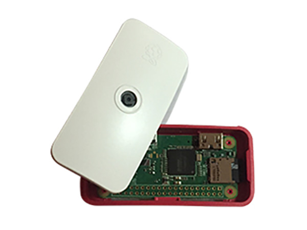

Dans cet article, je vais vous montrer comment transformer un tout tout petit ordinateur en camera de surveillance et envoyer tout ça sur Dropbox. Ainsi, vous pourrez à distance contrôler ce qu’il se passe chez vous.

Pour cet exercice, je vais utiliser un Raspberry Zero avec une toute petite camera IR.

## Matériel

* [Un Raspberry Zero W](https://www.adafruit.com/product/3400) Raspbian GNU/Linux 9 (stretch)
* [Une camera IR avec son boitier](https://www.adafruit.com/product/3415) ou une [Camera sans IR](https://www.adafruit.com/product/3414)
* [Un adaptateur HDMI](https://www.adafruit.com/product/2819)
* [Un mini USB HUB](https://www.adafruit.com/product/2991)
* Eventuellement un adaptateur [USB – USB Micro](https://www.adafruit.com/product/2910) ou [ceci](https://www.adafruit.com/product/1099) (Vous trouvez ceci n’importe où)
* [Une batterie 5V](https://www.adafruit.com/product/1959) (Vous en trouvez n’importe où)
* Un clavier, une souris et un écran (avec une prise HDMI)

Référence : https://learn.adafruit.com/cloud-cam-connected-raspberry-pi-security-camera/dropbox-sync

Pour info : https://www.raspberrypi.org/documentation/usage/camera/python/README.md

## Préparation du Raspberry

Pour l’installation du Raspberry, je vous laisse suivre l'article [Article/Backup/README.md](https://github.com/ecosensors/ecosensors/tree/main/Articles/Raspberry/Backup#pr%C3%A9paration-du-raspberry) sous le même chapitre.

## Configuration de votre camera

Ouvrez un terminal et mettez à jour votre OS

```
sudo apt-get update
sudo apt-get upgrade
sudo apt-get install wget
sudo apt-get dist-upgrade
```

Pour activez votre camera, tapez la commande

```
sudo raspi-config
```

et sélectionnez l’option

* 5 Interfacing Options
* P1 Caemra

et activez la.

Vous pouvez dors et déjà prendre une photo en tapant la commande suivante 
```
raspistill -o photo.jpg
```

## Sauvegarde dans Dropbox

### Installation du script DropBox

Ouvrez votre terminal et tapez les commandes suivantes

```
sudo apt-get install -y curl
cd ~
git clone https://github.com/andreafabrizi/Dropbox-Uploader.git
cd Dropbox-Uploader
sudo chmod a+x dropbox_uploader.sh
sudo cp dropbox_uploader.sh /usr/local/bin/dropbox_uploader
```

### Préparer de votre compte dropbox

Rendez-vous sur http://www.dropbox.com et authentifiez-vous avec votre compte. Si non, vous devez en créer un.

#### Créer un Api

En bas à droite, sur les trois points, cliquez sur ‘Developer’ puis ‘Create you App’, au centre de la page et suivez les informations des images

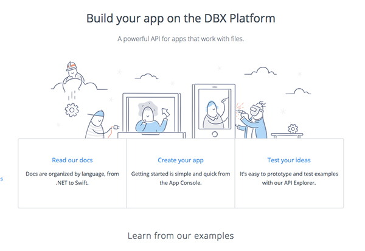

*Création de votre App*

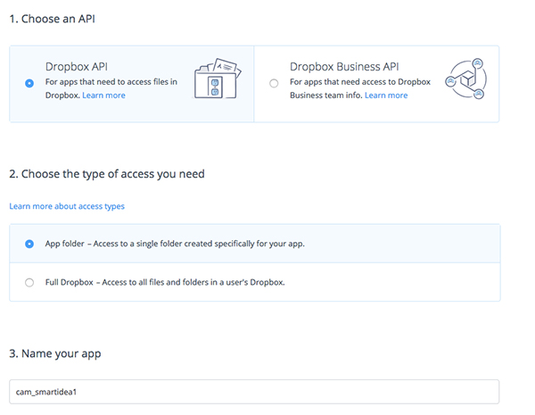

*Sélectionnez ces options et donnez un nom*

Une fois que vous avez créé votre application ‘Dropbox’ descendez jusqu’à l’option pour générer votre jeton (token)

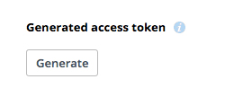

Générez votre Access token et mémorisez ce code. … non je rigole :o), mais ne le perdez pas de vue…, **ne fermez pas votre navigateur**, vous allez l’utiliser tout de suite.

Ouvrez votre terminal et tapez la commande suivante

```
dropbox_uploader upload
```

Comme c’est la première fois que vous exécutez cette commande, il va vous demander le jeton. Observez votre écran et copier/coller le jeton après `Access token:`

ou si vous avez la patience, recopier le jeton à l’aide de votre clavier ….
Tapez la touche ‘enter’ et confirmer avec Y.

Une fois terminé, il va sauver des informations dans un fichier caché, dans votre dossier personnel (home) `~/.dropbox_uploader`

Si vous avez besoin de supprimer/ré-initier votre jeton, supprimer ce dossier

```
# Si vous devez réinitier votre jeton
sudo rm ~/.dropbox_uploader
# et relance le script dropbox_uploader
```

Une autre chose important à faire, est de donner les droits en lecture sur ce dossier car votre jeton est nécessaire pour le programme Motion, qu’on a déjà installé. Il fonctionne avec un autre compte et il doit pouvoir lire ce fichier. Tapez cette commande:

```
sudo chmod a+r ~/.dropbox_uploader
```

Maintenant que DropBox est prêt, nous allons pouvoir tester cette fonctionnalité en envoyant un fichier dans le dossier que vous avez créé. Pour ma part, j’ai créé le dossier cam_smartidea1

Tapez les commandes suivantes

```
cd
sudo touch coucou.txt
dropbox_uploader upload coucou.txt "cam_smartidea1/"
```

N’oubliez pas le / avant le dernier " , si non le fichier sera sauvé en tant que dossier et pas dans le dossier ‘cam_folder1’

cd vous place dans votre dossier personnel (/home/nom_d_utilisateur). La deuxième commande va créer un fichier vide avec le nom coucou.txt. Finalement, la dernière commande va l’envoyer dans votre dossier cam_smartidea1.

Et ça marche!! Mon ordinateur a faire un petit bruit m’indiquant une mise à jour de DropBox. En effet, un nouveau dossier /App/cam_smartidea1/ s’est créé avec un fichier (développement suit)

## Préparatifs et installation de Motion

Pour détecter les mouvements avec la caméra Pi, vous pouvez utiliser l’excellent logiciel [Motion](http://www.lavrsen.dk/foswiki/bin/view/Motion/WebHome). Ce programme transformera le Raspberry en une caméra de sécurité capable de surveiller une caméra connectée pour rechercher des mouvements ou capturer périodiquement des images.

Avant de pouvoir utiliser le paquet Motion, vous devez charger un module spécial qui le fera fonctionner avec la caméra Pi. Normalement, la caméra Pi communique directement au GPU Pi, donc les programmes doivent être écrits pour utiliser spécifiquement la caméra Pi – i.e. L’appareil photo n’apparaît pas comme une webcam ou une autre source vidéo. Cependant, la fondation Pi a créé un module noyau spécial pour que la caméra Pi fonctionne avec l’API Video4Linux 2 de Linux et ressemble à une source vidéo normale. En utilisant le module V4L2 de la caméra Pi, vous pouvez utiliser la caméra Pi avec mouvement et la plupart des autres programmes vidéo Linux.

Pour activer ce module, assurez-vous que votre camera en connectée et d’avoir fait les mises à jour de votre OS

```
sudo apt-get update
sudo apt-get upgrade
```

Éditez ce fichier

```
sudo nano /etc/modules
```

Ce fichier contrôle les modules supplémentaires du noyau chargés au démarrage. Il faut ajouter une nouvelle ligne pour inclure le module spécial de la caméra Pi V4L2. Ajoutez la ligne suivante `bcm2835_v4l2` en bas du fichier:

```
# /etc/modules: kernel modules to load at boot time
# 
# This file contains the names of kernel modules that should be loaded
# at boot time, one per line. Lines beginning with "#" are ignored. 

i2c-dev
bcm2835_v4l2
```
**Attention: ce n’est pas un 1 mais un l comme ludovic, dans le v4l2**

Sauvez le fichier et quittez en pressant `Ctrl-o` puis enter et ensuite `Ctrl-x`.
Redémarrez votre Raspberry 

```
sudo reboot
```

Une fois que votre Raspberry a redémarré, ouvrez votre terminal et tapez cette commande pour vérifier que le module a bien été chargé

```
ls -l /dev/video*
```

Vous devriez voir /dev/video0

`crw-rw----+ 1 root video 81, 0 Nov 29 19:06 /dev/video0`


Si vous ne voyez pas la source / dev / video0, vous pouvez exécuter la commande lsmod pour lister tous les modules du noyau actifs et vérifier si les modules bcm2835_v4l2 sont chargés. Vous pouvez essayer de charger manuellement le module en exécutant

```
sudo modprobe bcm2835_v4l2
```

Si tout le reste échoue, vérifiez le journal du noyau en exécutant la commande dmesg pour voir s’il y a des messages d’erreur qui pourraient indiquer un problème lors du chargement du module.

## Installation de Motion

Pour installer le package, ouvrez votre terminal et tapez la commande suivante

```
sudo apt-get update
sudo apt-get install -y motion
```

Après l’installation il faudra modifier le propriétaire d’un fichier. D’abord, vérifier s’il existe

```
ls -l /var/lib |grep motion
```

Ce qui devrait vous afficher ceci:

`drwxr-s--- 2 motion adm 4096 Nov 28 22:46 motion`

Si le retour est vide (si vous ne voyez rien), tapez cette commande

```
sudo mkdir /var/lib/motion
```

Puis changer le propriétaire de ce dossier

```
sudo chown motion:motion /var/lib/motion
```

En retapant cette commande

```
ls -l /var/lib |grep motion
```

vous devriez voir maintenant

`drwxr-s--- 2 motion motion 4096 Nov 28 22:46 motion`


Profiter déjà pour changer les droits du dossier de journalisation, pour que Motion puisse écrire dedans

```
sudo mkdir /var/log/motion
sudo chown -R root:motion /var/log/motion/
sudo chmod -R 770 /var/log/motion
```

### Configuration de Motion

Il faut maintenant configurer le « comportement » de Motion.

Prenez connaissance [des divers options de configuration de Motion](http://www.lavrsen.dk/foswiki/bin/view/Motion/ConfigFileOptions)

Editer le fichier de configuration

```
sudo nano /etc/motion/motion.conf
```

Vous pouvez laisser la plus part des options telle qu’elle sont. Cependant certaines doivent être modifiées.

Je vous rapelle que pour quitter en sauvant, vous devez taper `<ctrl>+o`, puis `<enter>`, puis `<ctrl>+x`

#### Taille des photos

Descendez jusqu’à ces lignes

```
# Image width (pixels). Valid range: Camera dependent,
default: 352 
width 320 
# Image height (pixels). Valid range: Camera dependent, 
default: 288 
height 240
```

Vous définissez ici, la taille des images. Vous pouvez élargir ces nombres mais il faut tenir compte que plus l’image est grande, plus elle sera lourde et plus elle mettra du temps à être transférée sur un serveur distant comme Drobox. Si vous utilisez une connexion GSM (3G/4G), je vous recommande de ne ma trop élargir la taille de vos images.

Pour vous donner un exemple, cette image fait 350px sur 263px

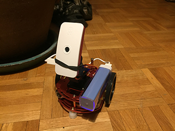

Si vous ne prévoyez pas d’imprimer des posters, cette taille peut être suffisante. Pour ma part, je vais laisser ces dimensions telle qu’elles le sont, car j’utilise le 3G/4G.

#### Seuil des mouvements

Une autre option à modifier est le seuil de mouvement. Ce paramètre contrôle le nombre de pixels dans les images avant la détection d’un mouvement. La valeur par défaut est 1500 pixels, mais c’est une valeur relativement faible pour une trame de 720p (qui a presque 1 million de pixels). Augmentez la valeur à 3000 pour commencer

```
#Threshold for number of changed pixels in an image that 
# triggers motion detection (default: 1500) 
threshold 3000
```

**Si la camera est trop sensible**, vous pouvez augmenter cette valeur.

Le paramètre `minimum_motion_frames` est un autre paramètre utile pour aider à contrôler la sensibilité de la détection de mouvement.

```
# Picture frames must contain motion at least the specified number of frames 
# in a row before they are detected as true motion. At the default of 1, all 
# motion is detected. Valid range: 1 to thousands, recommended 1-5 
minimum_motion_frames 2
```

Vous pouvez augmenter cette valeur pour avoir plus d’une trame modifiée **consécutivement** avant de déclencher une capture. Par exemple, si vous définissez cette valeur à 3, il doit y avoir 3 trames consécutives qui diffèrent par le nombre de pixels avant que le mouvement ne soit détecté.


#### Vidéo

Un autre paramètre à modifier est le paramètre de **capture vidéo**.

Faîtes défiler jusqu’à cette partie de la configuration:

```
# Use ffmpeg to encode movies in realtime (default: off) 
ffmpeg_output_movies on
```

Pour garder ce projet simple, je vais désactiver la capture de video

```
# Use ffmpeg to encode movies in realtime (default: off) 
ffmpeg_output_movies off
```

N’hésitez pas à explorer la possibilité d’activer des films plus tard, mais sachez que cela peut nécessiter l’installation d’autres logiciels ou l’utilisation d’une grande partie du processeur du Pi (en particulier si la résolution est élevée comme 720p ou 1080p).

Plus la vidéo sera longue, plus le transfère sera long. Un élément important à prendre en considération si vous utilisez une connexion 3G

#### Intervalle

Le paramètre `snapshot_interval` permet à l’appareil photo de prendre une photo à une certaine fréquence, qu’il y ait ou pas de mouvement.

```
# Make automated snapshot every N seconds (default: 0 = disabled) 
snapshot_interval 0
```

Vous ne voulez probablement pas activer ce paramètre car il peut générer beaucoup de données et surcharger votre compte Dropbox, mais il est bon de savoir qu’il existe cette une option.

#### Dossier de stockage

Le paramètre `target_dir` contrôle où les images capturées sont stockées localement sur le Raspberry. Vous n’avez pas besoin de modifier ce paramètre, mais il est bon de savoir où les images seront sauvegardées (la valeur par défaut est / var / lib / motion):

```
# Target base directory for pictures and films
# Recommended to use absolute path. (Default: current working directory)
target_dir /var/lib/motion
```

Pour quitter et sauver, taper les touches `<ctrl>+o`, puis `<enter>`, puis `<ctrl>+x`

Pour pouvoir facilement visualiser ce dossier, je vous recommande de créer un raccourci dans votre /home.

D’abord changer les droits. Le dossier /var/lib/motion ne permet l’écriture et la lecture qu’au propriétaire de ce dossier.


> Attention: Motion est le nom de l’application, mais aussi le nom d’un compte créer lors de l’installation de Motion, le nom d’un groupe et le nom d’un dossier (ouf)

Ajouter votre nom d’utilisateur dans le groupe ‘motion’ pour que vous puissiez lancer les captures.

```
sudo adduser pierrot motion
```

Changer les droits pour le groupe 'motion'


```
sudo chmod -R 770 /var/lib/motion
```

Si vous tapez la commande

```
ls -l /var/lib |grep motion
```

vous devriez voir ceci (drwxrws)

`drwxrws--- 2 motion motion 4096 Nov 28 22:46 motion`


Ensuite créez le lien

```
ln -s /var/lib/motion ~/motion
```

Cette dernière commande va créer un dossier motion dans le répertoire personnel, qui en fait n’est pas réellement un dossier, mais un lien.

Si depuis le terminal vous tapez `cd` puis `ls` (cd pour vous rendre dans votre /home/pierrot, ls pour lister le contenu du répertoire personnel /home/pierrot)

vous allez voir un nouveau lien ‘motion’. Maintenant taper cette commande

```
cd
ls motion
```


#### Flux video

Vous pouvez activer un flux vidéo de la caméra en modifiant le paramètre `stream_localhost`

Ré-éditez votre fichier de configuration `sudo nano /etc/motion/motion.conf`

puis allez à la ligne suivante:

```
# Restrict stream connections to localhost only (default: on)
stream_localhost on
```

En mettant `stream_localhost` sur off, n’importe quel ordinateur de votre réseau peut voir le flux vidéo de la caméra du Pi. Ceci est utile pour configurer l’appareil photo et s’assurer qu’il a une bonne vue de ce que vous voulez capturer. (`<ctrl>+o`, puis `<enter>`, puis `<ctrl>+x`)

*Sachez que n’importe qui sur votre réseau peut voir le flux! Par défaut, aucune authentification ou autre connexion n’est requise pour voir le flux.*

#### Déclenchement d’une action quand une photo est prise

Enfin, le dernier paramètre important que vous devez modifier est le paramètre on_picture_save qui contrôle l’action qui se produit lorsque la caméra prend une photo (que ce soit en détectant un mouvement ou en faisant partie d’une capture d’image périodique).

(Editez votre fichier de configuration `sudo nano /etc/motion/motion.conf`)

```
# Command to be executed when a picture (.ppm|.jpg) is saved (default: none)
# To give the filename as an argument to a command append it with %f
; on_picture_save value
```

Par défaut, il n’y a aucune action (on_picture_save est commentée par un ;).

Pour activer la synchronisation des photos sur Dropbox, nous pouvons insérer un appel au script de téléchargement de Dropbox (qui a été configuré dans la section précédente).

Modifier on_picture_save pour qu’il ressemble exactement à ceci:

```
# Command to be executed when a picture (.ppm|.jpg) is saved (default: none)
# To give the filename as an argument to a command append it with %f
on_picture_save dropbox_uploader -f /home/pierrot/.dropbox_uploader upload %f "cam_smartidea1/"
```

Il faudra encore remplacer pierrot par le nom d’utilisateur que vous avez créé ( Normalement, celui avec lequel vous avez ouvert cette session). Vous pouvez encore modifier cam_smartidea1 qui sera le nom du dossier où seront sauvées les images, dans votre Dropbox.

Cela dira à Motion d’appeler la commande dropbox_uploader et de télécharger les images dans le dossier « cam_smartidea1 », dans Dropbox. Notez que le paramètre -f est utilisé pour pointer vers le fichier de configuration créé lors de l’installation de l’application Dropbox (qui se trouve dans un fichier caché dans le répertoire personnel de l’utilisateur pierrot).

N’oubliez pas que pour sauvez en quittant nano, vous devez tapez les touches `<ctrl>+o` puis `<enter>` et ensuite `<ctrl>-x`.


## Tester Motion

Maintenant testons tout ceci.

Dans mon terminal je vais taper cette commande

```
sudo motion -n
```

Je ne vais pas bouger, puis je vais me lever et me réinstaller confortablement dans mon canapé.

J’ai l’agréable surprise de trouver 13 nouvelles images dans mon Dropbox!!!

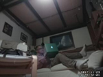 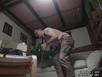
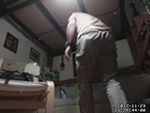 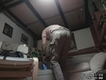
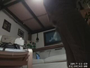 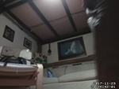
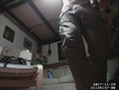 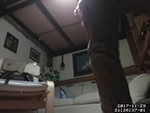
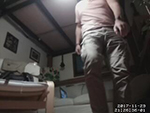 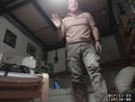
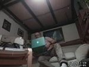 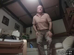
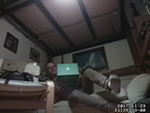

Pour arrêter Motion, presser les touche `<ctrl>+c`

On voit que la camera s’est enclenchée quand je me suis levé et s’est déclenchée lorsque je me suis réinstallé en faisant l’homme endormi.

Les images sont nommées de la manière suivante `01-20171119214628-00.jpg`

* **Event number** – C’est un nombre qui augmente chaque fois qu’il y a un nouvel événement de mouvement depuis le démarrage du programme de mouvement. Ceci est la valeur 01 dans l’exemple ci-dessus
* Dash
* **Date** – La date dans l’année, le mois, le format du jour. L’exemple ci-dessus est le 29 novembre 2017
* **Time** – L’heure :21 heure 46 et 28 seconde
* Dash
* **Frame number** – C’est just un ID unique dans l’événement du mouvement. Les valeurs élevées sont le plus loin dans le future.

Vous pouvez  changer ce format de fichier en modifiant l’option `jpeg_filename` dans le fichier de configuration de Motion.

Attention, pensez à vider le dossier motion de temps en temps :o)

```
sudo rm /var/lib/motion/*
```

Il faudrait prévoir que ceci se passe périodiquement, si non votre Raspberry va rapidement saturer, surtout si vous aveu une petite carte et vous prenez des photos avec une grande dimension.

## Exécuter Motion au démarrage du Raspberry

Pour configurer Motion à s’exécuter lors du démarrage, vous devrez exécuter quelques commandes qui activent son script d’initialisation.

Pour activer son mode daemon, d’abord éditez le fichier 

```
sudo nano /etc/default/motion
```

et changer la ligne `start_motion_daemon=no` à yes.

Puis quittez et sauvez en pressant les touches `ctrl+o`, puis , puis `ctrl+x`

Pour que Motion démarre au démarrage, entrez la commande

```
sudo systemctl enable motion
```

Redémarrer votre Raspberry `sudo reboot`

Si ensuite, vous entrez cette commande

```
sudo systemctl disable motion
```

Motion ne démarrera plus au démarrage de Raspberry

## La surveillance commence

Attention, à partir de maintenant, quand vous démarrez votre Raspberry, l’oeil de Moscou est actif!!!!

* Pour stoper le service: `sudo systemctl stop motion`
* Pour démarrer le service: `sudo systemctl start motion`
* Pour vérifier le statut: `sudo systemctl status motion`
* Pour lire le log: `sudo journalctl -u motion`
* Pour activer au démarrage: `sudo systemctl enable motion`
* Pour désactiver au démarrage: `sudo systemctl disable motion` 


# Bravo!

J’attire encore votre attention que cette configuration n’est pas optimale. En effet, si vous laissez votre Raspberry tourner, Motion va remplir le dossier /var/lib/motion. Vu que la carte SD est petite, votre Raspberry risque de saturer. J'ai écrit un autre article (backup) qui décrit comment monter un disque USB externe de manière permanente. Vous réussirez très facilement à modifier votre configuration pour sauvegarder les séquences d'images sur ce disque externe ...


