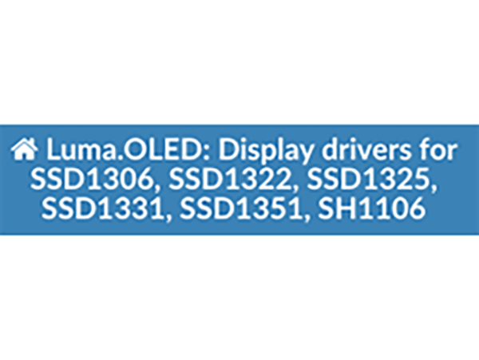

# Luma.oled et Python sur un Raspberry

*Publié le 10 février 2018*

*Keywords: oled, luma, raspberry, I2C*



Cet article vous résume rapidement comment installer [luma.oled](https://luma-oled.readthedocs.io/en/latest/intro.html) sur un Raspberry pour utiliser un écran OLED (I2C) avec Python.

Nous supposons que votre Raspberry est prêt à l'emploi et que vous un OS fraîchement installé.

## Préparation du bus I2C
Nous allons, cette fois-ci, utiliser l’écran OLED avec Python grâce à luma.oled. Pour plus de détail, veillez vous référez à ceci : https://luma-oled.readthedocs.io/en/latest/hardware.html et https://luma-oled.readthedocs.io/en/latest/install.html

La librairie luma.oled a été testée pour Python 2.7, 3.4, 3.5 et 3.6.

Dans l'article concernant les cartes RFID/NFC, je montre comment activer le port I2C.

Une fois fait, assurez-vous qu’I2C est bien activé.

```
dmesg | grep i2c
```

ou la commande

```
lsmod | grep i2c
```

qui devrait vous afficher au moins `i2c_dev 6642 0`

Installez i2c-tools, si ce n’est pas encore fait

```
sudo apt-get install i2c-tools
```

Ajoutez votre compte dans le groupe i2c et quitter

```
sudo usermod -a -G i2c pierrot
exit
```

Reconnectez-vous
```
ssh pierrot@smartidea4.local
```

Vous pouvez maintenant contrôler que votre périphérique communique correctement, avec la commande

```
i2cdetect -y 1
```

qui doit afficher un truc du genre

```


0 1 2 3 4 5 6 7 8 9 a b c d e f 
00: -- -- -- -- -- -- -- -- -- -- -- -- -- 
10: -- -- -- -- -- -- -- -- -- -- -- -- -- -- -- -- 
20: -- -- -- -- -- -- -- -- -- -- -- -- -- -- -- -- 
30: -- -- -- -- -- -- -- -- -- -- -- -- 3c -- -- -- 
40: -- -- -- -- -- -- -- -- -- -- -- -- -- -- -- -- 
50: -- -- -- -- -- -- -- -- -- -- -- -- -- -- -- -- 
60: -- -- -- -- -- -- -- -- -- -- -- -- -- -- -- -- 
70: -- -- -- -- -- -- -- --
```

## Installation de luma.oled

```
sudo apt-get install python3-dev python3-pip libfreetype6-dev libjpeg-dev build-essential
sudo -H pip3 install --upgrade luma.oled
```

## Exemples

Vous trouverez des exemples d’utilisation ici : https://github.com/rm-hull/luma.examples