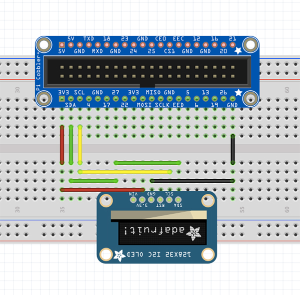

# Un raspberry pour lire vos cartes RFID / NFC

*Publié le 30 décembre 2017*

*Keywords: Raspberry Zero, RFID, NFC,*

 

Dans cet article, je vais vous résumer comment configurer un Raspberry Zero W pour lire un puce RFID.

Vous avez déjà installer l'OS de votre Raspberry et il est prêt à l'usage. J'ai écris des articles pour installer l'OS d'un Raspberry dans le dossier `Raspberry`

*Références: https://hallard.me/adafruit-oled-display-driver-for-pi/ , https://learn.adafruit.com/adafruit-nfc-rfid-on-raspberry-pi/building-libnfc*

## Matériel

* [Raspberry Zero W](https://www.raspberrypi.org/products/raspberry-pi-zero-w/)
* [NFC/RFID controller](https://www.adafruit.com/product/364)
* [PI Cobbler](https://www.adafruit.com/product/2029)
* [GPIO Stacking Header](https://www.adafruit.com/product/2223)
* [OLED I2C 128×32](https://www.adafruit.com/product/931)


## Assemblage
*Référence: https://learn.adafruit.com/monochrome-oled-breakouts/wiring-1-dot-3-128×64#using-with-i2c*

*Lisez et vérifiez bien ceci https://learn.adafruit.com/monochrome-oled-breakouts/wiring-1-dot-3-128×64#using-with-i2c en fonction de votre carte OLED LCD*





## LCD OLED 128×32 I2C

### Connexions

OLED 128×32 I2C | Raspberry
--- | ---
3V | 3V
SCL | SCL
SDA | SDA
GND | GND

Nous allons d’abord vérifier que I2C est activé sur votre Raspberry. Ouvrez votre terminal et tapez la commande suivante

```
sudo raspi-config
```

Sélectionner **5 Interfacing Option**


Puis **P5 I2C**


Puis, répondez YES pour l’activer. Puis cliquez sur `<Finish>`

## Installation
### Installation des librairies (C) et de git
```
sudo apt-get install build-essential git-core libi2c-dev i2c-tools lm-sensors
```

Vous pouvez déjà contrôler les périphériques I2C connectés à votre Raspberry

```
sudo i2cdetect -y 1
```

### Installation des drivers ArduiPi_OLED

*NB: ArduiPi_OLED est le successeur d’ Adafruit_SSD1306*

```
mkdir ~/Soft
cd ~/Soft
git clone https://github.com/hallard/ArduiPi_OLED.git
cd ArduiPi_OLED/
sudo make
```

Le script compilera la librairie (ArduiPi_OLED) et l’installera pour vous (c’est pourquoi nous devons utiliser sudo) dans `/usr/local/lib/` et les en-têtes de bibliothèque dans `/usr/local/include/`

#### Testons!

```
cd ~/Soft/ArduiPi_OLED/examples
sudo make
```

puis lancez le fichier de démo pour un écran 128×32 fonctionnant sur I2C

```
sudo ./oled_demo --verbose --oled 2
```

#### Optimisation
[Edit 09.2024] Il faudrait encore regarder pour l'écran affiche les mesures après le (re)démarrage. Je ne sais plus comment je l'avais fait en 2017 (je n'ai pas retester le module, même s'il fonctionnait très bien). A revoir...

## NFC / RFID

> N’hésitez pas à partager votre expérience pour améliorer cette partie
> Cette partie devrait être revue

*Références : https://blog.stigok.com/post/setting-up-a-pn532-nfc-module-on-a-raspberry-pi-using-i2c, https://learn.adafruit.com/adafruit-nfc-rfid-on-raspberry-pi*

### Connexion

NFC Controller | Raspberry
--- | ---
5V | 5V
SDA | SDA
SLC | SCL
GND | GND

### Installation

```
sudo apt-get install i2c-tools
```

Vous pouvez maintenant scaner votre périphérique I2C

```
sudo i2cdetect -y 1
```

Vous devriez voir le 0x24 qui correspond à l’adresse de votre carte PN532

```
 0 1 2 3 4 5 6 7 8 9 a b c d e f
00: -- -- -- -- -- -- -- -- -- -- -- -- -- 
10: -- -- -- -- -- -- -- -- -- -- -- -- -- -- -- -- 
20: -- -- -- -- 24 -- -- -- -- -- -- -- -- -- -- -- 
30: -- -- -- -- -- -- -- -- -- -- -- -- 3c -- -- -- 
40: -- -- -- -- -- -- -- -- -- -- -- -- -- -- -- -- 
50: -- -- -- -- -- -- -- -- -- -- -- -- -- -- -- -- 
60: -- -- -- -- -- -- -- -- -- -- -- -- -- -- -- --
```

Créez un dossier nfc dans /etc/

```
sudo mkdir /etc/nfc
```

### Configuration

* https://en.wikipedia.org/wiki/Autoconf
* https://en.wikipedia.org/wiki/GNU_Libtool

La prochaine étape est de configurer l’application.

Effectuez cette commande

```
ls /dev/i2c*
```

qui devrait afficher ceci:

`/dev/i2c-1`

Copiez libnfc.conf.sample dans /etc/nfc/

[Edit 09.2024] En relisant rapidement cet article, il semble que j'aurais oublié d'indiquer l'import de la librairie libnfc dans ~/Soft/libnfc. Mais vous devriez trouver la réponse dans les références ci-dessus.

```
cd ~/Soft/libnfc
sudo cp libnfc.conf.sample /etc/nfc/libnfc.conf
```

et dé-commenter la ligne, dans le fichier `libnfc.conf`

```
allow_intrusive_scan=true
```

Puis toujours dans le fichier `libnfc.conf`, décommentez ces lignes et corrigez-les ainsi: 
```
device.name = "PN532 over I2C"
device.connstring = "pn532_i2c:/dev/i2c-1"
```
(/dev/i2c-1 doit correspondre au résultat de `ls /dev/i2c*`)


Sauver le fichier avec les touches `<ctrl>+x` et ensuite `<ctrl>+O` ou `<ctrl>+Y`


Installons maintenant les librairies NFC

```
sudo apt install libnfc5 libnfc-bin libnfc-examples
```

Installez les packages suivants:

```
cd ~/Soft/libnfc/
sudo apt-get install autoconf
sudo apt-get install libtool
sudo apt-get install libpcsclite-dev libusb-dev
autoreconf -vis
./configure --with-drivers=pn532_i2c --sysconfdir=/etc --prefix=/usr
```

L’exécution devrait se finir par ces lignes:

```
checking for log flag... yes
checking for conffiles flag... yes
checking for envvars flag... yes
checking for debug flag... no
checking which drivers to build... pn532_uart
checking for documentation request... no
checking for readline.h... not found
checking that generated files are newer than configure... done
configure: creating ./config.status
config.status: creating Doxyfile
config.status: creating Makefile
config.status: creating cmake/Makefile
config.status: creating cmake/modules/Makefile
config.status: creating contrib/Makefile
config.status: creating contrib/devd/Makefile
config.status: creating contrib/libnfc/Makefile
config.status: creating contrib/linux/Makefile
config.status: creating contrib/udev/Makefile
config.status: creating contrib/win32/Makefile
config.status: creating contrib/win32/sys/Makefile
config.status: creating contrib/win32/libnfc/Makefile
config.status: creating contrib/win32/libnfc/buses/Makefile
config.status: creating examples/Makefile
config.status: creating examples/pn53x-tamashell-scripts/Makefile
config.status: creating include/Makefile
config.status: creating include/nfc/Makefile
config.status: creating libnfc.pc
config.status: creating libnfc/Makefile
config.status: creating libnfc/buses/Makefile
config.status: creating libnfc/chips/Makefile
config.status: creating libnfc/drivers/Makefile
config.status: creating test/Makefile
config.status: creating utils/Makefile
config.status: creating config.h
config.status: executing depfiles commands
config.status: executing libtool commands

Selected drivers:
 acr122_pcsc...... no
 acr122_usb....... no
 acr122s.......... no
 arygon........... no
 pn53x_usb........ no
 pn532_uart....... no
 pn532_spi....... no
 pn532_i2c........ yes
Installons maintenant les librairies NFC
```

Pour information, si vous ne spécifiez pas –with-driver en lançant cette commande ainsi:

```
./configure --sysconfdir=/etc --prefix=/usr
```

L’exécution devrait se terminer ainsi:

```
Selected drivers:
 acr122_pcsc...... no
 acr122_usb....... yes
 acr122s.......... yes
 arygon........... yes
 pn53x_usb........ yes
 pn532_uart....... yes
 pn532_spi....... yes
 pn532_i2c........ yes
 ```

 ### Installation de libnfc
 ```
 cd ~/Soft/libnfc/
sudo make clean
sudo make install all
```

## Testons!!
*Référence: http://nfc-tools.org/index.php/Libnfc:quick_start_example*

D’abord n’oubliez pas de déplacer les deux jumper sur SEL0 sur ON et SEL1 sur OFF


Vous pouvez dès à présent poser une carte sur votre lecteur

### Premier teste
Rendez-vous dans le dossier ‘example’ puis ‘doc’

```
cd ~/Soft/libnfc/examples/doc
```

puis lancer la commande

```
gcc -o quick_start_example1 quick_start_example1.c -lnfc
```

et finalement celle-ci

```
sudo ./quick_start_example1
```

qui devrait afficher ceci après avoir passé la carte RFID sur le lecture

```
./quick_start_example1 uses libnfc 1.7.1
NFC reader: pn532_i2c:/dev/i2c-1 opened
The following (NFC) ISO14443A tag was found:
 ATQA (SENS_RES): 00 04 
 UID (NFCID1): 67 fe a1 39 
 SAK (SEL_RES): 08
```

### Deuxième teste
Pour toutes ces commandes suivantes, vous trouverez plus d’information dans le manuel

```
man nfc-list
man nfc-poll
man nfc-nfc-scan-device
```

Vous pouvez aussi exécuter ces commandes, après avoir placé la carte sur le lecteur:

```
sudo nfc-list -v
```

Ce qui m’affiche

```
nfc-list uses libnfc 1.7.1
NFC device: pn532_i2c:/dev/i2c-1 opened
1 ISO14443A passive target(s) found:
ISO/IEC 14443A (106 kbps) target:
 ATQA (SENS_RES): 00 02 
* UID size: single
* bit frame anticollision supported
 UID (NFCID1): ef 21 58 36 
 SAK (SEL_RES): 38 
* Compliant with ISO/IEC 14443-4
* Not compliant with ISO/IEC 18092
 ATS: 78 f7 b1 02 4a 43 4f 50 32 34 32 52 32 
* Max Frame Size accepted by PICC: 256 bytes
* Bit Rate Capability:
 * Same bitrate in both directions mandatory
 * PICC to PCD, DS=2, bitrate 212 kbits/s supported
 * PICC to PCD, DS=4, bitrate 424 kbits/s supported
 * PICC to PCD, DS=8, bitrate 847 kbits/s supported
 * PCD to PICC, DR=2, bitrate 212 kbits/s supported
 * PCD to PICC, DR=4, bitrate 424 kbits/s supported
 * PCD to PICC, DR=8, bitrate 847 kbits/s supported
* Frame Waiting Time: 618.6 ms
* Start-up Frame Guard Time: 0.6041 ms
* Node Address not supported
* Card IDentifier supported
* Historical bytes Tk: 4a 43 4f 50 32 34 32 52 32 
 * Proprietary format

Fingerprinting based on MIFARE type Identification Procedure:
* SmartMX with MIFARE 4K emulation
Other possible matches based on ATQA & SAK values:
* MFC 4K emulated by Nokia 6212 Classic

0 Felica (212 kbps) passive target(s) found.
0 Felica (424 kbps) passive target(s) found.
0 ISO14443B passive target(s) found.
0 ISO14443B' passive target(s) found.
0 ISO14443B-2 ST SRx passive target(s) found.
0 ISO14443B-2 ASK CTx passive target(s) found.
0 ISO14443A-3 Jewel passive target(s) found.
0 ISO14443A-2 NFC Barcode passive target(s) found.
```

ou encore

```
sudo nfc-list -t 1
```

qui doit afficher ceci:

```
nfc-list uses libnfc 1.7.1
NFC device: pn532_i2c:/dev/i2c-1 opened
1 ISO14443A passive target(s) found:
ISO/IEC 14443A (106 kbps) target:
 ATQA (SENS_RES): 00 04 
 UID (NFCID1): 67 fe a1 39 
 SAK (SEL_RES): 08
```

Ce qui ressemble à ce que nous avons vu plus haut.

Ci-dessus, ceci sont les informations sur la carte

```
ATQA (SENS_RES): 00 04 
UID (NFCID1): 67 fe a1 39 
SAK (SEL_RES): 08
```

Et encore

```
sudo nfc-scan-device -v
```

affichera

```
nfc-scan-device uses libnfc 1.7.1
1 NFC device(s) found:
- pn532_i2c:/dev/i2c-1:
 pn532_i2c:/dev/i2c-1
chip: PN532 v1.6
initator mode modulations: ISO/IEC 14443A (106 kbps), FeliCa (424 kbps, 212 kbps), ISO/IEC 14443-4B (106 kbps), Innovision Jewel (106 kbps), D.E.P. (424 kbps, 212 kbps, 106 kbps)
target mode modulations: ISO/IEC 14443A (106 kbps), FeliCa (424 kbps, 212 kbps), D.E.P. (424 kbps, 212 kbps, 106 kbps)
```

et finallement

```
sudo nfc-poll
```

qui semble attendre qu’une carte soit présentée et termine lorsque la carte est retirée

```
nfc-poll uses libnfc 1.7.1
NFC reader: pn532_i2c:/dev/i2c-1 opened
NFC device will poll during 30000 ms (20 pollings of 300 ms for 5 modulations)
ISO/IEC 14443A (106 kbps) target:
 ATQA (SENS_RES): 00 04 
 UID (NFCID1): 67 fe a1 39 
 SAK (SEL_RES): 08 
nfc_initiator_target_is_present: Target Released
Waiting for card removing...done
```

## Evolution

Malheureusement, je n’ai pas terminé en faisant de sorte que les résultats s’affichent sur l’écran OLED, ce que je ferai dans un avenir proche. Mais au moins vous pouvez tester la fonctionnalité d’un lecteur de cartes RFID.

Si vous avez la solution pour le faire, d’ici là que je le fasse, n’hésitez pas à partager!