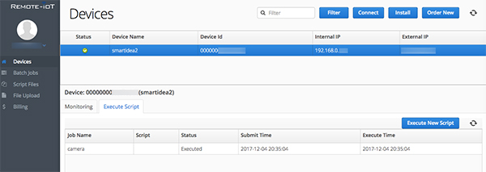

# Comment accéder à mon Raspberry depuis n’importe où?

*Publié le 4 décembre 2017*

Dans ce petit article vite fait :), vous apprendrez à configurer votre Raspberry avec [Remote-iot](https://remote-iot.com/) pour lancer des batch ou des scripts à distance.



Vous avez besoin d'un compte chez Remote-iot.

## Remote-iot

Une fois fait, connectez-vous à votre Raspberry

```
ssh <username>@<hostname>
```

Exécutez les deux commandes suivantes pour installer le service

```
curl -s -L https://remote-iot.com/install/remote-iot-install.sh | sudo -s bash
sudo /etc/remote-iot/services/setup.sh
```

Vous devez informer
* le nom d’utilisateur qui est l’adresse e-mail que vous avez utilisé pour créer le compte chez Remote-iot
* le mot de passe
* le nom de votre Raspberry


```
remote-iot stopped 
Starting remote-iot ... 
remote-iot started ... 
Please enter your Remote-IoT Username (e-mail address): <nom@email.com> 
Please enter your Remote-IoT Password: 
Please enter the device name: smartidea2 
................... 
The unit has been added into Remote-IoT system remote-iot stopped 
Starting remote-iot ... 
remote-iot started ...
```

## Bravo!

Maintenant, vous verrez un nouveau périphérique dans votre portail. Vous pourrez lancer des Batch ou des scripts à distance. J’ai fais pivoter ma Pi Camera ainsi et ça marche!


