# Comment Réaliser un routeur WiFi/4G sois-même

*Publié le 21 mars 2020*

*Keywords: Raspberry, Quectel, sixfab, Routeur WiFi/4G*

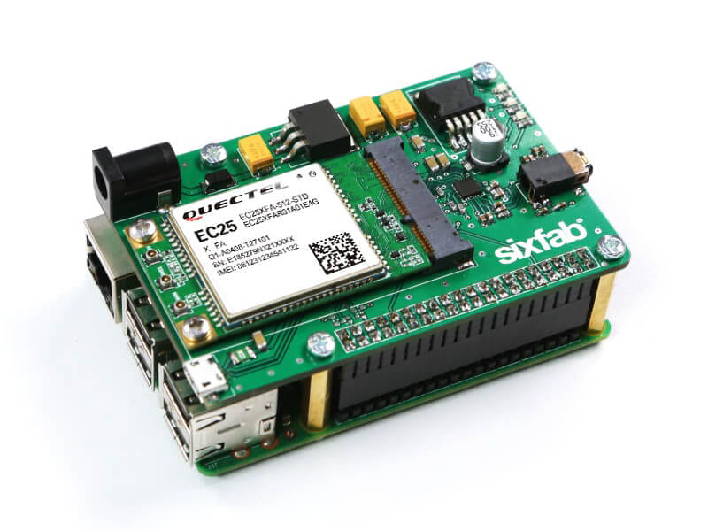

Dans cet article, je vais vous montrer comment réaliser un routeur WiFi / 4G pour votre domicile, avec un Raspberry afin de remplacer votre ADSL et économiser des frais.

Cet article n’est pas des plus simple à réaliser, mais si vous le suivez méticuleusement, je pense que Monsieur et Madame tout le monde peut le réaliser.

Cet exercice est réalisé avec un Mac et un Raspberry Pi3 ainsi que la version de Raspbian Litle datée du 2020-02-13.
Cet exercice est tout à fait réalisable avec un PC, mais il vous faudra Putty pour saisir les lignes de commande.
Je n’ai pas testé cet exercice avec un Raspnerry Pi4.

Pour l’exécution de cet exercice, j’ai connecté mon Raspberry à un écran, avec une souris et un clavier et je l’ai connecté à mon routeur via un câble Ethernet pour télécharger les packages nécessaires. Je n’ai pas configuré le WiFi de mon Raspberry. La configuration de votre WiFi sera remplacée lors de la configuration de [RaspAP](https://raspap.com/).

## Matériel

* [Rasbperry Pi3](https://www.raspberrypi.org/products/raspberry-pi-3-model-b/) (env EUR 50). Vous pouvez aussi utiliser un Raspberry Pi4
* [Sixfab 3G – 4G/LTE Base HAT for Raspberry Pi](https://sixfab.com/product/raspberry-pi-base-hat-3g-4g-lte-minipcie-cards/) (EURO 36.50)
* [Quectel EC25 Mini PCle 4G/LTE Module](https://sixfab.com/product/quectel-ec25-mini-pcle-4glte-module/) (EUR 56.–)
* [2x adaptateur UF.L SMA](https://www.digikey.ch/product-detail/fr/rf-solutions/CBA-UFLSMA-1/CBA-UFLSMA-1-ND/5845754) (EUR 6.–) (attention de prendre un mâle si vos antennes sont des femelles, ou vis versa).
* LTE antenna (2 antennes sont recommandées)
* Un clavier, souris, écran, câble ethernet
* [Stacking Header 2×20 (Tige 10mm)](https://www.pi-shop.ch/gpio-stacking-header-for-pi-a-b-pi-2-pi-3-extra-long-2x20-pins). Des tiges plus courtes vont aussi, si vous ne planifier pas de connecter un autre module.


## Préparation du Raspberry
### Installation du Rasbian Buster

Téléchargez la dernière version de [Raspbian Litle](https://www.raspberrypi.org/downloads/raspbian/).

*Note: La version Desktop n’est est absolument pas nécessaires. La version Little est beaucoup plus légère et moins gourmande en mémoire. Étant donné que le Desktop (l’interface Rasbian) ne sera jamais utilisé, il n’y a donc pas de sens à l’avoir.*

Téléchargez et installez [Etcher](https://www.balena.io/etcher/), et créez l’image sur la carte SD.


Éjectez votre carte SD et insérez la dans le Raspberry. Alimentez votre Raspberry

Connectez votre écran (avec un câble HDMI), la souris et le clavier sur votre Raspberry. Connectez votre Raspberry au routeur à l’aide de votre câble Ethernet.


### Configuration du Raspberry

Ouvrez votre terminal et authentifiez-vous avec le compte pi

```
ssh pi@raspberrypi.local
```

> L’installation du routeur doit se faire avec le compte pi. N’oubliez pas de changer son mot de passe

Le mot de passe de `pi` par défaut est `raspberry`

Vous pouvez aussi connecter votre clavier, souris et écran (avec un câble HDMI) à votre raspberry, pour continuer

Changer le mode de passe l’utilisateur pi

```
sudo passwd pi
```

Installez les mises à jour des packages utiles

```
sudo apt-get update
sudo apt-get upgrade
sudo apt-get install ntpdate vim
```

#### Activer SSH

```
sudo raspi-config
```


*5 Interfacing Options*

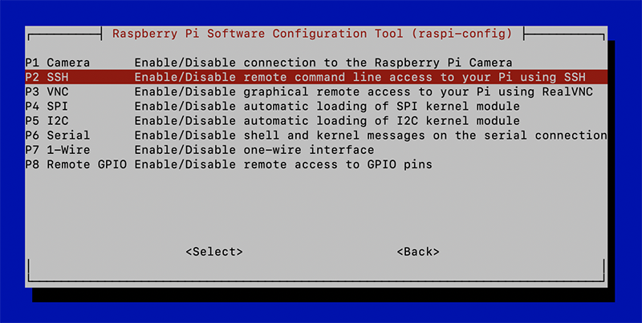

*P2 SSH*

Sélectionnez `P2 SSH` et activez-le. (A partir de la, vous pourriez reprendre l'exercise avec SSH, si votre Mac est connecté au même réseau).

#### Modifier le hostname

Modifiez le nom de votre Raspberry. J’ai donné le nom `ecosensors`

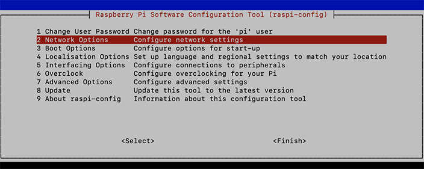

*2 Network Options*

Confirmez la prochaine fenêtre et donnez un nouveau nom à votre Rasperry

#### Localisation

Toujours dans raspi-config,

```
sudo raspi-config
```

modifiez la localisation


*4 Localisation Option*

Puis choisissez `I1 change local` en fonction de votre localisation

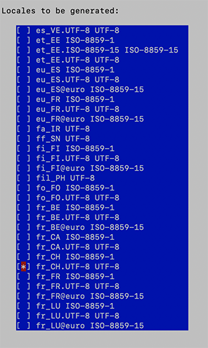

#### Time zone et WiFi

Puis choisissez `I2 Time zone` et corrigez-le en fonction de votre localisation. Puis choisissez `I4 Change WiFi country` et sélectionnez votre pays.

Quittez raspi-config et acceptez le redémarrage

## Assemblage

Eteingnez votre Raspberry et retirez l’alimentation

### Quectel EC25 Mini PCle 4G/LTE Module

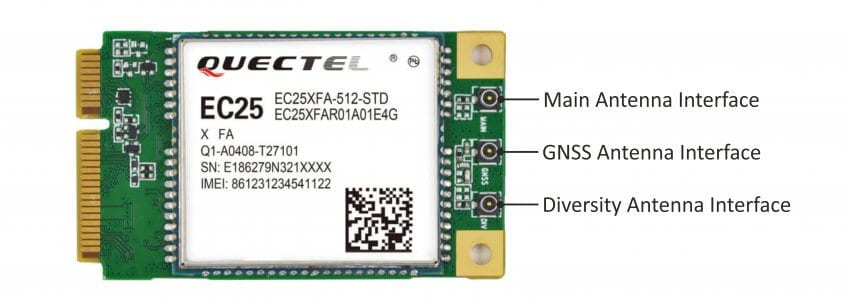

Le module EC25 comprend deux connecteurs UF.L pour les antennes LTE. Un connecteur pour l’antenne principale (Main Antenna Interface) et un connecteur pour l’antenne de diversité Rx, qui est utilisé pour résister à la chute des signaux causés par les mouvements à grande vitesse et l’effet de trajets multiples, et un connecteur UF.L pour une antenne GPS/ GNSS. L’impédance du port d’antenne est de 50 Ω.

Pour juste une connexion cellulaire, il vous suffit de connecter une antenne au port d’antenne principal (Main Antenna Interface). Pour obtenir une meilleure sensibilité Rx et une meilleure réception du signal, nous recommandons une antenne supplémentaire au port d’antenne diversité Rx (Diverity Antenna Interface). La fonction de diversité Rx (ANT_DIV) est activée par défaut.

Nous vous recommandons donc deux antennes LTE. Nous n’utilisons pas d’antenne GPS.

### Raspberry Pi 3G/4G&LTE Base HAT

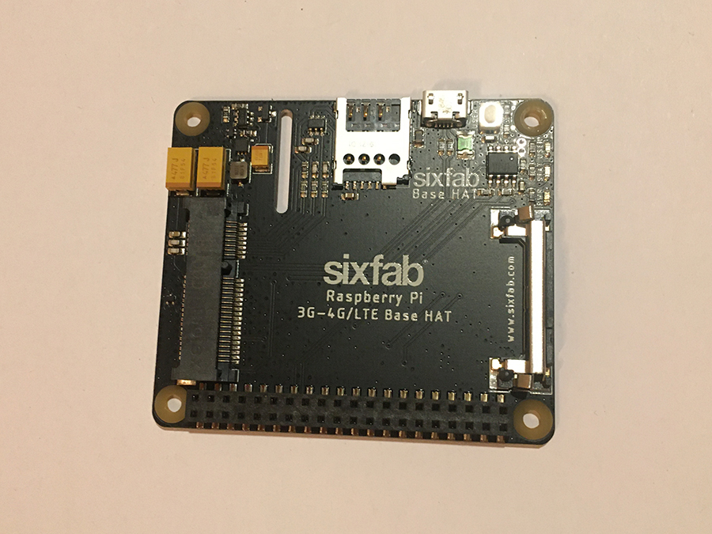

Insérer le module Quectel EC25 Mini PCle sur le HAT

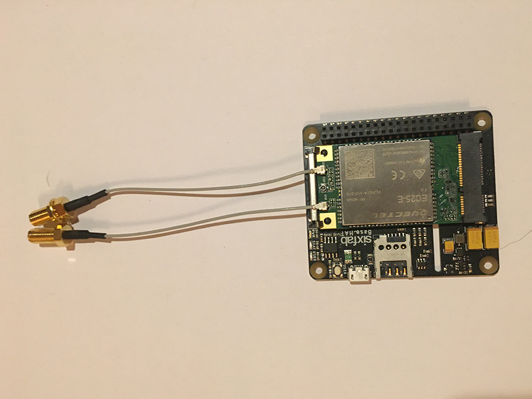

### Finalement

Insérez la broche avec des tiges de 10mm sur votre Rapsberry (des plus petites vont aussi) et fixez le chapeau (hat) sur votre Raspberry, ainsi que les deux adaptateurs UF.L SMA pour les antennes.

ATTENTION: Contrairement à ce qui est montré sur la photo, **ne connecter pas encore le câble USB** sur le Raspberry

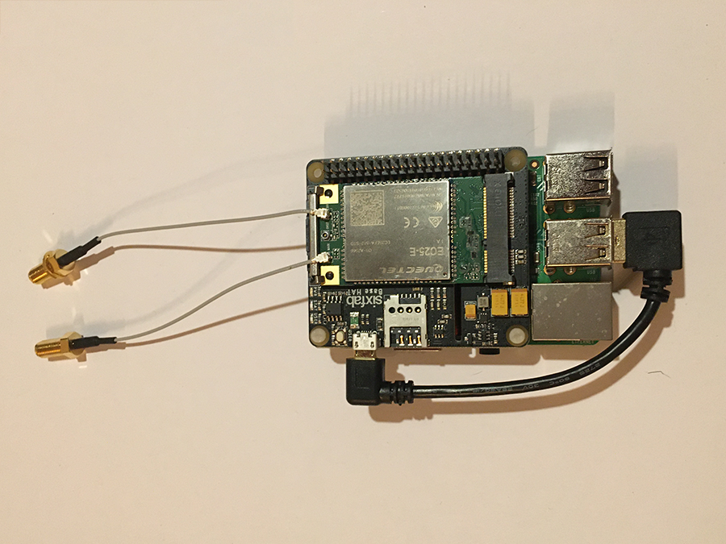

## Installation du routeur
Ne pas encore brancher le câble USB

### Mettre à jour votre Raspberry

```
sudo apt update && sudo apt upgrade
```

### Installation duKernel

```
sudo apt-get install raspberrypi-kernel-headers
```

contrôlez la version du Kernel

```
ls /usr/src
```

ce qui me donne

`linux-headers-4.19.97+  linux-headers-4.19.97-v7+  linux-headers-4.19.97-v7l+`

### Mettre à jour le firmware

Ouvrez votre navigateur et rendez-vous sur [rpi-firmware github repository commits](https://github.com/Hexxeh/rpi-firmware/commits) (sautez cette étape avec un RPi4) et recherchez la ligne correspondante à votre version

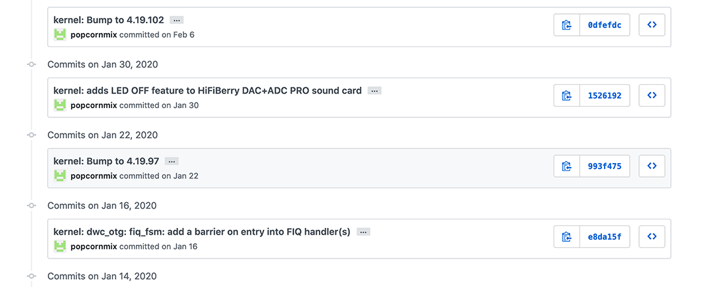

Vous aurez besoin de connaître la version. Cliquer sur <> **(sautez cette étape avec un RPi4)**

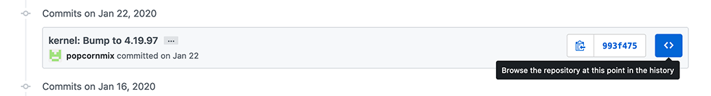

Retournez dans le terminal de votre Raspberry et saisissez la commande suivante en ajoutant le hash (sautez cette étape avec un RPi4)

```
sudo rpi-update 993f47507f287f5da56495f718c2d0cd05ccbc19
```

et répondez y ou o (yes/oui)

```
*** Raspberry Pi firmware updater by Hexxeh, enhanced by AndrewS and Dom
 *** Performing self-update
  % Total    % Received % Xferd  Average Speed   Time    Time     Time  Current
                                 Dload  Upload   Total   Spent    Left  Speed
100 18058  100 18058    0     0   3187      0  0:00:05  0:00:05 --:--:--  4288
 *** Relaunching after update
 *** Raspberry Pi firmware updater by Hexxeh, enhanced by AndrewS and Dom
 *** We're running for the first time
 *** Backing up files (this will take a few minutes)
 *** Backing up firmware
 *** Backing up modules 4.19.97-v7+
#############################################################
WARNING: 'rpi-update' updates to pre-releases of the linux 
kernel tree and Videocore firmware.

'rpi-update' should only be used if there is a specific 
reason to do so - for example, a request by a Raspberry Pi 
engineer.

DO NOT use 'rpi-update' as part of a regular update process.

##############################################################
Would you like to proceed? (y/N)
z *** Downloading specific firmware revision (this will take a few minutes)
  % Total    % Received % Xferd  Average Speed   Time    Time     Time  Current
                                 Dload  Upload   Total   Spent    Left  Speed
100   168  100   168    0     0     30      0  0:00:05  0:00:05 --:--:--    43
100  115M    0  115M    0     0   188k      0 --:--:--  0:10:28 --:--:--  239k
 *** Updating firmware
 *** Updating kernel modules
 *** depmod 4.19.97+
 *** depmod 4.19.97-v7l+
 *** depmod 4.19.97-v8+
 *** depmod 4.19.97-v7+
 *** Updating VideoCore libraries
 *** Using HardFP libraries
 *** Updating SDK
 *** Running ldconfig
 *** Storing current firmware revision
 *** Deleting downloaded files
 *** Syncing changes to disk
 *** If no errors appeared, your firmware was successfully updated to 993f47507f287f5da56495f718c2d0cd05ccbc19
 *** A reboot is needed to activate the new firmware
 ```

 Une fois fait, redémarrez votre Raspberry (sautez cette étape avec un RPi4)

 ```
 sudo reboot
 ```

 ## Installation du Soft

 installez unzip, si ce n’est pas fait

 ```
 sudo apt-get install unzip
 ```

 ### Téléchargement
 Je le télécharge dans un dossier sixfab et je me positionne dans ce dossier avant de le télécharger (sans sudo)

 ```
 mkdir -p ~/Soft/sixfab
cd ~/Soft/sixfab
sudo wget https://raw.githubusercontent.com/sixfab/Sixfab_RPi_3G-4G-LTE_Base_Shield/master/tutorials/QMI_tutorial/qmi_install.sh
```

changez les droits du fichier téléchargé afin de le rendre exécutable

```
sudo chmod +x qmi_install.sh
```

**Assurer vous que le câble USB fournit n’est toujours pas connecté entre le Raspberry et le module Raspberry Pi 3G/4G&LTE Base HAT, comme indiqué plus haut**

Lancez le script d’installation depuis là où vous l’avez téléchargé. Dans mon cas, je l’ai téléchargé dans `/Soft/sixfab/`

```
cd ~/Soft/sixfab
sudo ./qmi_install.sh
```

Il vous sera probablement demandé d’installer les packages suivants:

`busybox udhcpc`

Réponder ‘o’ ou ‘y’ (pour oui ou yes).

A la fin du processus, il vous sera demandé de taper une touche pour redémarrer votre Raspberry.

**Connectez maintenant le câble USB comme sur la photo, et insérez votre carte SIM**


## Configuration de l’APN

Rendez-vous dans le dossier `/files/quectel-CM`

```
cd ~/files/quectel-CM
```

Dans les étapes suivantes, vous allez informer le l’ APN, et si besoin le pin code.

En ce qui concerne ces informations, le mieux est de le demander à votre fournisseur, si vous ne le connaissez pas, en précisant que vous configurez un routeur.

Je vous donne ici des exemples, sans pour autant les avoir testés. Si cela ne devait pas fonctionner, il faudra alors vous référer auprès de votre fournisseur.

Vous trouverez aussi la prochaine commande à saisir pour enregistrer l’APN. **Si vous devez indiquer un nom d’utilisateur (username) et un mot de passe (password) ou si vous souhaitiez journaliser des événements, veuillez lire un peu plus bas**.

### Pour la Suisse

#### Sunrise / Yallo / Salt

* APN : internet
* username : aucun
* password : aucun

```
sudo ./quectel-CM -s internet
```

Si votre carte SIM demande un code PIN

```
sudo ./quectel-CM -s internet -p 1234
```

**Dans mon cas**, j’ai choisi de journaliser les événements. J’ai aussi besoin d’indiquer le PIN de ma carte SIM. J’ai donc saisi cette commande

```
sudo ./quectel-CM -s internet -p 1234 -f /var/log/sixfab_log.txt
```

#### Coop / Swisscom / MBudget

* APN : gprs.swisscom.ch
* username : aucun
* password : aucun

```
sudo ./quectel-CM -s gprs.swisscom.ch
```

Si votre carte SIM demande un code PIN

```
sudo ./quectel-CM -s gprs.swisscom.ch -p 1234
```

### Pour la France

Pour la France, vous avez ici [une liste de différents fournisseurs](https://wiki.apnchanger.org/France)

### Autres exemples de configuration de l’APN

Si vous deviez saisir le PIN code de votre carte SIM, avec l’APN

```
sudo ./quectel-CM -s internet -p 1234
```

Si vous souhaitiez aussi journaliser les événements dans un log

```
sudo ./quectel-CM -s internet -p 1234 -f /var/log/sixfab_log.txt
```

### Pour faire simple

Le plus simple serait de **supprimer le code PIN de votre carte SIM**, avec un smartphone, par exemple et de vous passer de journalisation. La commande deviendrait (pour Salt, Sunris et Yallo (pour la Suisse))

```
sudo ./quectel-CM -s internet
```

Pour une connexion réussi, l’affichage de votre terminal devrait se terminer par

```
.....[autres messages]....
[03-26_01:07:20:745] requestRegistrationState2 MCC: 228, MNC: 1, PS: Attached, DataCap: EDGE
[03-26_01:07:21:065] requestSetupDataCall WdsConnectionIPv4Handle: 0x871bb840
[03-26_01:07:21:129] requestRegistrationState2 MCC: 228, MNC: 1, PS: Attached, DataCap: EDGE
[03-26_01:07:21:161] requestQueryDataCall IPv4ConnectionStatus: CONNECTED
[03-26_01:07:21:225] ifconfig wwan0 up
[03-26_01:07:21:256] busybox udhcpc -f -n -q -t 5 -i wwan0
udhcpc: started, v1.30.1
No resolv.conf for interface wwan0.udhcpc
udhcpc: sending discover
udhcpc: sending select for 10.111.11.209
udhcpc: lease of 10.111.11.209 obtained, lease time 7200
Too few arguments.
Too few arguments.
```

(on voit bien une adresse IP fournie par votre fournissuer)

Ne fermez pas ce terminal pour contrôler votre connexion.

### Contrôler votre connexion

Pour contrôler que tout c’est bien passé et que vous êtes connectés, ouvrez un autre terminal et saisissez la commande

```
ifconfig wwan0
```

ce qui devrait afficher ceci avec une adresse IP

```
wwan0: flags=4291<UP,BROADCAST,RUNNING,NOARP,MULTICAST> mtu 1500
inet 10.111.11.209 netmask 255.255.255.252 broadcast 10.111.11.211
inet6 fe80::b5ff:b507:9b4:701a prefixlen 64 scopeid 0x20<link>
ether 0f:ef:01:f7:13:f5 txqueuelen 1000 (Ethernet)
RX packets 6 bytes 1400 (1.3 KiB)
RX errors 0 dropped 0 overruns 0 frame 0
TX packets 48 bytes 8867 (8.6 KiB)
TX errors 0 dropped 10 overruns 0 carrier 0 collisions 0
```

Si la connexion n’était pas réussie, vous ne verriez pas la ligne en gras, commençant par `inet`!

### Problème possible

Après l’installation, j’ai rencontré des problèmes de connexion où le Raspberry Pi 3G/4G&LTE Base HAT n’arrivait pas à se connecter. [Cet article](https://community.sixfab.com/t/solution-to-failed-to-get-dhcp-lease/600) m’a aidé à résoudre ce problème. Il est possible qu’un conflit entre dhcpc et udhcpc se produise. Pour résoudre se problème, éditer

```
sudo nano /etc/dhcpcd.conf
```

et ajoutez au bas du fichier

```
denyinterfaces wwan0
```

Redémarrer votre raspberry

```
sudo reboot
```

Ceci a résolu mon cas.

## Auto connexion au démarrage

Si vous souhaitiez que votre Raspberry, ou plus tôt votre routeur, se connecte automatiquement lorsque vous le démarrez, il y a encore deux-trois étapes à compléter.

Retournez dans le dossier où vous avez téléchargé le premier script d’installation

```
cd ~/Soft/sixfab
```

et téléchargez le nouveau script

```
sudo wget https://raw.githubusercontent.com/sixfab/Sixfab_RPi_3G-4G-LTE_Base_Shield/master/tutorials/QMI_tutorial/install_auto_connect.sh
```

et changez les droits du fichier pour le rendre exécutable

```
sudo chmod +x install_auto_connect.sh
```

Lancez le script et préparez-vous à saisir l’APN

```
sudo ./install_auto_connect.sh
```

`What is the APN?` A cette question, Saisissez votre APN et presser ‘enter’ pour continuer

Un service, nommé ‘qmi_reconnect’ est créé et activé. Pour contrôler l’état de ce service, saisissez la commande

```
sudo systemctl status qmi_reconnect.service
```

```
● qmi_reconnect.service - QMI Auto Connection
Loaded: loaded (/etc/systemd/system/qmi_reconnect.service; enabled; vendor pr
Active: active (running) since Fri 2020-03-27 21:15:49 CET; 5min ago
```

Pour l’arrêter ou le démarrer

```
sudo systemctl stop qmi_reconnect.service
sudo systemctl start qmi_reconnect.service
```

### PIN code de la carte SIM

Si votre carte SIM à un code PIN, ou/et si vous désirez journaliser (log) les événements, vous devez encore éditer le fichier

```
sudo nano /usr/src/qmi_reconnect.sh
```

et modifiez la ligne de la sorte en

```
# commenter la ligne ci-dessous
#sudo ./quectel-CM -s gprs.swisscom.ch
# et ajouter celle-ci en indiquant votre code PIN à la place du 1234
sudo ./quectel-CM -s gprs.swisscom.ch -p 1234 -f /var/log/sixfab_log.txt
 
# Si vous avez un carte SIM sans code, la ligne serait
# sudo ./quectel-CM -s gprs.swisscom.ch -f /var/log/sixfab_log.txt
# Voici un autre exemple sans mot de passe avec un autre APN et sans journalisation (log)
# sudo ./quectel-CM -s internet
```

Sur votre Mac presser option+X pour sauver, puis ‘o’ ou ‘y’ et ‘enter’ et redémarrer votre Rasoberry

```
sudo reboot
```

### Désinstallation

Si vous utiliser auto-connect, stop et désactiver le service

```
sudo systemctl stop qmi_reconnect.service
sudo systemctl disable qmi_reconnect.service
```

Puis supprimer les fichiers

```
sudo rm /usr/src/qmi_reconnect.sh
sudo rm /etc/systemd/system/qmi_reconnect.service
```

## Configurer votre Raspberry en un WiFi hotspot

Si vous avez un Raspberry avec 3G/4G&LTE Base HAT, connecté à un réseau cellulaire, vous pouvez facilement le convertir en un WiFi Hotspot avec RaspAP.

Ici une autre solution intéressante sans RaspAP: https://learn.pi-supply.com/make/how-to-setup-a-wireless-access-point-on-the-raspberry-pi/

### Préparation

Pour commencer, faites une copie de votre fichier de configuration WiFi (la deuxième commande va effacer le contenu du fichier précédement copié)

```
sudo cp /etc/wpa_supplicant/wpa_supplicant.conf /etc/wpa_supplicant/wpa_supplicant.conf.bck
sudo cp /dev/null /etc/wpa_supplicant/wpa_supplicant.conf
```

Ajoutez les lignes suivantes

```
ctrl_interface=DIR=/var/run/wpa_supplicant GROUP=netdev
update_config=1
```

en saisissant ces deux commandes

```
sudo sh -c "echo 'ctrl_interface=DIR=/var/run/wpa_supplicant GROUP=netdev' >> /etc/wpa_supplicant/wpa_supplicant.conf"
sudo sh -c "echo 'update_config=1' >> /etc/wpa_supplicant/wpa_supplicant.conf"
```

### Installation de RaspAP

RasAP est un software permettant de gérer le Hotspot (modème WiFi/4G) via une interface web. Pour info, RaspAP peut aussi être [installé manuellement](https://docs.raspap.com/).

Vérifiez vos mises à jour et redémarrez votre Raspberry

```
sudo apt-get update
sudo apt-get dist-upgrade
sudo reboot
```

Configurez la localisation du WiFi via Raspi-config

```
sudo raspi-config
```

Sélectionnez `4 Localisation Options`, puis `I4 Change Wi-fi country` et sélectionnant votre pays. Avec la touche `<tab>`, sélectionnez `finish` et quittez.

Si vous saisissez cette commande

```
less /etc/wpa_supplicant/wpa_supplicant.conf
```

vous devriez voir

```
ctrl_interface=DIR=/var/run/wpa_supplicant GROUP=netdev
update_config=1
country=CH
```

Installez maintenant RaspiAP

```
wget -q https://git.io/voEUQ -O /tmp/raspap && bash /tmp/raspap
# The command below wokrs as well but I prefer the first
#sudo curl -sL https://install.raspap.com | bash
```

Si les questions suivantes vous sont demandées, répondez de la manière suivante

```
Install to Lighttpd root directory: /var/www/html? [Y/n]: Y
Complete installation with these values? [Y/n]: Y
Enable HttpOnly for session cookies (Recommended)? [Y/n]: Y
Enable RaspAP control service (Recommended)? [Y/n]: Y
Install OpenVPN and enable client configuration? [Y/n]: Y
The system needs to be rebooted as a final step. Reboot now? [y/N]: Y
```

Une fois redémarré, votre Hotspot sera accessible avec le SSID « raspi-webgui »

* **SSID:** raspi-webgui
* **password:** ChangeMe

### Sécuriser votre WiFi

Connectez-vous à votre nouveau Hotspot en sélectionnant votre nouveau WiFi raspi-webgui et saisissez le mot de passe ci-dessus.

Ouvrez votre navigateur préféré (je vous recommande FireFox) et saisissez l’adresse 10.3.141.1


et saisissez les indentifiants par défaut de votre routeur

* **username :** admin
* **password :** secret

Premièrement, modifiez le mot de passe pour accéder à votre routeur, en vous rendant dans le menu **Authentification**

* Old password : secret
* New password : [Votre nouveau mot de passe]
* Repeat new password : [Votre nouveau mot de passe]

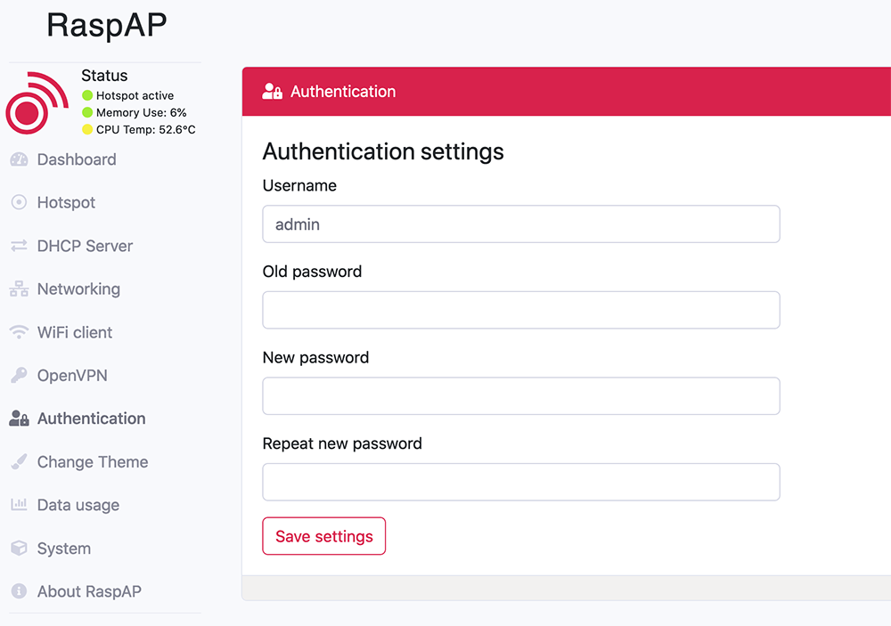

Et cliquez sur **Save Settings**

Deuxièmement, allez sous le menu hotspot et changez votre SSID. Je l’ai nommé « ecosensors »

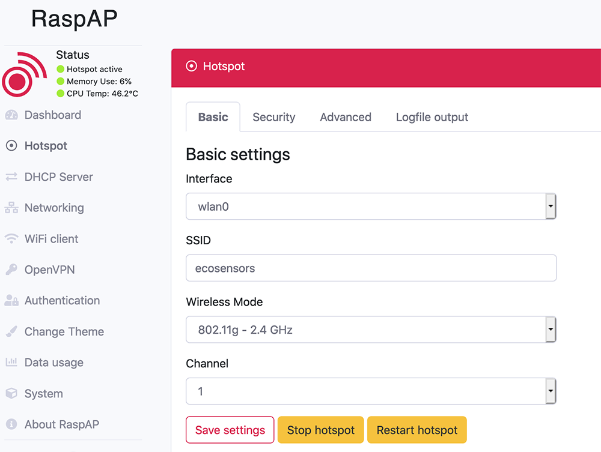

Vous pouvez aussi choisir le Mode du Wireless.

Passez sous l’onglet **Securtity** et changez le mot de passe (PSK)

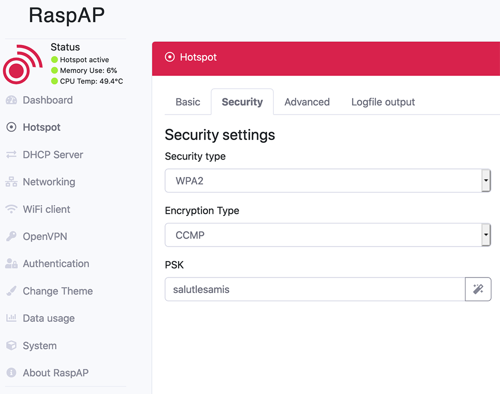

Vous trouverez aussi un QR code pour configurer vos smartphones (je ne l’ai pas testé)

Sous l’onglet **Advanced**, saisissez votre pays

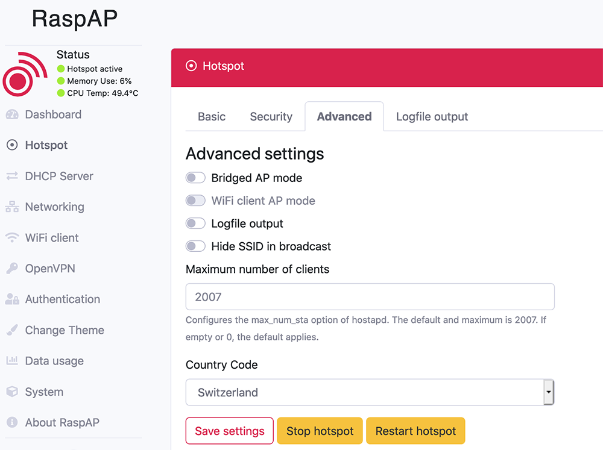

Cliquez sur `Save Settings`

Finalemement, rendez-vous sur le menu System et redémarrez votre routeur.

Pour plus d’informations, visitez le site [RaspAP](https://raspap.com/) | [Raspap-webgui](https://docs.raspap.com/)

> Après un peu moins de 20 heures d’activité, le routeur à consommer 0.05kWh.

### Référence

https://docs.sixfab.com/page/qmi-interface-internet-connection-setup-using-sixfab-shield-hat

## Problèmes possibles

**network at boot** : décocher **Attendre la connexion internet**

## Bravo!

Vous avez installé et configuré votre routeur!!
Il ne vous reste plus qu’à vous connecter à votre nouveau WiFi en utilisant le SSID que vous avez modifié, un peu plus haut, avec le nouveau mot de passe.

# Pour information

## Comment utiliser le port Ethernet (eth0)

Dans l’état actuel, si vous connectez un autre Rasperry aux prises ethernet, le premier ne fournira pas d’adresse IP au second. Pour que le second puisse se connecter à internet via le premier, il vous faut suivre ces étapes

Pour Info: https://newjerseystyle.github.io/en/2020/Raspberry-Pi-as-4G-LTE-Router/ (attention, cette procédure contient des erreurs, mais je la garde pour mémoire)

Editer

```
sudo nano /etc/dhcpcd.conf
```

et ajouter les lignes suivantes, en bas

```
interface eth0
static ip_address=10.3.142.1/24
static routers=10.3.142.1
static domain_name_server=1.1.1.1 8.8.8.8
```

Edier le fichier

```
sudo nano /etc/dnsmasq.conf
```

et ajouter les lignes suivantes

```
interface=eth0
listen-address=10.3.142.1
# Bind to the interface to make sure we aren't sending things elsewhere 
#### bind-interfaces #### BUT don't enable this.
server=8.8.8.8 # Forward DNS requests to Google DNS
domain-needed # Don't forward short names
# Never forward addresses in the non-routed address spaces.
bogus-priv
# Assign IP addresses between 10.3.142.2 and 10.3.142.5 with a
# 12 hour lease time
dhcp-range=10.3.142.2,10.3.142.5,12h
```

## Problèmes et mauvaises expériences

J’ai beaucoup galèré, pour arriver à faire un truc de simple, finalement. Je ne peux vraiment expliquer ce qu’il s’est passé, mais j’ai décidé de documenter ceci pour mémoire, à tout fin utile.

Premièrement, j’avais installé RaspAP avec la commande suivante

```
sudo curl -sL https://install.raspap.com | bash
```

sans avoir une epérience sur iptable.

Puis, [ce tuto](https://newjerseystyle.github.io/en/2020/Raspberry-Pi-as-4G-LTE-Router/) était sensé m’aider à configurer mon raspberry pour qu’un deuxième puisse se connecter aux ports eth0, afin d’établir une connexion à internet, via le premier. Cependant ce tuto contient des erreurs. Cette ligne est fausse

```
net.ipv4.ip_forwarding=1
```

L’écriture correcte est

```
net.ipv4.ip_forward=1
```

En plus, il n’est pas bien d’écrire les adresses IP static dans `/etc/network/interfaces`. Depuis Jessy, les adresses IP static se définissent dans `/etc/dhcpcd.conf`.

En suivante ce tuto (https://newjerseystyle.github.io/en/2020/Raspberry-Pi-as-4G-LTE-Router/), je ne suis jamais arrivé à mon but.

## Pour contrôler et activer ip_fowarder

pour contrôler si ip_fowarder est activé

```
cat /proc/sys/net/ipv4/ip_forward
```

doit retourner 1

pour l’activer et décommeter net.ipv4.ip_forward=1

```
sudo nano /etc/sysctl.conf
```

puis redémarrrer votre Pi

## Solution

Après avoir essayé de multiples solutions avec
* https://newjerseystyle.github.io/en/2020/Raspberry-Pi-as-4G-LTE-Router/
* https://docs.sixfab.com/page/share-wwan0-connection-to-lan
* https://www.raspberrypi.org/documentation/configuration/wireless/access-point-bridged.md
* https://www.raspberrypi.org/documentation/configuration/wireless/access-point-routed.md

j’ai repris tout de zéro en réinstallant RaspAP (voir aussi plus haut)

```
wget -q https://git.io/voEUQ -O /tmp/raspap && bash /tmp/raspap -y
```

Durant l’installation, j’ai constaté qu’il active déjà ip_forward

```
RaspAP Install: Configuring networking
Enabling IP forwarding
net.ipv4.ip_forward = 1
```

et en plus, il crée des iptable rule

```
Checking iptables rules
Adding rule: -t nat -A POSTROUTING -j MASQUERADE
Adding rule: -t nat -A POSTROUTING -s 192.168.50.0/24 ! -d 192.168.50.0/24 -j MASQUERADE
Persisting IP tables rules
```

A partir de là, j’ai décidé de ne plus suivre la suite du toto.

**En modifiant le fichier /etc/dhcpcd.conf et /etc/dnsmasq.conf, comme indiqué plus haut, tout fonctionne à merveille.**


