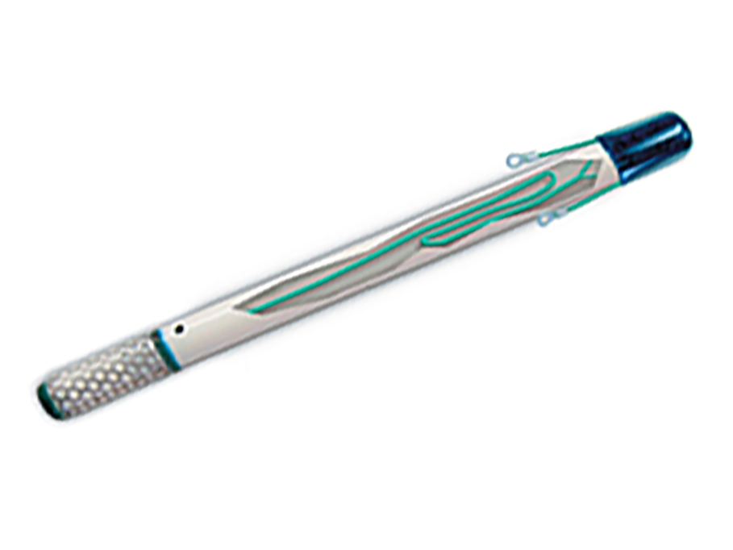
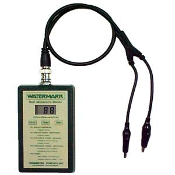

# La sonde tensiométrique Watermark

*Sondes tensiométriques Watermark*

La sonde tensiométrique Watermark ® sont des sondes tensiométriques qui permettent de calculer la teneur en eau du sol en kpa. **Autrement dit, la force de succion que la racine doit exercer pour extraire l’eau du sol.**

C’est un outil robuste et relativement peu onéreux, qui ne nécessite pas d’entretien particulier. Il est simple d’utilisation, les mesures sont précises. Sa construction est ingénieuse: un cylindre perforé en acier inoxydable qui supporte une membrane perméable. A l’intérieur, se trouve un agrégat de sable compact: la « matrice granulaire ». A une extrémité, il y a une plaquette de gypse et des électrodes connectées à deux fils qui émergent à la surface du sol. La plaquette de gypse sert de tampon contre les différences d’acidité et de salinité du sol, de sorte que la résistance électrique mesurée entre les électrodes dépend uniquement de l’humidité et de la température du sol.

## Sa construction

* Un cylindre perforé en acier inoxydable supporte une membrane perméable.
* A l’intérieur de laquelle se trouve un agrégat de sable compact, la « matrice granulaire ».
* A une extrémité il y a une plaquette de gypse et des électrodes connectées aux fils qui émergent à la surface du sol.

Le capteur est prolongé par un tube de PVC de 75cm d’où émerge deux fils électriques (connectés aux gypse via deux electrodes).

## Le fonctionnement de la sonde WATERMARK ®
Lorsque que le capteur est en contact avec le sol, la tension s’équilibre entre le sol et l’intérieur du capteur. La présence d’une plaquette de gypse sert de tampon contre les différences d’acidité et de salinité du sol, de sorte que la résistance électrique entre les électrodes dépend uniquement de l’état hydrique et de la température. En fait on mesure la résistivité életrique du milieu. Cette résistivité présente une relation quasi linéaire avec la teneur en eau à l’intérieur du capteur.

La sonde tensiométrique Watermark ® est un outil robuste et relativement peu onéreux, qui ne nécessite pas d’entretien particulier. Il est simple d’utilisation, les mesures sont précises.

## La lecture
Un circuit spécial est nécessaire pour mesurer la résistance électrique du capteur Watermark®.

Les courants continus ne doivent pas circuler dans la partie humide du capteur pour éviter la corrosion. L’excitation alternative évite ces problèmes, en inversant la polarité du courant plusieurs fois par seconde.

Le module électronique fournit l’excitation alternative. Le signal de sortie est une fréquence, qui dépend de la résistance électrique, à partir de laquelle la tension de l’humidité du sol peut être calculée.

il convient donc de mesurer la fréquence, la température, ainsi que la température compensée. Puis, avec l’équation de Shock, on peut connaitre le SWP (Soil Water Potenmtial) en kPa. Le constructeur de la sonde fournit un tableau de valeurs qui nous permet également de connaitre le SWP.

> 0-10 kPa (ou cbars): Soil saturé; 10-30 kPa: Le sol est suffisamment humide (sauf pour sables grossiers qui commencent à perdre de l’eau); 30-60 kPa: Gamme habituelle d’irrigation (sauf les sols argileux lourds); 60-100 kPa: Gamme habituelle pour l’irrigation dans les sols argileux lourds; 100-200 kpa: Le sol devient dangereusement sec.

La Tensiométrie est la mesure de tension de l’eau dans le sol, autrement dit, la force de succion que la racine doit exercer pour extraire l’eau du sol. L’unité de mesure de succion est: cbar (ou kPA). La mesure est universelle, car il s’agit de la difficulté à extraire l’eau. Elle est opérationnelle sur toute situation de sol, de culture, de mode d’irrigation, sans besoin de calibration. La force de liaison entre l’eau avec le sol (exprimé en tension), sur une gamme 0-200 cb, est l’indicateur le plus pertinent en sols irrigués

## Installation
La sonde doit être trempée dans un récipient d’eau, au moins 30mn avant de l’insérer dans le sol. (Une étude préconise même de la laisser tremper dans un récipient d’eau, de la laisser sécher, en répétant ce cycle trois fois). Une fois le trou fait, on fait tomber au fond du trou, un peu de boue. On en enduit aussi la partie sensible du capteur que l’on enfonce ensuite au moins jusqu’au repaire de profondeur. On réalise cette boue à partir de la terre du sol, finement tamisée en prenant soin qu’elle ne soit pas trop liquide. On s’assure au mieux, que des cailloux ne produisent pas un espace d’air au niveau du capteur.

## Watermark Digital Reader

J’ai acquis un lecteur Watermark Digital Reader pour comparer les mesures calculées avec la version 2 de mon circuit imprimé. Après avoir calibré le Watermark Digital Reader avec la température du sol, les mesures prises avec cet appareil sont identiques (à 3-5Kpa près) avec celles des mes stations

*Watermark Reader*
