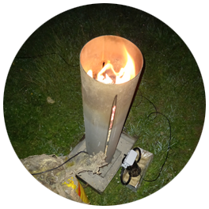
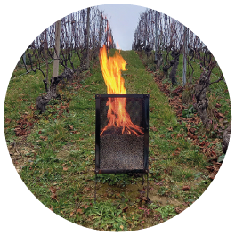

# La bougie à pellets pour réchauffer les bourgeons lors du gel de printemps

> 14kg de pellets coûte Sfr 5.-- pour 6 à 7 heures de chauffe 

L’objectif est de proposer une bougie à pellets pour la période de gel de printemps 2022. Les prototypes existants ont fait leurs preuves: avec un sac de pellets de 15kg à Sfr 5.--, la bougie, démontable pour optimiser le stockage hors-saison, à chauffer une zone pendant plus de 7h. 

[Presentation sur Youtube](https://www.youtube.com/watch?v=Tmb-zg431_U&t=29s)

## Environ 70% des récoltes ont été touchées
Entre les nuits du 7avril et 9 avril 2021, une masse d’air froid polaire accompagné de vent a causé de gros dégâts dans l’arc lémanique. Après trois nuits glaciales allant jusqu’à -8°C dans certains endroits, les pertes s’annonçaient énormes. Environ 70% des récoltes ont été touchées, allant jusqu’à 5 millions de francs de dégât dû au gel.

En Valais, le gel du printemps 2021 a causé des dégâts extrêmement importants sur les cultures d’abricotiers, particulièrement sur le coteau. En France, le gel a été fatal au bourgogne: la moitié de la récolte 2021 est perdue.

## Réchauffement climatique
La probabilité d’un épisode de gel tardif a été nettement renforcée par le changement climatique et a augmenté de 60% la probabilité qu’un événement survienne en période de bourgeonnement. Le réchauffement augmente dans des proportions encore plus grandes les phénomènes de chaleur précoce. Il favorise le «débourrement» de la végétation, qui sort plus tôt de sa dormance hivernale et bourgeonne. Et ce processus «arrive de plus en plus tôt»

## Méthodes de lutte
**L’aspersion** va créer une poche de glace autour du bourgeon, sans que l’eau qu’ils contiennent ne gèle.

**Les éoliennes et l’hélicoptère** vont brasser l’air pour que l’air un peu plus chaud vienne « réchauffer » les ceps de vigne.

**La bougie en paraffine**. Les producteurs hésitent toutefois avant d’installer des bougies en paraffine (à usage unique), car le coût est important: chaque bougie coûte environ 15 francs. Sur un hectare, la facture peut s’élever jusqu'à 3600 francs. Il faut dès lors effectuer une balance entre le coût de la production et le coût de la lutte contre le gel.

Enfin, il y a **ma bougie à pellets** qui nous vous présentons ici.

# Présentation de deux prototypes
L'objectif est de créer un modèle réutilisable pour moins de Sfr 150.--, d'une autonomie de chauffe de plus de 7 heures avec un sac de pellet de 15kg

# Version 1

Cette version a été testée durant la nuit du 2 au 3 mai 2021. Elle a réchauffé la zone pendant 9 heures avec le 3/4 d'un sac de pellet de 15kg 

# Version 2

Ce prototype a été testé entre le 25 février et le 4 avril 2022. Les dernières mesures indiquent un fonctionnement pendant 8 heures avec un sac de 15kg. 