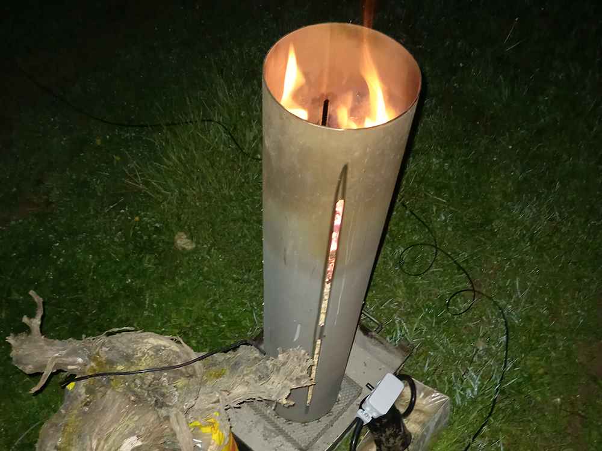
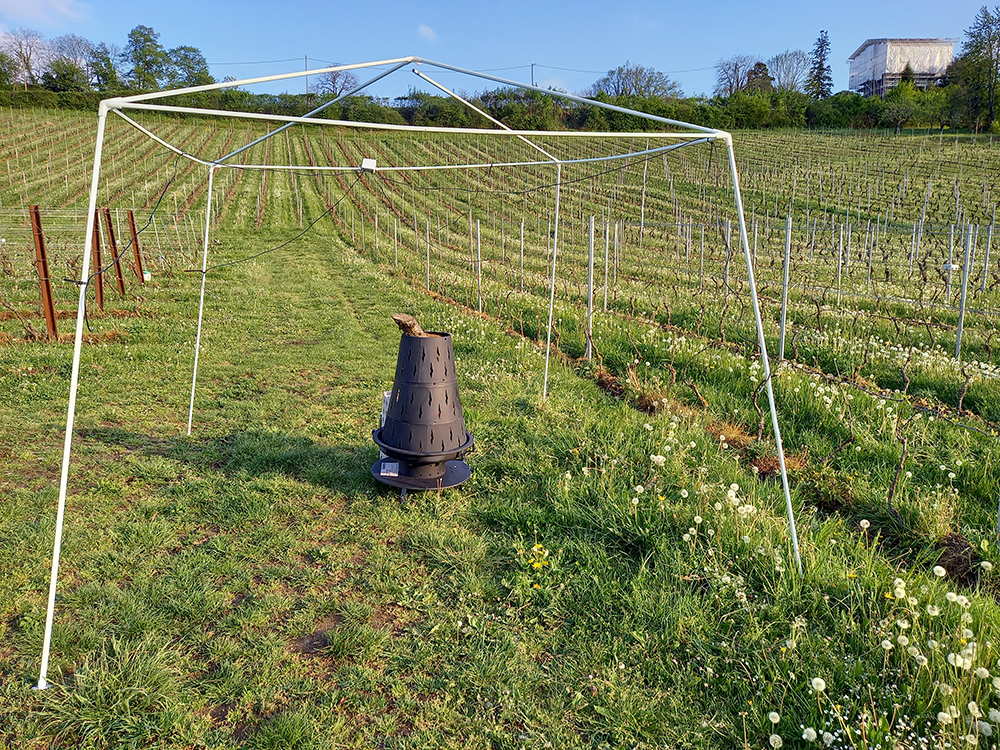
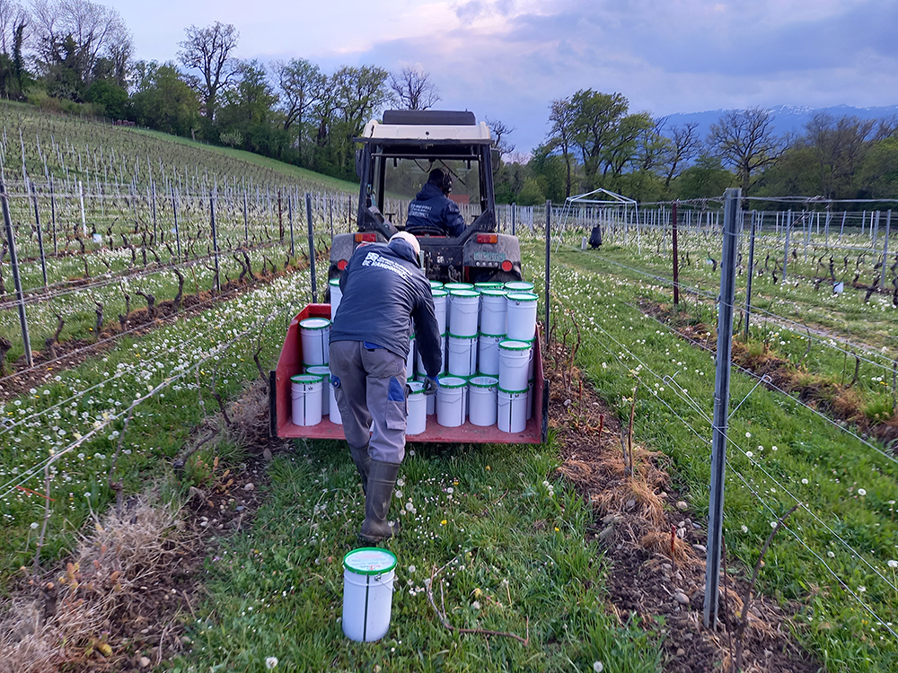
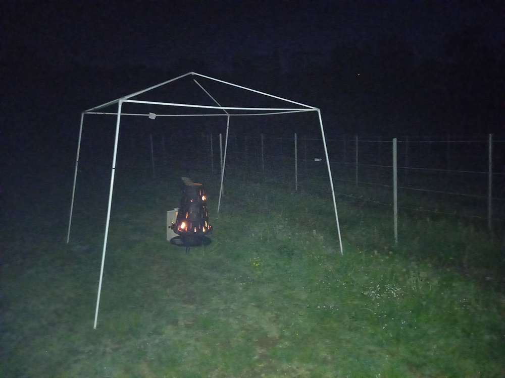
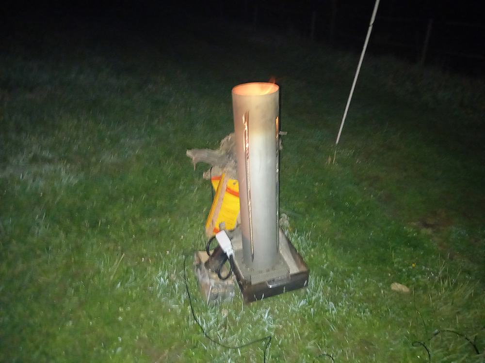
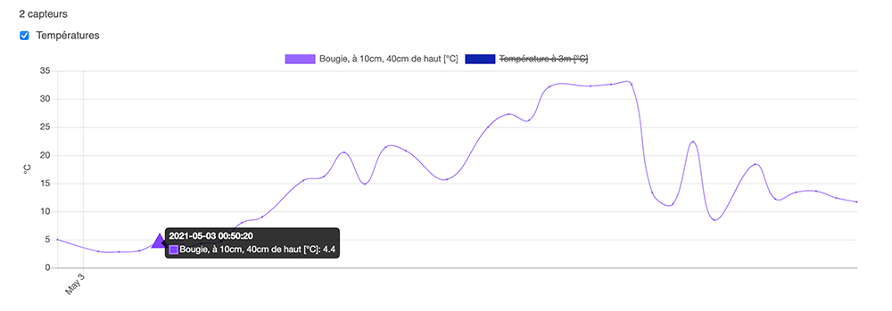
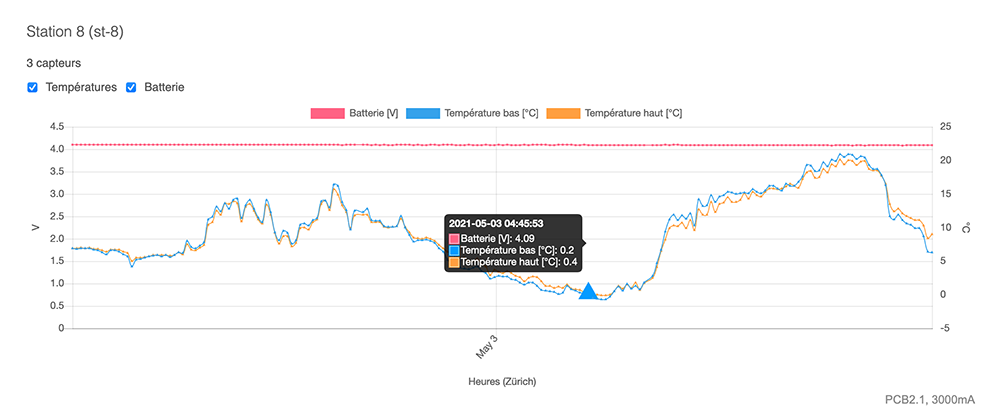
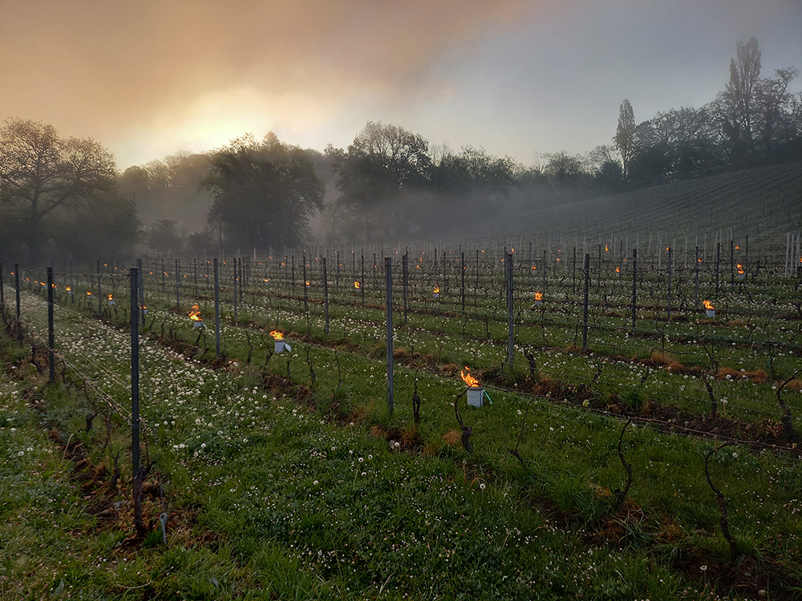
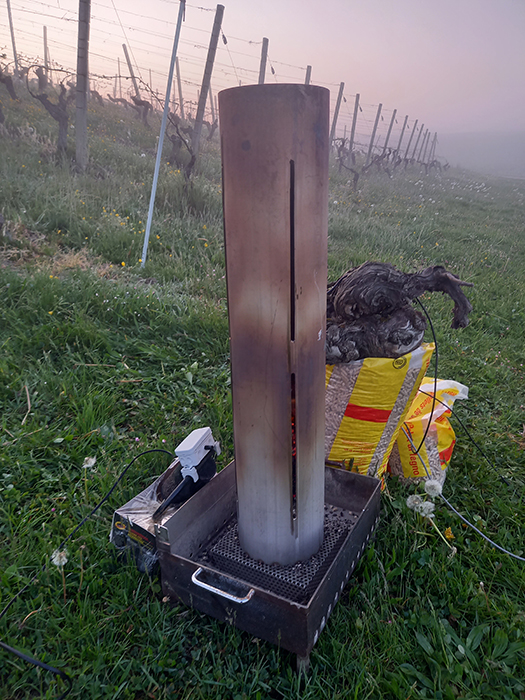
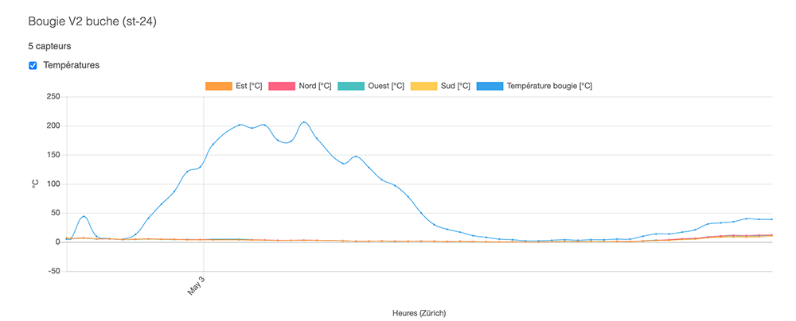

# La bougie à pellets – Version 1

Ca y est, je me lance. Après les dégâts du gel du mois d’avril 2021, je veux créer un prototype de bougie à pellet connectée.

Ce prototype (version 1) a été testé dans la nuit du 2 et 3 mai 2021, dont voici l’expérience,

Entre les nuits du 7avril et 9 avril 2021, une masse d’air froid polaire accompagné de vent a causé de gros dégâts dans l’arc lémanique. Après trois nuits glaciales allant jusqu’à -8°C dans certains endroits, les pertes s’annoncent énormes. Certaines parcelles approchent 100% de dégâts, principalement dans le canton du Valais où le débourrage et la fleuraison était avancée.

En décembre 2020, j’ai mis en place un système de surveillance en temps réel, SMART BUD, et 14 stations ont été déployés dans deux vignes différentes, grâce à une campagne de financement participatif remportée avec succès. En plus de cela, une application pour Android et IOS a été créée pour permettre aux exploitants de suivre l’état des températures et d’être alarmée directement sur leur smartphone.

Suite aux dégât du mois d’avril 2021, j’ai décidé donc de travailler sur un prototype de bougie à pellet connecté, qui complétera l’application SMART BUD.

**Fonctionnera-t-elle plus de 8h?**

## L’objectif?
L’objectif est de concevoir une bougie à pellet la moins onéreuse et facile à stocker, pour remplacer ou pour être utilisée avec les bougies au paraffine.

## Les prototypes

Je voulais comparer deux prototypes.

Une bougie remplie de pellet. Cette bougie a été installée volontairement à proximité de la station 13, soit à env. 3m, qui mesure à temps réel, la température des bourgeons (30cm et 1m du sol).

Une bougie plus grosse, remplie de bûches.

## Les sondes

Sur chaque structure de la pergola, j’ai installé 4 sondes de température, à plus ou moins 1m du sol et à env. 1.5m de la bougie. Une dirigée au Nord, à l’est, au sud et à l’ouest.

Sur les deux bougies, il y a encore une sonde infrarouge dirigée sur la bougie pour observer la température de la bougie. Les deux se trouvent en bas des bougies.

Sur la bougie remplie de pellets, j’ai encore installé une sonde à la mi-hauteur de la bougie, soit à10-20cm de cette dernière. Le but est d’observer quand la bougie aura consommé la moitié du pellet.

# Une nuit, un combat

Durant la nuit du 2 au 3 mai 2021, les exploitants, qui participent au projet SMART BUD, étaient inquiets suite aux alarmes gel annoncées par Méto Suisse. Initialement, le premier essai de la bougie à pellet connectée devait de se faire à Marchissy (VD), le 3 mai 2021. Mais après avoir discuté avec l’un d’eux, on a finalement fait le test directement dans les deux vignes. L’avantage est que toute l’infrastructure LoRaWAN était déjà en place, alors qu’à Marchissy (VD), j’aurais du tout installer.

Après quelques heures de réflexions et d’hésitations, l’un des exploitant à finalement fait le choix de positionner les bougies au paraffine à 19h, alors que le second a choisi, en cas de besoin, d’allumer des feux à proximité de la parcelle

*Installation des bougies au paraffine*

A 22h, j’ai allumé la bougie remplie de bûches

Puis j’ai été rejoint par un exploitant, à 23h pour allumer la bougie aux pellets ainsi que deux bougies en paraffine.

*Bougie aux pellets à 23h15*

Installé confortablement dans mon camping car à proximité de cette vigne, j’ai pu suivre cette dernière, une partie de la nuit.

A 0h45, la bougie était toujours allumée, Je craignais qu’elle s’éteigne par manque d’oxygène, malgré les ouvertures.

*Après 1h30*

*Bougie à pellet après 1h30*

Mais j’ai constaté que les sondes installées sur la structure, ne mesuraient pas la température dégagée par la bougie. Ces dernières, indiquaient la même température que la station 13, qui, pour rappel, se trouve à env. 3m de la bougie.

*4.4°C à 0h50*

Mais c’est à 1h30 que la sonde installée à la mi-hauteur de la bougie a commencé à mesurer une température.

*Après 2h30*

## Les alarmes

A 5h du matin, les alarmes générées par les stations installées dans ces vignes, ont fait sonner nos smartphones.

*Station 8 – Nuit du 2-3 mai 2021 à 4h45*

Un exploitant de la parcelle de 1 hectare, déjà sur déplace, décide finalement d’allumer les bougies au paraffine alors que l’exploitant de la parcelle de 4 hectares (là ou se situe la bougie à pellet) allume les feux pour faire de la fumée.

*Bougies en paraffine à 6h30*

*Allumage d'un feu pour faire de la fuméée*

[Vidéo du feu]

Je profite pour faire un saut afin de vérifier la bougie à pellet et belle surprise, elle est toujours allumée à 6h30

*Etat de la bougie à pellets après 7h15*

Il est encore intéressant de constater, que la sonde infrarouge, qui mesure la température au bas de la bougie à pellet, a commencé de mesurer 44°C à 4h46, puis 262°C à 7h03 et 44°C à 8h26

*Mesures de la sonde infrarouge, au bas de la bougie*

## Conclusion
La bougie remplie de bûches n’a pas été satisfaisante. Même si finalement, à 22h45, la sonde infrarouge a commencé à mesurer de la chaleur, à 2h36 la température de la bougie a commencé à descendre pour afficher 4°C à 4h20, elle a chauffé la zone env. 5h. Mais le gros problème était d’allumer les bûches rapidement. Alors que dans un cas de gel, l’exploitant doit pouvoir allumer rapidement la bougie sans devoir rester à observer si les bûches ont commencé à brûler.

*Mesures de la bougie remplie des bûches*

En revanche, la bougie aux pellets a vraiment bien fonctionner. Avec un allume-feu, un petit chalumeau et le feu à immédiatement pris. J’espérais d’une part, qu’elle ne atteindre pas avant que tout le pellet soit brûlé, mais je ne pensais pas qu’elle resterait allumée plus de 8h, car à 8h15, les derniers pellets se consumaient et la bougie générait toujours de la chaleur.

**Pour réchauffer la zone durant 9h, j’ai acheté un sac de pellet de 15kg à Sfr 5.–, mais je n’ai utilisé que le 3/4 du sac.**

*Etat de la bougie à pellets après 9h*

Après cet exercice, je vais donc travailler sur ce concept de bougie à pellet connectée, qui s’intégra à SMART BUD. L’objectif sera donc de faire une bougie un peu plus évoluée, de manière à ce qu’elle ne représente pas un problème de stockage, peu onéreuse, et surtout, que les exploitants puissent suivre la température de la bougie, en temps réel.

Je vais donc refaire des tests en positionnant environ 14 sondes de température, à proximité de la bougie à pellet (sans la structure de pergola) pour observer la chaleur dégagée par la bougie, en variant les ouvertures permettant de maintenir le feu allumé. Je vais aussi repenser la bougie (forme, épaisseur, matériel) pour qu’elle propage bien la chaleur.

