# La bougie à pellets – Version 2

Depuis le 9 octobre 2021, je teste un prototype de bougies à pellets pour lutter contre le gel de printemps.

Sur cette pages, vous allez voir

* La présentation d’une workshop avec 15 bougies à pellets
* Sa situation géographique (voir)
* La préparation du terrain (voir)
* Le déroulement du workshop (voir)
* Les différentes positions des bougies à pellets (voir)
* Les résultats des allumages (voir)
* Les conclusions (à terminer) (voir)
* La suite (voir)
* Les remerciements (voir)
* Des photos (voir)
* Un précédent workshop avec 1 à 3 bougies à pellets (voir)

## Workshop avec 15 bougies à pellets et LoRaWAN pour lutter contre le gel de printemps

### Introduction

[Introduction sur Youtube](https://www.youtube.com/watch?v=Tmb-zg431_U&t=12s)

La bougie en paraffine est souvent utilisée pour lutter contre le gel de printemps. Néanmoins, elle n’est pas réutilisable. Sachant qu’une bougie en paraffine coûte environ Sfr 14.– et qu’il en faut entre 200 et 240 par hectare, j’ai pensé approfondir mes premiers essais avec un plus grand nombre de bougies à pellets. L’avantage d’une bougie à pellets est qu’elle est réutilisable avec une recharge de 14kg pour Sfr 5.–

Le 25 novembre 2021, j’ai lancé une campagne de financement participatif, pour financer un workshop pour tester 10 bougies à pellets dans une vigne. Le 25 décembre 2021, l’objectif financé est atteint, ce qui m’a permis de financer un poste à souder MAG, une table à souder et l’acier pour réaliser 10 bougies à pellets. Après une petite formation de soudage, je me lance et le 31 janvier 2022 les bougies à pellets sont assemblées.

*Fig. 1 Formation assemblage de ma première bougie à pellets*

*Fig. 2 Assemblage des bougies à pellets*

*Fig. 3 Assemblage des bougies à pellets*

Avec les différents prototypes que j’avais déjà réalisé, c’est avec 15 bougies à pellets que ce workshop va se dérouler.

Pour surveiller le dégagement de la chaleur des bougies en temps réel, j’utilise mes 10 stations LoRaWAN que j’utilise déjà pour surveiller les températures des bourgeons, dans le cadre du projet Smart Bud.

### Situation géographique

L’exercice va se produire dans la bas d’une vigne de M. Patrick Duvernay, à la Plaine (GE), avec la participation d’Ellinor Sekund d’AgriGenève. Cette parcelle a la particularité de se trouver dans un creux, là où la masse d’air froid s’accumule et n’est pas brassée. Par conséquent, les bourgeons sont exposés dans une zone à risque, lors du gel de printemps.

*Fig. 4*

Cette vigne n’a pas les rangées régulières car une rangée a été enlevée. Chaque paire de rangée est distancée de 2.2m

*Fig. 5*

### Préparation du terrain

*Fig. 6 Préparation du workshop*

*Fig.7. Stations LoRaWAN avec 2 sondes de température*

### Déroulement du workshop

L’objectif est d’observer la chaleur dégagée par toutes ces bougies à pellets. Pour cela, j’utilise mes propres stations LoRaWAN, équipées de sondes de température, que j’utilise dans le projet SMART BUD.

**Les stations effectuent une mesure toutes les 15 minutes.** Les mesures sont envoyées vers une passerelle LoRaWAN, complètement autonome en énergie grâce à des panneaux solaires. Cette dernière, équipée d’une carte GSM, transmet les mesures vers un serveur distant, où les mesures sont sauvegardées dans une base de donnée. De là, une application Web, IOS et Android peuvent extraire les données et les afficher sur forme de graphiques. Pour ce workshop, la passerelle se situe en haut de la vigne.

*Fig. 8 Gateway LoRaWAN autonome installée sur une remorque solaire*

Une de mes station météo se trouve en dehors de la zone de chauffe, afin d’avoir *une température de référence.*

*Fig. 9 Station météo LoRaWAN avec un pyranomètre, un anémomètre et un baromètre*

Nous avons effectué 6 allumages de nuit: le 25 et 28 février 2022, le 7, 11, 23 mars 2022 et le 3 avril 2022.

Depuis le 11 mars, nous avons commencé à modifier la configuration des bougies.

Le 11 mars, nous avons rabaissé les sondes et les bougies sur le premier fils porteur, au niveau des rameaux et des bougeons. Nous avons ajouté un chapeau aux bougies.

Le 23 mars 2022, nous avons augmenté l’espace entre les bougies (4m) et **nous avons remplacé une bougie à pellets par une bougie en paraffine** pour comparer le comportement de ces deux bougies (voir Fig. 11 et Fig. 5).

Finalement, pour l’allumage du 4 d’avril 2022, nous avons gardé le même espace entre les bougies à pellets, sur les rangées (colonne), mais nous avons rapproché les bougies sur l’axe horizontal et nous avons décalé les bougies centrales de 2m sur le haut (voir Fig.12, ci-dessous ), de manière à ce qu’elles ne soient plus alignées, mais intercalées

### Positions des bougies

#### Position des bougies à pellets et des sondes jusqu’au 23 mars 2022

*Fig. 10 Position des bougies à pellets et des sondes, jusqu’au 23 mars 2022*

Les bougies sont distancées de 2m afin de former a quadrillage. (Voir fig. 6)

#### Position des bougies à pellets et des sondes durant la nuit du 23-24 mars 2022

*Fig. 11 Position des bougies à pellets et des sondes durant la nuit du 23-24 mars 2022*

#### Position des bougies à pellets et des sondes pour le 3 avril 2022

*Fig. 12 Position des bougies à pellets intercalées*

Note: La station A12 n’a malheureusement jamais fonctionné plus de 3h et je n’avais malheureusement plus de station pour la remplacer. J’ai donc décidé de l’utiliser comme-même, malgré le fait qu’elle n’a pas retourné des mesures pendant les périodes intéressantes.

### Mesures
#### Mesures du 25-26 février 2022
Le premier allumage a été effectué le 25 février à 22h. Malheureusement, la baromètre de la station est tombé en panne, ce qui nous n’a pas permis d’avoir une température de référence précise. Malgré ceci, la station d’agrométéo, positionnée à 20m, indiquait une température de **-2.5°C**, pendant toute la nuit. Toutes les sondes mesuraient également une température de -2°C, avant l’allumage des bougies à pellets.

Les sondes sont placées sur la deuxième fils porteur.

##### Résultats

**Visualiser toutes les mesures** du 25-26 février 2022, [ICI](https://bud.eco-sensors.ch/charts.php?field=3&date-from=2022-02-25&date-to=2022-02-26)!

Pour rappel
* les stations Axx se trouvent à l’extérieur gauche.
* Les stations Dxx se trouvent à l’extérieur droit. Les stations Bxx et Dxx se trouvent à l’intérieur.
* La station B34 se trouve le plus au centre.
* Les stations A12, B12, C12 et D12 se trouvent à l’extérieur bas.
* Les stations A56 et C56 se trouvent à l’extérieur haut (voir Fig. 10)

Les bougies à pellets ont été allumées à 22h30 et elles ont brûlé jusqu’à env. 6h30. On a pu constater une augmentation de +4° (+1.3°C) sur la station A34 avec un pic à 5°C alors qu’il faisait -2°C.

*Fig. 13 A34 25-2-2022*

Pour la station B34 (centre du quadrillage), la sonde B3 installée au-dessus des bourgeons, a affiché un pic de 6.6°C à 3h16 et un autre de 8°C à 5.53. Si non, elle a affiché, en moyenne, une température de 2.5°C, soit +4.5°C par rapport à la température de référence.

*Fig.14 B34 25-2-2022*

Pour les sondes BC2-3 et BC4-4 qui se trouvent entre les rangées B et C, elles ont affiché des températures entre 0°C et 1.1°C de 1h à 5h, puis les températures ont augmenté jusqu’à 4°C pour redescendre à 0°C, à 7h.

Pour la station D12 (extérieur bas/droit), on peut constater qu’il y eu des montées de température à 3°C, mais dès 3h35 et jusqu’à 5h15, la température était en dessous de 0°C.

Ceci peut s’expliquer par le fait que le côté droit de la bougie est exposée au froid, contrairement aux bougies positionnées au centre du quadrillage.

Si vous souhaitiez visualiser et analyser par vous même les températures, les mesures sont accessible, [ICI](https://bud.eco-sensors.ch/charts.php?field=3&date-from=2022-02-25&date-to=2022-02-26).

*Fig. 15 D12 25-2-2022*

Télécharger toutes les mesures en format A3 (pdf) [Page 1](Assets/pdf/bougies-graphique-25-2-2022_1.pdf) | [Page 2](Assets/pdf/bougies-graphique-25-2-2022_2.pdf)

#### Mesures du 28 février-1 mars 2022
Avant de remplacer le baromètre de la station météo, j’ai profité d’imprimer (3D) un nouveau boîtier pour le circuit imprimé et surtout des coupoles pour mieux protéger le baromètre (voir fig. 9).

Cette fois-ci, les bougies à pellets ont été allumées à 1h30 et nous avons utilisé un autre pellet qui s’est avéré de moins bonne qualité. De ce fait, Les bougies à pellets ont fourni de la chaleur pendant un peu plus de 4h.

##### Résultats

Visualiser toutes les mesures du 28 février au 1er mars 2022, [ICI](https://bud.eco-sensors.ch/charts.php?field=3&date-from=2022-02-28&date-to=2022-03-01)!

Pour rappel
* les stations Axx se trouvent à l’extérieur gauche.
* Les stations Dxx se trouvent à l’extérieur droit. Les stations Bxx et Dxx se trouvent à l’intérieur.
* La station B34 se trouve le plus au centre.
* Les stations A12, B12, C12 et D12 se trouvent à l’extérieur bas.
* Les stations A56 et C56 se trouvent à l’extérieur haut (voir Fig. 10).

**Température de référence** (station météo ST42): -3°C/-4°C

On voit que certaines stations mesurent déjà une température de -4°C à 6h ce qui s’explique par la mauvaise qualité des pellets utilisés cette fois-ci. L’un d’entre nous était bien sur le terrain vers 7h, pour constater que les bougies à pellets étaient bien éteintes.

Même si les températures des stations **extérieures** (voir Fig. 10) sont généralement restées en dessous de 0°C, on observe comme-même que la zone extérieure gauche chauffée par les bougies à pellets, a augmenté de -4°C à (en moyenne) -1°C., à l’exception de la sonde B5, qui se trouve elle, dans le coin haut/gauche, soit la zone la plus exposée au froid.

*Fig. 16 Mesures des sondes attachées aux stations A34 et A56*

Des mesures similaires sont aussi observées aux stations B12 et C12.

En revanche, les stations au centre du quadrillage affichent des mesures plus intéressantes, ce qui peut s’expliquer par le fait qu’elles sont entourées d’autres bougies, même si les sondes BC2-3 affichent des mesures proches de la température de référence (-3°C/-4°C). Les sondes BC2-3 et BC3-4 se trouvent entre les rangées B et C.

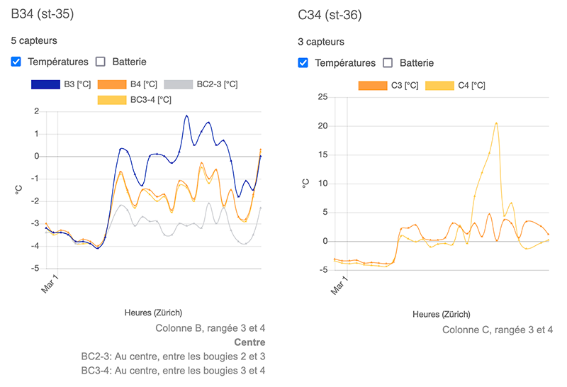

*Fig. 17 Températures des sondes attachées aux stations B34 et C34*

Si vous souhaitiez visualiser et analyser par vous même les températures, les mesures sont accessible, [ICI](https://bud.eco-sensors.ch/charts.php?field=3&date-from=2022-02-28&date-to=2022-03-01)!

#### Mesures du 7-8 mars 2022

Pour cette exercice, nous avons surélevé les bougies de 50cm, mais ceci s’est avéré inutile. En revanche, nous avons eu une nuit particulièrement froide: -6°C de 5h à 8h.

Les bougies à pellets ont été allumées à 2h et elles ont réchauffé les zones jusqu’à 8h. Selon la station météo, l’air ambiante est rapidement monté jusqu’à 1°C à 9h10 puis 5°C à 9h55

*Fig. 18 Station météo*

##### Résultats

**Visualiser toutes les mesures** du 7-8 mars 2022, [ICI](https://bud.eco-sensors.ch/charts.php?field=3&date-from=2022-03-07&date-to=2022-03-08)!

**Température de référence** (station météo ST42): -5°C/-6°C

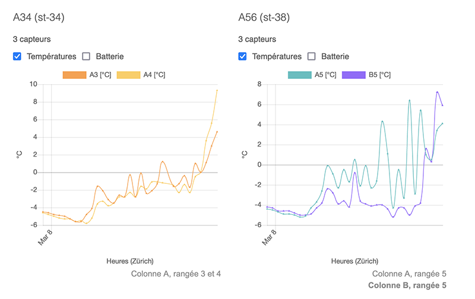

*Fig. 19 Stations sur la rangée A (rangée extérieure gauche)*

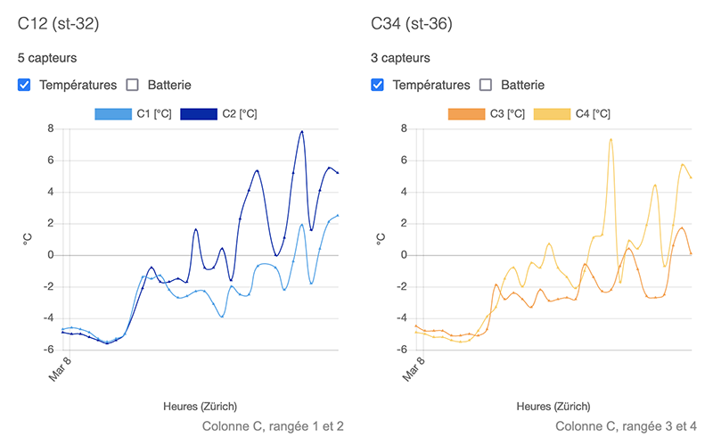

*Fig. 20 Stations sur l’une des rangée centrale*

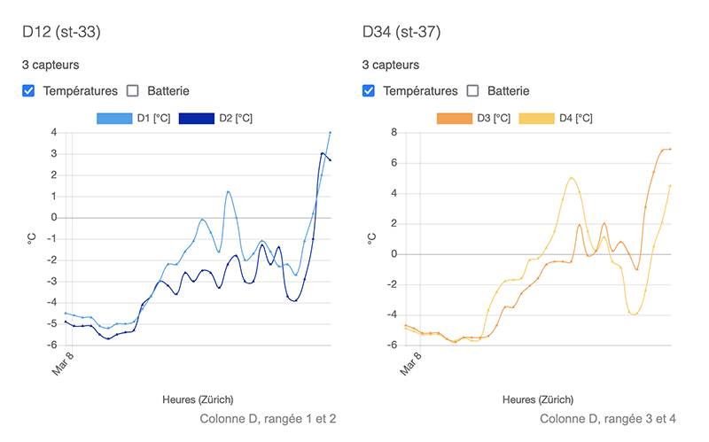

*Fig. 21 Stations sur la rangée extérieure droite*

Si vous souhaitiez visualiser et analyser par vous même les températures, les mesures sont accessible, [ICI](https://bud.eco-sensors.ch/charts.php?field=3&date-from=2022-03-07&date-to=2022-03-08).

Télécharger toutes les mesures en format A3 (pdf) [Page 1](Assets/pdf/graphique-7-3-2022_1.pdf) | [Page 2](Assets/pdf/graphique-7-3-2022_2.pdf)

#### Mesures du 11-12 mars 2022
Pour cette nuit, nous avons apporté des modifications.

* Le palissage ayant été effectué, nous avons descendu toutes les sondes pour les fixer sur le premier fils porteur, au niveau du sol, à proximité des bourgeons.
* Nous avons rabaissé les bougies à pellets pour que le 3/4 de sa hauteur, se trouve au niveau des rameaux.
* On a ajouté des chapeaux aux bougies à pellets

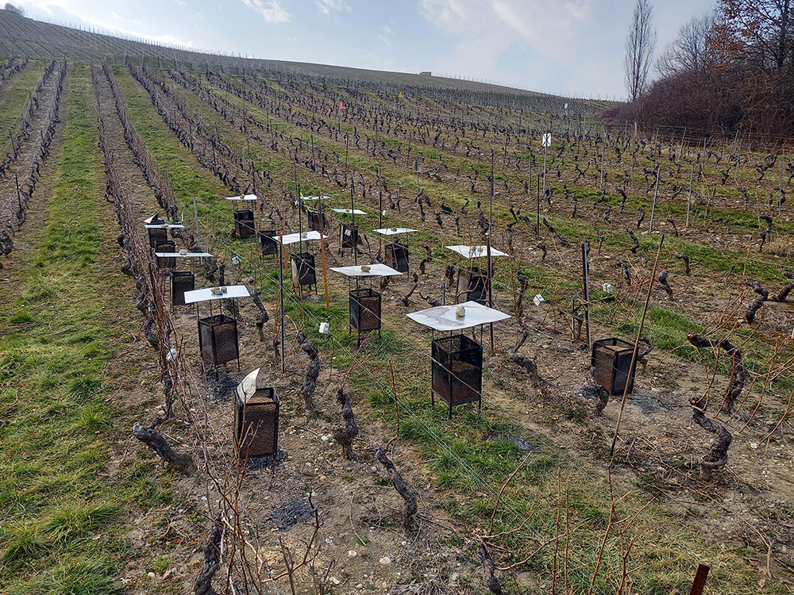

*Fig. 22*

##### Résultats

**Visualiser toutes les mesures** du 11-12 mars, [ICI](https://bud.eco-sensors.ch/charts.php?field=3&date-from=2022-03-11&date-to=2022-03-12)!

**Température de référence** (station météo ST42): 5°C

#### Mesures du 23-24 mars 2022
Cette fois-ci, nous avons distancé les bougies de 4m (voir Fig.11) et nous avons déplacé les stations et les sondes. Les sondes sont toujours fixées sur le premier fils porteur, à proximité des rameaux et bourgeons. Les bougies à pellets ont toujours leurs chapeaux et sont toujours à la hauteur des bourgeons, comme pour l’allumage du 11 mars 2022.

**Nous avons aussi remplacé une bougie à pellets par une bougie en paraffine** afin de comparer le dégagement de chaleur de ces deux bougies,  La bougie à pellets est « encadrée » par les sondes B1 et B2 de la station B12. La bougie en paraffine est « encadrée » par la sonde C5 de la station C56 et la sonde A1 de la station A12.

Les stations ne sont plus positionnées par rapport à leur colonne (A34 pour colonne A, B12 pour colonne B)

##### Résultats
**Visualiser toutes les mesures** du 23-24 février 2022, [ICI](https://bud.eco-sensors.ch/charts.php?field=3&date-from=2022-03-23&date-to=2022-03-24)!

**Température de référence** (station météo ST42): -1°C/-2°C

Les bougies à pellets et la bougie en paraffine ont été allumées à 2h du matin. A 7h du matin, un de nous est passé pour constater qu’elles étaient toujours allumée mais sans flammes, tout comme la bougie en paraffine.

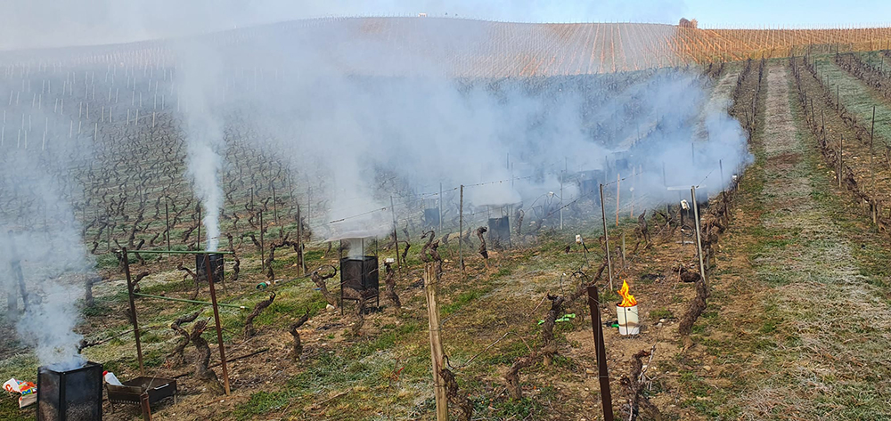

*Fig. 23 Etat des bougies à pellets à 7h du matin*

Un des premier constat, la bougie en paraffine dégage un peu plus de chaleur que la bougie à pellets mais elle ne produit pas de fumée. Plus tard, nous avons constaté que des bourgeons avaient été légèrement brûlés par la bougie en paraffine.

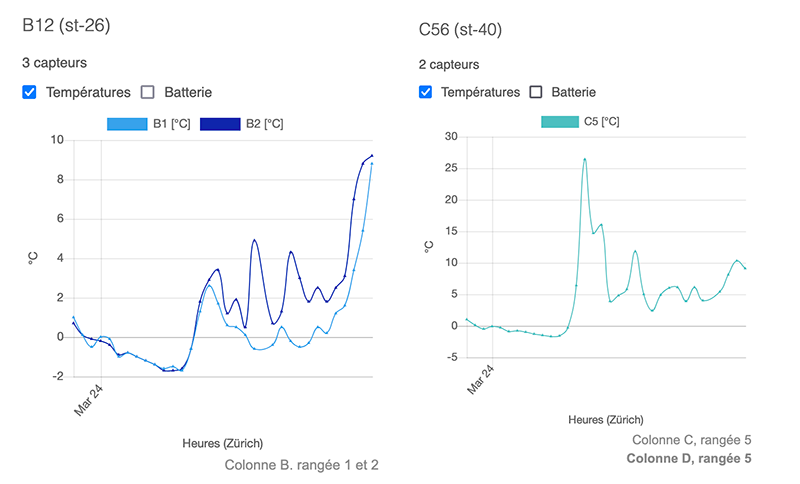

*Fig. 24 B12 mesure la bougie à pellets, C56 mesure la bougie en paraffine. Sur la B12, on voit une augmentation de température à 8°C à 8h43. C’est augmentation n’est pas causé par la bougie à pellet, mais par la température de l’air, suite à la levé du soleil (début de journée)*

#### Mesures du 3 avril 2022

La vigne, où nous effectuons ces exercices, (voir Fig. 5) a une rangé qui a été enlevée. C’est la raison pour laquelle, les rangées sont espacées de 1.1m et 2.2m.

Lors du précédent allumage, nous avons constaté que la chaleur ne se dissipait pas assez (voir Fig. 5) pour réchauffer la rangée manquante. Nous avons voulu considérer cette rangée manquante, comme si nous effectuons cet exercice dans une autre vigne. Dans ce scénario, nous avons repositionné et rapproché les bougies dans l’axe horizontal, de manière à ce qu’il y ait des bougies, **une rangée sur trois** (voir Fig. 12). En revanche, nous avons conservé la distance de 4m entre les bougies, dans l’axe vertical. Aussi, comme vous pouvez le constater sur la schéma (Fig. 12), **nous avons décalé de 2m vers le haut, les bougies de la rangée du milieu**, de manière à ce qu’elles ne soient plus dans le même axe horizontal que les bougies se trouvant dans les rangées 1 et 3.

*Fig. 12 Position des bougies à pellets intercalées*

**Note**: La station A12 n’a malheureusement jamais fonctionné plus de 3h et je n’avais malheureusement plus de station pour la remplacer. J’ai donc décidé de l’utiliser comme-même, malgré le fait qu’elle n’a pas retourné des mesures pendant les périodes intéressantes.

##### Résultats
**Visualiser toutes les mesures** du 3 avril 2022, [ICI](https://bud.eco-sensors.ch/charts.php?field=3&date-from=2022-04-03&date-to=2022-04-04)!

**Température de référence** (station météo ST42): 1°C

Notez que dans les courbes, ci-dessous, on observe que la fin des courbes montent jusqu’à 10°C. Ceci est causé par le début de la journée.

Extrémités (A34 et D12)

")

*Centre (B12 B34 et C12)*

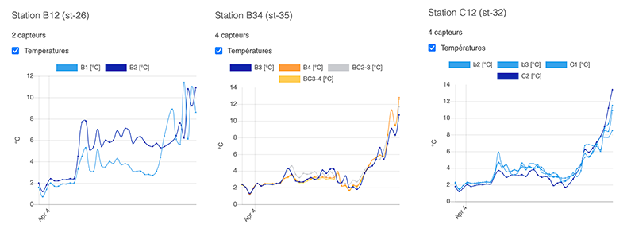

*Mesures au cente*

### Conclusion

Lors du premier allumage, les bougies à pellets ont été allumées à 22h30 et elles ont réchauffé les zones jusqu’à 6h30 du matin, **soit pendant 8 heures**. Pour les allumages suivants, la durée n’a pas pu être testée puisque les bougies ont été allumée à 2h et la chaleur de la matinée a pris le dessus, avant même que les bougies à pellets soient éteintes.

#### Chaleur des bougies à pellets
En général, les bougies à pellets ont réchauffé les zones de +4°C à +°6C, par rapport à la température de référence. Les bourgeons restent probablement exposés à un risque, si la température de l’air devait descendre en dessous de -6°C. Je n’ai pas les compétences pour dire si la fumée dégagée par les bougie à pellets (voir Fig. 23) pourrait sauver les bourgeons, au lever du soleil.

#### Qualité du pellet
Un des premier constat est la qualité du pellet. Lors du deuxième allumage, nous avons utilisé un autre pellet qui s’est avéré de moins bonne qualité, puisque les bougies se sont éteintes après 5h seulement!

#### Le vent
Une autre chose intéressante, le vent. Lors de ma précédente expérience, dans une vigne à Dardagny (voir ci-dessous, sous la section « Workshop précédent avec 1 et 3 bougies à pellets », les bougies de Dardagny étaient plus exposées au vent, alors qu’a la Plaine, les bougies se trouvaient dans un creux protégées par la vigne (en pente) et les arbres des alentours. A la Plaine, j’ai constaté que des résidus restaient sur le pellet qui n’était pas encore consommé, ce qui avait pour conséquence d’ « étouffer » la flamme, sans pour autant éteindre le pellet. Par moment, nous pensions que la bougie était éteinte alors qu’elle continuait à diffuser de la chaleur grâce aux braises. Aussi, le lendemain, quand les bougies étaient éteintes, Il n’y avait aucun reste dans les bougies situées à Dardagny, alors qu’il en restait dans celles de la Plaine. On sait qu’en cas d’incendie, il faut fermer les fenêtres du bâtiment sinistré. Par conséquent, je pense qu’un petit « courant d’air » pourrait favoriser le réchauffement d’une zone grâce à une meilleur flamme

#### La bougie en paraffine vs la bougie à pellets
On a constaté que la bougie en paraffine dure moins longtemps que la bougie à pellets. La bougie en paraffine chauffe plus que la bougie à pellets et on a vu, durant l’allumage du 23-24 mars 2022, que des bougeons avaient légèrement noirci à cause de la bougie en paraffine. Contrairement à la bougie en paraffine, la bougie à pellets dégage de la fumée (voir Fig 23), ce qui est très intéressant.

La pratique de l’enfumage n’est pas récente. Bougies ou paille mouillée, le but est de faire un maximum de fumée au lever du soleil. Cette technique de l’enfumage permet de créer un nuage artificiel pour protéger les bourgeons des basses températures et empêcher les rayons du soleil de les brûler.

Le 13 avril 2022, nous nous sommes rencontrer (Patrick, Ellinor et moi-même) pour discuter de l’allumage du 3 avril 2022 et nous avons conclu que cette configuration était la meilleur (Fig. 12).

Je vais retravailler le plan de la bougie à pellets de manière à ce qu’elle ne soit plus démontable, mais empilable, pour gagner sur le coût de production. Nous avons aussi utilisé une bougie ronde qui est très intéressante en terme de fabrication.

### Remerciement

Avant tout, j’aimerais, en premier, remercier les donateurs qui ont permis de financer une très grande partie de ce projet, à travers le crowdfunding.

J’aimerais aussi beaucoup remercier Patrick et Alain Duverney, viticulteurs et Ellinor Sekund, conseillère viticole chez AgriGenève.

Patrick s’est beaucoup investi dans ce workshop. D’une part, en fournissant la parcelle où les bougies à pellets ont été installées et en partageant son expertise et son regard. C’est entre autre lui, qui s’est porté volontaire pour allumer les bougies à pellets au milieu de la nuit :).

J’aimerais aussi remercier Ellinor, qui a suivi ce projet et s’est rendue à plusieurs reprises sur la parcelle. Son avis a permis d’apporter un équilibre et ses conseils ont eu une grande influence sur les différents allumages, les positions des sondes et des bougies.

J’ai eu beaucoup de plaisir à travailler avec eux, ce qui a été une expérience très enrichissante. Je les remercie encore pour leur collaboration.

### Photos

*Station LoRaWAN avec deux sondes de température*

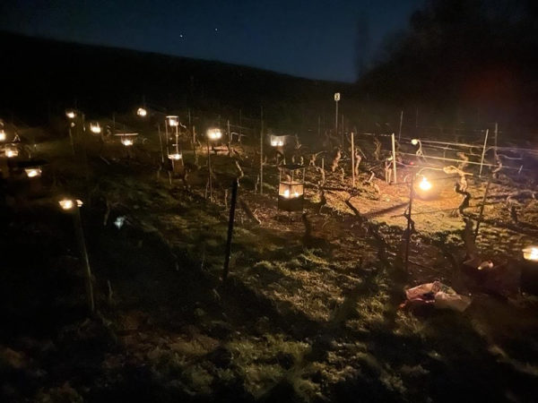

*Bougies à pellets lors de la nuit du 23-24 mars 2022*

*Bougies à pellets lors des premiers allumages*

*Bougies à pellets avec les chapeaux*

*Bougies à pellets avant l’allumage du 24-25 février 2022*

*Bougies à pellets durant la nuit du 23 mars 2022*

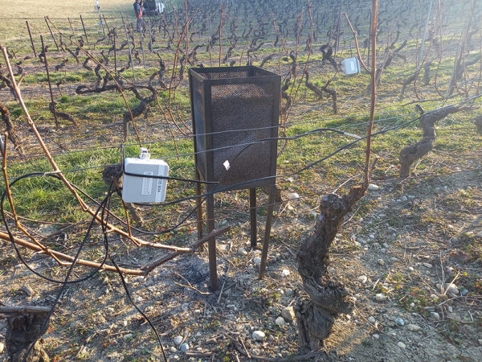

*Une bougie à pellets avec une station LoRaWAN et une sonde de température*

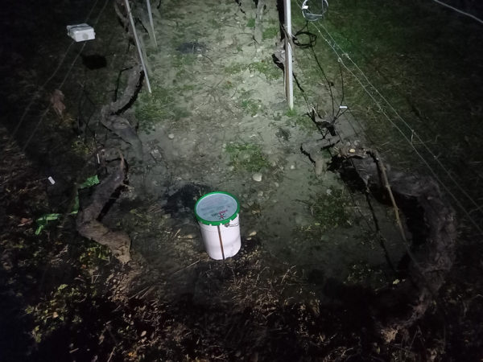

*Bougie en paraffine lors de l’allumage du 23 mars 2022*

