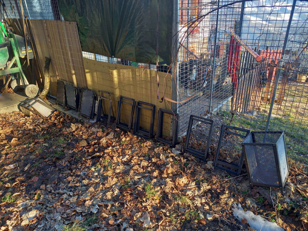
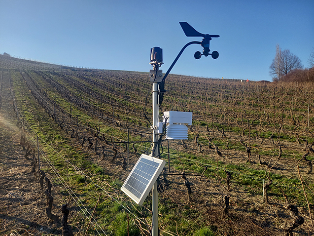
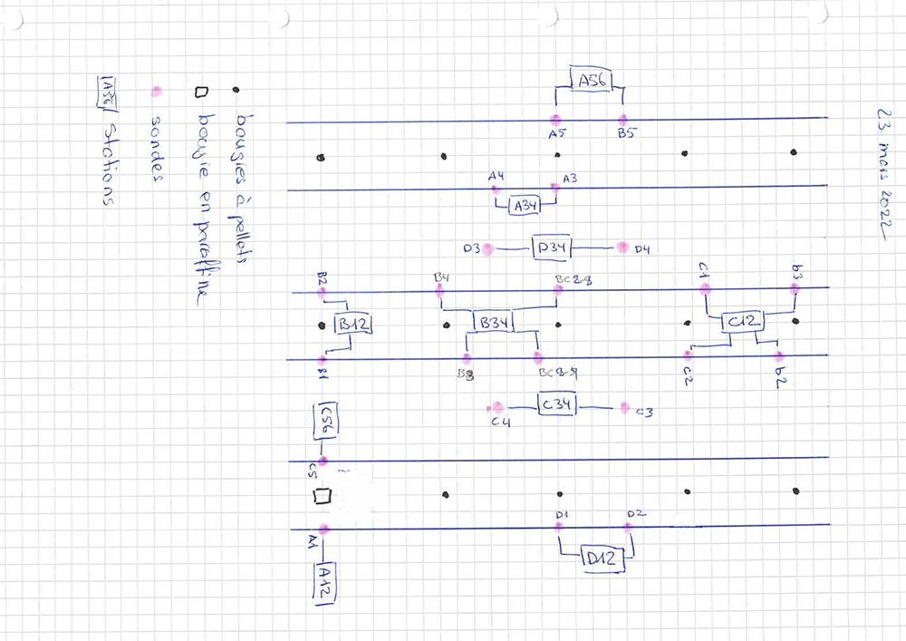
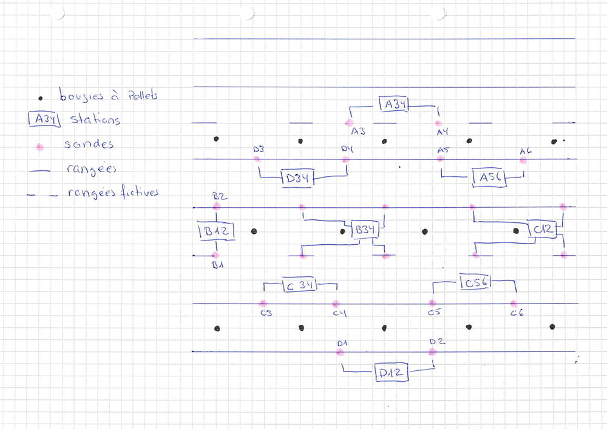
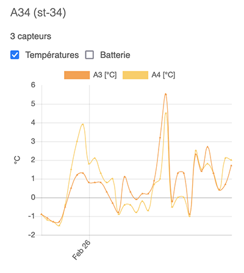

# La bougie à pellets – Version 1

Depuis le 9 octobre 2021, je teste un prototype de bougies à pellets pour lutter contre le gel de printemps.

Sur cette pages, vous allez voir

* La présentation d’une workshop avec 15 bougies à pellets
* Sa situation géographique (voir)
* La préparation du terrain (voir)
* Le déroulement du workshop (voir)
* Les différentes positions des bougies à pellets (voir)
* Les résultats des allumages (voir)
* Les conclusions (à terminer) (voir)
* La suite (voir)
* Les remerciements (voir)
* Des photos (voir)
* Un précédent workshop avec 1 à 3 bougies à pellets (voir)

## Workshop avec 15 bougies à pellets et LoRaWAN pour lutter contre le gel de printemps

### Introduction

[Introduction sur Youtube](https://www.youtube.com/watch?v=Tmb-zg431_U&t=12s)

La bougie en paraffine est souvent utilisée pour lutter contre le gel de printemps. Néanmoins, elle n’est pas réutilisable. Sachant qu’une bougie en paraffine coûte environ Sfr 14.– et qu’il en faut entre 200 et 240 par hectare, j’ai pensé approfondir mes premiers essais avec un plus grand nombre de bougies à pellets. L’avantage d’une bougie à pellets est qu’elle est réutilisable avec une recharge de 14kg pour Sfr 5.–

Le 25 novembre 2021, j’ai lancé une campagne de financement participatif, pour financer un workshop pour tester 10 bougies à pellets dans une vigne. Le 25 décembre 2021, l’objectif financé est atteint, ce qui m’a permis de financer un poste à souder MAG, une table à souder et l’acier pour réaliser 10 bougies à pellets. Après une petite formation de soudage, je me lance et le 31 janvier 2022 les bougies à pellets sont assemblées.

*Fig. 1 Formation assemblage de ma première bougie à pellets*

*Fig. 2 Assemblage des bougies à pellets*

*Fig. 3 Assemblage des bougies à pellets*

Avec les différents prototypes que j’avais déjà réalisé, c’est avec 15 bougies à pellets que ce workshop va se dérouler.

Pour surveiller le dégagement de la chaleur des bougies en temps réel, j’utilise mes 10 stations LoRaWAN que j’utilise déjà pour surveiller les températures des bourgeons, dans le cadre du projet Smart Bud.

### Situation géographique

L’exercice va se produire dans la bas d’une vigne de M. Patrick Duvernay, à la Plaine (GE), avec la participation d’Ellinor Sekund d’AgriGenève. Cette parcelle a la particularité de se trouver dans un creux, là où la masse d’air froid s’accumule et n’est pas brassée. Par conséquent, les bourgeons sont exposés dans une zone à risque, lors du gel de printemps.

*Fig. 4*

Cette vigne n’a pas les rangées régulières car une rangée a été enlevée. Chaque paire de rangée est distancée de 2.2m

*Fig. 5*

### Préparation du terrain

*Fig. 6 Préparation du workshop*

*Fig.7. Stations LoRaWAN avec 2 sondes de température*

### Déroulement du workshop

L’objectif est d’observer la chaleur dégagée par toutes ces bougies à pellets. Pour cela, j’utilise mes propres stations LoRaWAN, équipées de sondes de température, que j’utilise dans le projet SMART BUD.

**Les stations effectuent une mesure toutes les 15 minutes.** Les mesures sont envoyées vers une passerelle LoRaWAN, complètement autonome en énergie grâce à des panneaux solaires. Cette dernière, équipée d’une carte GSM, transmet les mesures vers un serveur distant, où les mesures sont sauvegardées dans une base de donnée. De là, une application Web, IOS et Android peuvent extraire les données et les afficher sur forme de graphiques. Pour ce workshop, la passerelle se situe en haut de la vigne.

*Fig. 8 Gateway LoRaWAN autonome installée sur une remorque solaire*

Une de mes station météo se trouve en dehors de la zone de chauffe, afin d’avoir *une température de référence.*

*Fig. 9 Station météo LoRaWAN avec un pyranomètre, un anémomètre et un baromètre*

Nous avons effectué 6 allumages de nuit: le 25 et 28 février 2022, le 7, 11, 23 mars 2022 et le 3 avril 2022.

Depuis le 11 mars, nous avons commencé à modifier la configuration des bougies.

Le 11 mars, nous avons rabaissé les sondes et les bougies sur le premier fils porteur, au niveau des rameaux et des bougeons. Nous avons ajouté un chapeau aux bougies.

Le 23 mars 2022, nous avons augmenté l’espace entre les bougies (4m) et **nous avons remplacé une bougie à pellets par une bougie en paraffine** pour comparer le comportement de ces deux bougies (voir Fig. 11 et Fig. 5).

Finalement, pour l’allumage du 4 d’avril 2022, nous avons gardé le même espace entre les bougies à pellets, sur les rangées (colonne), mais nous avons rapproché les bougies sur l’axe horizontal et nous avons décalé les bougies centrales de 2m sur le haut (voir Fig.12, ci-dessous ), de manière à ce qu’elles ne soient plus alignées, mais intercalées

### Positions des bougies

#### Position des bougies à pellets et des sondes jusqu’au 23 mars 2022

*Fig. 10 Position des bougies à pellets et des sondes, jusqu’au 23 mars 2022*

Les bougies sont distancées de 2m afin de former a quadrillage. (Voir fig. 6)

#### Position des bougies à pellets et des sondes durant la nuit du 23-24 mars 2022

*Fig. 11 Position des bougies à pellets et des sondes durant la nuit du 23-24 mars 2022*

#### Position des bougies à pellets et des sondes pour le 3 avril 2022

*Fig. 12 Position des bougies à pellets intercalées*

Note: La station A12 n’a malheureusement jamais fonctionné plus de 3h et je n’avais malheureusement plus de station pour la remplacer. J’ai donc décidé de l’utiliser comme-même, malgré le fait qu’elle n’a pas retourné des mesures pendant les périodes intéressantes.

### Mesures
#### Mesures du 25-26 février 2022
Le premier allumage a été effectué le 25 février à 22h. Malheureusement, la baromètre de la station est tombé en panne, ce qui nous n’a pas permis d’avoir une température de référence précise. Malgré ceci, la station d’agrométéo, positionnée à 20m, indiquait une température de **-2.5°C**, pendant toute la nuit. Toutes les sondes mesuraient également une température de -2°C, avant l’allumage des bougies à pellets.

Les sondes sont placées sur la deuxième fils porteur.

##### Résultats

**Visualiser toutes les mesures** du 25-26 février 2022, [ICI](https://bud.eco-sensors.ch/charts.php?field=3&date-from=2022-02-25&date-to=2022-02-26)!

Pour rappel
* les stations Axx se trouvent à l’extérieur gauche.
* Les stations Dxx se trouvent à l’extérieur droit. Les stations Bxx et Dxx se trouvent à l’intérieur.
* La station B34 se trouve le plus au centre.
* Les stations A12, B12, C12 et D12 se trouvent à l’extérieur bas.
* Les stations A56 et C56 se trouvent à l’extérieur haut (voir Fig. 10)

Les bougies à pellets ont été allumées à 22h30 et elles ont brûlé jusqu’à env. 6h30. On a pu constater une augmentation de +4° (+1.3°C) sur la station A34 avec un pic à 5°C alors qu’il faisait -2°C.

*Fig. 13 A34 25-2-2022*

Pour la station B34 (centre du quadrillage), la sonde B3 installée au-dessus des bourgeons, a affiché un pic de 6.6°C à 3h16 et un autre de 8°C à 5.53. Si non, elle a affiché, en moyenne, une température de 2.5°C, soit +4.5°C par rapport à la température de référence.

*Fig.14 B34 25-2-2022*

Pour les sondes BC2-3 et BC4-4 qui se trouvent entre les rangées B et C, elles ont affiché des températures entre 0°C et 1.1°C de 1h à 5h, puis les températures ont augmenté jusqu’à 4°C pour redescendre à 0°C, à 7h.

Pour la station D12 (extérieur bas/droit), on peut constater qu’il y eu des montées de température à 3°C, mais dès 3h35 et jusqu’à 5h15, la température était en dessous de 0°C.

Ceci peut s’expliquer par le fait que le côté droit de la bougie est exposée au froid, contrairement aux bougies positionnées au centre du quadrillage.

Si vous souhaitiez visualiser et analyser par vous même les températures, les mesures sont accessible, [ICI](https://bud.eco-sensors.ch/charts.php?field=3&date-from=2022-02-25&date-to=2022-02-26).

*Fig. 15 D12 25-2-2022*

Télécharger toutes les mesures en format A3 (pdf) [Page 1](Assets/pdf/bougies-graphique-25-2-2022_1.pdf) | [Page 2](Assets/pdf/bougies-graphique-25-2-2022_2.pdf)

