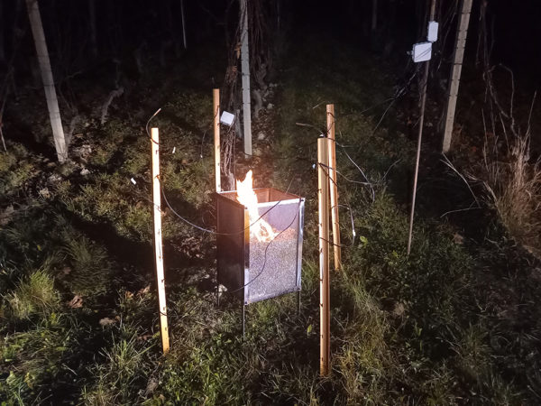
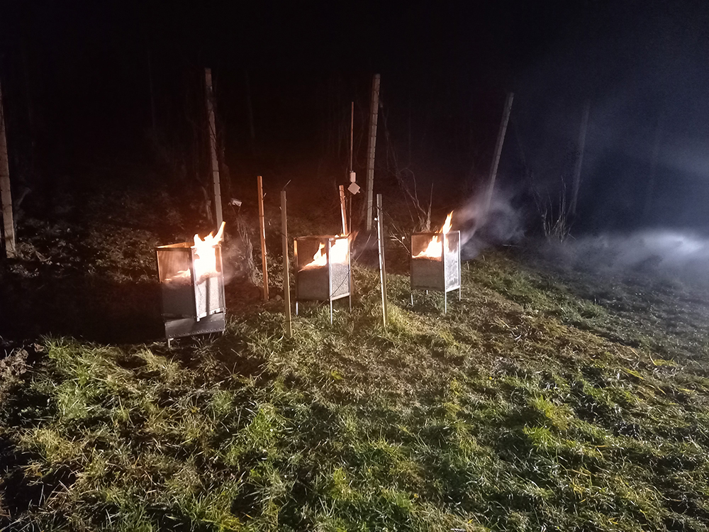
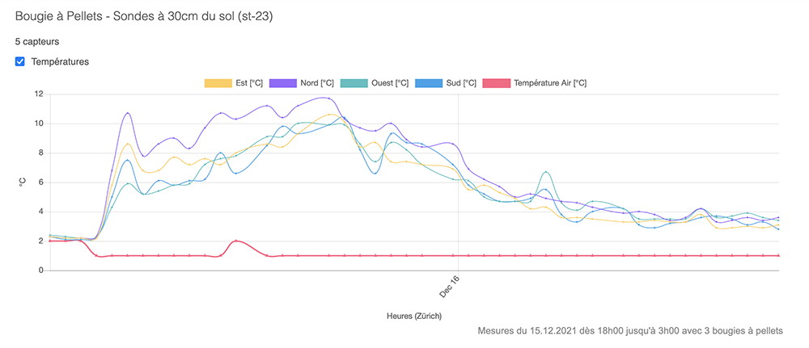
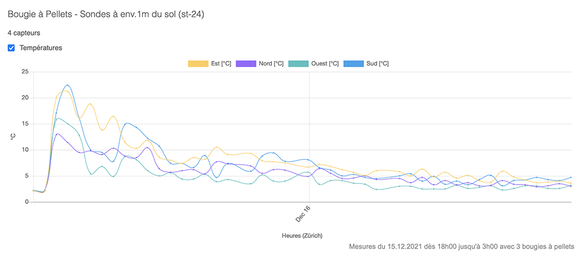
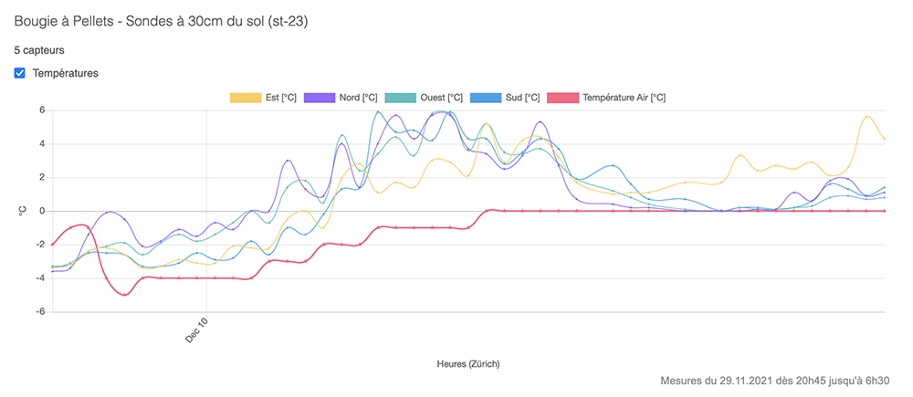
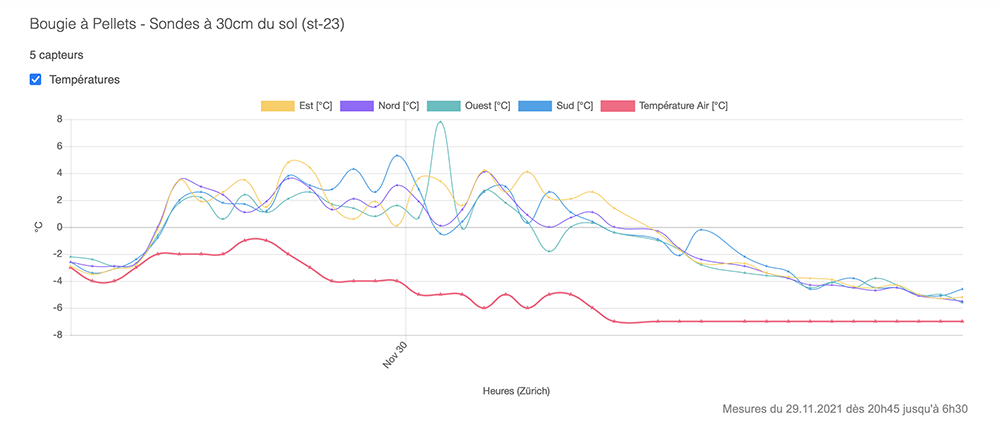
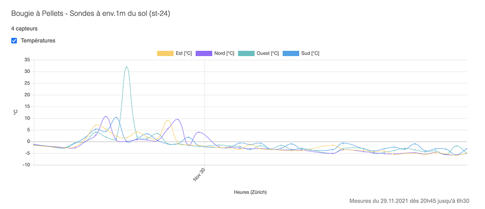
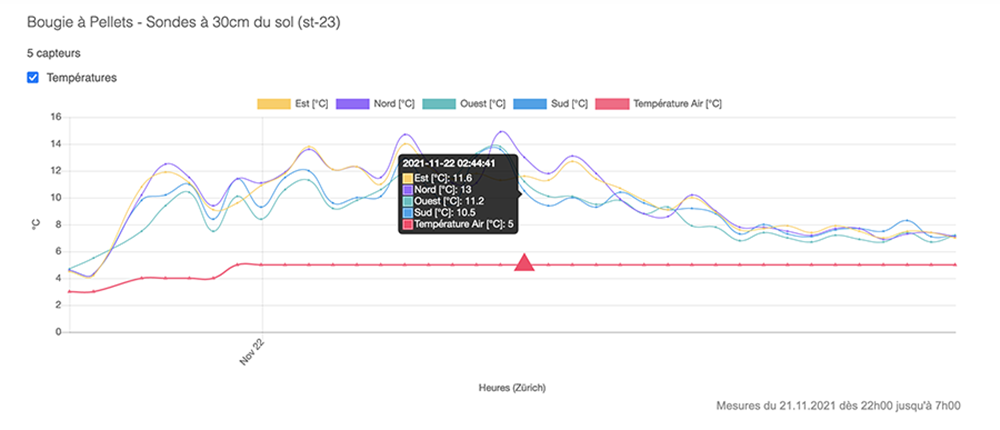
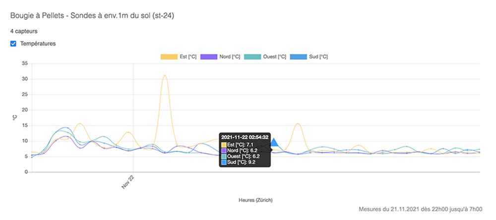

# Deuxième workshop avec 1 et 3 bougies à pellets

Ce workshop a été lancé avec trois bougies pour de présenter une solution et essayer de remporter une campagne de financement participtif. Le but est pouvoir financer 15 bougies à pelletes pour tester ma solution dans une maille de bougies (Workshop 3)

Sur la photo, vous pouvez constater 4 montants bruns. Sur chaque montant, j’ai fixé deux sondes de température positionnées à env. 60cm de la bougie. Ces sondes sont reliées une station (petite boîte grise sur le mât) qui relève les mesures toutes les 15 minutes. La passerelle LoRaWAN, qui va récolter les données des stations, se trouve dans un verger à env 1km de la bougie. Ainsi, je peux suivre, en temps réel, la dissipation de la chaleur, autour de la bougie.

## Mesures du 15 décembre 2021
Cette fois-ci, les 3 bougies ont été allumées à 18h00 et elles se sont éteintes vers 3h, selon les courbes. Durant cette nuit, la température de l’air était à 1°. Aussi bien pour les sondes placées à 30cm et 1m du sol, entre 18h et minuit, les sondes ont mesuré des températures de 5° à 10°, puis les températures on progressivement diminuer jusqu’à 3h.

*Mesures à 30cm du sol, le 15 décembre 2021 de 18h00 à 3h00 avec 3 bougies à pellets*

*Mesures à 1m du sol, le 15 décembre 2021 de 18h00 à 3h00 avec 3 bougies à pellets*

Si la campagne de financement est réussite, il serait intéressant de reproduire cet exercice, mais avec 10-16 bougies à pellets, qui seront distancées de 3-4m, et avec autant de sondes.

## Mesures du 9 décembre 2021
Voici les mesures de cette nuit. J’ai allumé la bougie à 21h45 et on constate que malgré les -4° de l’air, les sondes installées à 60cm de la bougie, ont mesurée des températures allant jusqu’à 5° au dessus de la température de l’air.

*Mesures du 9-12-21 à 30cm*

*Mesures à 2h52*

## Mesures du 29 novembre 2021

La bougie a été allumée à 20h45 alors qu’il faisait déjà -2°C. A 2h24 du matin, la température de l’air est descendue à -7°C alors que les températures mesurées à 60cm de la bougie étaient entre -0.4°C et 1°C. Puis, dès 3h et jusqu’à 6h30, les températures mesurées par les sondes inférieures étaient négatives mais toujours supérieures à la température de l’air, jusqu’à 6h, malgré le 7°C.

*Mesures à 30cm du sol, le 29 novembre 2021 de 20h45 à 6h30*

*Mesures à 1m du sol, le 29 novembre 2021 de 20h45 à 6h30*

## Mesures du 21 novembre 2021

Cette fois-ci, j’ai ajouté 4 sondes supplémentaires pour mesurer deux niveaux. Les 4 mêmes sondes mesures la température dégagée par la bougie à env. 30cm du sol, et les 4 nouvelles sondes mesurent la température à env. 1m du sol. Toutes les sondes entourent la bougie à pellets (nord, est, sud, ouest) à une distance de 60cm.

*Mesures du 21 novembre 2021 de la température mesurée par les 4 sondes se trouvant à env. 30cm du sol et à env. 60cm de la bougie*

*Mesures du 21 novembre 2021 de la température mesurée par les 4 sondes se trouvant à env. 1m du sol et à env. 60cm de la bougie*

