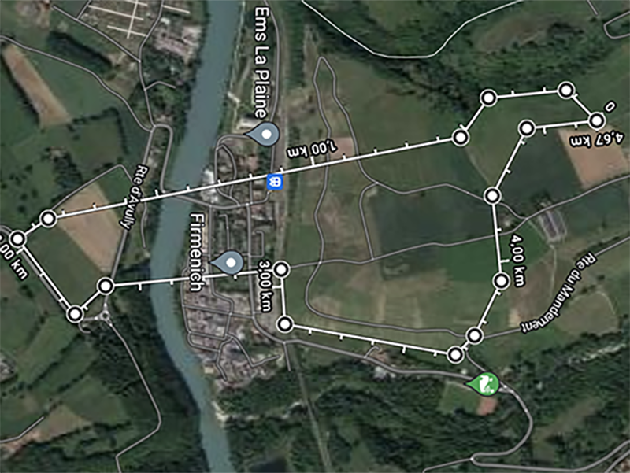
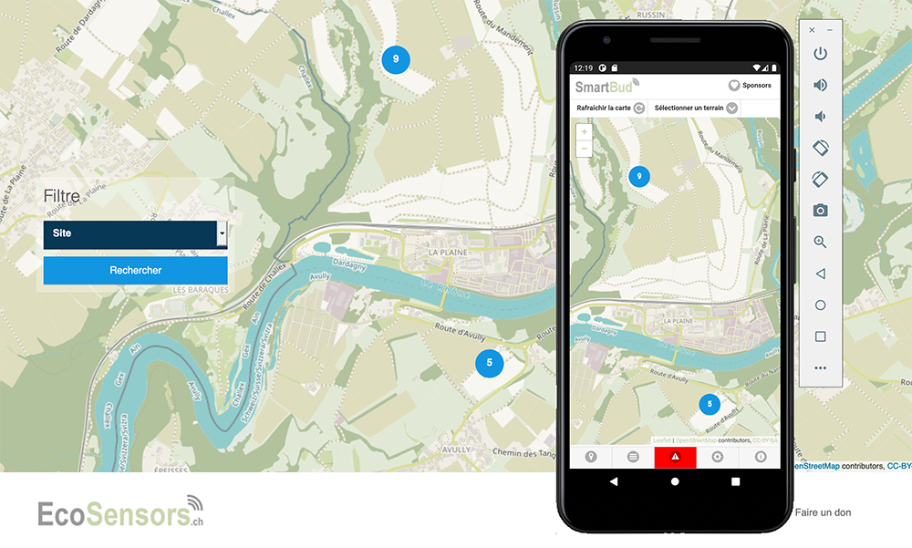
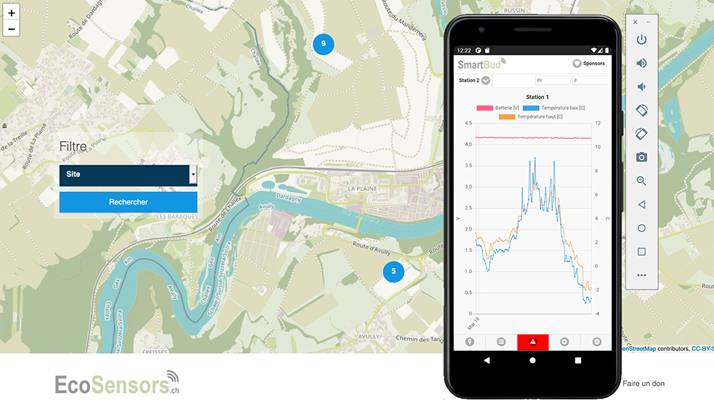
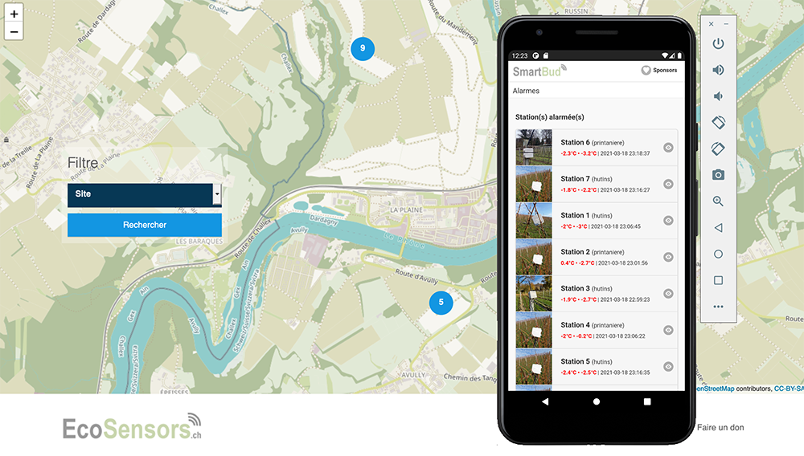
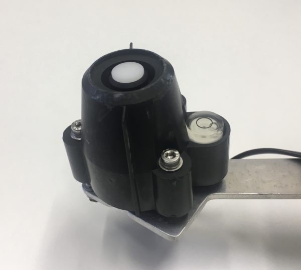
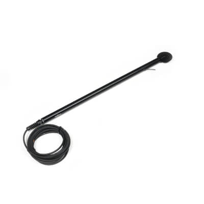
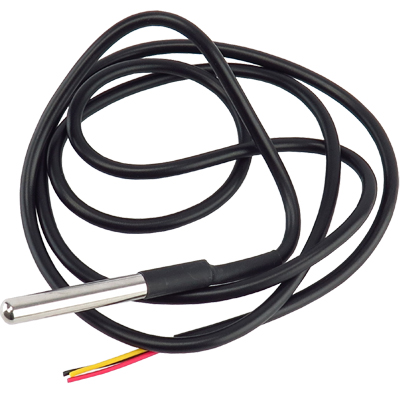
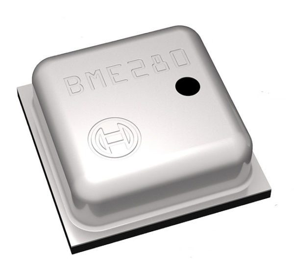

# Sauvons les récoltes du gel de printemps

Dans cette présentation, nous allons voir plusieurs aspects de ce projet pilote

* Présentation
* Durée du projet
* Présentation du matériel
	* Application Smartphone
	* Pyranomètre
	* Anémomètre
	* Détecteur de gel par rayonnement
	* Sonde Température des bourgeons
	* Baromètre
* Présentation des stations
* La techonolgie
	* LoRaWAN
	* Z-Wave
* Déroulement
	* Présentation du terrain
	* Le déroulement
	* La domotique pour générer les alarmes
* Situation au 16 avril 2021

## Présentation
Au début de chaque saison de croissance, lorsque les feuilles et les bourgeons commencent à émerger, les cultures sont sensibles aux dommages causés par le gel. C’est ce qu’on appelle un gel de rayonnement, dû à l’absence de mélange d’air (vent) près de la surface.

En gros, il existe deux façons d’estimer la température d’une feuille, d’un bourgeon ou d’une fleur:

* des modèles de prévision
* des mesures plus directes

Les modèles de prévision sont basés sur des mesures météorologiques étendues (par exemple, température de l’air, humidité relative, vitesse du vent et rayonnement net). De nombreux réseaux météorologiques agricoles proposent des alertes de gel en fonction de leurs réseaux et de leurs modèles de stations météorologiques.

Pour les zones non couvertes par ces services, ou pour les producteurs qui souhaitant leurs propres informations, trois types de mesures peuvent être utilisés :

* la température de l’air
* le rayonnement solaire et
* la température de surface
* la vitesse du vent

Ce projet consiste à journaliser ces quatre derniers points et à générer des alarmes lorsque la température des bourgeons s’approche d’un seuil critique, avant que ces derniers ne subissent des dégâts causés par le gel de printemps.

Pour se faire, nous allons utiliser plusieurs méthodes

* Détection du gel par rayonnement. La sonde utilisée simule à la fois une feuille et un bouton floral dans une seule sonde, fournissant une estimation directe de ces températures
* Surveillance des températures des bourgeons. Des sondes thermocouple placées à un centimètre du bourgeon
* Un anémomètre pour mesurer la vitesse et le sens du vent
* Un pyranomètre, pour mesurer la radiation solaire
* Un baromètre pour mesurer la température de l’air ambiante, la pression et l’humidité.

Ce projet est aussi présenté dans la revue [Vignes et Vergers No1](https://www.revuevitiarbohorti.ch/archives/?id_heft=134&jahr_heft=2022) et [AGRI Hebdo](https://www.facebook.com/ecosensors/photos/a.106412497776585/241220640962436/)

## Durée du projet

Le projet pilote se déroulera depuis fin février 2021 à fin mai 2021.

Mais les stations ont été progressivement déployées dans les deux vignes dès décembre 2020. Le projet a néanmoins commencé en octobre 2020 afin de préparer le matériel et de le tester sur le terrain.

Ce projet est reconduit en 2022 et les stations ont été réinstallées, début avril 2022. Pour 2022, nous avons installé moins de stations (min 2 par parcelle) mais le projet couvre maintenant 4 parcelles sur 65 hectares.

*Zone de l'exercice*

## Présentation du matériel
### Application smartphone SMART BUD
Depuis le mois de mars 2021, une application smartphone est disponible pour suivre l’état des cultures et pour recevoir des alarmes quand les températures descendent au-dessous d’un seuil critique. Elle est disponible sur Apple Store et Google Play

### Pyranomètre
*Marque : Davis Instrument, Réf: 6450*

*Un pyranomètre de Davis Instrument*

Un pyranomètre mesure le rayonnement solaire en W/m2.

* Plages de température : -40°F à 150°F (-40°C à 65°C)
* Résolution et Unités : 1 W/m2
* Plage de mesure : 0 à 1 800 W/m2
* Précision : ±5% à pleine échelle (Référence: Eppley PSP à 1000 W/m2) plus 45 W/m2 par câble additionnel de 100 ‘ (30 m)
* Dérive : jusqu’à ±2% par an
* Intervalle de mise à jour : 50 secondes à 1 minute

### Anémomètre
*Marque: Davis Instrument, réf: 6410*

*Anémomètre pour mesurer la direction et la vitesse du vent*

L’anémomètre Davis (référence: 07911) est conçu pour mesurer à la fois la vitesse et la direction du vent. Le capteur de vitesse du vent utilise un interrupteur magnétique qui se déclenche une fois par tour des coups à vent. La direction du vent est mesurée à l’aide d’un potentiomètre.

* Plages de température: 40° to +149°F (-40° to +65°C
* Wind Direction
	* Display Resolution: 16 points (22.5°) on compass rose, 1° in numeric display
	* Précision: ±5°
* Wind Speed
	* Résolution et unités :mesuré en 1 mph. Les autres unités sont converties de mph et arrondies à 1 km / h, 0,1 m / s ou 1 nœud le plus proche
	* Plage de mesures : 1 to 200 mph, 1 to 173 knots, 0.5 to 89 m/s, 1 to 322 km/h
    * Précision: 2 mph (2 nœuds, 3 km / h, 1 m / s) ou ± 5%
* Input / Output Connections
    * Black . . . . . . . . . . . . . . . . . . . . . . . . . . . . . . . . . . . . . . . . Wind speed open drain to ground
    * Red . . . . . . . . . . . . . . . . . . . . . . . . . . . . . . . . . . . . . . . . . Ground
    * Green . . . . . . . . . . . . . . . . . . . . . . . . . . . . . . . . . . . . . . . Wind direction pot wiper (20KΩ potentiometer)
    * Yellow . . . . . . . . . . . . . . . . . . . . . . . . . . . . . . . . . . . . . . . Pot supply voltage
    * Wind Speed Translation Formula . . . . . . . . . . . . . . . . . . 1600 rev/hr = 1 mph
    * V = P(2.25/T) (V = speed in mph, P = no. of pulses per sample period
    * T = sample period in seconds)
    * Wind Direction Translation . . . . . . . . . . . . . . . . . . . . . . . Variable resistance 0 – 20KΩ; 10KΩ = south, 180°

### Détecteur de gel par rayonnement
Cette sonde n’est plus utilisée pour la saison 2022

*Marque: Apogee Instruments, Réf: SF-110*

*un capteur de température innovant conçu pour imiter les feuilles et les boutons de fleurs / fruits*

Les capteurs de température des feuilles et des bourgeons Apogee modèle SF-110 sont conçus pour estimer approximativement les températures des feuilles et des boutons floraux des plantes pour la prévision des événements de gel. Ils sont destinés aux applications dans les champs et les vergers cultivés lorsque la température de l’air est proche du point de congélation et lorsque les mesures de la température de l’air ne sont pas un bon prédicteur de la formation de gel.

Les capteurs de température des feuilles et des bourgeons d’Apogee Instruments SF-110 se composent de deux thermistances de précision, l’une combinée à une feuille simulée et l’autre à un bourgeon simulé, dans un seul boîtier.

Les détecteurs sont résistants aux intempéries et sont conçus pour mesurer en continu la température dans les mêmes conditions environnementales auxquelles les plantes sont exposées

* Temps d’équilibre : 10s
* plages de température : -50 to 70 C; 0 to 100 % humidité relative
* Précision: 0.02°C

### Sonde Température étanche (pour les bourgeons)
*Marque: Maxim Integrated, Modèle: DS18B20*

*Capteur de température étanche*

La sonde DS18B20 étanche mesure en degrés Celsius avec une précision de 9 à 12-bit,-55C à 125C (+ /-0.5C). Chaque capteur possède un numéro unique de 64-bit de série programmé dans ce qui permet un grand nombre de capteurs pour être utilisé sur un bus de données. Le DS18B20 communique via le bus1-Wire.

* Interface: 1-Wire
* plages de température -55°C to +125°C
* Précision: ±0.5°C de -10°C à +85°C

### Baromètre
*Marque: Bosch, Modèle: BME280*

*BME280*

Le BME280 est un capteur d’humidité spécialement développé pour les applications mobiles et les appareils portables où la taille et la faible consommation d’énergie sont des paramètres de conception clé. Le capteur d’humidité offre un temps de réponse extrêmement rapide et prend donc en charge les exigences de performance pour les applications émergentes telle que la connaissance du contexte et une précision élevée sur une large plage de températures.

* Plages de fonctionnement
	* Pression: 300…1100 hPa
	* Température: -40…85°C
* Interface : I2C
* Humidité
	* Temps de réponse: 1s
	* Précision: ±3%

## La technologie
### LoRaWAN

LoRaWAN est un protocole de télécommunication permettant la communication à bas débit, par radio, d’objets à faible consommation électrique. Elle communique selon la technologie LoRa et connecté à Internet via des passerelles, participant ainsi à l’Internet des objets (IoT). Ce protocole est utilisé dans le cadre des villes intelligentes, le monitoring industriel ou encore l’agriculture. La technologie de modulation liée à LoRaWAN est LoRa, crée en 2009 par la startup grenobloise Cycléo et racheté par Semtech en 2012. Semtech promeut sa plateforme LoRa grâce à la LoRa Alliance, dont elle fait partie. Le protocole, LoRaWAN sur la couche physique LoRa, permet de connecter des capteurs ou des objets nécessitant une longue autonomie de batterie (comptée en années) et un coût réduit. LoRaWAN est l’acronyme de Long Range Wide-Area Network que l’on peut traduire par « réseau étendu à longue portée »

### Z-Wave
Z-Wave est un protocole radio conçu pour la domotique (éclairage, chauffage…). Z-Wave communique en utilisant une technologie radio de faible puissance dans la bande de fréquence de 868 MHz ; elle est conçue spécifiquement pour les applications de domotique et ce qu’on appelle l’Habitat communicant.

**Pourquoi la domotique?**

Initialement, je voulais utiliser ma boite domotique pour questionner la base de donnée en temps réel, et envoyer des alarmes via l’application Telegram. L’avantage de Telegram est que l’envoi des messages ne coûte rien, contrairement aux SMS.

Entre temps, j’ai développé l’application SMART BUD pour Android et IOS, qui génère les alarmes (push notification) sur le smartphone des exploitants. Cette application fonctionne très bien.

De ce fait, l’application Telegram a été mise de côté. Cependant, la domotique reste dans le projet, car une boite domotique pourra être installée chez un exploitant **pour générer des alarmes visuelles**, comme une sirène, un gyrophare ou le clignotement des lumières d’un domaine.

