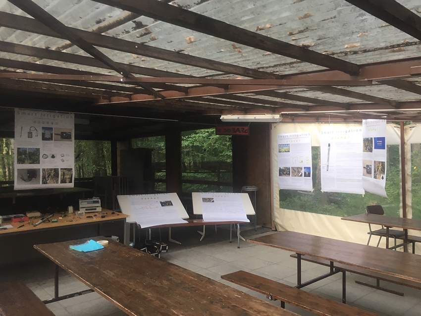
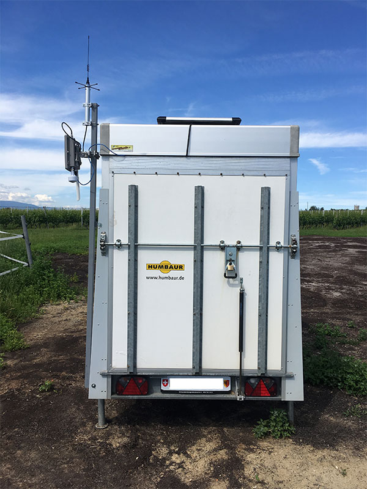
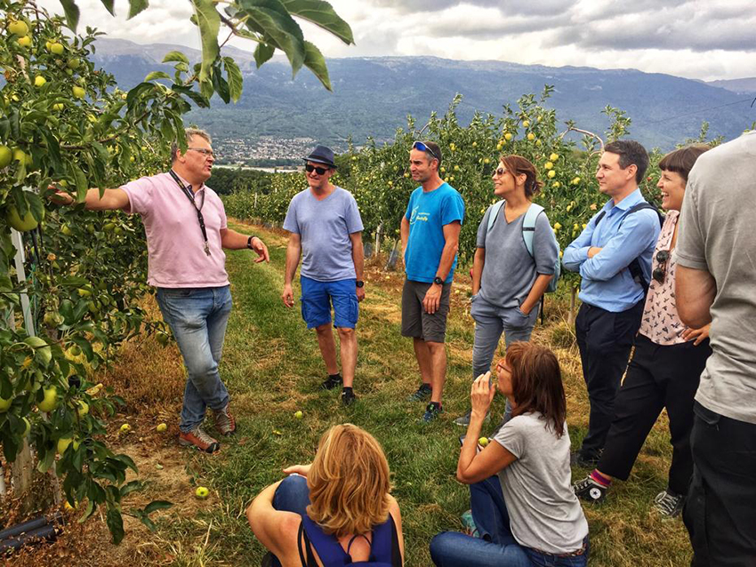
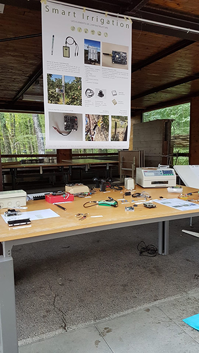
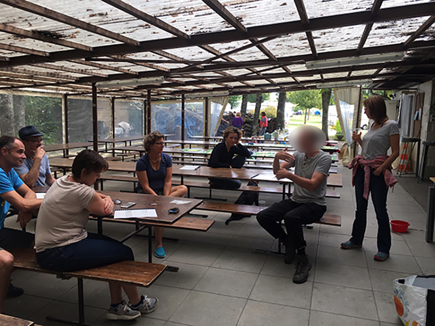
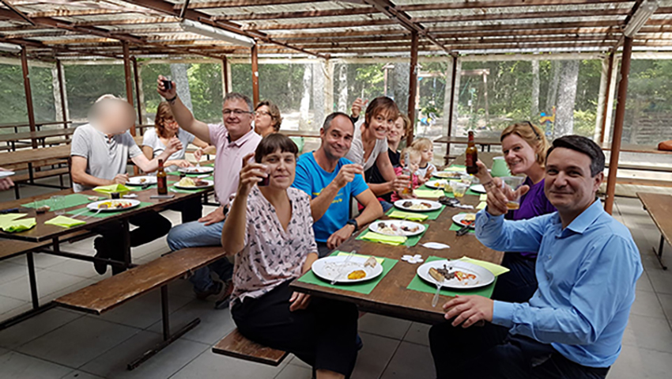

# Présentation de Smart Irrigation aux donateurs

Les contributeurs sont arrivés vers 10h30. Après un apéro, nous nous sommes réunis autour des posters A0 et de mon équipement électronique (circuits imprimés, micro-contrôleurs, capteurs, four à souder et diverses cartes). J’ai eu l’occasion de présenter mes motivations, les raisons pour lesquelles je travaille avec LoRaWAN. Pourquoi mon travail c’est tourné vers la surveillance de l’état hydrique des sols, même si le but principal de mon travail, est de maîtriser la communication sans fils (avec LoRaWAN), dans des lieux sans couverture.

*Préparation de la salle*

J’ai pu aussi vous montrer une passerelle-relai et ses avantages, même si elle n’est pas encore fonctionnelle (objectif 2020)

Après un bon barbecue, nous sommes partis, avec les enfants, pour une petite randonnée en direction du verger où sont installées les stations avec un petit détour vers la passerelle. Nous avons aussi eu la grande chance de découvrir et goûter toutes les variétés de pommes grâce à Sandrine, la propriétaire.

*La passerelle The Things Outdoor Gateway fixée sur ma remorque*

Ceci a été pour moi, un énorme plaisir de présenter ce projet aux personnes qui ont apporté un soutien. Car en dehors des écris, du site internet, j’ai pu leur montrer, pour de vrai, les stations, la passerelle, les capteurs, les composants électroniques ainsi que la solution en fonctionnement, et de vous faire part de mes ambitions pour l’année prochaine. En d’autres mots, vous avez pu voir, pour de vrai, dans quoi vous avez investi.

Ceci a encore été un bon exercice, pour présenter une solution, devant un public.

*Débats en attendant que d’autres s’occupent du barbecue, alors que les enfants jouent*

*Apéro et barbecue*

**Un grand merci pour votre soutien**

