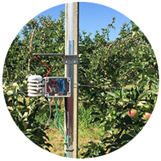

# SmartIrrigation
## Pour planifier l'irrigation des cultures
L’objectif est de développer et mettre en pratique une solution, à bas coût, pour mieux surveiller et planifier l’irrigation des cultures en temps réel, et ainsi permettre aux exploitants d'augmenter leurs rendements.

## Des racines à votre smartphone
Les stations mesurent le taux hydrique du sol à une séquence définie ainsi que la température de la terre et les conditions atmosphériques. La passerelle collecte les mesures et les transmet au serveur qui va les sauvegarder dans une base de données. Grâce à ceci, nous pouvons tirer des statistiques, traiter les données sauvegardées et les afficher sur votre portable (smartphone, laptop, etc.).

### Des mesures au plus proche des racines	

 
* Trois sondes tensiométriques plantées à différentes profondeurs
* Un compteur de goutte
* Mesure l’humidité de l’air
* Mesure la température du sol
* Mesure la température de l'air
* Mesure la pression atmosphérique
* Mesure la luminosité
* Une infrastructure pour couvrir jusqu’à 5 kilomètres de rayon à surveiller 

### Un outil, des bénéfices

* Mesure et visualisation en temps réel
* Simplification de la collecte et de l’interprétation des données
* Gestion des alarmes
* Performance du temps de réaction
* Augmentation du rendement

## Mais encore...
[Presentation sur Youtube](https://www.youtube.com/watch?v=QYvQ2LWMCxo&t=6s)

De nombreux types de capteurs et systèmes d’enregistrement de données ont été développés à cette fin. Leur adoption est encore limitée pour des raisons de coûts élevés et des difficultés dans la collecte et l’interprétation des données en temps opportun.

Les développements récents des microcontrôleurs Open Source (tel qu’Arduino), la communication sans fil, et l’Internet-of-Things (IoT) offrent des technologies intéressantes pour les agriculteurs, afin de

* réduire les coûts
* faciliter la collecte et l’interprétation des données
* visualiser l’état de ses cultures en temps réel
* mieux planifier l’irrigation des cultures

## Plus concrètement
La surveillance de l’irrigation des sols dans la production agricole est vital pour la durabilité économique et environnementale à long terme de l’agriculture. Il est donc important de développer des technologies d’irrigation efficaces pour les agriculteurs afin de leur permettre de gérer le traitement de leurs terres **quand**, **où** et dans **la quantité nécessaire**, pour maximiser leurs rendements.

Au fils des années, certaines technologies ont été développées pour aider les agriculteurs à planifier correctement l’irrigation. Ces technologies reposent généralement sur la surveillant des conditions météorologiques, en sondant les plantes et le sol.

Bien que beaucoup d’efforts ont été consacrés dans ce domaine, comme le développement des réseaux locaux de stations météorologiques et à la création de logiciels, les utilisations restent encore limitées.

Une étude récente avec des producteurs de maïs à grande échelle au Nebraska a montré que la surveillance de l’irrigation basé sur des capteurs a permis **d’économiser 33% d’eau** et le coût de pompage a été réduit considérablement.

Bien qu’une variété de capteurs et de systèmes de collecte et d’analyse de données sont actuellement disponibles dans le commerce, des solutions de surveillance en temps réelle, permettant de mieux planifier l’irrigation des cultures, sont encore rares. Ceci s’explique par des prix élevés, aux difficultés d’installation et de maintenance et à la difficulté de transmettre les mesures obtenus sur plusieurs kilomètres.

Le développement des microcontrôleurs à faible coût et OpenSource, leur capacité de gérer les technologies de communication sans fil, comme la radio, le téléphone cellulaire et le WiFi, offrent des possibilités très abordable. De plus, les récents développements dans les technologies de l’Internet des objets (Internet-of-Things) utilisés dans une grande variété d’applications, tel que les maisons intelligentes ou les villes intelligentes, apportent un complément non-négligeable, aux possibilités.

L’utilisation de ces technologies tel que l’Internet des objets (IoT) dans l’agriculture est encore très limitée. Mais ceci pourrait offrir des possibilités d’améliorer la planification de l’irrigation des cultures, grâce à des capteurs fournissant des données en temps réelles.

C’est pourquoi, l’objectif fixé de cet projet est de développer, tester et de mettre en pratique, une solution IoT de gestion de l’irrigation des cultures, à bas coût.

> Jusqu’à 3 à 10 km de couverture et une très faible consommation

Pour arriver à ces résultats, j’utilise une technologie promettante: LoRaWAN. Cette technologie est particulièrement intéressante car elle permet de transmettre des donnée par radio, dans un rayon de 3 à 10 kilomètres (en fonction de la configuration du terrain), à bas débit et surtout à une très faible consommation.

Dans l’expérience en cours, deux stations (nœuds) sont équipées de

* 3 sondes tensiométriques Watermark, pour mesurer le teneur en eau du sol en kPa (6 sondes Watermark pour la deuxième station)
* 1 sonde pour mesurer la température du sol
    un pluviomètre pour compter les gouttes versées par le système d’arrosage goutte-à-goutte.
* 1 sonde pour mesurer la température de l’air, la pression atmosphérique et l’humidité
* 1 sonde pour mesurer la luminosité
* un sonde IR pour mesurer la température (en phase de teste)
* Carte SD pour sauver les données et la journalisation

Sur la deuxième station, nous avons ajouté 3 sondes tensiométriques supplémentaires, soit 6 en tous, positionnées pour observer la formation de la bulbe d’eau qui va se forme avec l’arrivée des chaleurs et de l’arrosage.

Toutes les heures, les stations prennent les mesures et les envoient à la passerelle (gateway) qui traitera les données reçues et les transmettra à un serveur distant. Une interface web permettra aux propriétaires de visualiser l’état de leurs cultures, depuis leur smartphone, et en temps réel, depuis n’importe où, comme lors de votre petit-déjeuné, par exemple.

La passerelle, quant à elle, est autonome puisqu’elle est alimenté par une batterie de 12V/60A. Elle est connectée à un panneau solaire de 60W. Elle se trouve à 1 kilomètre des stations (nœuds). Pour plus de détail sur la passerelle, vous pouvez suivre ce lien: Passerelle pour la transmission des mesures.

Ainsi, il sera plus facile de choisir le bon moment pour irriguer vos sols, et de bien quantifier le besoin en eau.

## Perfectionnements apportés durant l’hiver 2019

Les circuits électroniques en place actuellement doivent être remplacés par un nouveau modèle amélioré, dont les modifications suivants ont été apportées:

* remplacement un circuit intégré trop gourmand
* modification de la programmation de micro-contrôleur pour améliorer l’autonomie (58 mn de veille sur 60 mn).
* amélioration du timing des prises des mesures avec un module RTC (Real Time Clock)
* amélioration du mode d’alimentation des sondes tensiométriques, pour avoir un résultat plus précis
* nouveau PCB personnalisé et plus petit
* intégration du baromètre et du luxmètre dans le PCB
* remplacement de certains connecteurs pour un montage et branchement des sondes plus simple
* amélioration des affichages des mesures sur un écran LCD (affichage page par page et mise en veil)
* utilisation de la carte SD pour enregistrer les paramètres de fonctionnalités du module

Enfin, j’ai refait l’application web pour un affichage plus convivial, sous forme de graphiques complets. Cette application web sera amenée à évoluer, notamment pour la gestion des alarmes, lorsque l’humidité du sol aura franchi le seuil critique.

# Expérience sur le terrain

Deux stations ont été installées, fin juin 2018, dans un verger genevois, au milieu des pommiers.

Les deux stations se trouvent au deux extrémités du verger. L’une au point le plus haut et la seconde au point le plus bas du verger. Toutes les deux mesurent:

* l’état hydrique du sol à 3 niveaux différents* grâce a trois sondes tensiométriques
* un compteur de goutte pour mesurer la quantité d’eau utilisée par arrosage
* l’humidité de l’air
* la température du sol
* la température de l’air
* la luminosité
* la pression atmosphérique
* l’état de la batterie

> Une sonde tensiométrique ne mesure pas l’humidité du sol mais la force de liaison entre l’eau avec le sol (exprimé en tension), autrement dit, la force de succion que la racine doit exercer pour extraire l’eau du sol

Toutes les heures, elles envoient les 10 mesures cités haut-dessus, à la passerelle qui elle se trouve à 1 kilomètre de la première station.

Les stations sont alimentées par une batterie au lithium de 3.7V/1000mA. Cette dernière est connectée à un petit panneau solaire de 3W qui suffit largement pour maintenir une tension de 4 à 4.3V sur 24h. A savoir qu’une batterie au lithium a une plage de fonctionnalité entre 3.6V et 4.3V. C’est à dire qu’en dessous de 3.6V, elle ne suffit plus pour alimenter une charge alors qu’à 4.3V, elle est entièrement chargée. Ce qui nous donne une marge dans le cas où des journées non ensoleillées devaient se suivent.

Les pommiers sont arrosés tous les deux-trois jours grâce à système d’arrosage goutte-à-goutte. En moyenne, 10 litres d’eau est versés par goutteur. Fin juillet, j’ai installé un pluviomètre sous le goutteur afin de compter le nombre de gouttes par heure.

## Preparation

*Préparation du matériel. Les sondes WATERMARK trempe déjà dans l’eau*

Pour commencer, avec un tarière de 20cm, j’ai creusé un trou de 60cm de profondeur.

Au fur et à mesure que je creusais, je mettais la terre récupérée dans mon seau d’eau, où trempaient déjà me deux sondes WATERMARK

Une fois le trou creusé, j’ai mis un couche de boue venant du seau, puis la première sonde WATERMARK, à env 55cm.

Je me suis assuré de bien recouvrir la sonde (partie cylindrique perforée) de boue, en refermant le trou avec la terre, jusqu’à 35cm du sol.

Puis, j’ai encore ajouté une couche de boue avant de positionner la deuxième sonde à 30cm du sol. J’ai encore ajouté une sonde étanche de température au niveau de cette sonde, pour connaître la température du sol, au moment de la prise des mesures. Là encore, j’ai continué à refermer le trou avec de la boue venant du seau, de manière à ce que la sonde (le tube cylindrique perforé) soit bien recouverte de boue.

J’ai finalement refermé compétemment le trou avec la terre restante. Il faudra encore attendre quelques jours pour que la boue et la terre qui recouvrent les sondes sèchent pour se trouver en équilibre avec le sol, tel que ce l’était avent de creuser ce trou.

## Watermark Digital Reader

*Watermark Digital Reader*

Afin de vérifier mes mesures, J’ai acquis un lecteur digital (Watermark Digital Reader) avec lequel j’ai pu comparé la tension de l’eau du sol, (autrement dit, la force de succion que la racine doit exercer pour extraire l’eau du sol) mesurées par mes deux stations. J’ai eu l’agréable surprise de constater qu’une différence de 2 à 7 kpa par sonde, c’est qui est très bien.

## Evolution
### 2018
En premier temps, j’avais positionné les sondes Watermark à 30cm, 35cm et 50cm de profondeur. Puis j’ai voulu essayer de mesurer la bulbe d’eau. J’ai donc repositionné la première sonde à 15cm du goutteur et à une profondeur de 30cm. La deuxième à 15cm et 30cm de profondeur, et la dernière à 15cm et 60cm de profondeur du point de chute des gouttes. Cependant, j’avais mal évalué ce point de chute et la bulbe d’eau se formait légèrement à côté des sondes.

*Mauvais positionnement des sondes pour mesurer la bulbe d’eau*

Afin de mieux mesurer cette bulbe d’eau formée par le goutteur, j’ai simulé l’eau versé par le goutteur avec une jerrican d’eau de 10litres en dosant le débit, de manière à ce que les gouttes tombent à côté de la sonde positionnée à 15cm/30cm. Dès ce moment, cette sonde à vite réagit mais pas celle plantée à 60cm de profondeur. Ce qui laisse à croire que la bulbe se forme env. entre 15 et 50cm de profondeur.

*Représentation de la chute des gouttes versées par la jerrican*

’ai aussi constaté que mon code qui calcule l’état hydrique du sol (en kpa) avait une erreur. Même si les courbes du graphique réagissaient, elles évoluaient en forme d’escalier. Aussi, il n’y avait aucunes mesures entre 100 et 199kpa. Pour comprendre l’erreur, j’ai utilisé l’équation de Koch (courbe jaune) pour calculé le tension grâce au la résistance électrique (courbe rouge) des sondes Watermark et je l’ai comparé le résultat avec ma fonction erronée (courbe violette).

*Correction des courbes*

On voit que le 16 septembre, j’ai corrigé ma fonction et la courbe violette évolue similairement avec la courbe jaune.

Aussi, à la station 2, le 21 septembre, j’ai replanté les trois sondes Watermark différemment.

* Sonde 1: à 1m du goutteur et à une profondeur de 30cm. Elle se trouve aussi à quelques centimètre du goutteur suivant
* Sonde 2: au point de chute (env 1-5cm) des gouttes du goutteur et à une profondeur de 30cm
* Sonde 3: à 10cm du point de chute et à une profondeur de 50cm

Ainsi, je peux continué à mesurer la bulbe d’eau avec la station 1, et comparer les mesures avec un positionnement différent, des sondes à la station 2, qui n’a pas pour but « d’observer » la bulbe d’eau, mais de mesurer l’état hydrique sur une longueur de 1m, entre deux goutteurs.

### 2019
En 2019, j’ai repositionné les sondes:

Station 1: Les sondes sont à 30cm de profond-eur et distancée de 1m
Station 2 et station 3: Une station ne permet d’avoir que 3 sondes tensionétriques. Afin de mieux mesurer la formation du bulbe d’eau, j’ai ajouté une nouvelle station (station 3), juste à côté de la station 2, pour avoir 6 sondes tensionétriques autour du point de chute du goutteur.

* La sonde 1 est à 30cm de profondeur et à 30cm du point de chute (est)
* La sonde 2 est à 30cm de profondeur et à 1cm du point de chute (surface).
* La sonde 3 est à 50m de profondeur et à env 10cm du point de chute (pro- fondeur).
* Les autres sondes tensiométriques sont connectées à la station 3. Elles sont toutes à 30cm de profondeur et à 30cm du point de chute (nord, ouest, sud)

> Seuil: 0-10 cbars (ou kPa): Soil saturé. 10-30 cbars: Le sol est suffisamment humide (sauf pour sables grossiers qui commencent à perdre de l’eau) 30-60 cbars: Gamme habituelle d’irrigation (sauf les sols argileux lourds) 60-100 cbars: Gamme habituelle pour l’irrigation dans les sols argileux lourds 100-200 cbars: Le sol devient dangereusement sec.

#### Analyse de la Station 1, du 20 juin au 19 juillet 2019

*Station 1 - Mesures du 20 juin au 19 juillet 2019*

Toutes les sondes sont sous un goutteur, à l’exception de la sonde rouge qui est légèrement décalée du point de chute des gouttes. Pour la sonde jaune, j’ai ajouté un conduit pour que les gouttes tombent bien au niveau de la sonde.On constate que la sonde rouge est généralement toujours sèche, Du moins, le sol devient très vite sec, La sonde jaune a tendance à sécher plus rapidement que la sonde verte.Pour la sonde rouge, on peut comprendre que le bulbe d’eau se forme à sa proximité et qu’elle est légèrement humidifiée par le bulbe. Ce qui expliquerait qu’elle sèche rapidement. Ceci probablement parce qu’elle ne se trouve pas exactement sous le point de chute des gouttes.On peut aussi en déduire que le bulbe d’eau reste à env 20-30cm de profondeur et ne doit pas avoir une largeur de plus de 20cm (suggetsion), ou alors son développe-ment se forme dans une direction opposée à la position de la sonde.Pour la sonde jaune et la sonde verte, on voit que le sol est saturé pendant quelques heures. La sonde jaune sèche plus vite que la verte ce qui peut se comprendre par le fait qu’elle soit moins humitifée par le bulbe d’eau formé par le goutteur 2.

#### Analyse des mesures des stations 2 & 3 – Formation du bulbe d’eau
##### Analyse (1) du 22 au 25 juillet 2019

*Station 2 – Mesures du 22 au 25 juillet 2019*

*Station 3 – Mesures du 20 au 25 juillet 2019*

##### Analyse (2) du 13 au 25 août 2019

*Station 2 – Mesures du 13 au 25 août 2019*

*Station 3 – Mesures du 13 au 25 août 2019*

Le premier point intéressant à constater est la sonde de profondeur et la sonde Est. On peut déduire que lors de l’analyse (1) et (2), le bulbe d’eau ne s’est pas formé jusqu’à ce deux sondes. Le teneur hydrique a été très faible à ces niveaux.La sonde de surface a été la plus réactive lors des arrosages. On peut même constater que lors des fortes pluies (40ml) du 18 au 20 août, toutes les courbes ont réagi. En revanche, il y a une période floue, entre le 22 et 23 juillet (analyse (1)), où la courbe de jaune n’a pas réagi aux arrosages alors que la sonde Ouest a réagi lors de chaque arrosage. C’est un comportement étrange alors que la sonde de surface est la plus proche du point de chute des gouttes. Il se peut que le bulbe n’est pas descendu jusqu’à la sonde de surface mais s’est déplacé rapidement en direction de la soude Ouest.La sonde Nord est relative stable également. Ce qui est intéressant de constater, c’est que lors de tous les arrosages, le bulbe d’eau ne s’est jamais formé jusqu’aux sondes externes (orange, bleu ciel et bleu foncé, violet) alors qu’une forte pluie (qui couvre une plus grande surface du sol) les font toutes réagir, sauf la sonde de profondeur et la sonde Nord (qui se trouve proche du poteau).On constate encore une fois, que la bulbe d’eau ne se forme jamais jusqu’à 60cm de profondeur, et ne doit pas faire plus de 20cm de large.

Je ne me suis plus trop investi dans ce projet pour me donner plus de temps sur la lutte contre le gel de printemps et pour les bougies à pellets pour réchauffer les bourgeons, en cas de gel.

