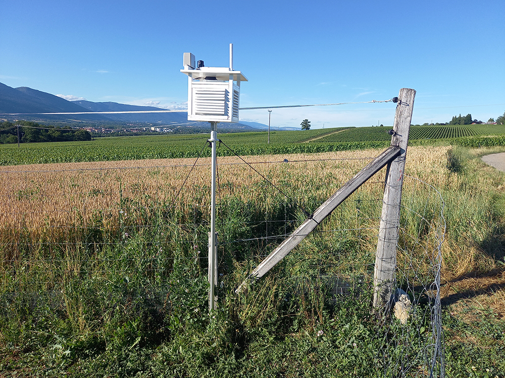
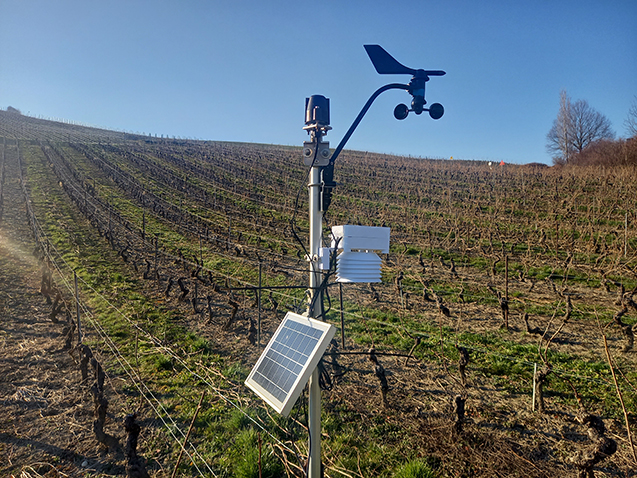
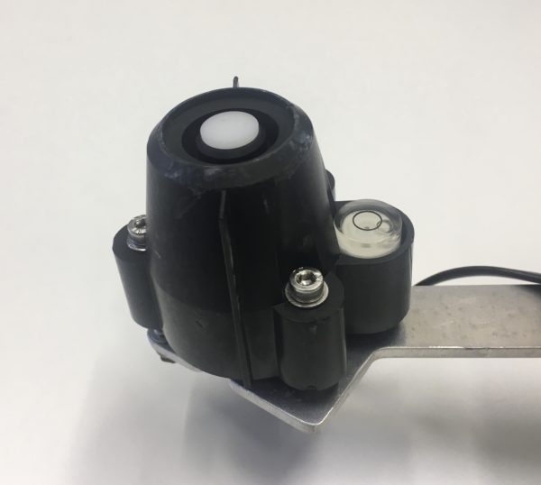
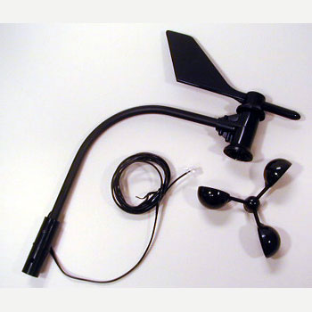

# Meteo

## Station météo – Abri Stevenson

Le but de ce projet est d’installer des petites stations météo LoRaWAN afin de prendre des mesures localement, toutes les heures. Ainsi, un agriculteur, un arboriculteur ou un viticulteur pourra connaître le niveau de précipitation au plus proche de sa parcelle.

L’objectif n’est pas de concurrencer un service existant, mais d’apporter des mesures complémentaires et plus locales.

### Compositiom

#### Abri Stevenson

Un abri météorologique, également appelé **abri Stevenson** désigne un boîtier utilisé en météorologie pour protéger les instruments de mesure contre les précipitations ainsi que les radiations (émissions) directes de chaleur de sources extérieures, tout en continuant à permettre la libre circulation de l’air autour de ces instruments de mesure.

Conçus pour accueillir divers instruments de mesure, l’abri permet de créer, autant que possible, un environnement uniforme en relation avec l’air extérieur.

Coût: Env. Sfr 400.–

#### Impression 3D

*Station météo LoRaWAN avec un pyranomètre, un anémomètre et un baromètre. Cette station météo a été installée provisoirement dans cette vigne, dans le cadre du workshop des 15 bougies à pellets.*

Depuis mars 2022, je ne fais plus d’abris Stevenson, sauf pour le fun. La fabrication et son coût sont trop importants. J’ai depuis acquis une imprimante 3D, et je fabrique mon boîtier avec des coupoles.

#### Pyranomètre

Le pyranomètre vous permettra de mesurer le rayonnement solaire

*Marque : Davis Instrument, Réf: 6450*

*Un pyranomètre de Davis Instrument*

Un pyranomètre mesure le rayonnement solaire en W/m2.

 * Plages de température : -40°F à 150°F (-40°C à 65°C)
 * Résolution et Unités : 1 W/m2
 * Plage de mesure : 0 à 1 800 W/m2
 * Précision : ±5% à pleine échelle (Référence: Eppley PSP à 1000 W/m2) plus 45 W/m2 par câble additionnel de 100 ‘ (30 m)
 * Dérive : jusqu’à ±2% par an
 * Intervalle de mise à jour : 50 secondes à 1 minute

Coût: Sfr. 250.–

#### Anémomètre

L’anémomètre Davis (référence: 07911) est conçu pour mesurer à la fois la vitesse et la direction du vent. Le capteur de vitesse du vent utilise un interrupteur magnétique qui se déclenche une fois par tour des coups à vent. La direction du vent est mesurée à l’aide d’un potentiomètre.

*Marque: Davis Instrument, réf: 6410*

*Anémomètre pour mesurer la direction et la vitesse du vent*

* Plages de température: 40° to +149°F (-40° to +65°C
* Wind Direction
* * Display Resolution: 16 points (22.5°) on compass rose, 1° in numeric display, Précision: ±5°
* Wind Speed
* * Résolution et unités :mesuré en 1 mph. Les autres unités sont converties de mph et arrondies à 1 km / h, 0,1 m / s ou 1 nœud le plus proche
        Plage de mesures : 1 to 200 mph, 1 to 173 knots, 0.5 to 89 m/s, 1 to 322 km/h
        Précision: 2 mph (2 nœuds, 3 km / h, 1 m / s) ou ± 5%

Coût: Sfr 210.–