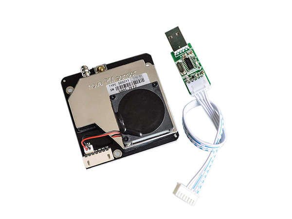

# Que respirons-nous?

Du 25 mars et jusqu’au 7 juillet 2020, une station est installée à La Chiésaz, entre Vevey et Châtel-St-Denis (VD), **sur la montée de l’autoroute allant vers Châtel-St-Denis (FR)**. Une seconde station est installée en campagne vaudoise afin de comparer les mesures des deux locations. L’objectif est de mesurer l’AQI (Air Quality Index) jusqu’à la fin du COVID-19, soit du moins jusqu’à la fin des restrictions qui nous obligent à rester à la maison et diminuer drastiquement nos déplacements. Cette situation est certes difficile à vivre mais elle a un impact avantageux sur l’environnement.

L’objectif est donc de mesurer l’index qualité de l’air pendant l’évolution du retour du trafic autoroutier.

Pour cela, une première station a été placée sur un mur destiné à protéger les riverains du bruit occasionné par le passage des véhicules sur l’A1.

Elle ne peut pas être mieux placée car elle se trouve à quelques mettre de la voie de secours. Je remercie au passage le propriétaire du terrain, pour m’avoir autorisé de placer cette station sur son terrain. Je précise encore que la station ne se trouve pas sur l’autoroute même, mais de l’autre côté des barrières de sécurité.

## Comment ça fonction et qu’est-ce que ça mesure?

La technologie utilisée est la même que pour le projet SMART IRRIGATION. soit LoRaWAN. LoRaWAN est un protocole de télécommunication permettant la communication à bas débit, par radio, d’objets à faible consommation électrique communiquant selon la technologie LoRa et connectés à l’Internet via des passerelles.

Toutes les stations (ou noeuds) prennent leurs mesures et envoient les données à la passerelle (Gateway). Cette dernière les traite et les envoie au serveur qui va lui les sauver dans une base de données pour que l’utilisateur puisse visualiser les valeurs en temps réel.

La passerelle (violet) se trouve sur Les Monts-de-Corsier, à env 1 kilomètre de la station (en vert), à vol d’oiseau. Toutes les demi-heures, la station prend les mesures et les envoie à la passerelle, qui seront retransmises au serveur, pour pouvoir les analyser en temps réel.

[Carte](https://eco-sensors.ch/measures/map_aqi_baume.php)

La deuxième station, qui se trouve à Arzier-Le Muids, au-desus de la ville de Gland, exceptionnellement et pour des raisons techniques, elle ne transmettra pas ses mesures via la technologie LoRaWAN. Elle sera directement connectée au WiFi et transmettra ses données directement au serveur, toutes les demi-heures.

Les deux stations mesurent les poussières fines, soit le PM2.5 et le PM10, grâce au capteur SDS011.

## Que sont les PM2.5 et PM10?
PM signifie Particulate Matter (également appelée particules en suspension): terme désignant un mélange de particules solides et de gouttelettes liquides présentes dans l’air. Certaines particules, telles que la poussière, la saleté, la suie ou la fumée, sont suffisamment grandes ou foncées pour être visibles à l’œil nu. D’autres sont si petits qu’ils ne peuvent être détectés qu’à l’aide d’un microscope électronique.

Les particules sont disponibles dans une large gamme de tailles. Les particules de diamètre inférieur ou égal à 10 micromètres sont si petites qu’elles peuvent pénétrer dans les poumons, ce qui peut entraîner de graves problèmes de santé. Dix micromètres est inférieur à la largeur d’un seul cheveu humain.

**Particules de poussière grossières (PM10):** particules inhalables, de diamètre généralement inférieur ou égal à 10 micromètres. Les sources comprennent les opérations de concassage ou de broyage et la poussière soulevée par les véhicules sur les routes.

**Particules fines (PM2,5):** fines particules inhalables, de diamètre généralement inférieur ou égal à 2,5 micromètres. Les particules fines sont produites par tous les types de combustion, y compris les véhicules à moteur, les centrales électriques, le chauffage au bois résidentiel, les incendies de forêt, le brûlage agricole et certains processus industriels

## L’indice de qualité de l’air (AQI)

Un indice de la qualité de l’air est une mesure de la qualité de l’air, permettant de synthétiser différentes données sous la forme d’une valeur unique.

L’IQA est un indice pour rendre compte de la qualité quotidienne de l’air. Il vous indique à quel point votre air est propre ou pollué et quels effets sur la santé associés pourraient vous préoccuper. L’AQI se concentre sur les effets sur la santé que vous pouvez ressentir quelques heures ou quelques jours après avoir respiré de l’air pollué.

L’EPA (l’Environmental Protection Agency des États-Unis), ne tienne pas  compte que des particules fines (PM2.5 et PM10) pour mesurer l’AQI,  mais aussi d’autres principaux polluants atmosphériques: ozone troposphérique, monoxyde de carbone , le dioxyde de soufre et le dioxyde d’azote. Pour chacun de ces polluants, l’EPA a établi des normes nationales de qualité de l’air pour protéger la santé publique

En suisse, l’indice de pollution de l’air à court terme (IPC, également appelé IPAIR22) repose sur la mesure de trois polluants : l’ozone, le dioxyde d’azote et les particules fines PM10. Il compte 6 niveaux:

Indice IPC | O3 | NO2 | PM10 | Pollution
--- | --- | --- | --- | ---
1 | 0 à 90 | 0 à 60 | 0 à 37 | Faible
2 | 91 à 120 | 61 à 80 | 38 à 50 | Modérée
3 | 121 à 150 | 81 à 100 | 51 à 62 | Significative
4 | 151 à 180 | 101 à 120 | 63 à 75 | Marquée
5 | 181 à 240 | 121 à 160 | 76 à 100 | Élevée
6 | > 240 | > 160 | > 100 | Très élevée

L’indice suisse IPC apparait donc comme moins exigeant que l’indice français Atmo pour l’ozone et les particules fines, et plus exigeant pour [le dioxyde d’azote](https://fr.wikipedia.org/wiki/Dioxyde_d%27azote), produit notamment par les véhicules Diesel.

Dans le cadre de mon exercice, les valeurs de l’API sont des valeurs retournées par le capteur SDS011 grâce à une fonction python. Dans l’état actuel, ces valeurs sont indicatives, puisque je ne mesure pas encore l’O3 et le NO3.

## Et le CO2

Le dioxyde de carbone (CO2). Le CO2, gaz incolore, inerte et non toxique, est le principal gaz à effet de serre à l’état naturel, avec la vapeur d’eau. Sa durée de vie dans l’atmosphère est d’environ 100 ans. Il est produit lorsque des composés carbonés sont brûlés et en présence d’oxygène.

Sous l’action de l’homme, le taux de CO2 dans l’atmosphère augmente régulièrement et notamment de 30% au cours des deux derniers siècles. En France, au cours des 20 dernières années, 70% à 90% des émissions de dioxyde de carbone proviendraient de la combustion des carburants d’origine fossile. L’agriculture et la sylviculture contribueraient pour 12% des émissions de dioxyde de carbone

## Quels sont les impacts sur la santé

Plus une particule est fine, plus elle peut pénétrer profondément dans les voies respiratoires et donc plus sa toxicité potentielle est élevée. Les plus grosses particules (PM10) sont retenues par les voies aériennes supérieures.

Les particules plus fines pénètrent profondément dans l’appareil respiratoire où elles peuvent provoquer une inflammation et altérer la fonction respiratoire dans son ensemble. Les particules de taille <1μm sont suspectées d’être une cause de problèmes cardio-vasculaires. Elles peuvent également avoir des propriétés mutagènes et cancérigènes. C’est notamment le cas de certaines particules émises par les moteurs diesel (Hydrocarbure Aromatiques Polycycliques – ou HAP –  par exemple).

Selon l’Organisation mondiale de la Santé (OMS) les effets ou conséquences liés à une exposition de courte durée sont :

* Des réactions inflammatoires des poumons
* Des symptômes respiratoires
* Des effets néfastes sur le système cardiovasculaire
* L’accroissement de la prise de médicaments, de l’hospitalisation et de la mortalité des personnes souffrant de problèmes respiratoires, étant cardiaques ou asthmatiques (et considerées comme les groupes à risques).

Les personnes âgées et les enfants sont également considérées comme les groupes à risques

Parmi les effets liés à une exposition de longue durée, l’OMS cite:

* L’accroissement des symptômes des voies respiratoires inférieures et des maladies respiratoires obstructives chroniques
* La réduction des fonctions pulmonaires chez les enfants et les adultes
* Le raccourcissement de l’espérance de vie dû principalement à la mortalité cardio-pulmonaire et probablement au cancer des poumons

Les effets néfastes sur la santé sont particulièrement avérés chez les personnes âgées ou souffrantes d’insuffisances immunitaires, cardiaques ou respiratoires et chez les enfants.Étant donné qu’une exposition aux particules à long terme diminue de manière significative l’espérance de vie, il est certain que les effets à long terme (exposition chronique) s’avèrent plus importants pour la santé publique que les effets à court terme (exposition aigue). Les études effectuées dans la cadre du programme CAFE (Clean Air for Europe) ont démontré que les PM2.5 présentes dans l’atmosphère raccourcissent actuellement l’espérance de vie statistique dans l’UE de plus de 8 mois, soit une perte annuelle totale de 3,6 millions d’années de vie

## La sonde SDS011

Le capteur est un module CO2 infrarouge intelligent. Il est de petite taille, utilisant le principe infrarouge non dispersif (NDIR) pour détecter l’existence de CO 2 dans l’air, avec une bonne sélectivité, sans dépendance à l’oxygène et une longue durée de vie. La compensation de température est intégrée. Il a une sortie UART et PWM.

 

Le capteur Nova SDS01 est probablement un des meilleurs capteur en thermes de précision et de prix: CHF 28.–.

Spécifications

* Measured values: PM2.5, PM10
* Range: 0–999.9 μg /m³ Supply voltage: 5V (4.7–5.3V) 
* Power consumption (work): 70mA±10mA 
* Power consumption (sleep mode laser & fan): < 4mA Storage temperature: -20 to +60C 
* Work temperature: -10 to +50C 
* Humidity (storage): Max. 90% Humidity (work): Max. 70% (condensation of water vapor falsify readings)
* Accuracy: 70% for 0.3μm and 98% for 0.5μm Size: 71x70x23 mm Certification: CE, FCC, RoHS 

## Le capteur MH-Z19B
Le MH-Z19 est un capteur auto-calibré, c’est à dire que la mesure envoyée par le capteur ne nécessite aucun traitement mathématique. Autrement dit, on récupère le teneur en CO2 exprimée en ppm (partie par million). Le MH-Z19 dispose d’une sortie PWM ainsi qu’une interface numérique UART (port série).

Le signal PWM est proportionnel à la concentration en CO2.

*J’ai mis un terme à cette expérience pour des raisons de temps. Je souhaite poursuivre mon premier projet pilote SMART IRRIGATION, et y ajouter une nouvelle fonctionnalité: ajouter un pyranomètre pour mesurer le rayonnement solaire et offrir un outil de surveillance lors du gel de printemps (gel tardif)*

