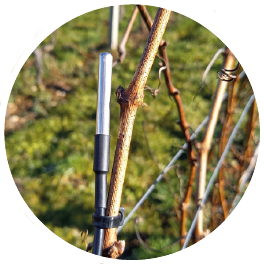
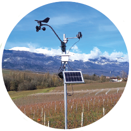

# SmartBud
## Pour sauver les récoltes du gel de printemps
### «En 2017, plus de 550 hectares ont été fortement endommagés entre Sion et Martigny.» 

L’objectif de ce projet est de surveiller la température des bourgeons qui émergent, lors du gel de printemps, pour permettre aux exploitants d’être alarmés immédiatement et de prendre les mesures nécessaires pour protéger leurs récoltes. «En 2017, plus de 550 hectares ont été fortement endommagés entre Sion et Martigny.» 

[Présentation de SMART BUD sur Rouge FM, le 18 mars 2021](https://youtu.be/-9DW8gAQh1I){target="_blank"}

Presses: [Vignes et Vergers N1](https://www.revuevitiarbohorti.ch/archives/?id_heft=134&jahr_heft=2022){:target="_blank"} et [AGRI Hebdo](https://www.facebook.com/ecosensors/photos/a.106412497776585/241220640962436/){:target="_blank"}

## Du bourgeon à votre smartphone
Les stations prennent la température des bourgeons à une séquence définie ainsi que la radiation solaire et la vitesse du vent. La passerelle collecte les mesures et les transmet au serveur qui va les sauvegarder dans une base de données. Grâce à ceci, nous pouvons tirer des statistiques, traiter les données sauvegardées et les afficher sur votre portable (smartphone, laptop, etc.). 

Des mesures au plus proche des bourgeons

Deux sondes de température placées à 1cm des bourgeons,
Détection du gel par rayonnement,
Mesure du rayonnement solaire,
Mesure de la vitesse et de la direction du vent,
Un baromètre pour mesurer la pression et la température de l’air ambiant,
Une infrastructure pour couvrir jusqu’à 5 kilomètres de rayon à surveiller.

### Un outil, des bénéfices

Mesure et visualisation en temps réel,
Simplification de la collecte et de l’interprétation des données,
Gestion des alarmes,
Performance du temps de réaction,
Augmentation du rendement.

## En savoir plus
* [Sauvons les récoltes du gel de printemps] (https://www)
* [La bougie à pellets pour réchauffer les bourgeons lors du gel de printemps](https://eco-sensors.ch/la-bougie-a-pellet/)
* [La bougie à pellets – Version 2](https://eco-sensors.ch/la-bougie-a-pellet/la-bougie-a-pellet-v2/)

## On en parler
* [Dossier: Les capteurs Smart Bud, comment ça marche ](https://www.revuevitiarbohorti.ch/archives/?id_heft=134&jahr_heft=2022){:target="_blank"}, Vignes et Bergers, No 1 (janvier 2022) 
* [Les arbres fruitiers en danger en raison du gel et de la neige dès lundi](https://www.lematin.ch/story/les-arbres-fruitiers-en-danger-en-raison-du-gel-et-de-la-neige-des-lundi-210628593769){:target="_blank"}, Le Matin (4.4.2021) 
* Coup de projecteur sur Rouge FM Rouge FM, Rouge FM (18.23.2021)
* [Une solution innovente testée cette année en terre genevoise](https://www.facebook.com/ecosensors/posts/241220684295765){:target="_blank"}, Agri Hebdo (12.2.2021) 
* [Lutte contre le gel](assets/pdf/lutte-contre-le-gel.pdf){:target="_blank"}, Bureau interprofesionnel des vins de Bourgogne
