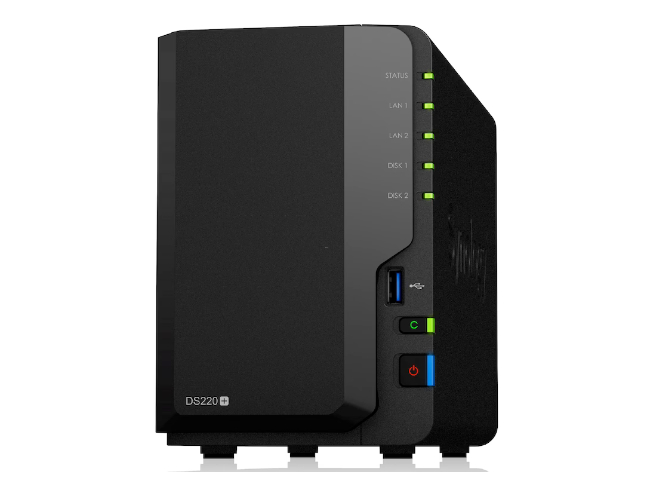

# Comment installer Ubuntu, Apache, MariaDB, SSL et InvoiceNinja sur un NAS Synonolgy

*Publié le 4 novembre 2023*

Dans cet article, je vais vous montrer comment installer Ubuntu, Apache, MariaDB, PHP dans un VM (Container Manager) d’un NAS Synology. Vous allez aussi installer un certificat Let’s Encrypt pour accéder à votre installation (Apache / InvoiceNinja) grâce au protocole  HTTPS. Finalement, vous allez installer [InvoiceNinja](https://invoiceninja.com/), qui est une application de facturation, de paiement et de gestion de workflow. [Suivre ce lien pour en savoir plus sur les fonctionnalités](https://invoiceninja.com/features/)

J’ai écris cet article au fur et à mesure de mes investigations pour arriver à mes fins, sans avoir une connaissance approfondie sur les VM (Container Manager / Docker) avec Synology. Si vous découvrez une erreur ou une amélioration, je serai ravi d’avoir votre partage. Cet article est encore en cours de rédaction

Cet exercie est réalisé avec un Macbook, un NAS synology DS220+ (DSM 7.2), dans un réseau local (Routeur WiFi de mon domicile).